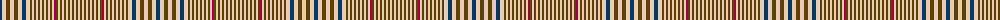

In pattern [BWGWGWBWGWGWGWGWGWGWRGWGWGWGWGWGW](/patterns/bwgwgwbwgwgwgwgwgwgwrgwgwgwgwgwgw/).

This was sourced from tartans-authority.  It is a [33 stripes tartan](/stripes/stripes33/).

Original link http://www.tartansauthority.com/tartan-ferret/display/8682/

## Thread count
DB/4 LR4 T4 LR4 T4 LR4 DB4 LR4 T2 LR2 T2 LR2 T2 LR2 T2 LR2 T2 LR2 T2 LR2 R2 T2 LR2 T2 LR2 T2 LR2 T2 LR2 T2 LR2 T2 LR/2

## Palette
Each colour and its ΔE from the base-6 reference it is a variant of.

| Colour | Shade | Base | ΔE (OKLab) |
|---|---|---|---|
| DB | <code style="background-color:#003C64;">#003C64</code> `#003C64` | B <code style="background-color:#2C4084;">#2C4084</code> | 0.07 |
| LR | <code style="background-color:#E8CCB8;">#E8CCB8</code> `#E8CCB8` | W <code style="background-color:#F4F4F0;">#F4F4F0</code> | 0.11 |
| R | <code style="background-color:#A00048;">#A00048</code> `#A00048` | R <code style="background-color:#C80000;">#C80000</code> | 0.11 |
| T | <code style="background-color:#604000;">#604000</code> `#604000` | G <code style="background-color:#006400;">#006400</code> | 0.14 |

ID: /setts/s33/b4w4g4w4g4w4b4w4g2w2g2w2g2w2g2w2g2w2g2w2r2g2w2g2w2g2w2g2w2g2w2g2w2-b003c64-g604000-ra00048-we8ccb8/
