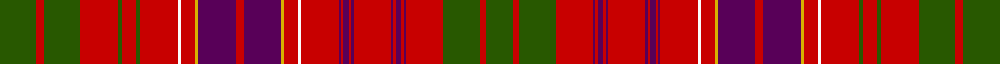

In pattern [GRGRBRBRBRBRBRBRWRYBRBYRWRGRGRGRG](/stripes/grgrbrbrbrbrbrbrwrybrbyrwrgrgrgrg/).

This was sourced from tartans-authority.  It is a [33 stripe tartan](/stripes/stripes33/).

Original link http://www.tartansauthority.com/tartan-ferret/display/853/

## Thread count
G/32 R7 G32 R33 G4 R12 G4 R33 W3 R12 Y3 DP33 R7 DP33 Y3 R12 W3 R33 DP2 R2 DP5 R2 DP2 R33 DP2 R2 DP5 R2 DP2 R33 G32 R6 G/23

## Palette
Each colour and the base-6 reference it is a variant of.

| Colour | Shade | Base |
|---|---|---|
| DP | <code style="background-color:#580058;">#580058</code> `oklch(32.3% 0.148 328.4)` <small>#580058</small> | B <code style="background-color:#2A418A;">#2A418A</code> |
| G | <code style="background-color:#285800;">#285800</code> `oklch(41.0% 0.122 135.8)` <small>#285800</small> | G <code style="background-color:#006100;">#006100</code> |
| R | <code style="background-color:#C80000;">#C80000</code> `oklch(52.3% 0.215 29.2)` <small>#C80000</small> | R <code style="background-color:#CC0000;">#CC0000</code> |
| W | <code style="background-color:#FCFCFC;">#FCFCFC</code> `oklch(99.1% 0.000 89.9)` <small>#FCFCFC</small> | W <code style="background-color:#F7F7F7;">#F7F7F7</code> |
| Y | <code style="background-color:#D8B000;">#D8B000</code> `oklch(77.1% 0.158 92.3)` <small>#D8B000</small> | Y <code style="background-color:#F2BF00;">#F2BF00</code> |

## Nearest tartans

The nearest existing variants by ΔTartan distance.

1. [Marchioness of Huntly's](/setts/s33/g32r7g32r33g4r12g4r33lb3r12ly3dp33r7dp33ly3r12lb3r33dp2r2dp5r2dp2r33dp2r2dp5r2dp2r33g32r7g32~x2/) — ΔT 0.28
1. [MacRae of Inverinate](/setts/s40/r23dg2r3dg2r3dg2r5ly5r5dg2r3dg2r3dg2r23dg23r5dg15r5dg23r23dg2r3dg2r3dg2r5w5r5dg2r3dg2r3dg2r23dp15r5dp15r5dp15~x2/) — ΔT 0.90
1. [MacKintosh 5](/setts/s42/db48r40k4r4g48r54db46r54dg14r4k4r4k4r48k4r4k4r4dg14r52db46r54dg60r4dg4r48db4r4r8db4r4db4r48k4r4dg60r48db4r4db4r4k7/) — ΔT 0.91
1. [Huntly](/setts/s33/g8r2g8r12g2r3g2r12w1r3ly1db12r3db12ly1r3w1r12db1r1db2r1db1r12db1r1db2r1db1r12g8r2g8~x2/) — ΔT 0.92
1. [MacKintosh #6](/setts/s41/db48r40k4r4dg48r54db46r54dg14r4k4r4k4r48k4r4k4r4dg14r52db46r54dg60r4dg4r48db4r12db4r4db4r48k4r4dg60r48db4r4db4r4k7/) — ΔT 0.94
1. [Ross 7](/setts/s31/g23r6g23r26g4r9g4r26w3r8p31r6p31r8w3r26p2r2p4r2p2r26p2r2p4r2p2r26g23r6g23~x2/) — ΔT 0.95
1. [MacAlister (Gourlay Steele Collection)](/setts/s30/r12dg3ly1r2ly1dg3r3db3r6t1r1dg8r1t1r12t1r1dg8r1t1r6dg2r1t1r2t1r1dg3ly1r4~x4/) — ΔT 1.11
1. [Donald of Staffa's Sett](/setts/s40/r30y5r27dg5r5dg5r5dg5r5dg5r25dg5r5k2dg28k2r5dg5r28dg5r5y28r26w5r26dg24w2dg24r7dg5r28dg5r7dg5k5r7y5r7y5r24~x2/) — ΔT 1.14
1. [Confrerie de Vouvray Corporate Tartan Tartan Number: 5802. Earliest known date: 2003 The Confrerie de Vouvray tartan was created for the French Order of Wine Growers by the Chevaliers Ecossais de la Chantepleure de Vouvray. The red, yellow and maroon are the colours of the french order and the grid pattern of green lines depict the rows of vines of the Chenin Blanc grape. The tartan was presented as a gift to the Grand Council at the 2nd Scottish Confrerie, held in Dundee in May 2003. See products available Copyright © Blair Urquhart, Comrie, 2015](/setts/s34/dt6r3ly14r3r15ly3r15dt5r3g1r3g1r3g1r3g1r3g1r3g1r3g1r3g1r3g1r3dt5r15ly3r19r3ly14r3~x2/) — ΔT 1.14
1. [MacDougall D](/setts/s27/r3dg5r1db1r15dp2r1lb1r1dp2r15db1r1dg5r5dg5dp2r1dp2db5r2dg1r2dg15r1db2lb1~x2/) — ΔT 1.15

## Neighbour map

Every grey dot is one of 14299 variants placed by the first two principal components of the ΔTartan feature space (44% of its variance). Red is this tartan; blue dots are its nearest — click one to open its page.

<svg viewBox="0 0 640 380" role="img" style="max-width:100%;height:auto;border:1px solid #e0e0e0;border-radius:4px;display:block" xmlns="http://www.w3.org/2000/svg"><image href="/nn/cloud.v1.png" width="640" height="380"/><a href="/setts/s33/g32r7g32r33g4r12g4r33lb3r12ly3dp33r7dp33ly3r12lb3r33dp2r2dp5r2dp2r33dp2r2dp5r2dp2r33g32r7g32~x2/"><circle cx="271.3" cy="92.3" r="4" fill="#3465a4"><title>Marchioness of Huntly's</title></circle></a><a href="/setts/s40/r23dg2r3dg2r3dg2r5ly5r5dg2r3dg2r3dg2r23dg23r5dg15r5dg23r23dg2r3dg2r3dg2r5w5r5dg2r3dg2r3dg2r23dp15r5dp15r5dp15~x2/"><circle cx="260.5" cy="88.1" r="4" fill="#3465a4"><title>MacRae of Inverinate</title></circle></a><a href="/setts/s42/db48r40k4r4g48r54db46r54dg14r4k4r4k4r48k4r4k4r4dg14r52db46r54dg60r4dg4r48db4r4r8db4r4db4r48k4r4dg60r48db4r4db4r4k7/"><circle cx="280.7" cy="78.2" r="4" fill="#3465a4"><title>MacKintosh 5</title></circle></a><a href="/setts/s33/g8r2g8r12g2r3g2r12w1r3ly1db12r3db12ly1r3w1r12db1r1db2r1db1r12db1r1db2r1db1r12g8r2g8~x2/"><circle cx="260.2" cy="102.8" r="4" fill="#3465a4"><title>Huntly</title></circle></a><a href="/setts/s41/db48r40k4r4dg48r54db46r54dg14r4k4r4k4r48k4r4k4r4dg14r52db46r54dg60r4dg4r48db4r12db4r4db4r48k4r4dg60r48db4r4db4r4k7/"><circle cx="273.9" cy="73.8" r="4" fill="#3465a4"><title>MacKintosh #6</title></circle></a><a href="/setts/s31/g23r6g23r26g4r9g4r26w3r8p31r6p31r8w3r26p2r2p4r2p2r26p2r2p4r2p2r26g23r6g23~x2/"><circle cx="276.2" cy="112.9" r="4" fill="#3465a4"><title>Ross 7</title></circle></a><a href="/setts/s30/r12dg3ly1r2ly1dg3r3db3r6t1r1dg8r1t1r12t1r1dg8r1t1r6dg2r1t1r2t1r1dg3ly1r4~x4/"><circle cx="299.3" cy="96.7" r="4" fill="#3465a4"><title>MacAlister (Gourlay Steele Collection)</title></circle></a><a href="/setts/s40/r30y5r27dg5r5dg5r5dg5r5dg5r25dg5r5k2dg28k2r5dg5r28dg5r5y28r26w5r26dg24w2dg24r7dg5r28dg5r7dg5k5r7y5r7y5r24~x2/"><circle cx="305.7" cy="91.2" r="4" fill="#3465a4"><title>Donald of Staffa's Sett</title></circle></a><a href="/setts/s34/dt6r3ly14r3r15ly3r15dt5r3g1r3g1r3g1r3g1r3g1r3g1r3g1r3g1r3g1r3dt5r15ly3r19r3ly14r3~x2/"><circle cx="284.3" cy="67.5" r="4" fill="#3465a4"><title>Confrerie de Vouvray Corporate Tartan Tartan Number: 5802. Earliest known date: 2003 The Confrerie de Vouvray tartan was created for the French Order of Wine Growers by the Chevaliers Ecossais de la Chantepleure de Vouvray. The red, yellow and maroon are the colours of the french order and the grid pattern of green lines depict the rows of vines of the Chenin Blanc grape. The tartan was presented as a gift to the Grand Council at the 2nd Scottish Confrerie, held in Dundee in May 2003. See products available Copyright © Blair Urquhart, Comrie, 2015</title></circle></a><a href="/setts/s27/r3dg5r1db1r15dp2r1lb1r1dp2r15db1r1dg5r5dg5dp2r1dp2db5r2dg1r2dg15r1db2lb1~x2/"><circle cx="259.1" cy="86.0" r="4" fill="#3465a4"><title>MacDougall D</title></circle></a><circle cx="274.1" cy="91.3" r="5" fill="#c00000"/></svg>

ID: /setts/s33/dg32r7dg32r33dg4r12dg4r33w3r12ly3dp33r7dp33ly3r12w3r33dp2r2dp5r2dp2r33dp2r2dp5r2dp2r33dg32r6dg23/
