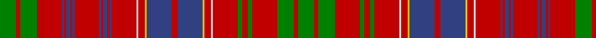

In pattern [GRGRBRBRBRBRBRBRWRYBRBYRWRGRGRGRG](/patterns/grgrbrbrbrbrbrbrwrybrbyrwrgrgrgrg/).

This was sourced from weddslist.  It is a [33 stripes tartan](/stripes/stripes33/).

Original link http://www.weddslist.com/cgi-bin/tartans/pg.pl?source=sts

## Thread count
G/16 R4 G16 R24 B2 R2 B4 R2 B2 R24 B2 R2 B4 R2 B2 R24 LN2 R6 Y2 B24 R6 B24 Y2 R6 LN2 R24 G4 R6 G4 R24 G16 R4 G/16

## Palette
Each colour and its ΔE from the base-6 reference it is a variant of.

| Colour | Shade | Base | ΔE (OKLab) |
|---|---|---|---|
| B | <code style="background-color:#304080;">#304080</code> `#304080` | B <code style="background-color:#2C4084;">#2C4084</code> | 0.01 |
| G | <code style="background-color:#008000;">#008000</code> `#008000` | G <code style="background-color:#006400;">#006400</code> | 0.09 |
| LN | <code style="background-color:#E0E0E0;">#E0E0E0</code> `#E0E0E0` | W <code style="background-color:#F4F4F0;">#F4F4F0</code> | 0.06 |
| R | <code style="background-color:#C00000;">#C00000</code> `#C00000` | R <code style="background-color:#C80000;">#C80000</code> | 0.02 |
| Y | <code style="background-color:#F0C000;">#F0C000</code> `#F0C000` | Y <code style="background-color:#E8C000;">#E8C000</code> | 0.01 |

## Nearest tartans

The nearest existing variants by ΔTartan distance.

1. [Huntly District Tartan Tartan Number: 853. Earliest known date: 1893 (1745) 'Old and Rare Scottish Tartans' was published in 1893 by D.W. Stewart. The book was illustrated by samples woven in silk. The Huntly district tartan is known to have been worn at the time of the '45 rebellion by Brodies, Forbes', Gordons, MacRaes, Munros and Rosses which gives a strong indication of the greater antiquity of the 'District' setts. See products available Copyright © Blair Urquhart, Comrie, 2015](/setts/s33/g16r4g16r24g4r6g4r24w2r6y2b24r6b24y2r6w2r24b2r2b4r2b2r24b2r2b4r2b2r24g16r4g16-b2c2c80-g006818-rc80000-we0e0e0-ye8c000/) — ΔT 0.40
1. [MacRae of Inverinate Clan Tartan Tartan Number: 2000. Earliest known date: pre 2003 Presented by Mrs Macrae of Inverinate 1977, and approved for the use of the MacRaes of the Inverinate branch of the Clan. See products available Copyright © Blair Urquhart, Comrie, 2015](/setts/s40/r46g4r6g4r6g4r10y10r10g4r6g4r6g4r46g46r10g30r10g46r46g4r6g4r6g4r10w10r10g4r6g4r6g4r46b30r10b30r10b30-b2c2c80-g006818-rc80000-we0e0e0-ye8c000/) — ΔT 0.48
1. [MacRae of Inverinate](/setts/s40/r46g4r6g4r6g4r10y10r10g4r6g4r6g4r46g46r10g30r10g46r46g4r6g4r6g4r10w10r10g4r6g4r6g4r46b30r10b30r10b30-b304080-g008000-rc00000-we0e0e0-yf0c000/) — ΔT 0.54
1. [Lumsden Short Version](/setts/s30/r18b2r2b4r2b2r18w2r8b22r4b22r8w2r18g4r8g4r18g10r6g8r6g6y2g6r6g12w2g12-b304080-g008000-rc00000-we0e0e0-yf0c000/) — ΔT 0.70
1. [Lumsden (Waistcoat)](/setts/s39/g21w2g20r8g6y3g6r8g10r9g11r22g3r9g3r21w2r10b26r6b26r10w2r19g2r2g3r2g2r20g2r2g3r2g2r19g20r6g20-b2c2c80-g006818-rc80000-we0e0e0-ye8c000/) — ΔT 0.74
1. [Lumsden (Short)](/setts/s30/r18b2r2b4r2b2r18w2r8b22r4b22r8w2r18g4r8g4r18g10r6g8r6g6y2g6r6g12w2g12-b2c2c80-g006818-rc80000-we0e0e0-ye8c000/) — ΔT 0.78
1. [Marchioness of Huntly's](/setts/s33/g64r14g64r66g8r24g8r66w6r24y6b66r14b66y6r24w6r66b4r4b10r4b4r66b4r4b10r4b4r66g64r14g64-b780078-g006818-rc80000-wc0c0c0-yd8b000/) — ΔT 0.81
1. [Kinnoull](/setts/s31/g46r12g46r50g8r20g8r50w6r20b62r12b62r20w6r50k4r4k8r4k4r50k4r4k8r4k4r50g46r12g46-b8080d0-g008000-k000000-rc00000-we0e0e0/) — ΔT 0.82
1. [Huntly (District)](/setts/s33/g32r7g32r33g4r12g4r33w3r12y3b33r7b33y3r12w3r33b2r2b5r2b2r33b2r2b5r2b2r33g32r6g23-b580058-g285800-rc80000-wfcfcfc-yd8b000/) — ΔT 0.91
1. [MacAlister](/setts/s30/r48g12y4r8y4g12r12b12r24ba4r4g32r4ba4r48ba4r4g32r4ba4r24g8r4ba4r8ba4r4g12y4r16-b304080-ba5480b0-g008000-rc00000-yf0c000/) — ΔT 0.92

## Neighbour map

Every grey dot is one of 15726 variants placed by the first two principal components of the ΔTartan feature space (44% of its variance). Red is this tartan; blue dots are its nearest — click one to open its page.

<svg viewBox="0 0 640 380" role="img" style="max-width:100%;height:auto;border:1px solid #e0e0e0;border-radius:4px;display:block" xmlns="http://www.w3.org/2000/svg"><image href="/nn/cloud.v1.png" width="640" height="380"/><a href="/setts/s33/g16r4g16r24g4r6g4r24w2r6y2b24r6b24y2r6w2r24b2r2b4r2b2r24b2r2b4r2b2r24g16r4g16-b2c2c80-g006818-rc80000-we0e0e0-ye8c000/"><circle cx="255.2" cy="99.5" r="4" fill="#3465a4"><title>Huntly District Tartan Tartan Number: 853. Earliest known date: 1893 (1745) 'Old and Rare Scottish Tartans' was published in 1893 by D.W. Stewart. The book was illustrated by samples woven in silk. The Huntly district tartan is known to have been worn at the time of the '45 rebellion by Brodies, Forbes', Gordons, MacRaes, Munros and Rosses which gives a strong indication of the greater antiquity of the 'District' setts. See products available Copyright © Blair Urquhart, Comrie, 2015</title></circle></a><a href="/setts/s40/r46g4r6g4r6g4r10y10r10g4r6g4r6g4r46g46r10g30r10g46r46g4r6g4r6g4r10w10r10g4r6g4r6g4r46b30r10b30r10b30-b2c2c80-g006818-rc80000-we0e0e0-ye8c000/"><circle cx="255.8" cy="88.7" r="4" fill="#3465a4"><title>MacRae of Inverinate Clan Tartan Tartan Number: 2000. Earliest known date: pre 2003 Presented by Mrs Macrae of Inverinate 1977, and approved for the use of the MacRaes of the Inverinate branch of the Clan. See products available Copyright © Blair Urquhart, Comrie, 2015</title></circle></a><a href="/setts/s40/r46g4r6g4r6g4r10y10r10g4r6g4r6g4r46g46r10g30r10g46r46g4r6g4r6g4r10w10r10g4r6g4r6g4r46b30r10b30r10b30-b304080-g008000-rc00000-we0e0e0-yf0c000/"><circle cx="256.4" cy="89.9" r="4" fill="#3465a4"><title>MacRae of Inverinate</title></circle></a><a href="/setts/s30/r18b2r2b4r2b2r18w2r8b22r4b22r8w2r18g4r8g4r18g10r6g8r6g6y2g6r6g12w2g12-b304080-g008000-rc00000-we0e0e0-yf0c000/"><circle cx="223.6" cy="121.6" r="4" fill="#3465a4"><title>Lumsden Short Version</title></circle></a><a href="/setts/s39/g21w2g20r8g6y3g6r8g10r9g11r22g3r9g3r21w2r10b26r6b26r10w2r19g2r2g3r2g2r20g2r2g3r2g2r19g20r6g20-b2c2c80-g006818-rc80000-we0e0e0-ye8c000/"><circle cx="226.2" cy="101.6" r="4" fill="#3465a4"><title>Lumsden (Waistcoat)</title></circle></a><a href="/setts/s30/r18b2r2b4r2b2r18w2r8b22r4b22r8w2r18g4r8g4r18g10r6g8r6g6y2g6r6g12w2g12-b2c2c80-g006818-rc80000-we0e0e0-ye8c000/"><circle cx="221.6" cy="119.9" r="4" fill="#3465a4"><title>Lumsden (Short)</title></circle></a><a href="/setts/s33/g64r14g64r66g8r24g8r66w6r24y6b66r14b66y6r24w6r66b4r4b10r4b4r66b4r4b10r4b4r66g64r14g64-b780078-g006818-rc80000-wc0c0c0-yd8b000/"><circle cx="268.7" cy="90.5" r="4" fill="#3465a4"><title>Marchioness of Huntly's</title></circle></a><a href="/setts/s31/g46r12g46r50g8r20g8r50w6r20b62r12b62r20w6r50k4r4k8r4k4r50k4r4k8r4k4r50g46r12g46-b8080d0-g008000-k000000-rc00000-we0e0e0/"><circle cx="225.9" cy="91.6" r="4" fill="#3465a4"><title>Kinnoull</title></circle></a><a href="/setts/s33/g32r7g32r33g4r12g4r33w3r12y3b33r7b33y3r12w3r33b2r2b5r2b2r33b2r2b5r2b2r33g32r6g23-b580058-g285800-rc80000-wfcfcfc-yd8b000/"><circle cx="271.6" cy="89.8" r="4" fill="#3465a4"><title>Huntly (District)</title></circle></a><a href="/setts/s30/r48g12y4r8y4g12r12b12r24ba4r4g32r4ba4r48ba4r4g32r4ba4r24g8r4ba4r8ba4r4g12y4r16-b304080-ba5480b0-g008000-rc00000-yf0c000/"><circle cx="303.9" cy="102.6" r="4" fill="#3465a4"><title>MacAlister</title></circle></a><circle cx="257.6" cy="101.4" r="5" fill="#c00000"/></svg>

ID: /setts/s33/g16r4g16r24g4r6g4r24w2r6y2b24r6b24y2r6w2r24b2r2b4r2b2r24b2r2b4r2b2r24g16r4g16-b304080-g008000-rc00000-we0e0e0-yf0c000/
