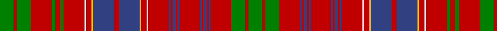

This page is one **sett** — a single exact thread-count. It belongs to the [tartan](/tartans/g8r2g8r12g2r3g2r12w1r3ly1db12r3db12ly1r3w1r12db1r1db2r1db1r12db1r1db2r1db1r12g8r2g8/)
(the same proportion at any scale), whose colour order is pattern [GRGRBRBRBRBRBRBRWRYBRBYRWRGRGRGRG](/stripes/grgrbrbrbrbrbrbrwrybrbyrwrgrgrgrg/).

Sourced from weddslist.  It is a [33 stripe tartan](/stripes/stripes33/).

Original link http://www.weddslist.com/cgi-bin/tartans/pg.pl?source=sts

2 attestations — the source records this cloth was collapsed from (oldest owns this page)

<ul>
<li>undated — Huntly (weddslist, <a href="http://www.weddslist.com/cgi-bin/tartans/pg.pl?source=sts">record</a>)</li>
<li>undated — Huntly District Tartan Tartan Number: 853. Earliest known date: 1893 (1745) 'Old and Rare Scottish Tartans' was published in 1893 by D.W. Stewart. The book was illustrated by samples woven in silk. The Huntly district tartan is known to have been worn at the time of the '45 rebellion by Brodies, Forbes', Gordons, MacRaes, Munros and Rosses which gives a strong indication of the greater antiquity of the 'District' setts. See products available Copyright © Blair Urquhart, Comrie, 2015 (house-of-tartan, <a href="http://www.house-of-tartan.scotland.net/house/TartanViewjs.asp?colr=Def&tnam=853">record</a>)</li>
</ul>

## Thread count
G/16 R4 G16 R24 G4 R6 G4 R24 LN2 R6 Y2 B24 R6 B24 Y2 R6 LN2 R24 B2 R2 B4 R2 B2 R24 B2 R2 B4 R2 B2 R24 G16 R4 G/16

## Palette

Palette: <strong>Tartan Dictionary</strong> <small style="color:#888">(1 of 5 colours)</small>
<table><thead><tr><th>Colour</th><th>Threads</th><th>Shade</th><th>Base</th><th>OKLCh</th></tr></thead><tbody><tr><td>G/</td><td style="text-align:right;font-variant-numeric:tabular-nums">16</td><td><code style="background-color:#008000;">#008000</code> <small style="color:#888">#008000</small></td><td>G <code style="background-color:#006100;">#006100</code></td><td><small style="color:#888">oklch(52.0% 0.177 142.5)</small></td></tr><tr><td>R</td><td style="text-align:right;font-variant-numeric:tabular-nums">4</td><td><code style="background-color:#C00000;">#C00000</code> <small style="color:#888">#C00000</small></td><td>R <code style="background-color:#CC0000;">#CC0000</code></td><td><small style="color:#888">oklch(50.7% 0.208 29.2)</small></td></tr><tr><td>G</td><td style="text-align:right;font-variant-numeric:tabular-nums">16</td><td><code style="background-color:#008000;">#008000</code> <small style="color:#888">#008000</small></td><td>G <code style="background-color:#006100;">#006100</code></td><td><small style="color:#888">oklch(52.0% 0.177 142.5)</small></td></tr><tr><td>R</td><td style="text-align:right;font-variant-numeric:tabular-nums">24</td><td><code style="background-color:#C00000;">#C00000</code> <small style="color:#888">#C00000</small></td><td>R <code style="background-color:#CC0000;">#CC0000</code></td><td><small style="color:#888">oklch(50.7% 0.208 29.2)</small></td></tr><tr><td>G</td><td style="text-align:right;font-variant-numeric:tabular-nums">4</td><td><code style="background-color:#008000;">#008000</code> <small style="color:#888">#008000</small></td><td>G <code style="background-color:#006100;">#006100</code></td><td><small style="color:#888">oklch(52.0% 0.177 142.5)</small></td></tr><tr><td>R</td><td style="text-align:right;font-variant-numeric:tabular-nums">6</td><td><code style="background-color:#C00000;">#C00000</code> <small style="color:#888">#C00000</small></td><td>R <code style="background-color:#CC0000;">#CC0000</code></td><td><small style="color:#888">oklch(50.7% 0.208 29.2)</small></td></tr><tr><td>G</td><td style="text-align:right;font-variant-numeric:tabular-nums">4</td><td><code style="background-color:#008000;">#008000</code> <small style="color:#888">#008000</small></td><td>G <code style="background-color:#006100;">#006100</code></td><td><small style="color:#888">oklch(52.0% 0.177 142.5)</small></td></tr><tr><td>R</td><td style="text-align:right;font-variant-numeric:tabular-nums">24</td><td><code style="background-color:#C00000;">#C00000</code> <small style="color:#888">#C00000</small></td><td>R <code style="background-color:#CC0000;">#CC0000</code></td><td><small style="color:#888">oklch(50.7% 0.208 29.2)</small></td></tr><tr><td>LN</td><td style="text-align:right;font-variant-numeric:tabular-nums">2</td><td><code style="background-color:#E0E0E0;">#E0E0E0</code> <small style="color:#888">#E0E0E0</small></td><td>W <code style="background-color:#F7F7F7;">#F7F7F7</code></td><td><small style="color:#888">oklch(90.7% 0.000 89.9)</small></td></tr><tr><td>R</td><td style="text-align:right;font-variant-numeric:tabular-nums">6</td><td><code style="background-color:#C00000;">#C00000</code> <small style="color:#888">#C00000</small></td><td>R <code style="background-color:#CC0000;">#CC0000</code></td><td><small style="color:#888">oklch(50.7% 0.208 29.2)</small></td></tr><tr><td>Y</td><td style="text-align:right;font-variant-numeric:tabular-nums">2</td><td><code style="background-color:#F0C000;">#F0C000</code> <small style="color:#888">#F0C000</small></td><td>Y <code style="background-color:#F2BF00;">#F2BF00</code></td><td><small style="color:#888">oklch(82.7% 0.169 90.5)</small></td></tr><tr><td>B</td><td style="text-align:right;font-variant-numeric:tabular-nums">24</td><td><code style="background-color:#304080;">#304080</code> <small style="color:#888">#304080</small></td><td>B <code style="background-color:#2A418A;">#2A418A</code></td><td><small style="color:#888">oklch(39.4% 0.109 270.2)</small></td></tr><tr><td>R</td><td style="text-align:right;font-variant-numeric:tabular-nums">6</td><td><code style="background-color:#C00000;">#C00000</code> <small style="color:#888">#C00000</small></td><td>R <code style="background-color:#CC0000;">#CC0000</code></td><td><small style="color:#888">oklch(50.7% 0.208 29.2)</small></td></tr><tr><td>B</td><td style="text-align:right;font-variant-numeric:tabular-nums">24</td><td><code style="background-color:#304080;">#304080</code> <small style="color:#888">#304080</small></td><td>B <code style="background-color:#2A418A;">#2A418A</code></td><td><small style="color:#888">oklch(39.4% 0.109 270.2)</small></td></tr><tr><td>Y</td><td style="text-align:right;font-variant-numeric:tabular-nums">2</td><td><code style="background-color:#F0C000;">#F0C000</code> <small style="color:#888">#F0C000</small></td><td>Y <code style="background-color:#F2BF00;">#F2BF00</code></td><td><small style="color:#888">oklch(82.7% 0.169 90.5)</small></td></tr><tr><td>R</td><td style="text-align:right;font-variant-numeric:tabular-nums">6</td><td><code style="background-color:#C00000;">#C00000</code> <small style="color:#888">#C00000</small></td><td>R <code style="background-color:#CC0000;">#CC0000</code></td><td><small style="color:#888">oklch(50.7% 0.208 29.2)</small></td></tr><tr><td>LN</td><td style="text-align:right;font-variant-numeric:tabular-nums">2</td><td><code style="background-color:#E0E0E0;">#E0E0E0</code> <small style="color:#888">#E0E0E0</small></td><td>W <code style="background-color:#F7F7F7;">#F7F7F7</code></td><td><small style="color:#888">oklch(90.7% 0.000 89.9)</small></td></tr><tr><td>R</td><td style="text-align:right;font-variant-numeric:tabular-nums">24</td><td><code style="background-color:#C00000;">#C00000</code> <small style="color:#888">#C00000</small></td><td>R <code style="background-color:#CC0000;">#CC0000</code></td><td><small style="color:#888">oklch(50.7% 0.208 29.2)</small></td></tr><tr><td>B</td><td style="text-align:right;font-variant-numeric:tabular-nums">2</td><td><code style="background-color:#304080;">#304080</code> <small style="color:#888">#304080</small></td><td>B <code style="background-color:#2A418A;">#2A418A</code></td><td><small style="color:#888">oklch(39.4% 0.109 270.2)</small></td></tr><tr><td>R</td><td style="text-align:right;font-variant-numeric:tabular-nums">2</td><td><code style="background-color:#C00000;">#C00000</code> <small style="color:#888">#C00000</small></td><td>R <code style="background-color:#CC0000;">#CC0000</code></td><td><small style="color:#888">oklch(50.7% 0.208 29.2)</small></td></tr><tr><td>B</td><td style="text-align:right;font-variant-numeric:tabular-nums">4</td><td><code style="background-color:#304080;">#304080</code> <small style="color:#888">#304080</small></td><td>B <code style="background-color:#2A418A;">#2A418A</code></td><td><small style="color:#888">oklch(39.4% 0.109 270.2)</small></td></tr><tr><td>R</td><td style="text-align:right;font-variant-numeric:tabular-nums">2</td><td><code style="background-color:#C00000;">#C00000</code> <small style="color:#888">#C00000</small></td><td>R <code style="background-color:#CC0000;">#CC0000</code></td><td><small style="color:#888">oklch(50.7% 0.208 29.2)</small></td></tr><tr><td>B</td><td style="text-align:right;font-variant-numeric:tabular-nums">2</td><td><code style="background-color:#304080;">#304080</code> <small style="color:#888">#304080</small></td><td>B <code style="background-color:#2A418A;">#2A418A</code></td><td><small style="color:#888">oklch(39.4% 0.109 270.2)</small></td></tr><tr><td>R</td><td style="text-align:right;font-variant-numeric:tabular-nums">24</td><td><code style="background-color:#C00000;">#C00000</code> <small style="color:#888">#C00000</small></td><td>R <code style="background-color:#CC0000;">#CC0000</code></td><td><small style="color:#888">oklch(50.7% 0.208 29.2)</small></td></tr><tr><td>B</td><td style="text-align:right;font-variant-numeric:tabular-nums">2</td><td><code style="background-color:#304080;">#304080</code> <small style="color:#888">#304080</small></td><td>B <code style="background-color:#2A418A;">#2A418A</code></td><td><small style="color:#888">oklch(39.4% 0.109 270.2)</small></td></tr><tr><td>R</td><td style="text-align:right;font-variant-numeric:tabular-nums">2</td><td><code style="background-color:#C00000;">#C00000</code> <small style="color:#888">#C00000</small></td><td>R <code style="background-color:#CC0000;">#CC0000</code></td><td><small style="color:#888">oklch(50.7% 0.208 29.2)</small></td></tr><tr><td>B</td><td style="text-align:right;font-variant-numeric:tabular-nums">4</td><td><code style="background-color:#304080;">#304080</code> <small style="color:#888">#304080</small></td><td>B <code style="background-color:#2A418A;">#2A418A</code></td><td><small style="color:#888">oklch(39.4% 0.109 270.2)</small></td></tr><tr><td>R</td><td style="text-align:right;font-variant-numeric:tabular-nums">2</td><td><code style="background-color:#C00000;">#C00000</code> <small style="color:#888">#C00000</small></td><td>R <code style="background-color:#CC0000;">#CC0000</code></td><td><small style="color:#888">oklch(50.7% 0.208 29.2)</small></td></tr><tr><td>B</td><td style="text-align:right;font-variant-numeric:tabular-nums">2</td><td><code style="background-color:#304080;">#304080</code> <small style="color:#888">#304080</small></td><td>B <code style="background-color:#2A418A;">#2A418A</code></td><td><small style="color:#888">oklch(39.4% 0.109 270.2)</small></td></tr><tr><td>R</td><td style="text-align:right;font-variant-numeric:tabular-nums">24</td><td><code style="background-color:#C00000;">#C00000</code> <small style="color:#888">#C00000</small></td><td>R <code style="background-color:#CC0000;">#CC0000</code></td><td><small style="color:#888">oklch(50.7% 0.208 29.2)</small></td></tr><tr><td>G</td><td style="text-align:right;font-variant-numeric:tabular-nums">16</td><td><code style="background-color:#008000;">#008000</code> <small style="color:#888">#008000</small></td><td>G <code style="background-color:#006100;">#006100</code></td><td><small style="color:#888">oklch(52.0% 0.177 142.5)</small></td></tr><tr><td>R</td><td style="text-align:right;font-variant-numeric:tabular-nums">4</td><td><code style="background-color:#C00000;">#C00000</code> <small style="color:#888">#C00000</small></td><td>R <code style="background-color:#CC0000;">#CC0000</code></td><td><small style="color:#888">oklch(50.7% 0.208 29.2)</small></td></tr><tr><td>G/</td><td style="text-align:right;font-variant-numeric:tabular-nums">16</td><td><code style="background-color:#008000;">#008000</code> <small style="color:#888">#008000</small></td><td>G <code style="background-color:#006100;">#006100</code></td><td><small style="color:#888">oklch(52.0% 0.177 142.5)</small></td></tr></tbody></table>

## Nearest tartans

The nearest existing variants by ΔTartan distance, with this tartan at the top so the swatches line up against it.

ΔTartan

Tartan

Sett

—

<a href="/ttd/edit/#slug=g8r2g8r12g2r3g2r12w1r3ly1db12r3db12ly1r3w1r12db1r1db2r1db1r12db1r1db2r1db1r12g8r2g8~x2">Huntly</a> <a class="nn-out" href="/setts/s33/g8r2g8r12g2r3g2r12w1r3ly1db12r3db12ly1r3w1r12db1r1db2r1db1r12db1r1db2r1db1r12g8r2g8~x2/" title="open its dictionary page">↗</a>

0.54

<a href="/ttd/edit/#slug=r23g2r3g2r3g2r5ly5r5g2r3g2r3g2r23g23r5g15r5g23r23g2r3g2r3g2r5w5r5g2r3g2r3g2r23db15r5db15r5db15~x2">MacRae of Inverinate</a> <a class="nn-out" href="/setts/s40/r23g2r3g2r3g2r5ly5r5g2r3g2r3g2r23g23r5g15r5g23r23g2r3g2r3g2r5w5r5g2r3g2r3g2r23db15r5db15r5db15~x2/" title="open its dictionary page">↗</a>

0.74

<a href="/ttd/edit/#slug=g21w2g20r8g6ly3g6r8g10r9g11r22g3r9g3r21w2r10db26r6db26r10w2r19g2r2g3r2g2r20g2r2g3r2g2r19g20r6g20">Lumsden (Waistcoat)</a> <a class="nn-out" href="/setts/s39/g21w2g20r8g6ly3g6r8g10r9g11r22g3r9g3r21w2r10db26r6db26r10w2r19g2r2g3r2g2r20g2r2g3r2g2r19g20r6g20/" title="open its dictionary page">↗</a>

0.79

<a href="/ttd/edit/#slug=r9db1r1db2r1db1r9w1r4db11r2db11r4w1r9g2r4g2r9g5r3g4r3g3ly1g3r3g6w1g6~x2">Lumsden (Short)</a> <a class="nn-out" href="/setts/s30/r9db1r1db2r1db1r9w1r4db11r2db11r4w1r9g2r4g2r9g5r3g4r3g3ly1g3r3g6w1g6~x2/" title="open its dictionary page">↗</a>

0.82

<a href="/ttd/edit/#slug=g32r7g32r33g4r12g4r33lb3r12ly3dp33r7dp33ly3r12lb3r33dp2r2dp5r2dp2r33dp2r2dp5r2dp2r33g32r7g32~x2">Marchioness of Huntly's</a> <a class="nn-out" href="/setts/s33/g32r7g32r33g4r12g4r33lb3r12ly3dp33r7dp33ly3r12lb3r33dp2r2dp5r2dp2r33dp2r2dp5r2dp2r33g32r7g32~x2/" title="open its dictionary page">↗</a>

0.82

<a href="/ttd/edit/#slug=g23r6g23r25g4r10g4r25w3r10b31r6b31r10w3r25k2r2k4r2k2r25k2r2k4r2k2r25g23r6g23~x2">Kinnoull</a> <a class="nn-out" href="/setts/s31/g23r6g23r25g4r10g4r25w3r10b31r6b31r10w3r25k2r2k4r2k2r25k2r2k4r2k2r25g23r6g23~x2/" title="open its dictionary page">↗</a>

0.92

<a href="/ttd/edit/#slug=dg32r7dg32r33dg4r12dg4r33w3r12ly3dp33r7dp33ly3r12w3r33dp2r2dp5r2dp2r33dp2r2dp5r2dp2r33dg32r6dg23">Huntly (District)</a> <a class="nn-out" href="/setts/s33/dg32r7dg32r33dg4r12dg4r33w3r12ly3dp33r7dp33ly3r12w3r33dp2r2dp5r2dp2r33dp2r2dp5r2dp2r33dg32r6dg23/" title="open its dictionary page">↗</a>

0.92

<a href="/ttd/edit/#slug=r12g3ly1r2ly1g3r3db3r6t1r1g8r1t1r12t1r1g8r1t1r6g2r1t1r2t1r1g3ly1r4~x4">MacAlister</a> <a class="nn-out" href="/setts/s30/r12g3ly1r2ly1g3r3db3r6t1r1g8r1t1r12t1r1g8r1t1r6g2r1t1r2t1r1g3ly1r4~x4/" title="open its dictionary page">↗</a>

0.93

<a href="/ttd/edit/#slug=r12dg3ly1r2ly1dg3r3db3r6t1r1dg8r1t1r12t1r1dg8r1t1r6dg2r1t1r2t1r1dg3ly1r4~x4">MacAlister (Gourlay Steele Collection)</a> <a class="nn-out" href="/setts/s30/r12dg3ly1r2ly1dg3r3db3r6t1r1dg8r1t1r12t1r1dg8r1t1r6dg2r1t1r2t1r1dg3ly1r4~x4/" title="open its dictionary page">↗</a>

0.94

<a href="/ttd/edit/#slug=g21w2g20r8g6ly3g6r8g10r9g11r22g3r9g3r21w2r10db26r6db26r10w2r19g2r2g3r2g2r20g2r2g3r2g2r19g20r6g20~x2">Lumsden Waistcoat</a> <a class="nn-out" href="/setts/s39/g21w2g20r8g6ly3g6r8g10r9g11r22g3r9g3r21w2r10db26r6db26r10w2r19g2r2g3r2g2r20g2r2g3r2g2r19g20r6g20~x2/" title="open its dictionary page">↗</a>

1.02

<a href="/ttd/edit/#slug=r24db4r22g4r4g4r4g4r4g4r20g4r4k2g22k2r4g4r22g4r4db22r21w4r21g19w2g19r5g4r22g4r5g4k4r5db4r5db4r19">MacDonald of Staffa 6</a> <a class="nn-out" href="/setts/s40/r24db4r22g4r4g4r4g4r4g4r20g4r4k2g22k2r4g4r22g4r4db22r21w4r21g19w2g19r5g4r22g4r5g4k4r5db4r5db4r19/" title="open its dictionary page">↗</a>

## Neighbour map

Every grey dot is one of 14299 variants placed by the first two principal components of the ΔTartan feature space (44% of its variance). Red is this tartan; blue dots are its nearest — click one to open its page.

<svg viewBox="0 0 640 380" role="img" style="max-width:100%;height:auto;border:1px solid #e0e0e0;border-radius:4px;display:block" xmlns="http://www.w3.org/2000/svg"><image href="/nn/cloud.v1.png" width="640" height="380"/><a href="/setts/s40/r23g2r3g2r3g2r5ly5r5g2r3g2r3g2r23g23r5g15r5g23r23g2r3g2r3g2r5w5r5g2r3g2r3g2r23db15r5db15r5db15~x2/"><circle cx="259.2" cy="91.1" r="4" fill="#3465a4"><title>MacRae of Inverinate</title></circle></a><a href="/setts/s39/g21w2g20r8g6ly3g6r8g10r9g11r22g3r9g3r21w2r10db26r6db26r10w2r19g2r2g3r2g2r20g2r2g3r2g2r19g20r6g20/"><circle cx="229.3" cy="103.1" r="4" fill="#3465a4"><title>Lumsden (Waistcoat)</title></circle></a><a href="/setts/s30/r9db1r1db2r1db1r9w1r4db11r2db11r4w1r9g2r4g2r9g5r3g4r3g3ly1g3r3g6w1g6~x2/"><circle cx="224.0" cy="120.7" r="4" fill="#3465a4"><title>Lumsden (Short)</title></circle></a><a href="/setts/s33/g32r7g32r33g4r12g4r33lb3r12ly3dp33r7dp33ly3r12lb3r33dp2r2dp5r2dp2r33dp2r2dp5r2dp2r33g32r7g32~x2/"><circle cx="271.3" cy="92.3" r="4" fill="#3465a4"><title>Marchioness of Huntly's</title></circle></a><a href="/setts/s31/g23r6g23r25g4r10g4r25w3r10b31r6b31r10w3r25k2r2k4r2k2r25k2r2k4r2k2r25g23r6g23~x2/"><circle cx="228.7" cy="91.8" r="4" fill="#3465a4"><title>Kinnoull</title></circle></a><a href="/setts/s33/dg32r7dg32r33dg4r12dg4r33w3r12ly3dp33r7dp33ly3r12w3r33dp2r2dp5r2dp2r33dp2r2dp5r2dp2r33dg32r6dg23/"><circle cx="274.1" cy="91.3" r="4" fill="#3465a4"><title>Huntly (District)</title></circle></a><a href="/setts/s30/r12g3ly1r2ly1g3r3db3r6t1r1g8r1t1r12t1r1g8r1t1r6g2r1t1r2t1r1g3ly1r4~x4/"><circle cx="305.7" cy="103.7" r="4" fill="#3465a4"><title>MacAlister</title></circle></a><a href="/setts/s30/r12dg3ly1r2ly1dg3r3db3r6t1r1dg8r1t1r12t1r1dg8r1t1r6dg2r1t1r2t1r1dg3ly1r4~x4/"><circle cx="299.3" cy="96.7" r="4" fill="#3465a4"><title>MacAlister (Gourlay Steele Collection)</title></circle></a><a href="/setts/s39/g21w2g20r8g6ly3g6r8g10r9g11r22g3r9g3r21w2r10db26r6db26r10w2r19g2r2g3r2g2r20g2r2g3r2g2r19g20r6g20~x2/"><circle cx="228.4" cy="103.6" r="4" fill="#3465a4"><title>Lumsden Waistcoat</title></circle></a><a href="/setts/s40/r24db4r22g4r4g4r4g4r4g4r20g4r4k2g22k2r4g4r22g4r4db22r21w4r21g19w2g19r5g4r22g4r5g4k4r5db4r5db4r19/"><circle cx="290.1" cy="98.7" r="4" fill="#3465a4"><title>MacDonald of Staffa 6</title></circle></a><circle cx="260.2" cy="102.8" r="5" fill="#c00000"/></svg>

ID: /setts/s33/g8r2g8r12g2r3g2r12w1r3ly1db12r3db12ly1r3w1r12db1r1db2r1db1r12db1r1db2r1db1r12g8r2g8~x2/
