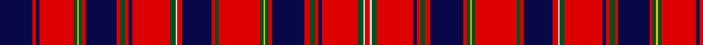

In pattern [BRBRGYGRBRGRBRGWRBRGRGYGRBRGRBRGWR](/patterns/brbrgygrbrgrbrgwrbrgrgygrbrgrbrgwr/).

This was sourced from register-of-tartans.  It is a [34 stripes tartan](/stripes/stripes34/).

Original link https://www.tartanregister.gov.uk/tartanDetails.aspx?ref=4275

## Register references

External register numbers recorded for this tartan.

- Scottish Register of Tartans: [4275](https://www.tartanregister.gov.uk/tartanDetails.aspx?ref=4275)
- Scottish Tartans World Register: 2004

## Thread count
DB/38 R4 DB4 R40 G4 Y2 G4 R4 DB36 R4 G6 R4 DB4 R44 G6 LN2 R6 DB34 R4 G4 R48 G4 Y2 G4 R4 DB38 R6 G6 R4 DB4 R42 G6 LN2 R/6

## Palette
Each colour and its ΔE from the base-6 reference it is a variant of.

| Colour | Shade | Base | ΔE (OKLab) |
|---|---|---|---|
| DB | <code style="background-color:#080848;">#080848</code> `#080848` | B <code style="background-color:#2A418A;">#2A418A</code> | 0.20 |
| G | <code style="background-color:#005020;">#005020</code> `#005020` | G <code style="background-color:#006100;">#006100</code> | 0.07 |
| LN | <code style="background-color:#E0E0E0;">#E0E0E0</code> `#E0E0E0` | W <code style="background-color:#F7F7F7;">#F7F7F7</code> | 0.07 |
| R | <code style="background-color:#DC0000;">#DC0000</code> `#DC0000` | R <code style="background-color:#CC0000;">#CC0000</code> | 0.03 |
| Y | <code style="background-color:#E8C000;">#E8C000</code> `#E8C000` | Y <code style="background-color:#F2BF00;">#F2BF00</code> | 0.02 |

## Nearest tartans

The nearest existing variants by ΔTartan distance.

1. [Unidentified, 18th C plain weave](/setts/s34/b19r2b2r20g2y1g2r2b18r2g3r2b2r22g3w1r3b17r2g2r24g2y1g2r2b19r3g3r2b2r21g3w1r3~b000050-g008000-rc00000-we0e0e0-yf0c000~x2/) — ΔT 0.49
1. [Unidentified Scarlett #3](/setts/s34/r3k18r2g3r2k2r20g2y1g2r2k18r2k2r20g3w1r3k18r2g3r2k2r20g2y1g2r2k18r2g2r20g3w1~g408060-k101010-rc80000-wfcfcfc-ye8c000~x2/) — ΔT 0.83
1. [MacKintosh #6](/setts/s41/b48r40k4r4g48r54b46r54ga14r4k4r4k4r48k4r4k4r4ga14r52b46r54ga60r4ga4r48b4r12b4r4b4r48k4r4ga60r48b4r4b4r4k7~b2c4084-g005020-ga002814-k101010-rdc0000/) — ΔT 1.39
1. [MacAlister (Logan 1831)](/setts/s41/r32g2ga12r4b4r4w2r4b4r4ga12r2w2r24b2r2ga44r2b2r64b2r2ga44r2b2r22w2r2ba16r2w2r10ga12g2r8g2ga12r3w2r2ba10~b3c82af-ba2c4084-g309c18-ga002814-rdc0000-we0e0e0~x2/) — ΔT 1.42
1. [Bahrain, Royal](/setts/s18/k16r1k2r3k1r9k1r3k2r1k6g3w3g5r28wa3r3wa3~g005020-k000028-raf0014-w98d0f0-wae0e0e0~x2/) — ΔT 1.43
1. [MacDougall Plaid](/setts/s24/b3ba12w6r6g46r14g6r14b14ba8w6r6w6ba8g12r16g12r6b6r86ba10w6r10b3~b2c4084-ba5a008c-g005020-rdc0000-we0e0e0/) — ΔT 1.48
1. [King George IV](/setts/s32/g3y3g3r24b1w1r3b6r3w1b1r3g24r3b1w1r24w1b1r3g24r3b1w1r3b6r3w1b1r24g3y3~b280034-g285800-rc80000-wf8f8f8-yfca098~x4/) — ΔT 1.49
1. [MacDougall D](/setts/s27/r3g5r1b1r15ba2r1w1r1ba2r15b1r1g5r5g5ba2r1ba2b5r2g1r2g15r1b2w1~b000064-ba5a3094-g004c00-rc80000-wd0d0d0/) — ΔT 1.50
1. [Plowman (Personal)](/setts/s18/r2b17r2g3r2b2r20g1y1r1g2r2b18r2g2r24g3w1~b28003c-g285800-rc80000-we0e0e0-ydcbc00~x2/) — ΔT 1.52
1. [Hebridean, North Uist](/setts/s24/b5r3w2b1w2r3g9y2w1y2g9r1g1r27b1r1b1r27b1r1b9w1b1w4~b000050-g008000-rc00000-we0e0e0-yf0c000~x2/) — ΔT 1.53

## Neighbour map

Every grey dot is one of 15726 variants placed by the first two principal components of the ΔTartan feature space (44% of its variance). Red is this tartan; blue dots are its nearest — click one to open its page.

<svg viewBox="0 0 640 380" role="img" style="max-width:100%;height:auto;border:1px solid #e0e0e0;border-radius:4px;display:block" xmlns="http://www.w3.org/2000/svg"><image href="/nn/cloud.v1.png" width="640" height="380"/><a href="/setts/s34/b19r2b2r20g2y1g2r2b18r2g3r2b2r22g3w1r3b17r2g2r24g2y1g2r2b19r3g3r2b2r21g3w1r3~b000050-g008000-rc00000-we0e0e0-yf0c000~x2/"><circle cx="281.5" cy="53.8" r="4" fill="#3465a4"><title>Unidentified, 18th C plain weave</title></circle></a><a href="/setts/s34/r3k18r2g3r2k2r20g2y1g2r2k18r2k2r20g3w1r3k18r2g3r2k2r20g2y1g2r2k18r2g2r20g3w1~g408060-k101010-rc80000-wfcfcfc-ye8c000~x2/"><circle cx="274.2" cy="61.2" r="4" fill="#3465a4"><title>Unidentified Scarlett #3</title></circle></a><a href="/setts/s41/b48r40k4r4g48r54b46r54ga14r4k4r4k4r48k4r4k4r4ga14r52b46r54ga60r4ga4r48b4r12b4r4b4r48k4r4ga60r48b4r4b4r4k7~b2c4084-g005020-ga002814-k101010-rdc0000/"><circle cx="273.6" cy="74.1" r="4" fill="#3465a4"><title>MacKintosh #6</title></circle></a><a href="/setts/s41/r32g2ga12r4b4r4w2r4b4r4ga12r2w2r24b2r2ga44r2b2r64b2r2ga44r2b2r22w2r2ba16r2w2r10ga12g2r8g2ga12r3w2r2ba10~b3c82af-ba2c4084-g309c18-ga002814-rdc0000-we0e0e0~x2/"><circle cx="274.9" cy="14.0" r="4" fill="#3465a4"><title>MacAlister (Logan 1831)</title></circle></a><a href="/setts/s18/k16r1k2r3k1r9k1r3k2r1k6g3w3g5r28wa3r3wa3~g005020-k000028-raf0014-w98d0f0-wae0e0e0~x2/"><circle cx="284.0" cy="67.7" r="4" fill="#3465a4"><title>Bahrain, Royal</title></circle></a><a href="/setts/s24/b3ba12w6r6g46r14g6r14b14ba8w6r6w6ba8g12r16g12r6b6r86ba10w6r10b3~b2c4084-ba5a008c-g005020-rdc0000-we0e0e0/"><circle cx="269.9" cy="50.2" r="4" fill="#3465a4"><title>MacDougall Plaid</title></circle></a><a href="/setts/s32/g3y3g3r24b1w1r3b6r3w1b1r3g24r3b1w1r24w1b1r3g24r3b1w1r3b6r3w1b1r24g3y3~b280034-g285800-rc80000-wf8f8f8-yfca098~x4/"><circle cx="305.3" cy="45.8" r="4" fill="#3465a4"><title>King George IV</title></circle></a><a href="/setts/s27/r3g5r1b1r15ba2r1w1r1ba2r15b1r1g5r5g5ba2r1ba2b5r2g1r2g15r1b2w1~b000064-ba5a3094-g004c00-rc80000-wd0d0d0/"><circle cx="258.1" cy="85.1" r="4" fill="#3465a4"><title>MacDougall D</title></circle></a><a href="/setts/s18/r2b17r2g3r2b2r20g1y1r1g2r2b18r2g2r24g3w1~b28003c-g285800-rc80000-we0e0e0-ydcbc00~x2/"><circle cx="325.6" cy="77.7" r="4" fill="#3465a4"><title>Plowman (Personal)</title></circle></a><a href="/setts/s24/b5r3w2b1w2r3g9y2w1y2g9r1g1r27b1r1b1r27b1r1b9w1b1w4~b000050-g008000-rc00000-we0e0e0-yf0c000~x2/"><circle cx="296.5" cy="40.1" r="4" fill="#3465a4"><title>Hebridean, North Uist</title></circle></a><circle cx="282.8" cy="50.2" r="5" fill="#c00000"/></svg>

ID: /setts/s34/b19r2b2r20g2y1g2r2b18r2g3r2b2r22g3w1r3b17r2g2r24g2y1g2r2b19r3g3r2b2r21g3w1r3~b080848-g005020-rdc0000-we0e0e0-ye8c000~x2/
