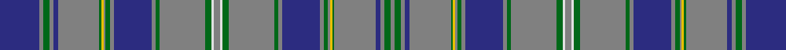

In pattern [BGGGBGGYGGGBGGGGWGWGGGGBGGGYGGBGGG](/stripes/bgggbggygggbggggwgwggggbgggyggbggg/).

This was sourced from register-of-tartans.  It is a [34 stripe tartan](/stripes/stripes34/).

Original link https://www.tartanregister.gov.uk/tartanDetails.aspx?ref=1669

## Register references

External register numbers recorded for this tartan.

- Scottish Register of Tartans: [1669](https://www.tartanregister.gov.uk/tartanDetails.aspx?ref=1669)
- Scottish Tartans Authority (ITI): 2008
- Scottish Tartans World Register: 2008

## Thread count
DB/38 N4 G6 N4 DB4 N40 G2 Y2 N2 G4 N4 DB36 N4 G4 N44 G6 LN2 N6 LN2 G6 N44 G4 N4 DB36 N4 G4 N2 Y2 G2 N40 DB4 N4 G6 N/4

## Palette
Each colour and its ΔE from the base-6 reference it is a variant of.

| Colour | Shade | Base | ΔE (OKLab) |
|---|---|---|---|
| DB | <code style="background-color:#2C2C80;">#2C2C80</code> `#2C2C80` | B <code style="background-color:#2A418A;">#2A418A</code> | 0.06 |
| G | <code style="background-color:#006818;">#006818</code> `#006818` | G <code style="background-color:#006100;">#006100</code> | 0.02 |
| LN | <code style="background-color:#E0E0E0;">#E0E0E0</code> `#E0E0E0` | W <code style="background-color:#F7F7F7;">#F7F7F7</code> | 0.07 |
| N | <code style="background-color:#808080;">#808080</code> `#808080` | G <code style="background-color:#006100;">#006100</code> | 0.23 |
| Y | <code style="background-color:#E8C000;">#E8C000</code> `#E8C000` | Y <code style="background-color:#F2BF00;">#F2BF00</code> | 0.02 |

## Nearest tartans

The nearest existing variants by ΔTartan distance.

1. [Weiss-Halliwell (Personal)](/setts/s36/db6k1n1k2n1k1db6k1n22k3n1k3n10k1db3n1k6n1dg3k1n10k3n1k3n22k1dg6k1n1k2n1k1dg6k1n12k1~x2/) — ΔT 1.51
1. [LOOK Keith](/setts/s24/n10r2n2r2n2dt5o25db6o2db2o1lb3o3lb3o11db2o2db6o25dt5n2r2n2r2~x2/) — ΔT 1.51
1. [Italian](/setts/s30/db24k2db24k1lb1k1g12r2k2r2g12k1lb1k1db24r2lb2g2db24k1lb1k1g12r2k2r2g12k1lb1k1~x2/) — ΔT 1.53
1. [Weiss-Halliwell (Personal)](/setts/s36/dp6k1o1k2o1k1dp6k1o22k3o1k3o10k1dp3o1k6o1dg3k1o10k3o1k3o22k1dg6k1o1k2o1k1dg6k1o12k1~x2/) — ΔT 1.72
1. [Wisconsin in Scotland](/setts/s29/ly1db22ly2m4y2m4r4w2r4m4y2m4ly2db22w2db22ly2m4y2m4r4w2r4m4y2m4ly2db22ly1/) — ΔT 1.78
1. [Joss](/setts/s24/r3dg1db2dg4db30k2db4k2db30dg27ly3k3w3~x2/) — ΔT 1.79
1. [LOOK Keith](/setts/s24/n10r2n2r2n2n5y25db6y2db2y1lb3y3lb3y11db2y2db6y25n5n2r2n2r2~x2/) — ΔT 1.80
1. [Coopers & Lybrand Corporate Commem. Tartan Tartan Number: 2303. Earliest known date: 1996 Designed by Deirdre Nicholls of Celtic Silks. May 1996. Swatch in STA's Johnston Collection. Dark green, red and blue called for but lighter shades used here to display sett. See products available Copyright © Blair Urquhart, Comrie, 2015](/setts/s20/g4r1db24t4k2g24r1db10t4db2t4db10r1g24k2t4db24r1g4t4~x2/) — ΔT 1.84
1. [Ettrick (Green) District Tartan Tartan Number: 2300. Earliest known date: 1971 Ettrick District is in the Borders of Scotland. See products available Copyright © Blair Urquhart, Comrie, 2015](/setts/s24/dt2dg2r1dg5r1dt6r2dg1ly1dg1r1dg1r1dg1t1dg1r2dt6dg20r1dg1r1dg1dt2~x2/) — ΔT 1.84
1. [Platt (Name)](/setts/s28/g16db6ly2g12r2g14db14ly1db12r2g6db24g6ly2r2~x2/) — ΔT 1.84

## Neighbour map

Every grey dot is one of 14299 variants placed by the first two principal components of the ΔTartan feature space (44% of its variance). Red is this tartan; blue dots are its nearest — click one to open its page.

<svg viewBox="0 0 640 380" role="img" style="max-width:100%;height:auto;border:1px solid #e0e0e0;border-radius:4px;display:block" xmlns="http://www.w3.org/2000/svg"><image href="/nn/cloud.v1.png" width="640" height="380"/><a href="/setts/s36/db6k1n1k2n1k1db6k1n22k3n1k3n10k1db3n1k6n1dg3k1n10k3n1k3n22k1dg6k1n1k2n1k1dg6k1n12k1~x2/"><circle cx="355.1" cy="102.1" r="4" fill="#3465a4"><title>Weiss-Halliwell (Personal)</title></circle></a><a href="/setts/s24/n10r2n2r2n2dt5o25db6o2db2o1lb3o3lb3o11db2o2db6o25dt5n2r2n2r2~x2/"><circle cx="294.6" cy="73.9" r="4" fill="#3465a4"><title>LOOK Keith</title></circle></a><a href="/setts/s30/db24k2db24k1lb1k1g12r2k2r2g12k1lb1k1db24r2lb2g2db24k1lb1k1g12r2k2r2g12k1lb1k1~x2/"><circle cx="306.1" cy="70.2" r="4" fill="#3465a4"><title>Italian</title></circle></a><a href="/setts/s36/dp6k1o1k2o1k1dp6k1o22k3o1k3o10k1dp3o1k6o1dg3k1o10k3o1k3o22k1dg6k1o1k2o1k1dg6k1o12k1~x2/"><circle cx="321.0" cy="76.3" r="4" fill="#3465a4"><title>Weiss-Halliwell (Personal)</title></circle></a><a href="/setts/s29/ly1db22ly2m4y2m4r4w2r4m4y2m4ly2db22w2db22ly2m4y2m4r4w2r4m4y2m4ly2db22ly1/"><circle cx="284.2" cy="64.4" r="4" fill="#3465a4"><title>Wisconsin in Scotland</title></circle></a><a href="/setts/s24/r3dg1db2dg4db30k2db4k2db30dg27ly3k3w3~x2/"><circle cx="351.7" cy="80.4" r="4" fill="#3465a4"><title>Joss</title></circle></a><a href="/setts/s24/n10r2n2r2n2n5y25db6y2db2y1lb3y3lb3y11db2y2db6y25n5n2r2n2r2~x2/"><circle cx="317.7" cy="86.6" r="4" fill="#3465a4"><title>LOOK Keith</title></circle></a><a href="/setts/s20/g4r1db24t4k2g24r1db10t4db2t4db10r1g24k2t4db24r1g4t4~x2/"><circle cx="282.8" cy="120.4" r="4" fill="#3465a4"><title>Coopers &amp; Lybrand Corporate Commem. Tartan Tartan Number: 2303. Earliest known date: 1996 Designed by Deirdre Nicholls of Celtic Silks. May 1996. Swatch in STA's Johnston Collection. Dark green, red and blue called for but lighter shades used here to display sett. See products available Copyright © Blair Urquhart, Comrie, 2015</title></circle></a><a href="/setts/s24/dt2dg2r1dg5r1dt6r2dg1ly1dg1r1dg1r1dg1t1dg1r2dt6dg20r1dg1r1dg1dt2~x2/"><circle cx="354.2" cy="103.3" r="4" fill="#3465a4"><title>Ettrick (Green) District Tartan Tartan Number: 2300. Earliest known date: 1971 Ettrick District is in the Borders of Scotland. See products available Copyright © Blair Urquhart, Comrie, 2015</title></circle></a><a href="/setts/s28/g16db6ly2g12r2g14db14ly1db12r2g6db24g6ly2r2~x2/"><circle cx="300.6" cy="131.8" r="4" fill="#3465a4"><title>Platt (Name)</title></circle></a><circle cx="337.5" cy="83.0" r="5" fill="#c00000"/></svg>

ID: /setts/s34/db19y2g3y2db2y20g1ly1y1g2y2db18y2g2y22g3w1y3~x2/
