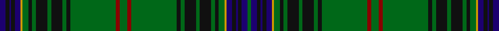

In pattern [BKBKBYGKGKGKGKGRGRGKGKGKGKGYBKBKBG](/stripes/bkbkbygkgkgkgkgrgrgkgkgkgkgybkbkbg/).

This was sourced from register-of-tartans.  It is a [34 stripe tartan](/stripes/stripes34/).

Original link https://www.tartanregister.gov.uk/tartanDetails.aspx?ref=5190

## Register references

External register numbers recorded for this tartan.

- Scottish Register of Tartans: [5190](https://www.tartanregister.gov.uk/tartanDetails.aspx?ref=5190)
- Scottish Tartans Authority (ITI): 3847

## Thread count
DB/6 K4 DB2 K4 DB6 DY2 G6 K4 G4 K12 G4 K12 G4 K4 G48 DR4 G8 DR4 G48 K4 G4 K12 G4 K12 G4 K4 G6 DY2 DB6 K4 DB2 K4 DB6 G/4

## Palette
Each colour and the base-6 reference it is a variant of.

| Colour | Shade | Base |
|---|---|---|
| DB | <code style="background-color:#1C0070;">#1C0070</code> `oklch(26.3% 0.162 277.1)` <small>#1C0070</small> | B <code style="background-color:#2A418A;">#2A418A</code> |
| DR | <code style="background-color:#880000;">#880000</code> `oklch(39.4% 0.162 29.2)` <small>#880000</small> | R <code style="background-color:#CC0000;">#CC0000</code> |
| DY | <code style="background-color:#D09800;">#D09800</code> `oklch(71.4% 0.147 82.1)` <small>#D09800</small> | Y <code style="background-color:#F2BF00;">#F2BF00</code> |
| G | <code style="background-color:#006818;">#006818</code> `oklch(45.0% 0.142 145.0)` <small>#006818</small> | G <code style="background-color:#006100;">#006100</code> |
| K | <code style="background-color:#101010;">#101010</code> `oklch(17.3% 0.000 89.9)` <small>#101010</small> | K <code style="background-color:#000000;">#000000</code> |

## Nearest tartans

The nearest existing variants by ΔTartan distance.

1. [King Edward VII](/setts/s32/ly8g84b21k10b10k10b10k10b21g62r3g6r3g10ly3g5r6/) — ΔT 1.20
1. [Hyslop Hunting (Name)](/setts/s18/g4r2g24k2g2k6g2k6g2k2g3lo1db3k2db1k2db3g2~x2/) — ΔT 1.31
1. [Kinnear, Barony of (Personal)](/setts/s20/k4r2k8g3k8g36k8g3r4lb2r3lo2r4g3k8g36k8g3k8r2~x2/) — ΔT 1.39
1. [Ettrick Forest](/setts/s24/db2g2r1g4r1db6r2g1ly1g1r1g1r1g1t1g1r2db6g26r1g1r1g1db1~x2/) — ΔT 1.51
1. [Park Clan/Family Weavers Tartan Tartan Number: 2387. Earliest known date: September 1996 William D. Park wished to have a tartan for himself and family. Can be worn by those of the same name. See products available Copyright © Blair Urquhart, Comrie, 2015](/setts/s22/r3db16k16g4k2g2k2g34r4g3r2g3~x2/) — ΔT 1.55
1. [Sarafilovic](/setts/s16/db15k18g3k2g2k2g44ly4g44k2g2k2g3k18db15r4~x2/) — ΔT 1.59
1. [Stewart Hunting](/setts/s26/g37ly3g37k9db4k2db3k2db31g4db31k2db3k2db4k9g37r3g37db9g4db31g4db31g4db9/) — ΔT 1.59
1. [Ettrick (Green) District Tartan Tartan Number: 2300. Earliest known date: 1971 Ettrick District is in the Borders of Scotland. See products available Copyright © Blair Urquhart, Comrie, 2015](/setts/s24/dt2dg2r1dg5r1dt6r2dg1ly1dg1r1dg1r1dg1t1dg1r2dt6dg20r1dg1r1dg1dt2~x2/) — ΔT 1.60
1. [Kennedy](/setts/s17/db2dg2ly1dg3r1dg2r1dg13db4k3db3k3db3k3db4dg23r2~x2/) — ΔT 1.63
1. [Kennedy #3](/setts/s32/g24dt4k3dt3k3dt3k3dt4g12dp2g2dp2g3lo2g2k2g2lo2g3dp2g2dp2g12dt4k3dt3k3dt3k3dt4g24r3~x2/) — ΔT 1.65

## Neighbour map

Every grey dot is one of 14299 variants placed by the first two principal components of the ΔTartan feature space (44% of its variance). Red is this tartan; blue dots are its nearest — click one to open its page.

<svg viewBox="0 0 640 380" role="img" style="max-width:100%;height:auto;border:1px solid #e0e0e0;border-radius:4px;display:block" xmlns="http://www.w3.org/2000/svg"><image href="/nn/cloud.v1.png" width="640" height="380"/><a href="/setts/s32/ly8g84b21k10b10k10b10k10b21g62r3g6r3g10ly3g5r6/"><circle cx="357.8" cy="85.1" r="4" fill="#3465a4"><title>King Edward VII</title></circle></a><a href="/setts/s18/g4r2g24k2g2k6g2k6g2k2g3lo1db3k2db1k2db3g2~x2/"><circle cx="344.8" cy="111.6" r="4" fill="#3465a4"><title>Hyslop Hunting (Name)</title></circle></a><a href="/setts/s20/k4r2k8g3k8g36k8g3r4lb2r3lo2r4g3k8g36k8g3k8r2~x2/"><circle cx="310.9" cy="111.0" r="4" fill="#3465a4"><title>Kinnear, Barony of (Personal)</title></circle></a><a href="/setts/s24/db2g2r1g4r1db6r2g1ly1g1r1g1r1g1t1g1r2db6g26r1g1r1g1db1~x2/"><circle cx="389.6" cy="76.7" r="4" fill="#3465a4"><title>Ettrick Forest</title></circle></a><a href="/setts/s22/r3db16k16g4k2g2k2g34r4g3r2g3~x2/"><circle cx="293.8" cy="130.2" r="4" fill="#3465a4"><title>Park Clan/Family Weavers Tartan Tartan Number: 2387. Earliest known date: September 1996 William D. Park wished to have a tartan for himself and family. Can be worn by those of the same name. See products available Copyright © Blair Urquhart, Comrie, 2015</title></circle></a><a href="/setts/s16/db15k18g3k2g2k2g44ly4g44k2g2k2g3k18db15r4~x2/"><circle cx="316.4" cy="121.1" r="4" fill="#3465a4"><title>Sarafilovic</title></circle></a><a href="/setts/s26/g37ly3g37k9db4k2db3k2db31g4db31k2db3k2db4k9g37r3g37db9g4db31g4db31g4db9/"><circle cx="259.7" cy="112.0" r="4" fill="#3465a4"><title>Stewart Hunting</title></circle></a><a href="/setts/s24/dt2dg2r1dg5r1dt6r2dg1ly1dg1r1dg1r1dg1t1dg1r2dt6dg20r1dg1r1dg1dt2~x2/"><circle cx="354.2" cy="103.3" r="4" fill="#3465a4"><title>Ettrick (Green) District Tartan Tartan Number: 2300. Earliest known date: 1971 Ettrick District is in the Borders of Scotland. See products available Copyright © Blair Urquhart, Comrie, 2015</title></circle></a><a href="/setts/s17/db2dg2ly1dg3r1dg2r1dg13db4k3db3k3db3k3db4dg23r2~x2/"><circle cx="335.4" cy="114.6" r="4" fill="#3465a4"><title>Kennedy</title></circle></a><a href="/setts/s32/g24dt4k3dt3k3dt3k3dt4g12dp2g2dp2g3lo2g2k2g2lo2g3dp2g2dp2g12dt4k3dt3k3dt3k3dt4g24r3~x2/"><circle cx="293.4" cy="108.4" r="4" fill="#3465a4"><title>Kennedy #3</title></circle></a><circle cx="321.2" cy="83.4" r="5" fill="#c00000"/></svg>

ID: /setts/s34/db3k2db1k2db3lo1g3k2g2k6g2k6g2k2g24r2g4r2g24k2g2k6g2k6g2k2g3lo1db3k2db1k2db3g2~x2/
