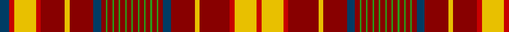

This page is one **sett** — a single exact thread-count. It belongs to the [tartan](/tartans/db6r3y14r3dr15y3dr15db5dr3g1dr3g1dr3g1dr3g1dr3g1dr3g1dr3g1dr3g1dr3g1dr3db5dr15y3dr19r3y14r3/)
(the same proportion at any scale), whose colour order is pattern [BRYRRYRBRGRGRGRGRGRGRGRGRGRBRYRRYR](/stripes/bryrryrbrgrgrgrgrgrgrgrgrgrbryrryr/).

Sourced from house-of-tartan.  It is a [34 stripe tartan](/stripes/stripes34/).

Original link http://www.house-of-tartan.scotland.net/house/TartanViewjs.asp?colr=Def&tnam=5802

## Thread count
DB/12 R6 Y28 R6 DR30 Y6 DR30 DB10 DR6 G2 DR6 G2 DR6 G2 DR6 G2 DR6 G2 DR6 G2 DR6 G2 DR6 G2 DR6 G2 DR6 DB10 DR30 Y6 DR38 R6 Y28 R/6

## Palette
Each colour and the base-6 reference it is a variant of.

| Colour | Shade | Base |
|---|---|---|
| DB | <code style="background-color:#003C64;">#003C64</code> `oklch(34.5% 0.089 246.0)` <small>#003C64</small> | B <code style="background-color:#2A418A;">#2A418A</code> |
| DR | <code style="background-color:#880000;">#880000</code> `oklch(39.4% 0.162 29.2)` <small>#880000</small> | R <code style="background-color:#CC0000;">#CC0000</code> |
| G | <code style="background-color:#289C18;">#289C18</code> `oklch(60.6% 0.191 141.6)` <small>#289C18</small> | G <code style="background-color:#006100;">#006100</code> |
| R | <code style="background-color:#C80000;">#C80000</code> `oklch(52.3% 0.215 29.2)` <small>#C80000</small> | R <code style="background-color:#CC0000;">#CC0000</code> |
| Y | <code style="background-color:#E8C000;">#E8C000</code> `oklch(81.9% 0.168 93.7)` <small>#E8C000</small> | Y <code style="background-color:#F2BF00;">#F2BF00</code> |

## Nearest tartans

The nearest existing variants by ΔTartan distance, with this tartan at the top so the swatches line up against it.

ΔTartan

Tartan

Sett

—

<a href="/ttd/edit/#slug=dt6r3ly14r3r15ly3r15dt5r3g1r3g1r3g1r3g1r3g1r3g1r3g1r3g1r3g1r3dt5r15ly3r19r3ly14r3~x2">Confrerie de Vouvray Corporate Tartan Tartan Number: 5802. Earliest known date: 2003 The Confrerie de Vouvray tartan was created for the French Order of Wine Growers by the Chevaliers Ecossais de la Chantepleure de Vouvray. The red, yellow and maroon are the colours of the french order and the grid pattern of green lines depict the rows of vines of the Chenin Blanc grape. The tartan was presented as a gift to the Grand Council at the 2nd Scottish Confrerie, held in Dundee in May 2003. See products available Copyright © Blair Urquhart, Comrie, 2015</a> <a class="nn-out" href="/setts/s34/dt6r3ly14r3r15ly3r15dt5r3g1r3g1r3g1r3g1r3g1r3g1r3g1r3g1r3g1r3dt5r15ly3r19r3ly14r3~x2/" title="open its dictionary page">↗</a>

0.99

<a href="/ttd/edit/#slug=r12dg3ly1r2ly1dg3r3db3r6t1r1dg8r1t1r12t1r1dg8r1t1r6dg2r1t1r2t1r1dg3ly1r4~x4">MacAlister (Gourlay Steele Collection)</a> <a class="nn-out" href="/setts/s30/r12dg3ly1r2ly1dg3r3db3r6t1r1dg8r1t1r12t1r1dg8r1t1r6dg2r1t1r2t1r1dg3ly1r4~x4/" title="open its dictionary page">↗</a>

1.02

<a href="/setts/s32/dg3lr3dg3r24dp1w1r3dp6r3w1dp1r3dg24r3dp1w1r24w1dp1r3dg24r3dp1w1r3dp6r3w1dp1r24dg3lr3~x4/">King George IV</a>

1.09

<a href="/ttd/edit/#slug=db48r40k4r4dg48r54db46r54dg14r4k4r4k4r48k4r4k4r4dg14r52db46r54dg60r4dg4r48db4r12db4r4db4r48k4r4dg60r48db4r4db4r4k7">MacKintosh #6</a> <a class="nn-out" href="/setts/s41/db48r40k4r4dg48r54db46r54dg14r4k4r4k4r48k4r4k4r4dg14r52db46r54dg60r4dg4r48db4r12db4r4db4r48k4r4dg60r48db4r4db4r4k7/" title="open its dictionary page">↗</a>

1.11

<a href="/ttd/edit/#slug=r30y5r27dg5r5dg5r5dg5r5dg5r25dg5r5k2dg28k2r5dg5r28dg5r5y28r26w5r26dg24w2dg24r7dg5r28dg5r7dg5k5r7y5r7y5r24~x2">Donald of Staffa's Sett</a> <a class="nn-out" href="/setts/s40/r30y5r27dg5r5dg5r5dg5r5dg5r25dg5r5k2dg28k2r5dg5r28dg5r5y28r26w5r26dg24w2dg24r7dg5r28dg5r7dg5k5r7y5r7y5r24~x2/" title="open its dictionary page">↗</a>

1.12

<a href="/ttd/edit/#slug=r16g1r1g1r1g1r1g1r6g1db1g6k1r1g1r4g1r1db4r4w1r4g4w1g4r1g1r6g1r8w1~x2">MacDonald of Staffa (Smith's)</a> <a class="nn-out" href="/setts/s31/r16g1r1g1r1g1r1g1r6g1db1g6k1r1g1r4g1r1db4r4w1r4g4w1g4r1g1r6g1r8w1~x2/" title="open its dictionary page">↗</a>

1.14

<a href="/ttd/edit/#slug=db48r40k4r4g48r54db46r54dg14r4k4r4k4r48k4r4k4r4dg14r52db46r54dg60r4dg4r48db4r4r8db4r4db4r48k4r4dg60r48db4r4db4r4k7">MacKintosh 5</a> <a class="nn-out" href="/setts/s42/db48r40k4r4g48r54db46r54dg14r4k4r4k4r48k4r4k4r4dg14r52db46r54dg60r4dg4r48db4r4r8db4r4db4r48k4r4dg60r48db4r4db4r4k7/" title="open its dictionary page">↗</a>

1.14

<a href="/ttd/edit/#slug=dg32r7dg32r33dg4r12dg4r33w3r12ly3dp33r7dp33ly3r12w3r33dp2r2dp5r2dp2r33dp2r2dp5r2dp2r33dg32r6dg23">Huntly (District)</a> <a class="nn-out" href="/setts/s33/dg32r7dg32r33dg4r12dg4r33w3r12ly3dp33r7dp33ly3r12w3r33dp2r2dp5r2dp2r33dp2r2dp5r2dp2r33dg32r6dg23/" title="open its dictionary page">↗</a>

1.15

<a href="/ttd/edit/#slug=g23r6g23r25g4r10g4r25w3r10b31r6b31r10w3r25k2r2k4r2k2r25k2r2k4r2k2r25g23r6g23~x2">Kinnoull</a> <a class="nn-out" href="/setts/s31/g23r6g23r25g4r10g4r25w3r10b31r6b31r10w3r25k2r2k4r2k2r25k2r2k4r2k2r25g23r6g23~x2/" title="open its dictionary page">↗</a>

1.17

<a href="/ttd/edit/#slug=r24db4r22g4r4g4r4g4r4g4r20g4r4k2g22k2r4g4r22g4r4db22r21w4r21g19w2g19r5g4r22g4r5g4k4r5db4r5db4r19">MacDonald of Staffa 6</a> <a class="nn-out" href="/setts/s40/r24db4r22g4r4g4r4g4r4g4r20g4r4k2g22k2r4g4r22g4r4db22r21w4r21g19w2g19r5g4r22g4r5g4k4r5db4r5db4r19/" title="open its dictionary page">↗</a>

1.20

<a href="/ttd/edit/#slug=r24db4r22dg4r4dg4r4dg4r4dg4r20dg4r4k2dg22k2r4dg4r22dg4r4db22r21w4r21dg19w2dg19r5dg4r22dg4r5dg4k4r5db4r5db4r19">MacDonald of Staffa</a> <a class="nn-out" href="/setts/s40/r24db4r22dg4r4dg4r4dg4r4dg4r20dg4r4k2dg22k2r4dg4r22dg4r4db22r21w4r21dg19w2dg19r5dg4r22dg4r5dg4k4r5db4r5db4r19/" title="open its dictionary page">↗</a>

## Neighbour map

Every grey dot is one of 14299 variants placed by the first two principal components of the ΔTartan feature space (44% of its variance). Red is this tartan; blue dots are its nearest — click one to open its page.

<svg viewBox="0 0 640 380" role="img" style="max-width:100%;height:auto;border:1px solid #e0e0e0;border-radius:4px;display:block" xmlns="http://www.w3.org/2000/svg"><image href="/nn/cloud.v1.png" width="640" height="380"/><a href="/setts/s30/r12dg3ly1r2ly1dg3r3db3r6t1r1dg8r1t1r12t1r1dg8r1t1r6dg2r1t1r2t1r1dg3ly1r4~x4/"><circle cx="299.3" cy="96.7" r="4" fill="#3465a4"><title>MacAlister (Gourlay Steele Collection)</title></circle></a><a href="/setts/s32/dg3lr3dg3r24dp1w1r3dp6r3w1dp1r3dg24r3dp1w1r24w1dp1r3dg24r3dp1w1r3dp6r3w1dp1r24dg3lr3~x4/"><circle cx="305.7" cy="45.4" r="4" fill="#3465a4"><title>King George IV</title></circle></a><a href="/setts/s41/db48r40k4r4dg48r54db46r54dg14r4k4r4k4r48k4r4k4r4dg14r52db46r54dg60r4dg4r48db4r12db4r4db4r48k4r4dg60r48db4r4db4r4k7/"><circle cx="273.9" cy="73.8" r="4" fill="#3465a4"><title>MacKintosh #6</title></circle></a><a href="/setts/s40/r30y5r27dg5r5dg5r5dg5r5dg5r25dg5r5k2dg28k2r5dg5r28dg5r5y28r26w5r26dg24w2dg24r7dg5r28dg5r7dg5k5r7y5r7y5r24~x2/"><circle cx="305.7" cy="91.2" r="4" fill="#3465a4"><title>Donald of Staffa's Sett</title></circle></a><a href="/setts/s31/r16g1r1g1r1g1r1g1r6g1db1g6k1r1g1r4g1r1db4r4w1r4g4w1g4r1g1r6g1r8w1~x2/"><circle cx="350.0" cy="79.3" r="4" fill="#3465a4"><title>MacDonald of Staffa (Smith's)</title></circle></a><a href="/setts/s42/db48r40k4r4g48r54db46r54dg14r4k4r4k4r48k4r4k4r4dg14r52db46r54dg60r4dg4r48db4r4r8db4r4db4r48k4r4dg60r48db4r4db4r4k7/"><circle cx="280.7" cy="78.2" r="4" fill="#3465a4"><title>MacKintosh 5</title></circle></a><a href="/setts/s33/dg32r7dg32r33dg4r12dg4r33w3r12ly3dp33r7dp33ly3r12w3r33dp2r2dp5r2dp2r33dp2r2dp5r2dp2r33dg32r6dg23/"><circle cx="274.1" cy="91.3" r="4" fill="#3465a4"><title>Huntly (District)</title></circle></a><a href="/setts/s31/g23r6g23r25g4r10g4r25w3r10b31r6b31r10w3r25k2r2k4r2k2r25k2r2k4r2k2r25g23r6g23~x2/"><circle cx="228.7" cy="91.8" r="4" fill="#3465a4"><title>Kinnoull</title></circle></a><a href="/setts/s40/r24db4r22g4r4g4r4g4r4g4r20g4r4k2g22k2r4g4r22g4r4db22r21w4r21g19w2g19r5g4r22g4r5g4k4r5db4r5db4r19/"><circle cx="290.1" cy="98.7" r="4" fill="#3465a4"><title>MacDonald of Staffa 6</title></circle></a><a href="/setts/s40/r24db4r22dg4r4dg4r4dg4r4dg4r20dg4r4k2dg22k2r4dg4r22dg4r4db22r21w4r21dg19w2dg19r5dg4r22dg4r5dg4k4r5db4r5db4r19/"><circle cx="291.8" cy="95.4" r="4" fill="#3465a4"><title>MacDonald of Staffa</title></circle></a><circle cx="284.3" cy="67.5" r="5" fill="#c00000"/></svg>

ID: /setts/s34/dt6r3ly14r3r15ly3r15dt5r3g1r3g1r3g1r3g1r3g1r3g1r3g1r3g1r3g1r3dt5r15ly3r19r3ly14r3~x2/
