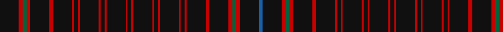

This page is one **sett** — a single exact thread-count. It belongs to the [tartan](/tartans/k10r2g2r2k10r2k10r1k2r1k10r1k2r1k10r1k2r1k10r1k2r1k10r1k2r1k10r2k10r2g2r2k10b2/)
(the same proportion at any scale), whose colour order is pattern [BKRGRKRKRKRKRKRKRKRKRKRKRKRKRKRGRK](/stripes/bkrgrkrkrkrkrkrkrkrkrkrkrkrkrkrgrk/).

Sourced from register-of-tartans.  It is a [34 stripe tartan](/stripes/stripes34/).

Original link https://www.tartanregister.gov.uk/tartanDetails.aspx?ref=1659

## Register references

External register numbers recorded for this tartan.

- Scottish Register of Tartans: [1659](https://www.tartanregister.gov.uk/tartanDetails.aspx?ref=1659)
- Scottish Tartans Authority (ITI): 1990
- Scottish Tartans World Register: 1990

## Thread count
K/20 R4 G4 R4 K20 R4 K20 R2 K4 R2 K20 R2 K4 R2 K20 R2 K4 R2 K20 R2 K4 R2 K20 R2 K4 R2 K20 R4 K20 R4 G4 R4 K20 B/4

## Palette

Palette: <strong>Tartan Register</strong> <small style="color:#888">(5 of 6 colours)</small>
<table><thead><tr><th>Colour</th><th>Threads</th><th>Shade</th><th>Base</th><th>OKLCh</th></tr></thead><tbody><tr><td>K/</td><td style="text-align:right;font-variant-numeric:tabular-nums">20</td><td><code style="background-color:#101010;">#101010</code> <small style="color:#888">#101010</small></td><td>K <code style="background-color:#000000;">#000000</code></td><td><small style="color:#888">oklch(17.3% 0.000 89.9)</small></td></tr><tr><td>R</td><td style="text-align:right;font-variant-numeric:tabular-nums">4</td><td><code style="background-color:#C80000;">#C80000</code> <small style="color:#888">#C80000</small></td><td>R <code style="background-color:#CC0000;">#CC0000</code></td><td><small style="color:#888">oklch(52.3% 0.215 29.2)</small></td></tr><tr><td>G</td><td style="text-align:right;font-variant-numeric:tabular-nums">4</td><td><code style="background-color:#00643C;">#00643C</code> <small style="color:#888">#00643C</small></td><td>G <code style="background-color:#006100;">#006100</code></td><td><small style="color:#888">oklch(44.3% 0.104 157.7)</small></td></tr><tr><td>R</td><td style="text-align:right;font-variant-numeric:tabular-nums">4</td><td><code style="background-color:#C80000;">#C80000</code> <small style="color:#888">#C80000</small></td><td>R <code style="background-color:#CC0000;">#CC0000</code></td><td><small style="color:#888">oklch(52.3% 0.215 29.2)</small></td></tr><tr><td>K</td><td style="text-align:right;font-variant-numeric:tabular-nums">20</td><td><code style="background-color:#101010;">#101010</code> <small style="color:#888">#101010</small></td><td>K <code style="background-color:#000000;">#000000</code></td><td><small style="color:#888">oklch(17.3% 0.000 89.9)</small></td></tr><tr><td>R</td><td style="text-align:right;font-variant-numeric:tabular-nums">4</td><td><code style="background-color:#C80000;">#C80000</code> <small style="color:#888">#C80000</small></td><td>R <code style="background-color:#CC0000;">#CC0000</code></td><td><small style="color:#888">oklch(52.3% 0.215 29.2)</small></td></tr><tr><td>K</td><td style="text-align:right;font-variant-numeric:tabular-nums">20</td><td><code style="background-color:#101010;">#101010</code> <small style="color:#888">#101010</small></td><td>K <code style="background-color:#000000;">#000000</code></td><td><small style="color:#888">oklch(17.3% 0.000 89.9)</small></td></tr><tr><td>R</td><td style="text-align:right;font-variant-numeric:tabular-nums">2</td><td><code style="background-color:#C80000;">#C80000</code> <small style="color:#888">#C80000</small></td><td>R <code style="background-color:#CC0000;">#CC0000</code></td><td><small style="color:#888">oklch(52.3% 0.215 29.2)</small></td></tr><tr><td>K</td><td style="text-align:right;font-variant-numeric:tabular-nums">4</td><td><code style="background-color:#101010;">#101010</code> <small style="color:#888">#101010</small></td><td>K <code style="background-color:#000000;">#000000</code></td><td><small style="color:#888">oklch(17.3% 0.000 89.9)</small></td></tr><tr><td>R</td><td style="text-align:right;font-variant-numeric:tabular-nums">2</td><td><code style="background-color:#C80000;">#C80000</code> <small style="color:#888">#C80000</small></td><td>R <code style="background-color:#CC0000;">#CC0000</code></td><td><small style="color:#888">oklch(52.3% 0.215 29.2)</small></td></tr><tr><td>K</td><td style="text-align:right;font-variant-numeric:tabular-nums">20</td><td><code style="background-color:#101010;">#101010</code> <small style="color:#888">#101010</small></td><td>K <code style="background-color:#000000;">#000000</code></td><td><small style="color:#888">oklch(17.3% 0.000 89.9)</small></td></tr><tr><td>R</td><td style="text-align:right;font-variant-numeric:tabular-nums">2</td><td><code style="background-color:#C80000;">#C80000</code> <small style="color:#888">#C80000</small></td><td>R <code style="background-color:#CC0000;">#CC0000</code></td><td><small style="color:#888">oklch(52.3% 0.215 29.2)</small></td></tr><tr><td>K</td><td style="text-align:right;font-variant-numeric:tabular-nums">4</td><td><code style="background-color:#101010;">#101010</code> <small style="color:#888">#101010</small></td><td>K <code style="background-color:#000000;">#000000</code></td><td><small style="color:#888">oklch(17.3% 0.000 89.9)</small></td></tr><tr><td>R</td><td style="text-align:right;font-variant-numeric:tabular-nums">2</td><td><code style="background-color:#C80000;">#C80000</code> <small style="color:#888">#C80000</small></td><td>R <code style="background-color:#CC0000;">#CC0000</code></td><td><small style="color:#888">oklch(52.3% 0.215 29.2)</small></td></tr><tr><td>K</td><td style="text-align:right;font-variant-numeric:tabular-nums">20</td><td><code style="background-color:#101010;">#101010</code> <small style="color:#888">#101010</small></td><td>K <code style="background-color:#000000;">#000000</code></td><td><small style="color:#888">oklch(17.3% 0.000 89.9)</small></td></tr><tr><td>R</td><td style="text-align:right;font-variant-numeric:tabular-nums">2</td><td><code style="background-color:#C80000;">#C80000</code> <small style="color:#888">#C80000</small></td><td>R <code style="background-color:#CC0000;">#CC0000</code></td><td><small style="color:#888">oklch(52.3% 0.215 29.2)</small></td></tr><tr><td>K</td><td style="text-align:right;font-variant-numeric:tabular-nums">4</td><td><code style="background-color:#101010;">#101010</code> <small style="color:#888">#101010</small></td><td>K <code style="background-color:#000000;">#000000</code></td><td><small style="color:#888">oklch(17.3% 0.000 89.9)</small></td></tr><tr><td>R</td><td style="text-align:right;font-variant-numeric:tabular-nums">2</td><td><code style="background-color:#C80000;">#C80000</code> <small style="color:#888">#C80000</small></td><td>R <code style="background-color:#CC0000;">#CC0000</code></td><td><small style="color:#888">oklch(52.3% 0.215 29.2)</small></td></tr><tr><td>K</td><td style="text-align:right;font-variant-numeric:tabular-nums">20</td><td><code style="background-color:#101010;">#101010</code> <small style="color:#888">#101010</small></td><td>K <code style="background-color:#000000;">#000000</code></td><td><small style="color:#888">oklch(17.3% 0.000 89.9)</small></td></tr><tr><td>R</td><td style="text-align:right;font-variant-numeric:tabular-nums">2</td><td><code style="background-color:#C80000;">#C80000</code> <small style="color:#888">#C80000</small></td><td>R <code style="background-color:#CC0000;">#CC0000</code></td><td><small style="color:#888">oklch(52.3% 0.215 29.2)</small></td></tr><tr><td>K</td><td style="text-align:right;font-variant-numeric:tabular-nums">4</td><td><code style="background-color:#101010;">#101010</code> <small style="color:#888">#101010</small></td><td>K <code style="background-color:#000000;">#000000</code></td><td><small style="color:#888">oklch(17.3% 0.000 89.9)</small></td></tr><tr><td>R</td><td style="text-align:right;font-variant-numeric:tabular-nums">2</td><td><code style="background-color:#C80000;">#C80000</code> <small style="color:#888">#C80000</small></td><td>R <code style="background-color:#CC0000;">#CC0000</code></td><td><small style="color:#888">oklch(52.3% 0.215 29.2)</small></td></tr><tr><td>K</td><td style="text-align:right;font-variant-numeric:tabular-nums">20</td><td><code style="background-color:#101010;">#101010</code> <small style="color:#888">#101010</small></td><td>K <code style="background-color:#000000;">#000000</code></td><td><small style="color:#888">oklch(17.3% 0.000 89.9)</small></td></tr><tr><td>R</td><td style="text-align:right;font-variant-numeric:tabular-nums">2</td><td><code style="background-color:#C80000;">#C80000</code> <small style="color:#888">#C80000</small></td><td>R <code style="background-color:#CC0000;">#CC0000</code></td><td><small style="color:#888">oklch(52.3% 0.215 29.2)</small></td></tr><tr><td>K</td><td style="text-align:right;font-variant-numeric:tabular-nums">4</td><td><code style="background-color:#101010;">#101010</code> <small style="color:#888">#101010</small></td><td>K <code style="background-color:#000000;">#000000</code></td><td><small style="color:#888">oklch(17.3% 0.000 89.9)</small></td></tr><tr><td>R</td><td style="text-align:right;font-variant-numeric:tabular-nums">2</td><td><code style="background-color:#C80000;">#C80000</code> <small style="color:#888">#C80000</small></td><td>R <code style="background-color:#CC0000;">#CC0000</code></td><td><small style="color:#888">oklch(52.3% 0.215 29.2)</small></td></tr><tr><td>K</td><td style="text-align:right;font-variant-numeric:tabular-nums">20</td><td><code style="background-color:#101010;">#101010</code> <small style="color:#888">#101010</small></td><td>K <code style="background-color:#000000;">#000000</code></td><td><small style="color:#888">oklch(17.3% 0.000 89.9)</small></td></tr><tr><td>R</td><td style="text-align:right;font-variant-numeric:tabular-nums">4</td><td><code style="background-color:#C80000;">#C80000</code> <small style="color:#888">#C80000</small></td><td>R <code style="background-color:#CC0000;">#CC0000</code></td><td><small style="color:#888">oklch(52.3% 0.215 29.2)</small></td></tr><tr><td>K</td><td style="text-align:right;font-variant-numeric:tabular-nums">20</td><td><code style="background-color:#101010;">#101010</code> <small style="color:#888">#101010</small></td><td>K <code style="background-color:#000000;">#000000</code></td><td><small style="color:#888">oklch(17.3% 0.000 89.9)</small></td></tr><tr><td>R</td><td style="text-align:right;font-variant-numeric:tabular-nums">4</td><td><code style="background-color:#C80000;">#C80000</code> <small style="color:#888">#C80000</small></td><td>R <code style="background-color:#CC0000;">#CC0000</code></td><td><small style="color:#888">oklch(52.3% 0.215 29.2)</small></td></tr><tr><td>G</td><td style="text-align:right;font-variant-numeric:tabular-nums">4</td><td><code style="background-color:#00643C;">#00643C</code> <small style="color:#888">#00643C</small></td><td>G <code style="background-color:#006100;">#006100</code></td><td><small style="color:#888">oklch(44.3% 0.104 157.7)</small></td></tr><tr><td>R</td><td style="text-align:right;font-variant-numeric:tabular-nums">4</td><td><code style="background-color:#C80000;">#C80000</code> <small style="color:#888">#C80000</small></td><td>R <code style="background-color:#CC0000;">#CC0000</code></td><td><small style="color:#888">oklch(52.3% 0.215 29.2)</small></td></tr><tr><td>K</td><td style="text-align:right;font-variant-numeric:tabular-nums">20</td><td><code style="background-color:#101010;">#101010</code> <small style="color:#888">#101010</small></td><td>K <code style="background-color:#000000;">#000000</code></td><td><small style="color:#888">oklch(17.3% 0.000 89.9)</small></td></tr><tr><td>B/</td><td style="text-align:right;font-variant-numeric:tabular-nums">4</td><td><code style="background-color:#1860A8;">#1860A8</code> <small style="color:#888">#1860A8</small></td><td>B <code style="background-color:#2A418A;">#2A418A</code></td><td><small style="color:#888">oklch(48.6% 0.134 252.8)</small></td></tr></tbody></table>

## Nearest tartans

The nearest existing variants by ΔTartan distance, with this tartan at the top so the swatches line up against it.

ΔTartan

Tartan

Sett

—

<a href="/ttd/edit/#slug=k10r2g2r2k10r2k10r1k2r1k10r1k2r1k10r1k2r1k10r1k2r1k10r1k2r1k10r2k10r2g2r2k10b2~x2">Hebrides #3</a> <a class="nn-out" href="/setts/s34/k10r2g2r2k10r2k10r1k2r1k10r1k2r1k10r1k2r1k10r1k2r1k10r1k2r1k10r2k10r2g2r2k10b2~x2/" title="open its dictionary page">↗</a>

1.87

<a href="/ttd/edit/#slug=k2r1k10r1k2r1k10r2k10r2dg2r2k10db2~x2">Hebridean</a> <a class="nn-out" href="/setts/s14/k2r1k10r1k2r1k10r2k10r2dg2r2k10db2~x2/" title="open its dictionary page">↗</a>

1.98

<a href="/ttd/edit/#slug=k3r2k17r3k17r3g3r3k17b3k4r1k17r2~x2">Hebrides #11</a> <a class="nn-out" href="/setts/s14/k3r2k17r3k17r3g3r3k17b3k4r1k17r2~x2/" title="open its dictionary page">↗</a>

1.98

<a href="/ttd/edit/#slug=k17db3k4r1k17r2k3r2k17r3k17r3g3r3~x2">Black (Hebridean) (Artefact)</a> <a class="nn-out" href="/setts/s14/k17db3k4r1k17r2k3r2k17r3k17r3g3r3~x2/" title="open its dictionary page">↗</a>

2.04

<a href="/ttd/edit/#slug=k2r1k10r1k2r1k10r1k2r1k10r2k10r2dg2r2k10db2~x2">Hebridean 6</a> <a class="nn-out" href="/setts/s18/k2r1k10r1k2r1k10r1k2r1k10r2k10r2dg2r2k10db2~x2/" title="open its dictionary page">↗</a>

2.40

<a href="/ttd/edit/#slug=k5lb1n4lb1k26lb1k10n5k2n5k10lb1n4lb1k5lb1k5lb1n4lb1k10n5k2n5k10lb1k26lb1n4lb1k5lb1~x2">Clergy (Logan) (Corporate)</a> <a class="nn-out" href="/setts/s32/k5lb1n4lb1k26lb1k10n5k2n5k10lb1n4lb1k5lb1k5lb1n4lb1k10n5k2n5k10lb1k26lb1n4lb1k5lb1~x2/" title="open its dictionary page">↗</a>

2.41

<a href="/ttd/edit/#slug=r2k25dy2k20n5k2n4k3n3k4n2k6ly2~x2">Gold-Smith (Personal)</a> <a class="nn-out" href="/setts/s13/r2k25dy2k20n5k2n4k3n3k4n2k6ly2~x2/" title="open its dictionary page">↗</a>

2.48

<a href="/ttd/edit/#slug=k2r1k10r1k2r1k10r2k10r2g2r2k10db2~x2">Hebridean 7</a> <a class="nn-out" href="/setts/s14/k2r1k10r1k2r1k10r2k10r2g2r2k10db2~x2/" title="open its dictionary page">↗</a>

2.60

<a href="/setts/s20/g10k3g3k20dp3k5g3k20g3k3g10~x2/">Pike Personal Weavers Tartan Tartan Number: 3229. Earliest known date: 2/4/02 Darker version, final design See products available Copyright © Blair Urquhart, Comrie, 2015</a>

2.62

<a href="/setts/s18/k40dp2k6b2k2b2k10dp4w2dp5~x2/">Ironside (Personal)</a>

2.69

<a href="/ttd/edit/#slug=k5r2k30t8w1k9w2k9w1t8k30r3k30t8w1k9w2~x2">Glasgow Caledonian University</a> <a class="nn-out" href="/setts/s17/k5r2k30t8w1k9w2k9w1t8k30r3k30t8w1k9w2~x2/" title="open its dictionary page">↗</a>

## Neighbour map

Every grey dot is one of 14359 variants placed by the first two principal components of the ΔTartan feature space (44% of its variance). Red is this tartan; blue dots are its nearest — click one to open its page.

<svg viewBox="0 0 640 380" role="img" style="max-width:100%;height:auto;border:1px solid #e0e0e0;border-radius:4px;display:block" xmlns="http://www.w3.org/2000/svg"><image href="/nn/cloud.v1.png" width="640" height="380"/><a href="/setts/s14/k2r1k10r1k2r1k10r2k10r2dg2r2k10db2~x2/"><circle cx="459.8" cy="191.2" r="4" fill="#3465a4"><title>Hebridean</title></circle></a><a href="/setts/s14/k3r2k17r3k17r3g3r3k17b3k4r1k17r2~x2/"><circle cx="500.9" cy="174.5" r="4" fill="#3465a4"><title>Hebrides #11</title></circle></a><a href="/setts/s14/k17db3k4r1k17r2k3r2k17r3k17r3g3r3~x2/"><circle cx="507.0" cy="177.5" r="4" fill="#3465a4"><title>Black (Hebridean) (Artefact)</title></circle></a><a href="/setts/s18/k2r1k10r1k2r1k10r1k2r1k10r2k10r2dg2r2k10db2~x2/"><circle cx="456.4" cy="179.1" r="4" fill="#3465a4"><title>Hebridean 6</title></circle></a><a href="/setts/s32/k5lb1n4lb1k26lb1k10n5k2n5k10lb1n4lb1k5lb1k5lb1n4lb1k10n5k2n5k10lb1k26lb1n4lb1k5lb1~x2/"><circle cx="449.2" cy="115.1" r="4" fill="#3465a4"><title>Clergy (Logan) (Corporate)</title></circle></a><a href="/setts/s13/r2k25dy2k20n5k2n4k3n3k4n2k6ly2~x2/"><circle cx="457.6" cy="162.6" r="4" fill="#3465a4"><title>Gold-Smith (Personal)</title></circle></a><a href="/setts/s14/k2r1k10r1k2r1k10r2k10r2g2r2k10db2~x2/"><circle cx="436.8" cy="187.2" r="4" fill="#3465a4"><title>Hebridean 7</title></circle></a><a href="/setts/s20/g10k3g3k20dp3k5g3k20g3k3g10~x2/"><circle cx="373.1" cy="197.6" r="4" fill="#3465a4"><title>Pike Personal Weavers Tartan Tartan Number: 3229. Earliest known date: 2/4/02 Darker version, final design See products available Copyright © Blair Urquhart, Comrie, 2015</title></circle></a><a href="/setts/s18/k40dp2k6b2k2b2k10dp4w2dp5~x2/"><circle cx="459.6" cy="117.8" r="4" fill="#3465a4"><title>Ironside (Personal)</title></circle></a><a href="/setts/s17/k5r2k30t8w1k9w2k9w1t8k30r3k30t8w1k9w2~x2/"><circle cx="474.7" cy="124.3" r="4" fill="#3465a4"><title>Glasgow Caledonian University</title></circle></a><circle cx="473.9" cy="157.7" r="5" fill="#c00000"/></svg>

ID: /setts/s34/k10r2g2r2k10r2k10r1k2r1k10r1k2r1k10r1k2r1k10r1k2r1k10r1k2r1k10r2k10r2g2r2k10b2~x2/
