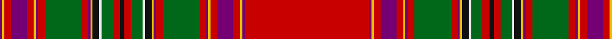

In pattern [BYRBRYBRGRBYKWGRKRGWKYBRGRBYRBRYBR](/patterns/byrbrybrgrbykwgrkrgwkybrgrbyrbrybr/).

This was sourced from house-of-tartan.  It is a [34 stripes tartan](/stripes/stripes34/).

Original link http://www.house-of-tartan.scotland.net/house/TartanViewjs.asp?colr=Def&tnam=6375

## Thread count
P/2 Y2 R6 P14 R6 Y2 P2 R6 G32 R6 P2 Y2 K6 W2 G10 R6 K4 R6 G10 W2 K6 Y2 P2 R6 G32 R6 P2 Y2 R6 P14 R6 Y2 P2 R/110

## Palette
Each colour and its ΔE from the base-6 reference it is a variant of.

| Colour | Shade | Base | ΔE (OKLab) |
|---|---|---|---|
| G | <code style="background-color:#006818;">#006818</code> `#006818` | G <code style="background-color:#006100;">#006100</code> | 0.02 |
| K | <code style="background-color:#101010;">#101010</code> `#101010` | K <code style="background-color:#000000;">#000000</code> | 0.17 |
| P | <code style="background-color:#740074;">#740074</code> `#740074` | B <code style="background-color:#2A418A;">#2A418A</code> | 0.16 |
| R | <code style="background-color:#C80000;">#C80000</code> `#C80000` | R <code style="background-color:#CC0000;">#CC0000</code> | 0.01 |
| W | <code style="background-color:#ECECEC;">#ECECEC</code> `#ECECEC` | W <code style="background-color:#F7F7F7;">#F7F7F7</code> | 0.03 |
| Y | <code style="background-color:#E8C000;">#E8C000</code> `#E8C000` | Y <code style="background-color:#F2BF00;">#F2BF00</code> | 0.02 |

## Nearest tartans

The nearest existing variants by ΔTartan distance.

1. [Moray Plaid](/setts/s20/g56r2g4r6g2r32g2r6g4r2g28k6y6k6b6k6r96w6r6w6-b2c4084-g005020-k101010-rdc0000-we0e0e0-ye8c000/) — ΔT 1.37
1. [MacLeod of Gesto Clan Tartan Tartan Number: 1258. Earliest known date: pre 1850 Very similar to the sett recorded by Rhuriah MacLeod from a sample in a collection made for the Great Exhibition in London in 1851, now held by the Smith Institute in Stirling. The samples, made by Wilson's of Bannockburn, were donated to the institute anonymously in 1930. See products available Copyright © Blair Urquhart, Comrie, 2015](/setts/s23/r176w4b16w4k4r4y4g6w8g6y4r12k4w4ga64k4y4w4y4k8r12w4k6-b5c8ca8-g604000-ga006818-k101010-rc80000-we0e0e0-ye8c000/) — ΔT 1.38
1. [MacAlister](/setts/s41/r64g4ga24r8b8r8w4r8b8r8ga24r4w4r48b4r4ga88r4b4r128b4r4ga88r4b4r44w4r4ba32r4w4r20ga24g4r16g4ga24r6w4r4ba20-b5480b0-ba304080-g30a010-ga003000-rc00000-we0e0e0/) — ΔT 1.38
1. [MacAlister (Logan 1831)](/setts/s41/r64g4ga24r8b8r8w4r8b8r8ga24r4w4r48b4r4ga88r4b4r128b4r4ga88r4b4r44w4r4ba32r4w4r20ga24g4r16g4ga24r6w4r4ba20-b3c82af-ba2c4084-g309c18-ga002814-rdc0000-we0e0e0/) — ΔT 1.42
1. [Moray Plaid Artifact Tartan Tartan Number: 991. Earliest known date: 1820 Early 19thC. MacGregor-Hastie's list of unknowns. See products available Copyright © Blair Urquhart, Comrie, 2015](/setts/s20/g56r2g4r6g2r32g2r6g4r2g28k6y6k6b6k6r96w6r6w6-b2c2c80-g006818-k101010-rc80000-we0e0e0-ye8c000/) — ΔT 1.43
1. [MacLeod of Gesto #2](/setts/s23/r176w4k8b16w4k4y4g6w8g6y4r12k4w4ga64k4y4w4y4k8r12w4k6-b5c8ca8-g604000-ga006818-k101010-rc80000-wf8f8f8-ye8c000/) — ΔT 1.45
1. [Not Specified #3](/setts/s26/r90b4w4k13y3k3w3k3g18r14k3r7w3r7k3r14g18k3w3k3y3k13w4b4r90k56-b2c2c80-g006818-k101010-rc80000-we0e0e0-ye8c000/) — ΔT 1.46
1. [MacBain Clan Tartan Tartan Number: 951. Earliest known date: 1960 (1847) MacBains, MacBeans, and MacVeans are all forms of the same name possibly from the same origin as the early Scottish King, Donald Ban. The principle family is MacBean of Kinchyle from the northern end of Loch Ness. The MacBains are closely associated with Mackintosh and this is apparent in the design of the tartan. This version, recorded by Lord Lyon under the name MacBain, shows a minor variation on the earlier MacBean sett attributed to McIan (1847). See products available Copyright © Blair Urquhart, Comrie, 2015](/setts/s19/r120w4b10k4w4k4b10w4k4g24k4w4r10ra10g4ra10r10w4g20-b5c8ca8-g006818-k101010-rc80000-raa00048-we0e0e0/) — ΔT 1.47
1. [MacLeod of Gesto (Clan)](/setts/s23/r172w4b12w4k4r8y4g8w4g8y4r8k4w4g26k4y4w4y4k8r8w4k8-b2888c4-g006818-k101010-rc80000-we0e0e0-yd8b000/) — ΔT 1.50
1. [Unidentified Plaid #8](/setts/s22/w10r198g24r8g4r24g4r8g24r48b30k58g48r24g8r4g24r4g8r24g98y10-b0596fa-g005020-k101010-rdc0000-we0e0e0-ye8c000/) — ΔT 1.51

## Neighbour map

Every grey dot is one of 15726 variants placed by the first two principal components of the ΔTartan feature space (44% of its variance). Red is this tartan; blue dots are its nearest — click one to open its page.

<svg viewBox="0 0 640 380" role="img" style="max-width:100%;height:auto;border:1px solid #e0e0e0;border-radius:4px;display:block" xmlns="http://www.w3.org/2000/svg"><image href="/nn/cloud.v1.png" width="640" height="380"/><a href="/setts/s20/g56r2g4r6g2r32g2r6g4r2g28k6y6k6b6k6r96w6r6w6-b2c4084-g005020-k101010-rdc0000-we0e0e0-ye8c000/"><circle cx="321.0" cy="14.0" r="4" fill="#3465a4"><title>Moray Plaid</title></circle></a><a href="/setts/s23/r176w4b16w4k4r4y4g6w8g6y4r12k4w4ga64k4y4w4y4k8r12w4k6-b5c8ca8-g604000-ga006818-k101010-rc80000-we0e0e0-ye8c000/"><circle cx="320.3" cy="14.0" r="4" fill="#3465a4"><title>MacLeod of Gesto Clan Tartan Tartan Number: 1258. Earliest known date: pre 1850 Very similar to the sett recorded by Rhuriah MacLeod from a sample in a collection made for the Great Exhibition in London in 1851, now held by the Smith Institute in Stirling. The samples, made by Wilson's of Bannockburn, were donated to the institute anonymously in 1930. See products available Copyright © Blair Urquhart, Comrie, 2015</title></circle></a><a href="/setts/s41/r64g4ga24r8b8r8w4r8b8r8ga24r4w4r48b4r4ga88r4b4r128b4r4ga88r4b4r44w4r4ba32r4w4r20ga24g4r16g4ga24r6w4r4ba20-b5480b0-ba304080-g30a010-ga003000-rc00000-we0e0e0/"><circle cx="282.7" cy="14.0" r="4" fill="#3465a4"><title>MacAlister</title></circle></a><a href="/setts/s41/r64g4ga24r8b8r8w4r8b8r8ga24r4w4r48b4r4ga88r4b4r128b4r4ga88r4b4r44w4r4ba32r4w4r20ga24g4r16g4ga24r6w4r4ba20-b3c82af-ba2c4084-g309c18-ga002814-rdc0000-we0e0e0/"><circle cx="271.0" cy="14.0" r="4" fill="#3465a4"><title>MacAlister (Logan 1831)</title></circle></a><a href="/setts/s20/g56r2g4r6g2r32g2r6g4r2g28k6y6k6b6k6r96w6r6w6-b2c2c80-g006818-k101010-rc80000-we0e0e0-ye8c000/"><circle cx="325.5" cy="17.8" r="4" fill="#3465a4"><title>Moray Plaid Artifact Tartan Tartan Number: 991. Earliest known date: 1820 Early 19thC. MacGregor-Hastie's list of unknowns. See products available Copyright © Blair Urquhart, Comrie, 2015</title></circle></a><a href="/setts/s23/r176w4k8b16w4k4y4g6w8g6y4r12k4w4ga64k4y4w4y4k8r12w4k6-b5c8ca8-g604000-ga006818-k101010-rc80000-wf8f8f8-ye8c000/"><circle cx="300.2" cy="14.0" r="4" fill="#3465a4"><title>MacLeod of Gesto #2</title></circle></a><a href="/setts/s26/r90b4w4k13y3k3w3k3g18r14k3r7w3r7k3r14g18k3w3k3y3k13w4b4r90k56-b2c2c80-g006818-k101010-rc80000-we0e0e0-ye8c000/"><circle cx="319.1" cy="16.2" r="4" fill="#3465a4"><title>Not Specified #3</title></circle></a><a href="/setts/s19/r120w4b10k4w4k4b10w4k4g24k4w4r10ra10g4ra10r10w4g20-b5c8ca8-g006818-k101010-rc80000-raa00048-we0e0e0/"><circle cx="306.3" cy="21.4" r="4" fill="#3465a4"><title>MacBain Clan Tartan Tartan Number: 951. Earliest known date: 1960 (1847) MacBains, MacBeans, and MacVeans are all forms of the same name possibly from the same origin as the early Scottish King, Donald Ban. The principle family is MacBean of Kinchyle from the northern end of Loch Ness. The MacBains are closely associated with Mackintosh and this is apparent in the design of the tartan. This version, recorded by Lord Lyon under the name MacBain, shows a minor variation on the earlier MacBean sett attributed to McIan (1847). See products available Copyright © Blair Urquhart, Comrie, 2015</title></circle></a><a href="/setts/s23/r172w4b12w4k4r8y4g8w4g8y4r8k4w4g26k4y4w4y4k8r8w4k8-b2888c4-g006818-k101010-rc80000-we0e0e0-yd8b000/"><circle cx="383.3" cy="14.0" r="4" fill="#3465a4"><title>MacLeod of Gesto (Clan)</title></circle></a><a href="/setts/s22/w10r198g24r8g4r24g4r8g24r48b30k58g48r24g8r4g24r4g8r24g98y10-b0596fa-g005020-k101010-rdc0000-we0e0e0-ye8c000/"><circle cx="295.4" cy="20.9" r="4" fill="#3465a4"><title>Unidentified Plaid #8</title></circle></a><circle cx="327.3" cy="14.0" r="5" fill="#c00000"/></svg>

ID: /setts/s34/r110b2y2r6b14r6y2b2r6g32r6b2y2k6w2g10r6k4r6g10w2k6y2b2r6g32r6b2y2r6b14r6y2b2-b740074-g006818-k101010-rc80000-wececec-ye8c000/
