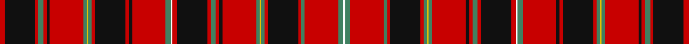

In pattern [RKRGRKRGYGRKRKRGWRKRGRKRGYGRKRGRGW](/stripes/rkrgrkrgygrkrkrgwrkrgrkrgygrkrgrgw/).

This was sourced from register-of-tartans.  It is a [34 stripe tartan](/stripes/stripes34/).

Original link https://www.tartanregister.gov.uk/tartanDetails.aspx?ref=4376

## Register references

External register numbers recorded for this tartan.

- Scottish Register of Tartans: [4376](https://www.tartanregister.gov.uk/tartanDetails.aspx?ref=4376)
- Scottish Tartans Authority (ITI): 6322

## Thread count
R/6 K36 R4 G6 R4 K4 R40 G4 Y2 G4 R4 K36 R4 K4 R40 G6 W2 R6 K36 R4 G6 R4 K4 R40 G4 Y2 G4 R4 K36 R4 G4 R40 G6 W/2

## Palette
Each colour and its ΔE from the base-6 reference it is a variant of.

| Colour | Shade | Base | ΔE (OKLab) |
|---|---|---|---|
| G | <code style="background-color:#408060;">#408060</code> `#408060` | G <code style="background-color:#006100;">#006100</code> | 0.14 |
| K | <code style="background-color:#101010;">#101010</code> `#101010` | K <code style="background-color:#000000;">#000000</code> | 0.17 |
| R | <code style="background-color:#C80000;">#C80000</code> `#C80000` | R <code style="background-color:#CC0000;">#CC0000</code> | 0.01 |
| W | <code style="background-color:#FCFCFC;">#FCFCFC</code> `#FCFCFC` | W <code style="background-color:#F7F7F7;">#F7F7F7</code> | 0.01 |
| Y | <code style="background-color:#E8C000;">#E8C000</code> `#E8C000` | Y <code style="background-color:#F2BF00;">#F2BF00</code> | 0.02 |

## Nearest tartans

The nearest existing variants by ΔTartan distance.

1. [Unidentified 18th Centuary plain weave](/setts/s34/db19r2db2r20dg2ly1dg2r2db18r2dg3r2db2r22dg3w1r3db17r2dg2r24dg2ly1dg2r2db19r3dg3r2db2r21dg3w1r3~x2/) — ΔT 0.83
1. [Unidentified, 18th C plain weave](/setts/s34/db19r2db2r20g2ly1g2r2db18r2g3r2db2r22g3w1r3db17r2g2r24g2ly1g2r2db19r3g3r2db2r21g3w1r3~x2/) — ΔT 0.96
1. [MacDougall D](/setts/s27/r3dg5r1db1r15dp2r1lb1r1dp2r15db1r1dg5r5dg5dp2r1dp2db5r2dg1r2dg15r1db2lb1~x2/) — ΔT 1.07
1. [King George IV](/setts/s32/dg3lr3dg3r24dp1w1r3dp6r3w1dp1r3dg24r3dp1w1r24w1dp1r3dg24r3dp1w1r3dp6r3w1dp1r24dg3lr3~x4/) — ΔT 1.08
1. [MacKintosh 5](/setts/s42/db48r40k4r4g48r54db46r54dg14r4k4r4k4r48k4r4k4r4dg14r52db46r54dg60r4dg4r48db4r4r8db4r4db4r48k4r4dg60r48db4r4db4r4k7/) — ΔT 1.14
1. [MacKintosh #6](/setts/s41/db48r40k4r4dg48r54db46r54dg14r4k4r4k4r48k4r4k4r4dg14r52db46r54dg60r4dg4r48db4r12db4r4db4r48k4r4dg60r48db4r4db4r4k7/) — ΔT 1.15
1. [MacRae of Inverinate](/setts/s40/r23dg2r3dg2r3dg2r5ly5r5dg2r3dg2r3dg2r23dg23r5dg15r5dg23r23dg2r3dg2r3dg2r5w5r5dg2r3dg2r3dg2r23dp15r5dp15r5dp15~x2/) — ΔT 1.25
1. [Confrerie de Vouvray Corporate Tartan Tartan Number: 5802. Earliest known date: 2003 The Confrerie de Vouvray tartan was created for the French Order of Wine Growers by the Chevaliers Ecossais de la Chantepleure de Vouvray. The red, yellow and maroon are the colours of the french order and the grid pattern of green lines depict the rows of vines of the Chenin Blanc grape. The tartan was presented as a gift to the Grand Council at the 2nd Scottish Confrerie, held in Dundee in May 2003. See products available Copyright © Blair Urquhart, Comrie, 2015](/setts/s34/dt6r3ly14r3r15ly3r15dt5r3g1r3g1r3g1r3g1r3g1r3g1r3g1r3g1r3g1r3dt5r15ly3r19r3ly14r3~x2/) — ΔT 1.27
1. [MacAlister Clan Tartan Tartan Number: 1465. Earliest known date: 1850 This plate is taken from the manuscript of William and Andrew Smith's 'Authenticated Tartans of the Clans and Families of Scotland'. The Smith's sources included the findings of George Hunter, an Army clothier, who toured the Highlands in search of old tartans prior to 1822. MacAlisters are descendants of Donald of Islay, Lord of the Isles. Contemporary accounts of Flora MacDonald (1746) suggest that MacAlisters wore the MacDonald tartan at that time. The MacAlister tartan certified by the chief in 1816 shows the MacDonald connection in its design. The present day Chief MacAlister of Loup was granted by Lord Lyon in 1991. See products available Copyright © Blair Urquhart, Comrie, 2015](/setts/s44/r8g1dg2r2t1r1w1r1t1r2dg3r1w1r6t1r1dg12r1t1r16t1r1dg12r1t1r6w1r1db4r1w1r2dg3g1r2g1dg3r3w1r1db2r1w1r8~x2/) — ΔT 1.34
1. [MacAlister (Logan 1831)](/setts/s41/r32g2dg12r4t4r4w2r4t4r4dg12r2w2r24t2r2dg44r2t2r64t2r2dg44r2t2r22w2r2db16r2w2r10dg12g2r8g2dg12r3w2r2db10~x2/) — ΔT 1.37

## Neighbour map

Every grey dot is one of 14299 variants placed by the first two principal components of the ΔTartan feature space (44% of its variance). Red is this tartan; blue dots are its nearest — click one to open its page.

<svg viewBox="0 0 640 380" role="img" style="max-width:100%;height:auto;border:1px solid #e0e0e0;border-radius:4px;display:block" xmlns="http://www.w3.org/2000/svg"><image href="/nn/cloud.v1.png" width="640" height="380"/><a href="/setts/s34/db19r2db2r20dg2ly1dg2r2db18r2dg3r2db2r22dg3w1r3db17r2dg2r24dg2ly1dg2r2db19r3dg3r2db2r21dg3w1r3~x2/"><circle cx="283.9" cy="48.2" r="4" fill="#3465a4"><title>Unidentified 18th Centuary plain weave</title></circle></a><a href="/setts/s34/db19r2db2r20g2ly1g2r2db18r2g3r2db2r22g3w1r3db17r2g2r24g2ly1g2r2db19r3g3r2db2r21g3w1r3~x2/"><circle cx="283.0" cy="52.6" r="4" fill="#3465a4"><title>Unidentified, 18th C plain weave</title></circle></a><a href="/setts/s27/r3dg5r1db1r15dp2r1lb1r1dp2r15db1r1dg5r5dg5dp2r1dp2db5r2dg1r2dg15r1db2lb1~x2/"><circle cx="259.1" cy="86.0" r="4" fill="#3465a4"><title>MacDougall D</title></circle></a><a href="/setts/s32/dg3lr3dg3r24dp1w1r3dp6r3w1dp1r3dg24r3dp1w1r24w1dp1r3dg24r3dp1w1r3dp6r3w1dp1r24dg3lr3~x4/"><circle cx="305.7" cy="45.4" r="4" fill="#3465a4"><title>King George IV</title></circle></a><a href="/setts/s42/db48r40k4r4g48r54db46r54dg14r4k4r4k4r48k4r4k4r4dg14r52db46r54dg60r4dg4r48db4r4r8db4r4db4r48k4r4dg60r48db4r4db4r4k7/"><circle cx="280.7" cy="78.2" r="4" fill="#3465a4"><title>MacKintosh 5</title></circle></a><a href="/setts/s41/db48r40k4r4dg48r54db46r54dg14r4k4r4k4r48k4r4k4r4dg14r52db46r54dg60r4dg4r48db4r12db4r4db4r48k4r4dg60r48db4r4db4r4k7/"><circle cx="273.9" cy="73.8" r="4" fill="#3465a4"><title>MacKintosh #6</title></circle></a><a href="/setts/s40/r23dg2r3dg2r3dg2r5ly5r5dg2r3dg2r3dg2r23dg23r5dg15r5dg23r23dg2r3dg2r3dg2r5w5r5dg2r3dg2r3dg2r23dp15r5dp15r5dp15~x2/"><circle cx="260.5" cy="88.1" r="4" fill="#3465a4"><title>MacRae of Inverinate</title></circle></a><a href="/setts/s34/dt6r3ly14r3r15ly3r15dt5r3g1r3g1r3g1r3g1r3g1r3g1r3g1r3g1r3g1r3dt5r15ly3r19r3ly14r3~x2/"><circle cx="284.3" cy="67.5" r="4" fill="#3465a4"><title>Confrerie de Vouvray Corporate Tartan Tartan Number: 5802. Earliest known date: 2003 The Confrerie de Vouvray tartan was created for the French Order of Wine Growers by the Chevaliers Ecossais de la Chantepleure de Vouvray. The red, yellow and maroon are the colours of the french order and the grid pattern of green lines depict the rows of vines of the Chenin Blanc grape. The tartan was presented as a gift to the Grand Council at the 2nd Scottish Confrerie, held in Dundee in May 2003. See products available Copyright © Blair Urquhart, Comrie, 2015</title></circle></a><a href="/setts/s44/r8g1dg2r2t1r1w1r1t1r2dg3r1w1r6t1r1dg12r1t1r16t1r1dg12r1t1r6w1r1db4r1w1r2dg3g1r2g1dg3r3w1r1db2r1w1r8~x2/"><circle cx="260.3" cy="40.2" r="4" fill="#3465a4"><title>MacAlister Clan Tartan Tartan Number: 1465. Earliest known date: 1850 This plate is taken from the manuscript of William and Andrew Smith's 'Authenticated Tartans of the Clans and Families of Scotland'. The Smith's sources included the findings of George Hunter, an Army clothier, who toured the Highlands in search of old tartans prior to 1822. MacAlisters are descendants of Donald of Islay, Lord of the Isles. Contemporary accounts of Flora MacDonald (1746) suggest that MacAlisters wore the MacDonald tartan at that time. The MacAlister tartan certified by the chief in 1816 shows the MacDonald connection in its design. The present day Chief MacAlister of Loup was granted by Lord Lyon in 1991. See products available Copyright © Blair Urquhart, Comrie, 2015</title></circle></a><a href="/setts/s41/r32g2dg12r4t4r4w2r4t4r4dg12r2w2r24t2r2dg44r2t2r64t2r2dg44r2t2r22w2r2db16r2w2r10dg12g2r8g2dg12r3w2r2db10~x2/"><circle cx="275.8" cy="14.0" r="4" fill="#3465a4"><title>MacAlister (Logan 1831)</title></circle></a><circle cx="275.2" cy="60.1" r="5" fill="#c00000"/></svg>

ID: /setts/s34/r3k18r2g3r2k2r20g2ly1g2r2k18r2k2r20g3w1r3k18r2g3r2k2r20g2ly1g2r2k18r2g2r20g3w1~x2/
