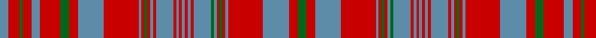

In pattern [BRGRBRGRBRBRGRBRBRBRBRBRBGBRGRBRBRG](/patterns/brgrbrgrbrbrgrbrbrbrbrbrbgbrgrbrbrg/).

This was sourced from register-of-tartans.  It is a [35 stripes tartan](/stripes/stripes35/).

Original link https://www.tartanregister.gov.uk/tartanDetails.aspx?ref=3068

## Thread count
B/12 R16 G4 R12 B12 R28 G12 R12 B36 R48 B4 R4 G4 R4 B4 R4 B24 R4 B4 R4 B4 R4 B4 R4 B24 G4 B4 R4 G4 R4 B4 R48 B36 R12 G/12

## Palette
Each colour and its ΔE from the base-6 reference it is a variant of.

| Colour | Shade | Base | ΔE (OKLab) |
|---|---|---|---|
| B | <code style="background-color:#5C8CA8;">#5C8CA8</code> `#5C8CA8` | B <code style="background-color:#2A418A;">#2A418A</code> | 0.23 |
| G | <code style="background-color:#006818;">#006818</code> `#006818` | G <code style="background-color:#006100;">#006100</code> | 0.02 |
| R | <code style="background-color:#C80000;">#C80000</code> `#C80000` | R <code style="background-color:#CC0000;">#CC0000</code> | 0.01 |

## Nearest tartans

The nearest existing variants by ΔTartan distance.

1. [Robertson 4](/setts/s28/r28g2r5g2r28g2r5g2r28b3r3g24r3b24r3b3r28g2r5g2r28b3r3g24r3b24r3b3x2~b304080-g008000-rc00000/) — ΔT 1.21
1. [Ross 1](/setts/s36/r32b3r3b8r3b3r23g20r6g20r6g20r22g5r10g5r22b24r5b24r23b3r3b8r3b3r32b3r3b8r3b3r23g20r6g20~b304080-g008000-rc00000/) — ΔT 1.21
1. [Campbell of Loudoun, Plaid](/setts/s25/b3r1b1r3b9r3b1r1b3r1b1r18b14r3b1r1b1r3g4r14g10r10b5r4b1x2~b304080-g008000-rc00000/) — ΔT 1.27
1. [Na Fir Dileas (Corporate)](/setts/s32/r17g12r6b33r4g4r33g4r4g4r33g4r4b33r39g15r7b39r4g4r39g4r4g4r39g4r4b39r7g15r39b14~b2c2c80-g006818-rc80000/) — ΔT 1.35
1. [Ross #4](/setts/s27/g18r2g18r18g2r4g2r18b18r2b18r18b1r1b2r1b1r18b1r1b2r1b1r18g18r2g18x2~b2c4084-g005020-rdc0000/) — ΔT 1.45
1. [Ross (Clan)](/setts/s27/g18r2g18r18g2r4g2r18b18r2b18r18b1r1b2r1b1r18b1r1g2r1b1r18g18r2g18x2~b2c2c80-g006818-rc80000/) — ΔT 1.46
1. [Ross Clan Tartan Tartan Number: 864. Earliest known date: 1810-15 D.C.Stewart says, "The version here given may be taken to be correct." Later versions, including Logans, are known to have omissions. The Clan Ross is descended from Fearcher MacinTagart, Earl of Ross in the 13th century. The chiefship has passed to the Rosses of Shandwick. The tartan is also worn by the MacTiers. Also worn by the Metro Toronto Police pipe band. (Strathallan 1994) See products available Copyright © Blair Urquhart, Comrie, 2015](/setts/s27/g18r2g18r18g2r4g2r18b18r2b18r18b1r1b2r1b1r18b1r1b2r1b1r18g18r2g18x2~b2c2c80-g006818-rc80000/) — ΔT 1.46
1. [Robertson 5](/setts/s29/r28g2r5g2r28b3r3b24r3g24r3b3r28g2r5g2r28b3r3b24r3g24r3b3r28g2r5g2r28x2~b304080-g008000-rc00000/) — ΔT 1.47
1. [Ross 7](/setts/s31/g23r6g23r26g4r9g4r26w3r8b31r6b31r8w3r26b2r2b4r2b2r26b2r2b4r2b2r26g23r6g23x2~b800080-g008000-rc00000-we0e0e0/) — ΔT 1.50
1. [Lumsden, of Clova](/setts/s31/b9r2b9r9g1r1g2r1g1r9g1r1g2r1g1r9w1r4b11r2b11r4w1r9g2r4g2r9g9r2g9x2~b304080-g008000-rc00000-we0e0e0/) — ΔT 1.52

## Neighbour map

Every grey dot is one of 15726 variants placed by the first two principal components of the ΔTartan feature space (44% of its variance). Red is this tartan; blue dots are its nearest — click one to open its page.

<svg viewBox="0 0 640 380" role="img" style="max-width:100%;height:auto;border:1px solid #e0e0e0;border-radius:4px;display:block" xmlns="http://www.w3.org/2000/svg"><image href="/nn/cloud.v1.png" width="640" height="380"/><a href="/setts/s28/r28g2r5g2r28g2r5g2r28b3r3g24r3b24r3b3r28g2r5g2r28b3r3g24r3b24r3b3x2~b304080-g008000-rc00000/"><circle cx="362.8" cy="133.6" r="4" fill="#3465a4"><title>Robertson 4</title></circle></a><a href="/setts/s36/r32b3r3b8r3b3r23g20r6g20r6g20r22g5r10g5r22b24r5b24r23b3r3b8r3b3r32b3r3b8r3b3r23g20r6g20~b304080-g008000-rc00000/"><circle cx="290.0" cy="149.6" r="4" fill="#3465a4"><title>Ross 1</title></circle></a><a href="/setts/s25/b3r1b1r3b9r3b1r1b3r1b1r18b14r3b1r1b1r3g4r14g10r10b5r4b1x2~b304080-g008000-rc00000/"><circle cx="351.8" cy="131.3" r="4" fill="#3465a4"><title>Campbell of Loudoun, Plaid</title></circle></a><a href="/setts/s32/r17g12r6b33r4g4r33g4r4g4r33g4r4b33r39g15r7b39r4g4r39g4r4g4r39g4r4b39r7g15r39b14~b2c2c80-g006818-rc80000/"><circle cx="309.9" cy="148.2" r="4" fill="#3465a4"><title>Na Fir Dileas (Corporate)</title></circle></a><a href="/setts/s27/g18r2g18r18g2r4g2r18b18r2b18r18b1r1b2r1b1r18b1r1b2r1b1r18g18r2g18x2~b2c4084-g005020-rdc0000/"><circle cx="290.1" cy="126.9" r="4" fill="#3465a4"><title>Ross #4</title></circle></a><a href="/setts/s27/g18r2g18r18g2r4g2r18b18r2b18r18b1r1b2r1b1r18b1r1g2r1b1r18g18r2g18x2~b2c2c80-g006818-rc80000/"><circle cx="293.0" cy="129.5" r="4" fill="#3465a4"><title>Ross (Clan)</title></circle></a><a href="/setts/s27/g18r2g18r18g2r4g2r18b18r2b18r18b1r1b2r1b1r18b1r1b2r1b1r18g18r2g18x2~b2c2c80-g006818-rc80000/"><circle cx="291.8" cy="129.3" r="4" fill="#3465a4"><title>Ross Clan Tartan Tartan Number: 864. Earliest known date: 1810-15 D.C.Stewart says, &quot;The version here given may be taken to be correct.&quot; Later versions, including Logans, are known to have omissions. The Clan Ross is descended from Fearcher MacinTagart, Earl of Ross in the 13th century. The chiefship has passed to the Rosses of Shandwick. The tartan is also worn by the MacTiers. Also worn by the Metro Toronto Police pipe band. (Strathallan 1994) See products available Copyright © Blair Urquhart, Comrie, 2015</title></circle></a><a href="/setts/s29/r28g2r5g2r28b3r3b24r3g24r3b3r28g2r5g2r28b3r3b24r3g24r3b3r28g2r5g2r28x2~b304080-g008000-rc00000/"><circle cx="386.7" cy="135.7" r="4" fill="#3465a4"><title>Robertson 5</title></circle></a><a href="/setts/s31/g23r6g23r26g4r9g4r26w3r8b31r6b31r8w3r26b2r2b4r2b2r26b2r2b4r2b2r26g23r6g23x2~b800080-g008000-rc00000-we0e0e0/"><circle cx="276.0" cy="112.0" r="4" fill="#3465a4"><title>Ross 7</title></circle></a><a href="/setts/s31/b9r2b9r9g1r1g2r1g1r9g1r1g2r1g1r9w1r4b11r2b11r4w1r9g2r4g2r9g9r2g9x2~b304080-g008000-rc00000-we0e0e0/"><circle cx="245.5" cy="133.5" r="4" fill="#3465a4"><title>Lumsden, of Clova</title></circle></a><circle cx="324.4" cy="130.4" r="5" fill="#c00000"/></svg>

ID: /setts/s35/b3r4g1r3b3r7g3r3b9r12b1r1g1r1b1r1b6r1b1r1b1r1b1r1b6g1b1r1g1r1b1r12b9r3g3x4~b5c8ca8-g006818-rc80000/
