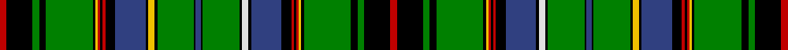

In pattern [RKGKGKYRKRKBKWKGKBKGKYKBKRKRYKGKGKR](/stripes/rkgkgkyrkrkbkwkgkbkgkykbkrkrykgkgkr/).

This was sourced from weddslist.  It is a [35 stripe tartan](/stripes/stripes35/).

Original link http://www.weddslist.com/cgi-bin/tartans/pg.pl?source=sts

## Thread count
R/16 K62 G16 K16 G112 K6 Y6 R6 K6 R6 K24 B72 K6 Y16 K6 G88 K4 B12 K4 G88 K6 LN16 K6 B72 K24 R6 K6 R6 Y6 K6 G112 K16 G16 K62 R/16

## Palette
Each colour and the base-6 reference it is a variant of.

| Colour | Shade | Base |
|---|---|---|
| B | <code style="background-color:#304080;">#304080</code> `oklch(39.4% 0.109 270.2)` <small>#304080</small> | B <code style="background-color:#2A418A;">#2A418A</code> |
| G | <code style="background-color:#008000;">#008000</code> `oklch(52.0% 0.177 142.5)` <small>#008000</small> | G <code style="background-color:#006100;">#006100</code> |
| K | <code style="background-color:#000000;">#000000</code> `oklch(0.0% 0.000 0.0)` <small>#000000</small> | K <code style="background-color:#000000;">#000000</code> |
| LN | <code style="background-color:#E0E0E0;">#E0E0E0</code> `oklch(90.7% 0.000 89.9)` <small>#E0E0E0</small> | W <code style="background-color:#F7F7F7;">#F7F7F7</code> |
| R | <code style="background-color:#C00000;">#C00000</code> `oklch(50.7% 0.208 29.2)` <small>#C00000</small> | R <code style="background-color:#CC0000;">#CC0000</code> |
| Y | <code style="background-color:#F0C000;">#F0C000</code> `oklch(82.7% 0.169 90.5)` <small>#F0C000</small> | Y <code style="background-color:#F2BF00;">#F2BF00</code> |

## Nearest tartans

The nearest existing variants by ΔTartan distance, with this tartan at the top so the swatches line up against it.

ΔTartan

Tartan

Sett

—

<a href="/ttd/edit/#slug=r8k31g8k8g56k3ly3r3k3r3k12db36k3w8k3g44k2db6k2g44k3ly8k3db36k12r3k3r3ly3k3g56k8g8k31r8~x2">Unidentified Plaid 14</a> <a class="nn-out" href="/setts/s35/r8k31g8k8g56k3ly3r3k3r3k12db36k3w8k3g44k2db6k2g44k3ly8k3db36k12r3k3r3ly3k3g56k8g8k31r8~x2/" title="open its dictionary page">↗</a>

1.18

<a href="/ttd/edit/#slug=r3k2g9db12w3db12g2k2g2k2g36k2g2k2g2db12w3db12k3ly3k2g12k2r3k2g6w3~x2">Cockburn</a> <a class="nn-out" href="/setts/s27/r3k2g9db12w3db12g2k2g2k2g36k2g2k2g2db12w3db12k3ly3k2g12k2r3k2g6w3~x2/" title="open its dictionary page">↗</a>

1.41

<a href="/ttd/edit/#slug=r5k2g30k2ly5k2db31k2w5k2db31k6g2k2g2k2g86k2g2k2g2k6db31k2w5k2db31k6g25k2r5~x2">Cockburn</a> <a class="nn-out" href="/setts/s31/r5k2g30k2ly5k2db31k2w5k2db31k6g2k2g2k2g86k2g2k2g2k6db31k2w5k2db31k6g25k2r5~x2/" title="open its dictionary page">↗</a>

1.46

<a href="/ttd/edit/#slug=g10ly3g3ly1k2r2k2ly1g3ly3g10db21k2db2k2db21k15g15r2g15k15db2k2db2k2db31k2db2k2db2~x2">Dundee Discovery</a> <a class="nn-out" href="/setts/s30/g10ly3g3ly1k2r2k2ly1g3ly3g10db21k2db2k2db21k15g15r2g15k15db2k2db2k2db31k2db2k2db2~x2/" title="open its dictionary page">↗</a>

1.46

<a href="/ttd/edit/#slug=db21k1db1k1db1k10g22r2g22k10db16k1db2k1db16k10g22ly2g22k10db1k1db1k1db7~x2">Farquharson</a> <a class="nn-out" href="/setts/s25/db21k1db1k1db1k10g22r2g22k10db16k1db2k1db16k10g22ly2g22k10db1k1db1k1db7~x2/" title="open its dictionary page">↗</a>

1.52

<a href="/setts/s38/g82k2g2k2g2k8db28k2w6k2db28k2ly6k2g32k2r5k2g15w6/">Ayre Personal Tartan Tartan Number: 6305. Earliest known date: 1819 This is Wilsons No. 038 (1819) and has been adopted by David Ayre of Kilmarnock as a private family tartan. See #805. See products available Copyright © Blair Urquhart, Comrie, 2015</a>

1.53

<a href="/ttd/edit/#slug=r2k6g2k2g14k1ly1r1k1r1k3b9k1ly2k1g11k1b2k1g11k1w2k1b9k1r1k1r1ly1k1g14k2g2k6r2~x2">Unidentified (R.J.Forsyth)</a> <a class="nn-out" href="/setts/s35/r2k6g2k2g14k1ly1r1k1r1k3b9k1ly2k1g11k1b2k1g11k1w2k1b9k1r1k1r1ly1k1g14k2g2k6r2~x2/" title="open its dictionary page">↗</a>

1.58

<a href="/ttd/edit/#slug=k2lo2k3w2k2g16r2g24r2g16k2w2k3lo2k4db4k4lo2k3w2k2db12r2db12g12r2g12k2w2k3lo2k4db2~x2">Hawick</a> <a class="nn-out" href="/setts/s33/k2lo2k3w2k2g16r2g24r2g16k2w2k3lo2k4db4k4lo2k3w2k2db12r2db12g12r2g12k2w2k3lo2k4db2~x2/" title="open its dictionary page">↗</a>

1.63

<a href="/setts/s22/g42b3k8ly2k2w3k2g12r5k2r2w2~x2/">King George VI (Green Stewart)</a>

1.66

<a href="/setts/s22/g46k3db6ly2db3ly2db3g7r6db2r3w4~x2/">Seller (Personal)</a>

1.66

<a href="/ttd/edit/#slug=k6g2k2g14k1ly2k1b5r1b5k1w2k1g14k1b2k1g14k1w2k1b5r1b5k1ly2k1g14k2g2k6r2~x2">Duncan of Sketraw Clan Tartan Tartan Number: 6497. Earliest known date: 2005 January A modified version of an unidentified tartan No. 331 from the 1930s. This new version is for John Duncan of Sketraw, and is approved by the Clan Duncan Society See products available Copyright © Blair Urquhart, Comrie, 2015</a> <a class="nn-out" href="/setts/s32/k6g2k2g14k1ly2k1b5r1b5k1w2k1g14k1b2k1g14k1w2k1b5r1b5k1ly2k1g14k2g2k6r2~x2/" title="open its dictionary page">↗</a>

## Neighbour map

Every grey dot is one of 14299 variants placed by the first two principal components of the ΔTartan feature space (44% of its variance). Red is this tartan; blue dots are its nearest — click one to open its page.

<svg viewBox="0 0 640 380" role="img" style="max-width:100%;height:auto;border:1px solid #e0e0e0;border-radius:4px;display:block" xmlns="http://www.w3.org/2000/svg"><image href="/nn/cloud.v1.png" width="640" height="380"/><a href="/setts/s27/r3k2g9db12w3db12g2k2g2k2g36k2g2k2g2db12w3db12k3ly3k2g12k2r3k2g6w3~x2/"><circle cx="188.2" cy="65.5" r="4" fill="#3465a4"><title>Cockburn</title></circle></a><a href="/setts/s31/r5k2g30k2ly5k2db31k2w5k2db31k6g2k2g2k2g86k2g2k2g2k6db31k2w5k2db31k6g25k2r5~x2/"><circle cx="243.4" cy="16.7" r="4" fill="#3465a4"><title>Cockburn</title></circle></a><a href="/setts/s30/g10ly3g3ly1k2r2k2ly1g3ly3g10db21k2db2k2db21k15g15r2g15k15db2k2db2k2db31k2db2k2db2~x2/"><circle cx="210.0" cy="63.7" r="4" fill="#3465a4"><title>Dundee Discovery</title></circle></a><a href="/setts/s25/db21k1db1k1db1k10g22r2g22k10db16k1db2k1db16k10g22ly2g22k10db1k1db1k1db7~x2/"><circle cx="204.9" cy="97.1" r="4" fill="#3465a4"><title>Farquharson</title></circle></a><a href="/setts/s38/g82k2g2k2g2k8db28k2w6k2db28k2ly6k2g32k2r5k2g15w6/"><circle cx="254.6" cy="16.2" r="4" fill="#3465a4"><title>Ayre Personal Tartan Tartan Number: 6305. Earliest known date: 1819 This is Wilsons No. 038 (1819) and has been adopted by David Ayre of Kilmarnock as a private family tartan. See #805. See products available Copyright © Blair Urquhart, Comrie, 2015</title></circle></a><a href="/setts/s35/r2k6g2k2g14k1ly1r1k1r1k3b9k1ly2k1g11k1b2k1g11k1w2k1b9k1r1k1r1ly1k1g14k2g2k6r2~x2/"><circle cx="187.1" cy="77.0" r="4" fill="#3465a4"><title>Unidentified (R.J.Forsyth)</title></circle></a><a href="/setts/s33/k2lo2k3w2k2g16r2g24r2g16k2w2k3lo2k4db4k4lo2k3w2k2db12r2db12g12r2g12k2w2k3lo2k4db2~x2/"><circle cx="174.0" cy="86.4" r="4" fill="#3465a4"><title>Hawick</title></circle></a><a href="/setts/s22/g42b3k8ly2k2w3k2g12r5k2r2w2~x2/"><circle cx="253.3" cy="57.9" r="4" fill="#3465a4"><title>King George VI (Green Stewart)</title></circle></a><a href="/setts/s22/g46k3db6ly2db3ly2db3g7r6db2r3w4~x2/"><circle cx="234.7" cy="45.3" r="4" fill="#3465a4"><title>Seller (Personal)</title></circle></a><a href="/setts/s32/k6g2k2g14k1ly2k1b5r1b5k1w2k1g14k1b2k1g14k1w2k1b5r1b5k1ly2k1g14k2g2k6r2~x2/"><circle cx="207.6" cy="85.2" r="4" fill="#3465a4"><title>Duncan of Sketraw Clan Tartan Tartan Number: 6497. Earliest known date: 2005 January A modified version of an unidentified tartan No. 331 from the 1930s. This new version is for John Duncan of Sketraw, and is approved by the Clan Duncan Society See products available Copyright © Blair Urquhart, Comrie, 2015</title></circle></a><circle cx="189.8" cy="39.1" r="5" fill="#c00000"/></svg>

ID: /setts/s35/r8k31g8k8g56k3ly3r3k3r3k12db36k3w8k3g44k2db6k2g44k3ly8k3db36k12r3k3r3ly3k3g56k8g8k31r8~x2/
