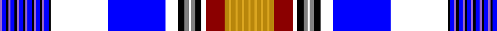

In pattern [BBKBBKBBKBBKBBKBBKWBWKGWGKWRYYYYYYYY](/patterns/bbkbbkbbkbbkbbkbbkwbwkgwgkwryyyyyyyy/).

This was sourced from register-of-tartans.  It is a [36 stripes tartan](/stripes/stripes36/).

Original link https://www.tartanregister.gov.uk/tartanDetails.aspx?ref=10264

## Thread count
P/2 B4 K2 P2 B4 K2 P2 B4 K2 P2 B4 K2 P2 B4 K2 P2 B4 K2 W54 B54 W12 K6 N4 W2 N4 K6 W4 DR18 DY4 Y2 DY4 Y2 DY4 Y2 DY4 Y/2

## Palette
Each colour and its ΔE from the base-6 reference it is a variant of.

| Colour | Shade | Base | ΔE (OKLab) |
|---|---|---|---|
| B | <code style="background-color:#0000FF;">#0000FF</code> `#0000FF` | B <code style="background-color:#2A418A;">#2A418A</code> | 0.20 |
| DR | <code style="background-color:#8B0000;">#8B0000</code> `#8B0000` | R <code style="background-color:#CC0000;">#CC0000</code> | 0.14 |
| DY | <code style="background-color:#B8860B;">#B8860B</code> `#B8860B` | Y <code style="background-color:#F2BF00;">#F2BF00</code> | 0.18 |
| K | <code style="background-color:#000000;">#000000</code> `#000000` | K <code style="background-color:#000000;">#000000</code> | 0.00 |
| N | <code style="background-color:#808080;">#808080</code> `#808080` | G <code style="background-color:#006100;">#006100</code> | 0.23 |
| P | <code style="background-color:#9966CC;">#9966CC</code> `#9966CC` | B <code style="background-color:#2A418A;">#2A418A</code> | 0.23 |
| W | <code style="background-color:#FFFFFF;">#FFFFFF</code> `#FFFFFF` | W <code style="background-color:#F7F7F7;">#F7F7F7</code> | 0.02 |
| Y | <code style="background-color:#DAA520;">#DAA520</code> `#DAA520` | Y <code style="background-color:#F2BF00;">#F2BF00</code> | 0.08 |

## Nearest tartans

The nearest existing variants by ΔTartan distance.

1. [Am Yisrael Chair (Corporate)](/setts/s36/b1ba2k1b1ba2k1b1ba2k1b1ba2k1b1ba2k1b1ba2k1w27ba27w6k3r2w1r2k3w2ra9y2ya1y2ya1y2ya1y2ya1~b780078-ba2c2c80-k101010-r888888-ra880000-we0e0e0-ybc8c00-yae8c000~x2/) — ΔT 1.43
1. [Arctic (District)](/setts/s22/w6wa1w1wa2r2g2k2w1b2ba16w1ba16b2w1k2g2r2wa2w1wa1w6b1~b2474e8-ba1c0070-g00643c-k101010-rc80000-wfcfcfc-wac0c0c0~x4/) — ΔT 2.18
1. [Women's Wear Daily 'Clan' (Fashion)](/setts/s29/r1k1y2k1r1k1b2k1r1k1g2k1r2k1w12k1g2k1r1k1b2k1r1k1y2k1r1ba28w1~b1474b4-ba003c64-g289c18-k101010-rc80000-we0e0e0-ye8c000~x2/) — ΔT 2.29
1. [Alabama (Provisional)](/setts/s23/r5w3b2w1b4ra1b1ra3b1ra1b4rb4ba1rb1ba1rb4b4bb25w1bb2w2bb2w3~b003c64-ba5c8ca8-bb1474b4-rc80000-ra901c38-rb888888-we0e0e0~x2/) — ΔT 2.54
1. [Women's Wear Daily Hunting (Fashion)](/setts/s29/r1k1y2k1r1k1b2k1r1k1g2k1r2k1w12k1g2k1r1k1b2k1r1k1y2k1r1ka28w1~b1474b4-g289c18-k101010-ka00002c-rc80000-we0e0e0-ye8c000~x2/) — ΔT 2.55
1. [Cooper Dress (Dalgliesh #1) (Dance)](/setts/s18/b2w4r2wa26b3wa2b3k10w3b2w3g9b1k1b21w3b2r2~b2c2c80-g006818-k101010-rc80000-wc49cd8-wafcfcfc~x2/) — ΔT 2.62
1. [Cooper Dress Tartan Tartan Number: 75. Earliest known date: 1970-80 Modern White replaces green in this dress version of the Couper of Gogar family tartan. The original dates to circa 1886 when it was woven for the Gogar branch of the family by Peter MacArthur and Company in Hamilton. The dress version has been produced more recently. The Coupers of Gogar are also Baronets of Nova Scotia (1638). See products available Copyright © Blair Urquhart, Comrie, 2015](/setts/s18/b2w4r2wa26b3wa2b3k10w3b2w3g9b1k1b21w3b2r2~b2c2c80-g006818-k101010-rc80000-wc49cd8-wae0e0e0~x2/) — ΔT 2.67
1. [Mackintosh #7](/setts/s36/b7w1b7w1b24w1b2ba2w1ba2b2w1g10ga3w1b4ba2w1r3w1ba2b3w1ga3g10w1b2ba2w1ba2b2w1b6r16k2r2~b5a008c-ba3c82af-g002814-ga309c18-k101010-rdc0000-we0e0e0~x2/) — ΔT 2.68
1. [Unidentified #39](/setts/s18/g20w2b70y2k13w10r5k1r5k1r5w10k13y2ga15w22k2y2~b5a008c-g808080-ga503c14-k101010-rdc0000-we0e0e0-ye8c000~x2/) — ΔT 2.69
1. [Cooper, dress](/setts/s18/b2w4r2wa26b3wa2b3k10w3b2w3g9b1k1b21w3b2r2~b304080-g008000-k000000-rc00000-wc0a0e0-wae0e0e0~x2/) — ΔT 2.73

## Neighbour map

Every grey dot is one of 15726 variants placed by the first two principal components of the ΔTartan feature space (44% of its variance). Red is this tartan; blue dots are its nearest — click one to open its page.

<svg viewBox="0 0 640 380" role="img" style="max-width:100%;height:auto;border:1px solid #e0e0e0;border-radius:4px;display:block" xmlns="http://www.w3.org/2000/svg"><image href="/nn/cloud.v1.png" width="640" height="380"/><a href="/setts/s36/b1ba2k1b1ba2k1b1ba2k1b1ba2k1b1ba2k1b1ba2k1w27ba27w6k3r2w1r2k3w2ra9y2ya1y2ya1y2ya1y2ya1~b780078-ba2c2c80-k101010-r888888-ra880000-we0e0e0-ybc8c00-yae8c000~x2/"><circle cx="103.9" cy="14.0" r="4" fill="#3465a4"><title>Am Yisrael Chair (Corporate)</title></circle></a><a href="/setts/s22/w6wa1w1wa2r2g2k2w1b2ba16w1ba16b2w1k2g2r2wa2w1wa1w6b1~b2474e8-ba1c0070-g00643c-k101010-rc80000-wfcfcfc-wac0c0c0~x4/"><circle cx="133.4" cy="36.8" r="4" fill="#3465a4"><title>Arctic (District)</title></circle></a><a href="/setts/s29/r1k1y2k1r1k1b2k1r1k1g2k1r2k1w12k1g2k1r1k1b2k1r1k1y2k1r1ba28w1~b1474b4-ba003c64-g289c18-k101010-rc80000-we0e0e0-ye8c000~x2/"><circle cx="151.2" cy="14.0" r="4" fill="#3465a4"><title>Women's Wear Daily 'Clan' (Fashion)</title></circle></a><a href="/setts/s23/r5w3b2w1b4ra1b1ra3b1ra1b4rb4ba1rb1ba1rb4b4bb25w1bb2w2bb2w3~b003c64-ba5c8ca8-bb1474b4-rc80000-ra901c38-rb888888-we0e0e0~x2/"><circle cx="166.9" cy="28.9" r="4" fill="#3465a4"><title>Alabama (Provisional)</title></circle></a><a href="/setts/s29/r1k1y2k1r1k1b2k1r1k1g2k1r2k1w12k1g2k1r1k1b2k1r1k1y2k1r1ka28w1~b1474b4-g289c18-k101010-ka00002c-rc80000-we0e0e0-ye8c000~x2/"><circle cx="144.5" cy="14.0" r="4" fill="#3465a4"><title>Women's Wear Daily Hunting (Fashion)</title></circle></a><a href="/setts/s18/b2w4r2wa26b3wa2b3k10w3b2w3g9b1k1b21w3b2r2~b2c2c80-g006818-k101010-rc80000-wc49cd8-wafcfcfc~x2/"><circle cx="124.2" cy="41.6" r="4" fill="#3465a4"><title>Cooper Dress (Dalgliesh #1) (Dance)</title></circle></a><a href="/setts/s18/b2w4r2wa26b3wa2b3k10w3b2w3g9b1k1b21w3b2r2~b2c2c80-g006818-k101010-rc80000-wc49cd8-wae0e0e0~x2/"><circle cx="131.5" cy="45.5" r="4" fill="#3465a4"><title>Cooper Dress Tartan Tartan Number: 75. Earliest known date: 1970-80 Modern White replaces green in this dress version of the Couper of Gogar family tartan. The original dates to circa 1886 when it was woven for the Gogar branch of the family by Peter MacArthur and Company in Hamilton. The dress version has been produced more recently. The Coupers of Gogar are also Baronets of Nova Scotia (1638). See products available Copyright © Blair Urquhart, Comrie, 2015</title></circle></a><a href="/setts/s36/b7w1b7w1b24w1b2ba2w1ba2b2w1g10ga3w1b4ba2w1r3w1ba2b3w1ga3g10w1b2ba2w1ba2b2w1b6r16k2r2~b5a008c-ba3c82af-g002814-ga309c18-k101010-rdc0000-we0e0e0~x2/"><circle cx="170.8" cy="14.0" r="4" fill="#3465a4"><title>Mackintosh #7</title></circle></a><a href="/setts/s18/g20w2b70y2k13w10r5k1r5k1r5w10k13y2ga15w22k2y2~b5a008c-g808080-ga503c14-k101010-rdc0000-we0e0e0-ye8c000~x2/"><circle cx="151.7" cy="14.0" r="4" fill="#3465a4"><title>Unidentified #39</title></circle></a><a href="/setts/s18/b2w4r2wa26b3wa2b3k10w3b2w3g9b1k1b21w3b2r2~b304080-g008000-k000000-rc00000-wc0a0e0-wae0e0e0~x2/"><circle cx="126.2" cy="44.3" r="4" fill="#3465a4"><title>Cooper, dress</title></circle></a><circle cx="85.6" cy="14.0" r="5" fill="#c00000"/></svg>

ID: /setts/s36/b1ba2k1b1ba2k1b1ba2k1b1ba2k1b1ba2k1b1ba2k1w27ba27w6k3g2w1g2k3w2r9y2ya1y2ya1y2ya1y2ya1~b9966cc-ba0000ff-g808080-k000000-r8b0000-wffffff-yb8860b-yadaa520~x2/
