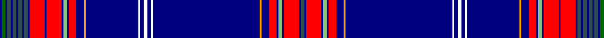

In pattern [BBRBYBRBYBWBWBWBYBRBYBRBRBBBBBBBBBGB](/patterns/bbrbybrbybwbwbwbybrbybrbrbbbbbbbbbgb/).

This was sourced from register-of-tartans.  It is a [36 stripes tartan](/stripes/stripes36/).

Original link https://www.tartanregister.gov.uk/tartanDetails.aspx?ref=10537

## Thread count
DB/2 G4 DB2 N4 DB2 N4 DB2 N4 DB2 N4 DB2 R16 DB2 R16 DB2 LG4 DB2 R8 DB8 Y2 DB56 W2 DB4 W4 DB4 W2 DB114 Y2 DB8 R8 DB2 LG4 DB2 R16 DB2 N/4

## Palette
Each colour and its ΔE from the base-6 reference it is a variant of.

| Colour | Shade | Base | ΔE (OKLab) |
|---|---|---|---|
| DB | <code style="background-color:#000080;">#000080</code> `#000080` | B <code style="background-color:#2C4084;">#2C4084</code> | 0.14 |
| G | <code style="background-color:#006400;">#006400</code> `#006400` | G <code style="background-color:#006400;">#006400</code> | 0.00 |
| LG | <code style="background-color:#86C67C;">#86C67C</code> `#86C67C` | Y <code style="background-color:#E8C000;">#E8C000</code> | 0.14 |
| N | <code style="background-color:#2F4F4F;">#2F4F4F</code> `#2F4F4F` | B <code style="background-color:#2C4084;">#2C4084</code> | 0.11 |
| R | <code style="background-color:#FF0000;">#FF0000</code> `#FF0000` | R <code style="background-color:#C80000;">#C80000</code> | 0.11 |
| W | <code style="background-color:#FFFFFF;">#FFFFFF</code> `#FFFFFF` | W <code style="background-color:#F4F4F0;">#F4F4F0</code> | 0.03 |
| Y | <code style="background-color:#FFA500;">#FFA500</code> `#FFA500` | Y <code style="background-color:#E8C000;">#E8C000</code> | 0.07 |

## Nearest tartans

The nearest existing variants by ΔTartan distance.

1. [New York Tartan Day Parade (Corp.)](/setts/s34/b4w2b56y2b8r8b2g4b2r16b2ba4b2ba4b2ba4b2ba4b2ba4b2ba4b2r16b2g4b2r8b8y2b112w2b4w4-b202060-ba5c5c5c-g289c18-rc80000-we0e0e0-yd87c00/) — ΔT 1.72
1. [Gorman Spring (Personal)](/setts/s19/b72ba4b10g4w4r6w4g4b10g4w4r6w4g4b10ba4b23y2b18-b2c2c80-ba2888c4-g006818-rb468ac-we0e0e0-ye8c000/) — ΔT 2.31
1. [Khalsa](/setts/s22/b10w2b10w2b10w2b10w2b10w2r10ba2y10ba2r10y2k72w2ba6w2k144w2-b003c64-ba0000cd-k101010-re86000-wffffff-yfccc00/) — ΔT 2.45
1. [Gorman Spring (Personal)](/setts/s19/b72ba4b10g4w4r6w4g4b10g4w4r6w4g4b10ba4b23y2b18-b000080-ba0276fd-g00611c-rb452cd-wffffff-ydaa520/) — ΔT 2.45
1. [American Scottish Foundation](/setts/s22/w4r4w4r4b4w2b2w2b2w2b4ba8w2ba8b70g4k2g4r4g2r4w2-b003c64-ba2474e8-g285800-k101010-rdc0000-wffffff/) — ΔT 2.45
1. [ASF Official (Corporate)](/setts/s22/w4r4w4r4b4w2b2w2b2w2b4ba8w2ba8b70g4k2g4r4g2r4w2-b003c64-ba2c2c80-g285800-k101010-rc80000-we0e0e0/) — ΔT 2.49
1. [Reeves (2015)](/setts/s17/b72ba4b8ba6b8ba8w2r4g4w2k4g6k4b6k4r6w2-b2c4084-ba5c8ca8-g146400-k101010-rc80000-wffffff/) — ΔT 2.56
1. [Unidentified (Miss Paterson)](/setts/s44/b14r4k2b10k2b10k2b10k2ba6b77w4k6b28k92ba6k2ba6k2ba6k2ba6k207ba6k2ba6k2ba6k2ba6k92b28k6w4b76ba6k2b10k2b10k2b10k2r4-b1474b4-ba2c2c80-k101010-rc80000-wfcfcfc/) — ΔT 2.61
1. [London '88](/setts/s12/y8b110r8k8b4y4b4w10b6ra4r4k4-b2c2c80-k101010-r888888-rac80000-we0e0e0-ye8c000/) — ΔT 2.70
1. [Australian National](/setts/s14/b104g30w2g4w2g4y4g4k4ba6w4b4r4ba10-b202060-ba2c2c80-g006818-k101010-rc80000-wfcfcfc-ye8c000/) — ΔT 2.76

## Neighbour map

Every grey dot is one of 15726 variants placed by the first two principal components of the ΔTartan feature space (44% of its variance). Red is this tartan; blue dots are its nearest — click one to open its page.

<svg viewBox="0 0 640 380" role="img" style="max-width:100%;height:auto;border:1px solid #e0e0e0;border-radius:4px;display:block" xmlns="http://www.w3.org/2000/svg"><image href="/nn/cloud.v1.png" width="640" height="380"/><a href="/setts/s34/b4w2b56y2b8r8b2g4b2r16b2ba4b2ba4b2ba4b2ba4b2ba4b2ba4b2r16b2g4b2r8b8y2b112w2b4w4-b202060-ba5c5c5c-g289c18-rc80000-we0e0e0-yd87c00/"><circle cx="450.2" cy="14.0" r="4" fill="#3465a4"><title>New York Tartan Day Parade (Corp.)</title></circle></a><a href="/setts/s19/b72ba4b10g4w4r6w4g4b10g4w4r6w4g4b10ba4b23y2b18-b2c2c80-ba2888c4-g006818-rb468ac-we0e0e0-ye8c000/"><circle cx="428.0" cy="54.9" r="4" fill="#3465a4"><title>Gorman Spring (Personal)</title></circle></a><a href="/setts/s22/b10w2b10w2b10w2b10w2b10w2r10ba2y10ba2r10y2k72w2ba6w2k144w2-b003c64-ba0000cd-k101010-re86000-wffffff-yfccc00/"><circle cx="397.1" cy="14.0" r="4" fill="#3465a4"><title>Khalsa</title></circle></a><a href="/setts/s19/b72ba4b10g4w4r6w4g4b10g4w4r6w4g4b10ba4b23y2b18-b000080-ba0276fd-g00611c-rb452cd-wffffff-ydaa520/"><circle cx="401.6" cy="51.8" r="4" fill="#3465a4"><title>Gorman Spring (Personal)</title></circle></a><a href="/setts/s22/w4r4w4r4b4w2b2w2b2w2b4ba8w2ba8b70g4k2g4r4g2r4w2-b003c64-ba2474e8-g285800-k101010-rdc0000-wffffff/"><circle cx="302.1" cy="14.0" r="4" fill="#3465a4"><title>American Scottish Foundation</title></circle></a><a href="/setts/s22/w4r4w4r4b4w2b2w2b2w2b4ba8w2ba8b70g4k2g4r4g2r4w2-b003c64-ba2c2c80-g285800-k101010-rc80000-we0e0e0/"><circle cx="320.2" cy="16.4" r="4" fill="#3465a4"><title>ASF Official (Corporate)</title></circle></a><a href="/setts/s17/b72ba4b8ba6b8ba8w2r4g4w2k4g6k4b6k4r6w2-b2c4084-ba5c8ca8-g146400-k101010-rc80000-wffffff/"><circle cx="372.7" cy="46.4" r="4" fill="#3465a4"><title>Reeves (2015)</title></circle></a><a href="/setts/s44/b14r4k2b10k2b10k2b10k2ba6b77w4k6b28k92ba6k2ba6k2ba6k2ba6k207ba6k2ba6k2ba6k2ba6k92b28k6w4b76ba6k2b10k2b10k2b10k2r4-b1474b4-ba2c2c80-k101010-rc80000-wfcfcfc/"><circle cx="356.9" cy="14.0" r="4" fill="#3465a4"><title>Unidentified (Miss Paterson)</title></circle></a><a href="/setts/s12/y8b110r8k8b4y4b4w10b6ra4r4k4-b2c2c80-k101010-r888888-rac80000-we0e0e0-ye8c000/"><circle cx="424.5" cy="58.1" r="4" fill="#3465a4"><title>London '88</title></circle></a><a href="/setts/s14/b104g30w2g4w2g4y4g4k4ba6w4b4r4ba10-b202060-ba2c2c80-g006818-k101010-rc80000-wfcfcfc-ye8c000/"><circle cx="344.8" cy="22.6" r="4" fill="#3465a4"><title>Australian National</title></circle></a><circle cx="371.4" cy="14.0" r="5" fill="#c00000"/></svg>

ID: /setts/s36/b4ba2r16ba2y4ba2r8ba8ya2ba114w2ba4w4ba4w2ba56ya2ba8r8ba2y4ba2r16ba2r16ba2b4ba2b4ba2b4ba2b4ba2g4ba2-b2f4f4f-ba000080-g006400-rff0000-wffffff-y86c67c-yaffa500/
