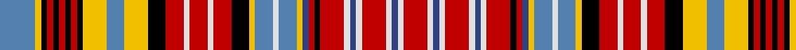

In pattern [BYKRKRKRKYBYKRWRWRKYBWBYBRKRWBWRWBWR](/patterns/bykrkrkrkybykrwrwrkybwbybrkrwbwrwbwr/).

This was sourced from weddslist.  It is a [36 stripes tartan](/stripes/stripes36/).

Original link http://www.weddslist.com/cgi-bin/tartans/pg.pl?source=sts

## Thread count
Ba/24 Y4 K4 R4 K4 R4 K4 R4 K4 Y16 Ba12 Y16 K12 R12 LN4 R12 LN4 R12 K12 Y4 Ba12 LN4 Ba12 Y4 B4 R4 K4 R16 LN4 B4 LN4 R16 LN4 B4 LN4 R/16

## Palette
Each colour and its ΔE from the base-6 reference it is a variant of.

| Colour | Shade | Base | ΔE (OKLab) |
|---|---|---|---|
| B | <code style="background-color:#304080;">#304080</code> `#304080` | B <code style="background-color:#2A418A;">#2A418A</code> | 0.02 |
| Ba | <code style="background-color:#5480B0;">#5480B0</code> `#5480B0` | B <code style="background-color:#2A418A;">#2A418A</code> | 0.19 |
| K | <code style="background-color:#000000;">#000000</code> `#000000` | K <code style="background-color:#000000;">#000000</code> | 0.00 |
| LN | <code style="background-color:#E0E0E0;">#E0E0E0</code> `#E0E0E0` | W <code style="background-color:#F7F7F7;">#F7F7F7</code> | 0.07 |
| R | <code style="background-color:#C00000;">#C00000</code> `#C00000` | R <code style="background-color:#CC0000;">#CC0000</code> | 0.03 |
| Y | <code style="background-color:#F0C000;">#F0C000</code> `#F0C000` | Y <code style="background-color:#F2BF00;">#F2BF00</code> | 0.00 |

## Nearest tartans

The nearest existing variants by ΔTartan distance.

1. [Ogilvie (Paton) #2](/setts/s36/b6y1k1r1k1r1k1r1k1y4b3y4k3r3w1r3w1r3k3y1b3w1b3y1ba1r1k1r4w1ba1w1r4w1ba1w1r4x4~b3c82af-ba2c4084-k101010-rdc0000-we0e0e0-ye8c000/) — ΔT 0.51
1. [Wilson's No.190](/setts/s36/k3y2k13w2b11r12w2r12k12y2g12r12w2r12b11w2k13y2k3y2k13w2b11r12w2r12g12y2k12r12w2r12b11w2k13y2x2~b2888c4-g006818-k101010-rc80000-we0e0e0-ye8c000/) — ΔT 0.81
1. [Ogilvie](/setts/s34/b3w2r12k2r2b2y2ra6w2ra6y2k3r6w2r6w2r6k3y4ra6y4k2r2k2r2k2r2k2y2ra6y2b2y2b2x2~b2c2c80-k101010-rc80000-ra888888-wc0c0c0-yd09800/) — ΔT 1.05
1. [Debian](/setts/s36/b7y1b7r7k1r7w1k1w3ra3w3k1w1ra3w1k1w1ra3w1k1w1k1w1k1w3ra3w1ra3w1k1w1k1w3r7k1r7x4~b141e46-k101010-r781c38-rac80028-we0e0e0-ye8c000/) — ΔT 1.11
1. [Wilson's No.011](/setts/s22/r18b10k15y4k4w6k4g23r12r4r10w4r10r4r12g23k4w6k4y4k15b10x2~b5c8ca8-g006818-k101010-rc80000-wfcfcfc-ye8c000/) — ΔT 1.29
1. [Ogilvie (Paton)](/setts/s36/b6k2b6y4k2r3y2r3w2r3k2y2b3w2b3y2k2r3w2r3k2y2b6k2b6k2b6y2k2r3w2r3w2r3k6w1x2~b2c4084-k101010-rdc0000-we0e0e0-ye8c000/) — ΔT 1.44
1. [Ogilvy of Airlie](/setts/s36/r14w2b3w2r14k2r2b2y2ba7w2ba7y2k4r7w1r7w1r7k4y5ba7y5k2r2k2r2k2r2k2y2ba7y2b3y2b3x2~b000050-ba5480b0-k000000-rc00000-we0e0e0-yf0c000/) — ΔT 1.47
1. [Ogilvie #3](/setts/s37/r6k6r6k6y7b7y7k8r6w5r6w5r6k8y8b8w7b7y7k8r8k8r15w2k2w2r14w2k2w2r14k8r8k8y6b6y6~b2c4084-k101010-rdc0000-we0e0e0-ye8c000/) — ΔT 1.49
1. [Ogilvy of Airlie Clan Tartan Tartan Number: 234. Earliest known date: 1830 Ogilvy of Airlie is the most usual form of the Ogilvy or Ogilvie tartan. The enormous complexity of the pattern makes it impossible to say whether accuracy of design has been maintained over the years, however, this count has been derived from an actual sample in the Paton collection housed at the Scottish Tartans Museum. The sett differs from the 'Drummond or Ogilvie' in detail but the overall design is the same. One full sett (repeat) of the pattern takes up the width of the loom. . See products available Copyright © Blair Urquhart, Comrie, 2015](/setts/s36/r14w2b3w2r14k2r2b2y2ba7w2ba7y2k4r7w1r7w1r7k4y5ba7y5k2r2k2r2k2r2k2y2ba7y2b3y2b3x2~b202060-ba5c8ca8-k101010-rc80000-we0e0e0-ye8c000/) — ΔT 1.55
1. [McNair (2016)](/setts/s24/r2ra1g1ra1ga1ra1k2ra2r2ra1g2ga1y1ga1y1ga1y1r2k8ra1ga1ra1k3ra1x10~g005020-ga289c18-k101010-r960028-raff0000-yffff00/) — ΔT 1.56

## Neighbour map

Every grey dot is one of 15726 variants placed by the first two principal components of the ΔTartan feature space (44% of its variance). Red is this tartan; blue dots are its nearest — click one to open its page.

<svg viewBox="0 0 640 380" role="img" style="max-width:100%;height:auto;border:1px solid #e0e0e0;border-radius:4px;display:block" xmlns="http://www.w3.org/2000/svg"><image href="/nn/cloud.v1.png" width="640" height="380"/><a href="/setts/s36/b6y1k1r1k1r1k1r1k1y4b3y4k3r3w1r3w1r3k3y1b3w1b3y1ba1r1k1r4w1ba1w1r4w1ba1w1r4x4~b3c82af-ba2c4084-k101010-rdc0000-we0e0e0-ye8c000/"><circle cx="34.4" cy="103.7" r="4" fill="#3465a4"><title>Ogilvie (Paton) #2</title></circle></a><a href="/setts/s36/k3y2k13w2b11r12w2r12k12y2g12r12w2r12b11w2k13y2k3y2k13w2b11r12w2r12g12y2k12r12w2r12b11w2k13y2x2~b2888c4-g006818-k101010-rc80000-we0e0e0-ye8c000/"><circle cx="49.2" cy="113.4" r="4" fill="#3465a4"><title>Wilson's No.190</title></circle></a><a href="/setts/s34/b3w2r12k2r2b2y2ra6w2ra6y2k3r6w2r6w2r6k3y4ra6y4k2r2k2r2k2r2k2y2ra6y2b2y2b2x2~b2c2c80-k101010-rc80000-ra888888-wc0c0c0-yd09800/"><circle cx="49.1" cy="116.2" r="4" fill="#3465a4"><title>Ogilvie</title></circle></a><a href="/setts/s36/b7y1b7r7k1r7w1k1w3ra3w3k1w1ra3w1k1w1ra3w1k1w1k1w1k1w3ra3w1ra3w1k1w1k1w3r7k1r7x4~b141e46-k101010-r781c38-rac80028-we0e0e0-ye8c000/"><circle cx="45.0" cy="83.1" r="4" fill="#3465a4"><title>Debian</title></circle></a><a href="/setts/s22/r18b10k15y4k4w6k4g23r12r4r10w4r10r4r12g23k4w6k4y4k15b10x2~b5c8ca8-g006818-k101010-rc80000-wfcfcfc-ye8c000/"><circle cx="42.0" cy="137.2" r="4" fill="#3465a4"><title>Wilson's No.011</title></circle></a><a href="/setts/s36/b6k2b6y4k2r3y2r3w2r3k2y2b3w2b3y2k2r3w2r3k2y2b6k2b6k2b6y2k2r3w2r3w2r3k6w1x2~b2c4084-k101010-rdc0000-we0e0e0-ye8c000/"><circle cx="26.5" cy="145.9" r="4" fill="#3465a4"><title>Ogilvie (Paton)</title></circle></a><a href="/setts/s36/r14w2b3w2r14k2r2b2y2ba7w2ba7y2k4r7w1r7w1r7k4y5ba7y5k2r2k2r2k2r2k2y2ba7y2b3y2b3x2~b000050-ba5480b0-k000000-rc00000-we0e0e0-yf0c000/"><circle cx="98.0" cy="64.0" r="4" fill="#3465a4"><title>Ogilvy of Airlie</title></circle></a><a href="/setts/s37/r6k6r6k6y7b7y7k8r6w5r6w5r6k8y8b8w7b7y7k8r8k8r15w2k2w2r14w2k2w2r14k8r8k8y6b6y6~b2c4084-k101010-rdc0000-we0e0e0-ye8c000/"><circle cx="44.0" cy="136.3" r="4" fill="#3465a4"><title>Ogilvie #3</title></circle></a><a href="/setts/s36/r14w2b3w2r14k2r2b2y2ba7w2ba7y2k4r7w1r7w1r7k4y5ba7y5k2r2k2r2k2r2k2y2ba7y2b3y2b3x2~b202060-ba5c8ca8-k101010-rc80000-we0e0e0-ye8c000/"><circle cx="110.3" cy="66.5" r="4" fill="#3465a4"><title>Ogilvy of Airlie Clan Tartan Tartan Number: 234. Earliest known date: 1830 Ogilvy of Airlie is the most usual form of the Ogilvy or Ogilvie tartan. The enormous complexity of the pattern makes it impossible to say whether accuracy of design has been maintained over the years, however, this count has been derived from an actual sample in the Paton collection housed at the Scottish Tartans Museum. The sett differs from the 'Drummond or Ogilvie' in detail but the overall design is the same. One full sett (repeat) of the pattern takes up the width of the loom. . See products available Copyright © Blair Urquhart, Comrie, 2015</title></circle></a><a href="/setts/s24/r2ra1g1ra1ga1ra1k2ra2r2ra1g2ga1y1ga1y1ga1y1r2k8ra1ga1ra1k3ra1x10~g005020-ga289c18-k101010-r960028-raff0000-yffff00/"><circle cx="62.4" cy="97.5" r="4" fill="#3465a4"><title>McNair (2016)</title></circle></a><circle cx="25.4" cy="102.3" r="5" fill="#c00000"/></svg>

ID: /setts/s36/b6y1k1r1k1r1k1r1k1y4b3y4k3r3w1r3w1r3k3y1b3w1b3y1ba1r1k1r4w1ba1w1r4w1ba1w1r4x4~b5480b0-ba304080-k000000-rc00000-we0e0e0-yf0c000/
