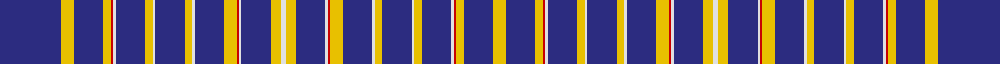

In pattern [BYBYRWBYWBYWBYRWBYWYBWRYBWYBWYBWRYBY](/stripes/bybyrwbywbywbyrwbywybwrybwybwybwryby/).

This was sourced from house-of-tartan.  It is a [36 stripe tartan](/stripes/stripes36/).

Original link http://www.house-of-tartan.scotland.net/house/TartanViewjs.asp?colr=Def&tnam=3913

## Also known as

This cloth is also recorded under:

- Racing Wanless Australian

## Thread count
DB/50 Y10 DB24 Y6 R2 LN2 DB24 Y6 LN2 DB24 Y6 LN2 DB24 Y10 R2 LN2 DB24 Y8 LN4 Y8 DB24 LN2 R2 Y10 DB24 LN2 Y6 DB24 LN2 Y6 DB24 LN2 R2 Y6 DB24 Y/10

## Palette
Each colour and the base-6 reference it is a variant of.

| Colour | Shade | Base |
|---|---|---|
| DB | <code style="background-color:#2C2C80;">#2C2C80</code> `oklch(35.0% 0.138 276.6)` <small>#2C2C80</small> | B <code style="background-color:#2A418A;">#2A418A</code> |
| LN | <code style="background-color:#E0E0E0;">#E0E0E0</code> `oklch(90.7% 0.000 89.9)` <small>#E0E0E0</small> | W <code style="background-color:#F7F7F7;">#F7F7F7</code> |
| R | <code style="background-color:#C80000;">#C80000</code> `oklch(52.3% 0.215 29.2)` <small>#C80000</small> | R <code style="background-color:#CC0000;">#CC0000</code> |
| Y | <code style="background-color:#E8C000;">#E8C000</code> `oklch(81.9% 0.168 93.7)` <small>#E8C000</small> | Y <code style="background-color:#F2BF00;">#F2BF00</code> |

## Nearest tartans

The nearest existing variants by ΔTartan distance.

1. [Wanless (Personal)](/setts/s19/db25ly5db12ly3r1w1db12ly3w1db12ly3w1db12ly5r1w1db12ly4w2~x2/) — ΔT 1.36
1. [Clackson Personal Weavers Tartan Tartan Number: 5831. Earliest known date: June 2003 Designed by Dr. Stephen Gregory Clackson of Orkney for all bearers of any version of his armorial bearings, for all descendants of such persons and for all persons granted written permission by him or his heirs. Inspired by the armorial bearings of Dr Clackson (which are matriculated in the Public Register of all Arms and Bearings in Scotland) to commemorate the birth in Aberdeen of his daughter Frideswide Joyce Charlotte on the 13th February 2003. See products available Copyright © Blair Urquhart, Comrie, 2015](/setts/s24/db24r2db8w5db4ly5db4w5db4ly5db8r2db24~x2/) — ΔT 1.50
1. [Washington Stockmens](/setts/s38/db4o3db4o19k2o3k2o12db4o3db4o3k1o2ly1o2ly1o2k1o3~x4/) — ΔT 1.76
1. [European Union District Tartan Tartan Number: 2486. Earliest known date: 1997/98 The tartan was designed by William Chalmers of Kilsyth in Scotland. The cloth is an authentic Scottish Tartan for all Europeans & originally registered with the the Scottish Tartans Society, the United Kingdom Patent Office, the President of the European Union and the Commissioners in Brussels. The Tartan Squares are worked round the twelve stars on the European Union Flag, designed by Mr Paul Levy, the Council of Europe?s Director of information in the early 1950s. The tartan is made up of the colours on the flag of the European Union, running through the tartan is a small red line, this commemorates the blood spilt on our Continent since recorded history, the white line is slightly larger and represents peace on the Continent of Europe and the world. Various items & cloth (wool worsted and poly-viscose) available from the designer at Tel: 01236 822299, or International 44-00-01236 822299, or Email: CChalmers@compuserve.com . See products available Copyright © Blair Urquhart, Comrie, 2015](/setts/s18/w4db32k1ly2k1db10ly18db10k1r2~x2/) — ΔT 1.96
1. [Washington, Stockman](/setts/s20/db4y3db4y19k2y3k2y12db4y3db4y3k1y2ly1y2ly1y2k1y3~x4/) — ΔT 1.97
1. [Washington Stockmens (Corporate)](/setts/s20/db4o3db4o19k2o3k2o12db4o3db4o3k1o2ly1o2ly1o2k1o3~x4/) — ΔT 2.11
1. [Parker Personal Tartan Tartan Number: 6485. Earliest known date: 2004 David Parker, who lives in Las Vegas on the high desert where it is cold in winter and hot in summer, designed for a medium weight fabric, based on the American flag. See products available Copyright © Blair Urquhart, Comrie, 2015](/setts/s26/r6db16w4db4w4db4w4db16ly2db16r6w3db4w3r6db16ly2db16w4db4w4db4w4db16r6db4~x2/) — ΔT 2.15
1. [Made in Scotland](/setts/s23/w3k9t2k1t2k1t2k1t2k1t20lo2t20k1t2k1t2k1t2k1t2k2p2~x2/) — ΔT 2.20
1. [SPA Association](/setts/s18/db5ly1db1ly1k4db15w1db2ly1db2w1db15k4ly1db1ly1db5w1~x4/) — ΔT 2.22
1. [Hebrides South Uist #4](/setts/s56/r4db24r2db1r8db1r3db24r3db2r2g7r2db2r3db24r2db1r8db1r2db24w1db2r2db2r2g2db2~x2/) — ΔT 2.34

## Neighbour map

Every grey dot is one of 14299 variants placed by the first two principal components of the ΔTartan feature space (44% of its variance). Red is this tartan; blue dots are its nearest — click one to open its page.

<svg viewBox="0 0 640 380" role="img" style="max-width:100%;height:auto;border:1px solid #e0e0e0;border-radius:4px;display:block" xmlns="http://www.w3.org/2000/svg"><image href="/nn/cloud.v1.png" width="640" height="380"/><a href="/setts/s19/db25ly5db12ly3r1w1db12ly3w1db12ly3w1db12ly5r1w1db12ly4w2~x2/"><circle cx="416.6" cy="111.0" r="4" fill="#3465a4"><title>Wanless (Personal)</title></circle></a><a href="/setts/s24/db24r2db8w5db4ly5db4w5db4ly5db8r2db24~x2/"><circle cx="329.5" cy="131.2" r="4" fill="#3465a4"><title>Clackson Personal Weavers Tartan Tartan Number: 5831. Earliest known date: June 2003 Designed by Dr. Stephen Gregory Clackson of Orkney for all bearers of any version of his armorial bearings, for all descendants of such persons and for all persons granted written permission by him or his heirs. Inspired by the armorial bearings of Dr Clackson (which are matriculated in the Public Register of all Arms and Bearings in Scotland) to commemorate the birth in Aberdeen of his daughter Frideswide Joyce Charlotte on the 13th February 2003. See products available Copyright © Blair Urquhart, Comrie, 2015</title></circle></a><a href="/setts/s38/db4o3db4o19k2o3k2o12db4o3db4o3k1o2ly1o2ly1o2k1o3~x4/"><circle cx="403.7" cy="97.4" r="4" fill="#3465a4"><title>Washington Stockmens</title></circle></a><a href="/setts/s18/w4db32k1ly2k1db10ly18db10k1r2~x2/"><circle cx="366.3" cy="77.5" r="4" fill="#3465a4"><title>European Union District Tartan Tartan Number: 2486. Earliest known date: 1997/98 The tartan was designed by William Chalmers of Kilsyth in Scotland. The cloth is an authentic Scottish Tartan for all Europeans &amp; originally registered with the the Scottish Tartans Society, the United Kingdom Patent Office, the President of the European Union and the Commissioners in Brussels. The Tartan Squares are worked round the twelve stars on the European Union Flag, designed by Mr Paul Levy, the Council of Europe?s Director of information in the early 1950s. The tartan is made up of the colours on the flag of the European Union, running through the tartan is a small red line, this commemorates the blood spilt on our Continent since recorded history, the white line is slightly larger and represents peace on the Continent of Europe and the world. Various items &amp; cloth (wool worsted and poly-viscose) available from the designer at Tel: 01236 822299, or International 44-00-01236 822299, or Email: CChalmers@compuserve.com . See products available Copyright © Blair Urquhart, Comrie, 2015</title></circle></a><a href="/setts/s20/db4y3db4y19k2y3k2y12db4y3db4y3k1y2ly1y2ly1y2k1y3~x4/"><circle cx="400.6" cy="123.9" r="4" fill="#3465a4"><title>Washington, Stockman</title></circle></a><a href="/setts/s20/db4o3db4o19k2o3k2o12db4o3db4o3k1o2ly1o2ly1o2k1o3~x4/"><circle cx="407.5" cy="125.6" r="4" fill="#3465a4"><title>Washington Stockmens (Corporate)</title></circle></a><a href="/setts/s26/r6db16w4db4w4db4w4db16ly2db16r6w3db4w3r6db16ly2db16w4db4w4db4w4db16r6db4~x2/"><circle cx="303.9" cy="155.4" r="4" fill="#3465a4"><title>Parker Personal Tartan Tartan Number: 6485. Earliest known date: 2004 David Parker, who lives in Las Vegas on the high desert where it is cold in winter and hot in summer, designed for a medium weight fabric, based on the American flag. See products available Copyright © Blair Urquhart, Comrie, 2015</title></circle></a><a href="/setts/s23/w3k9t2k1t2k1t2k1t2k1t20lo2t20k1t2k1t2k1t2k1t2k2p2~x2/"><circle cx="379.5" cy="77.1" r="4" fill="#3465a4"><title>Made in Scotland</title></circle></a><a href="/setts/s18/db5ly1db1ly1k4db15w1db2ly1db2w1db15k4ly1db1ly1db5w1~x4/"><circle cx="433.1" cy="132.3" r="4" fill="#3465a4"><title>SPA Association</title></circle></a><a href="/setts/s56/r4db24r2db1r8db1r3db24r3db2r2g7r2db2r3db24r2db1r8db1r2db24w1db2r2db2r2g2db2~x2/"><circle cx="430.6" cy="67.8" r="4" fill="#3465a4"><title>Hebrides South Uist #4</title></circle></a><circle cx="380.0" cy="85.4" r="5" fill="#c00000"/></svg>

ID: /setts/s36/db25ly5db12ly3r1w1db12ly3w1db12ly3w1db12ly5r1w1db12ly4w2~x2/
