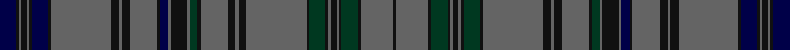

In pattern [BKBKBKBKBKBKBKBBKBGKBKBKBKGKBKBKGKBK](/stripes/bkbkbkbkbkbkbkbbkbgkbkbkbkgkbkbkgkbk/).

This was sourced from register-of-tartans.  It is a [36 stripe tartan](/stripes/stripes36/).

Original link https://www.tartanregister.gov.uk/tartanDetails.aspx?ref=11055

## Register references

External register numbers recorded for this tartan.

- Scottish Register of Tartans: [11055](https://www.tartanregister.gov.uk/tartanDetails.aspx?ref=11055)

## Thread count
DB/12 K2 N2 K4 N2 K2 DB12 K2 N44 K6 N2 K6 N20 K2 DB6 N2 K12 N2 DG6 K2 N20 K6 N2 K6 N44 K2 DG12 K2 N2 K4 N2 K2 DG12 K2 N24 K/2

## Palette
Each colour and the base-6 reference it is a variant of.

| Colour | Shade | Base |
|---|---|---|
| DB | <code style="background-color:#000048;">#000048</code> `oklch(18.2% 0.126 264.1)` <small>#000048</small> | B <code style="background-color:#2A418A;">#2A418A</code> |
| DG | <code style="background-color:#003820;">#003820</code> `oklch(30.0% 0.070 158.3)` <small>#003820</small> | G <code style="background-color:#006100;">#006100</code> |
| K | <code style="background-color:#101010;">#101010</code> `oklch(17.3% 0.000 89.9)` <small>#101010</small> | K <code style="background-color:#000000;">#000000</code> |
| N | <code style="background-color:#646464;">#646464</code> `oklch(50.3% 0.000 89.9)` <small>#646464</small> | B <code style="background-color:#2A418A;">#2A418A</code> |

## Nearest tartans

The nearest existing variants by ΔTartan distance.

1. [Weiss-Halliwell (Personal)](/setts/s36/dp6k1o1k2o1k1dp6k1o22k3o1k3o10k1dp3o1k6o1dg3k1o10k3o1k3o22k1dg6k1o1k2o1k1dg6k1o12k1~x2/) — ΔT 1.48
1. [Ettrick (Green) District Tartan Tartan Number: 2300. Earliest known date: 1971 Ettrick District is in the Borders of Scotland. See products available Copyright © Blair Urquhart, Comrie, 2015](/setts/s24/dt2dg2r1dg5r1dt6r2dg1ly1dg1r1dg1r1dg1t1dg1r2dt6dg20r1dg1r1dg1dt2~x2/) — ΔT 1.49
1. [Hebrides South Uist #2](/setts/s34/db19y2g3y2db2y20g1ly1y1g2y2db18y2g2y22g3w1y3~x2/) — ΔT 1.51
1. [Park Clan/Family Weavers Tartan Tartan Number: 2387. Earliest known date: September 1996 William D. Park wished to have a tartan for himself and family. Can be worn by those of the same name. See products available Copyright © Blair Urquhart, Comrie, 2015](/setts/s22/r3db16k16g4k2g2k2g34r4g3r2g3~x2/) — ΔT 1.70
1. [Hislop Hunting (Personal)](/setts/s34/db3k2db1k2db3lo1g3k2g2k6g2k6g2k2g24r2g4r2g24k2g2k6g2k6g2k2g3lo1db3k2db1k2db3g2~x2/) — ΔT 1.71
1. [Italian (Fashion)](/setts/s30/db24k2db24k1lb1k1k12r2k2r2k12k1lb1k1db24r2lb2g2db24k1lb1k1k12r2k2r2k12k1lb1k1~x2/) — ΔT 1.74
1. [Whitworth (2003)](/setts/s34/db60k2db2k2db5k15db5g20r2k3r2g20db5k15g5db20k2g4~x2/) — ΔT 1.85
1. [Granton](/setts/s22/o3k2o4n15k2lo2k2lo2k2o6k45o6k2lo2k2lo2k2n15o4k2o3n2~x2/) — ΔT 1.85
1. [Platt (Name)](/setts/s28/g16db6ly2g12r2g14db14ly1db12r2g6db24g6ly2r2~x2/) — ΔT 1.86
1. [Hood](/setts/s40/o2k2o8db8k2o2k2w2k11db8o46k8o2k8o2k8o2k8o2k8o2k8o2k8o2k8o2k8o46db8k11w2k2o2k2db8o8k2o2w2~x2/) — ΔT 1.88

## Neighbour map

Every grey dot is one of 14299 variants placed by the first two principal components of the ΔTartan feature space (44% of its variance). Red is this tartan; blue dots are its nearest — click one to open its page.

<svg viewBox="0 0 640 380" role="img" style="max-width:100%;height:auto;border:1px solid #e0e0e0;border-radius:4px;display:block" xmlns="http://www.w3.org/2000/svg"><image href="/nn/cloud.v1.png" width="640" height="380"/><a href="/setts/s36/dp6k1o1k2o1k1dp6k1o22k3o1k3o10k1dp3o1k6o1dg3k1o10k3o1k3o22k1dg6k1o1k2o1k1dg6k1o12k1~x2/"><circle cx="321.0" cy="76.3" r="4" fill="#3465a4"><title>Weiss-Halliwell (Personal)</title></circle></a><a href="/setts/s24/dt2dg2r1dg5r1dt6r2dg1ly1dg1r1dg1r1dg1t1dg1r2dt6dg20r1dg1r1dg1dt2~x2/"><circle cx="354.2" cy="103.3" r="4" fill="#3465a4"><title>Ettrick (Green) District Tartan Tartan Number: 2300. Earliest known date: 1971 Ettrick District is in the Borders of Scotland. See products available Copyright © Blair Urquhart, Comrie, 2015</title></circle></a><a href="/setts/s34/db19y2g3y2db2y20g1ly1y1g2y2db18y2g2y22g3w1y3~x2/"><circle cx="337.5" cy="83.0" r="4" fill="#3465a4"><title>Hebrides South Uist #2</title></circle></a><a href="/setts/s22/r3db16k16g4k2g2k2g34r4g3r2g3~x2/"><circle cx="293.8" cy="130.2" r="4" fill="#3465a4"><title>Park Clan/Family Weavers Tartan Tartan Number: 2387. Earliest known date: September 1996 William D. Park wished to have a tartan for himself and family. Can be worn by those of the same name. See products available Copyright © Blair Urquhart, Comrie, 2015</title></circle></a><a href="/setts/s34/db3k2db1k2db3lo1g3k2g2k6g2k6g2k2g24r2g4r2g24k2g2k6g2k6g2k2g3lo1db3k2db1k2db3g2~x2/"><circle cx="321.2" cy="83.4" r="4" fill="#3465a4"><title>Hislop Hunting (Personal)</title></circle></a><a href="/setts/s30/db24k2db24k1lb1k1k12r2k2r2k12k1lb1k1db24r2lb2g2db24k1lb1k1k12r2k2r2k12k1lb1k1~x2/"><circle cx="354.6" cy="93.3" r="4" fill="#3465a4"><title>Italian (Fashion)</title></circle></a><a href="/setts/s34/db60k2db2k2db5k15db5g20r2k3r2g20db5k15g5db20k2g4~x2/"><circle cx="259.4" cy="80.9" r="4" fill="#3465a4"><title>Whitworth (2003)</title></circle></a><a href="/setts/s22/o3k2o4n15k2lo2k2lo2k2o6k45o6k2lo2k2lo2k2n15o4k2o3n2~x2/"><circle cx="300.0" cy="87.6" r="4" fill="#3465a4"><title>Granton</title></circle></a><a href="/setts/s28/g16db6ly2g12r2g14db14ly1db12r2g6db24g6ly2r2~x2/"><circle cx="300.6" cy="131.8" r="4" fill="#3465a4"><title>Platt (Name)</title></circle></a><a href="/setts/s40/o2k2o8db8k2o2k2w2k11db8o46k8o2k8o2k8o2k8o2k8o2k8o2k8o2k8o2k8o46db8k11w2k2o2k2db8o8k2o2w2~x2/"><circle cx="277.4" cy="62.9" r="4" fill="#3465a4"><title>Hood</title></circle></a><circle cx="355.1" cy="102.1" r="5" fill="#c00000"/></svg>

ID: /setts/s36/db6k1n1k2n1k1db6k1n22k3n1k3n10k1db3n1k6n1dg3k1n10k3n1k3n22k1dg6k1n1k2n1k1dg6k1n12k1~x2/
