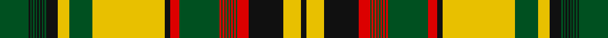

In pattern [GKGKGKGKGKGKGKYGYKRGRGRGRGRGRGRGRKYK](/stripes/gkgkgkgkgkgkgkygykrgrgrgrgrgrgrgrkyk/).

This was sourced from register-of-tartans.  It is a [36 stripe tartan](/stripes/stripes36/).

Original link https://www.tartanregister.gov.uk/tartanDetails.aspx?ref=3111

## Register references

External register numbers recorded for this tartan.

- Scottish Register of Tartans: [3111](https://www.tartanregister.gov.uk/tartanDetails.aspx?ref=3111)
- Scottish Tartans World Register: 2026

## Thread count
G/20 K1 G1 K1 G1 K1 G1 K1 G1 K1 G1 K1 G1 K8 Y8 G16 Y50 K4 R6 G28 R1 G1 R1 G1 R1 G1 R1 G1 R1 G1 R1 G1 R8 K24 Y12 K/4

## Palette
Each colour and the base-6 reference it is a variant of.

| Colour | Shade | Base |
|---|---|---|
| G | <code style="background-color:#005020;">#005020</code> `oklch(37.7% 0.105 149.6)` <small>#005020</small> | G <code style="background-color:#006100;">#006100</code> |
| K | <code style="background-color:#101010;">#101010</code> `oklch(17.3% 0.000 89.9)` <small>#101010</small> | K <code style="background-color:#000000;">#000000</code> |
| R | <code style="background-color:#DC0000;">#DC0000</code> `oklch(56.2% 0.230 29.2)` <small>#DC0000</small> | R <code style="background-color:#CC0000;">#CC0000</code> |
| Y | <code style="background-color:#E8C000;">#E8C000</code> `oklch(81.9% 0.168 93.7)` <small>#E8C000</small> | Y <code style="background-color:#F2BF00;">#F2BF00</code> |

## Nearest tartans

The nearest existing variants by ΔTartan distance, with this tartan at the top so the swatches line up against it.

ΔTartan

Tartan

Sett

—

<a href="/ttd/edit/#slug=dg20k1dg1k1dg1k1dg1k1dg1k1dg1k1dg1k8ly8dg16ly50k4r6dg28r1dg1r1dg1r1dg1r1dg1r1dg1r1dg1r8k24ly12k4">New Brunswick (PIK Mills, Toronto)</a> <a class="nn-out" href="/setts/s36/dg20k1dg1k1dg1k1dg1k1dg1k1dg1k1dg1k8ly8dg16ly50k4r6dg28r1dg1r1dg1r1dg1r1dg1r1dg1r1dg1r8k24ly12k4/" title="open its dictionary page">↗</a>

0.65

<a href="/ttd/edit/#slug=g20k1g1k1g1k1g1k1g1k1g1k1g1k8ly8g16ly50k4r6g28r1g1r1g1r1g1r1g1r1g1r1g1r8k24ly12k4">New Brunswick</a> <a class="nn-out" href="/setts/s36/g20k1g1k1g1k1g1k1g1k1g1k1g1k8ly8g16ly50k4r6g28r1g1r1g1r1g1r1g1r1g1r1g1r8k24ly12k4/" title="open its dictionary page">↗</a>

1.11

<a href="/ttd/edit/#slug=ly50dg16ly8k8dg1k1dg1k1dg1k1dg1k1dg1k1dg1k1dg20k40ly12k24r8dg1r1dg1r1dg1r1dg1r1dg1r1dg1r1dg28r6k4">New Brunswick (CIDD 28101)</a> <a class="nn-out" href="/setts/s36/ly50dg16ly8k8dg1k1dg1k1dg1k1dg1k1dg1k1dg1k1dg20k40ly12k24r8dg1r1dg1r1dg1r1dg1r1dg1r1dg1r1dg28r6k4/" title="open its dictionary page">↗</a>

1.30

<a href="/ttd/edit/#slug=k50lo16k8dy8lo1dy1lo1dy1lo1dy1lo1dy1lo1dy1lo1dy1lo20dy40k12dy24dg8lo1dg1lo1dg1lo1dg1lo1dg1lo1dg1lo1dg1lo28dg6dy4">Alberta (Commemorative)</a> <a class="nn-out" href="/setts/s36/k50lo16k8dy8lo1dy1lo1dy1lo1dy1lo1dy1lo1dy1lo1dy1lo20dy40k12dy24dg8lo1dg1lo1dg1lo1dg1lo1dg1lo1dg1lo1dg1lo28dg6dy4/" title="open its dictionary page">↗</a>

1.31

<a href="/ttd/edit/#slug=k50g16k8w8g1w1g1w1g1w1g1w1g1w1g1w1g20w40k12w24ly8g1ly1g1ly1g1ly1g1ly1g1ly1g1ly1g28ly6w4">Saskatchewan (Commemorative)</a> <a class="nn-out" href="/setts/s36/k50g16k8w8g1w1g1w1g1w1g1w1g1w1g1w1g20w40k12w24ly8g1ly1g1ly1g1ly1g1ly1g1ly1g1ly1g28ly6w4/" title="open its dictionary page">↗</a>

1.36

<a href="/ttd/edit/#slug=k50lo16k8dg8lo1dg1lo1dg1lo1dg1lo1dg1lo1dg1lo1dg1lo20dg40k12dg24g8lo1g1lo1g1lo1g1lo1g1lo1g1lo1g1lo28g6dg4">Nova Scotia (Commemorative)</a> <a class="nn-out" href="/setts/s36/k50lo16k8dg8lo1dg1lo1dg1lo1dg1lo1dg1lo1dg1lo1dg1lo20dg40k12dg24g8lo1g1lo1g1lo1g1lo1g1lo1g1lo1g1lo28g6dg4/" title="open its dictionary page">↗</a>

1.39

<a href="/ttd/edit/#slug=k50lo16k8dy8lo1dy1lo1dy1lo1dy1lo1dy1lo1dy1lo1dy1lo20dy40k12dy24r8lo1r1lo1r1lo1r1lo1r1lo1r1lo1r1lo28r6dy4">Ontario (CIDD 28103) (Commemorative)</a> <a class="nn-out" href="/setts/s36/k50lo16k8dy8lo1dy1lo1dy1lo1dy1lo1dy1lo1dy1lo1dy1lo20dy40k12dy24r8lo1r1lo1r1lo1r1lo1r1lo1r1lo1r1lo28r6dy4/" title="open its dictionary page">↗</a>

1.68

<a href="/ttd/edit/#slug=r50lo16r8k8lo1k1lo1k1lo1k1lo1k1lo1k1lo1k1lo20k40r12k24dg8lo1dg1lo1dg1lo1dg1lo1dg1lo1dg1lo1dg1lo28dg6k4">Prince Edward Island (CIDD 28100)</a> <a class="nn-out" href="/setts/s36/r50lo16r8k8lo1k1lo1k1lo1k1lo1k1lo1k1lo1k1lo20k40r12k24dg8lo1dg1lo1dg1lo1dg1lo1dg1lo1dg1lo1dg1lo28dg6k4/" title="open its dictionary page">↗</a>

1.70

<a href="/ttd/edit/#slug=db50lo16db8dg8lo1dg1lo1dg1lo1dg1lo1dg1lo1dg1lo1dg1lo20dg40db12dg24g8lo1g1lo1g1lo1g1lo1g1lo1g1lo1g1lo28g6dg4">Nova Scotia (CIDD 20899)</a> <a class="nn-out" href="/setts/s36/db50lo16db8dg8lo1dg1lo1dg1lo1dg1lo1dg1lo1dg1lo1dg1lo20dg40db12dg24g8lo1g1lo1g1lo1g1lo1g1lo1g1lo1g1lo28g6dg4/" title="open its dictionary page">↗</a>

1.73

<a href="/ttd/edit/#slug=k50w16k8dg8w1dg1w1dg1w1dg1w1dg1w1dg1w1dg1w20dg40k12dg24g8w1g1w1g1w1g1w1g1w1g1w1g1w28g6dg4">British Columbia (Commemorative)</a> <a class="nn-out" href="/setts/s36/k50w16k8dg8w1dg1w1dg1w1dg1w1dg1w1dg1w1dg1w20dg40k12dg24g8w1g1w1g1w1g1w1g1w1g1w1g1w28g6dg4/" title="open its dictionary page">↗</a>

1.82

<a href="/ttd/edit/#slug=ly50lo16ly8dy8lo1dy1lo1dy1lo1dy1lo1dy1lo1dy1lo1dy1lo20dy40ly12dy24dg8lo1dg1lo1dg1lo1dg1lo1dg1lo1dg1lo1dg1lo28dg6dy4">Alberta (CIDD 28106)</a> <a class="nn-out" href="/setts/s36/ly50lo16ly8dy8lo1dy1lo1dy1lo1dy1lo1dy1lo1dy1lo1dy1lo20dy40ly12dy24dg8lo1dg1lo1dg1lo1dg1lo1dg1lo1dg1lo1dg1lo28dg6dy4/" title="open its dictionary page">↗</a>

## Neighbour map

Every grey dot is one of 14299 variants placed by the first two principal components of the ΔTartan feature space (44% of its variance). Red is this tartan; blue dots are its nearest — click one to open its page.

<svg viewBox="0 0 640 380" role="img" style="max-width:100%;height:auto;border:1px solid #e0e0e0;border-radius:4px;display:block" xmlns="http://www.w3.org/2000/svg"><image href="/nn/cloud.v1.png" width="640" height="380"/><a href="/setts/s36/g20k1g1k1g1k1g1k1g1k1g1k1g1k8ly8g16ly50k4r6g28r1g1r1g1r1g1r1g1r1g1r1g1r8k24ly12k4/"><circle cx="219.0" cy="14.0" r="4" fill="#3465a4"><title>New Brunswick</title></circle></a><a href="/setts/s36/ly50dg16ly8k8dg1k1dg1k1dg1k1dg1k1dg1k1dg1k1dg20k40ly12k24r8dg1r1dg1r1dg1r1dg1r1dg1r1dg1r1dg28r6k4/"><circle cx="226.2" cy="18.9" r="4" fill="#3465a4"><title>New Brunswick (CIDD 28101)</title></circle></a><a href="/setts/s36/k50lo16k8dy8lo1dy1lo1dy1lo1dy1lo1dy1lo1dy1lo1dy1lo20dy40k12dy24dg8lo1dg1lo1dg1lo1dg1lo1dg1lo1dg1lo1dg1lo28dg6dy4/"><circle cx="230.5" cy="18.7" r="4" fill="#3465a4"><title>Alberta (Commemorative)</title></circle></a><a href="/setts/s36/k50g16k8w8g1w1g1w1g1w1g1w1g1w1g1w1g20w40k12w24ly8g1ly1g1ly1g1ly1g1ly1g1ly1g1ly1g28ly6w4/"><circle cx="195.3" cy="14.0" r="4" fill="#3465a4"><title>Saskatchewan (Commemorative)</title></circle></a><a href="/setts/s36/k50lo16k8dg8lo1dg1lo1dg1lo1dg1lo1dg1lo1dg1lo1dg1lo20dg40k12dg24g8lo1g1lo1g1lo1g1lo1g1lo1g1lo1g1lo28g6dg4/"><circle cx="221.7" cy="21.6" r="4" fill="#3465a4"><title>Nova Scotia (Commemorative)</title></circle></a><a href="/setts/s36/k50lo16k8dy8lo1dy1lo1dy1lo1dy1lo1dy1lo1dy1lo1dy1lo20dy40k12dy24r8lo1r1lo1r1lo1r1lo1r1lo1r1lo1r1lo28r6dy4/"><circle cx="230.8" cy="14.0" r="4" fill="#3465a4"><title>Ontario (CIDD 28103) (Commemorative)</title></circle></a><a href="/setts/s36/r50lo16r8k8lo1k1lo1k1lo1k1lo1k1lo1k1lo1k1lo20k40r12k24dg8lo1dg1lo1dg1lo1dg1lo1dg1lo1dg1lo1dg1lo28dg6k4/"><circle cx="244.6" cy="14.0" r="4" fill="#3465a4"><title>Prince Edward Island (CIDD 28100)</title></circle></a><a href="/setts/s36/db50lo16db8dg8lo1dg1lo1dg1lo1dg1lo1dg1lo1dg1lo1dg1lo20dg40db12dg24g8lo1g1lo1g1lo1g1lo1g1lo1g1lo1g1lo28g6dg4/"><circle cx="246.7" cy="31.3" r="4" fill="#3465a4"><title>Nova Scotia (CIDD 20899)</title></circle></a><a href="/setts/s36/k50w16k8dg8w1dg1w1dg1w1dg1w1dg1w1dg1w1dg1w20dg40k12dg24g8w1g1w1g1w1g1w1g1w1g1w1g1w28g6dg4/"><circle cx="204.1" cy="14.0" r="4" fill="#3465a4"><title>British Columbia (Commemorative)</title></circle></a><a href="/setts/s36/ly50lo16ly8dy8lo1dy1lo1dy1lo1dy1lo1dy1lo1dy1lo1dy1lo20dy40ly12dy24dg8lo1dg1lo1dg1lo1dg1lo1dg1lo1dg1lo1dg1lo28dg6dy4/"><circle cx="263.0" cy="26.5" r="4" fill="#3465a4"><title>Alberta (CIDD 28106)</title></circle></a><circle cx="231.6" cy="14.0" r="5" fill="#c00000"/></svg>

ID: /setts/s36/dg20k1dg1k1dg1k1dg1k1dg1k1dg1k1dg1k8ly8dg16ly50k4r6dg28r1dg1r1dg1r1dg1r1dg1r1dg1r1dg1r8k24ly12k4/
