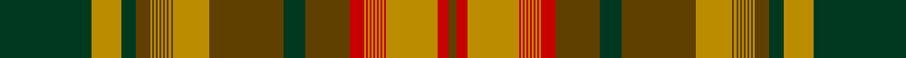

In pattern [GRYRYRYRYRYRYRYRGGGYGYGYGYGYGYGYGGYG](/stripes/gryryryryryryryrgggygygygygygygyggyg/).

This was sourced from register-of-tartans.  It is a [36 stripe tartan](/stripes/stripes36/).

Original link https://www.tartanregister.gov.uk/tartanDetails.aspx?ref=3254

## Register references

External register numbers recorded for this tartan.

- Scottish Register of Tartans: [3254](https://www.tartanregister.gov.uk/tartanDetails.aspx?ref=3254)
- Scottish Tartans Authority (ITI): 2038
- Scottish Tartans World Register: 2038

## Thread count
DG/50 DY16 DG8 T8 DY1 T1 DY1 T1 DY1 T1 DY1 T1 DY1 T1 DY1 T1 DY20 T40 DG12 T24 R8 DY1 R1 DY1 R1 DY1 R1 DY1 R1 DY1 R1 DY1 R1 DY28 R6 T/4

## Palette
Each colour and the base-6 reference it is a variant of.

| Colour | Shade | Base |
|---|---|---|
| DB | <code style="background-color:#2C2C80;">#2C2C80</code> `oklch(35.0% 0.138 276.6)` <small>#2C2C80</small> | B <code style="background-color:#2A418A;">#2A418A</code> |
| DG | <code style="background-color:#003820;">#003820</code> `oklch(30.0% 0.070 158.3)` <small>#003820</small> | G <code style="background-color:#006100;">#006100</code> |
| DR | <code style="background-color:#441800;">#441800</code> `oklch(27.3% 0.076 46.3)` <small>#441800</small> | B <code style="background-color:#2A418A;">#2A418A</code> |
| DY | <code style="background-color:#BC8C00;">#BC8C00</code> `oklch(66.8% 0.137 84.1)` <small>#BC8C00</small> | Y <code style="background-color:#F2BF00;">#F2BF00</code> |
| G | <code style="background-color:#289C18;">#289C18</code> `oklch(60.6% 0.191 141.6)` <small>#289C18</small> | G <code style="background-color:#006100;">#006100</code> |
| Ga | <code style="background-color:#006818;">#006818</code> `oklch(45.0% 0.142 145.0)` <small>#006818</small> | G <code style="background-color:#006100;">#006100</code> |
| K | <code style="background-color:#101010;">#101010</code> `oklch(17.3% 0.000 89.9)` <small>#101010</small> | K <code style="background-color:#000000;">#000000</code> |
| LG | <code style="background-color:#C4BC68;">#C4BC68</code> `oklch(78.4% 0.107 103.7)` <small>#C4BC68</small> | Y <code style="background-color:#F2BF00;">#F2BF00</code> |
| LN | <code style="background-color:#E0E0E0;">#E0E0E0</code> `oklch(90.7% 0.000 89.9)` <small>#E0E0E0</small> | W <code style="background-color:#F7F7F7;">#F7F7F7</code> |
| R | <code style="background-color:#C80000;">#C80000</code> `oklch(52.3% 0.215 29.2)` <small>#C80000</small> | R <code style="background-color:#CC0000;">#CC0000</code> |
| T | <code style="background-color:#604000;">#604000</code> `oklch(39.8% 0.083 76.8)` <small>#604000</small> | G <code style="background-color:#006100;">#006100</code> |

## Nearest tartans

The nearest existing variants by ΔTartan distance.

1. [Newfoundland (CIDD 28098)](/setts/s36/g50r16g8do8r1do1r1do1r1do1r1do1r1do1r1do1r20do40g12do24lo8r1lo1r1lo1r1lo1r1lo1r1lo1r1lo1r28lo6do4/) — ΔT 0.88
1. [Alberta (CIDD 28106)](/setts/s36/ly50lo16ly8dy8lo1dy1lo1dy1lo1dy1lo1dy1lo1dy1lo1dy1lo20dy40ly12dy24dg8lo1dg1lo1dg1lo1dg1lo1dg1lo1dg1lo1dg1lo28dg6dy4/) — ΔT 1.14
1. [Not Specified](/setts/s26/r3g50r3g1r3t3r3t45r3t3r50t3r3t3r50t3r3t45r3t3r3g1r3g50r3t3~x2/) — ΔT 1.69
1. [Nova Scotia (CIDD 20899)](/setts/s36/db50lo16db8dg8lo1dg1lo1dg1lo1dg1lo1dg1lo1dg1lo1dg1lo20dg40db12dg24g8lo1g1lo1g1lo1g1lo1g1lo1g1lo1g1lo28g6dg4/) — ΔT 1.79
1. [Prince Edward Island (CIDD 28100)](/setts/s36/r50lo16r8k8lo1k1lo1k1lo1k1lo1k1lo1k1lo1k1lo20k40r12k24dg8lo1dg1lo1dg1lo1dg1lo1dg1lo1dg1lo1dg1lo28dg6k4/) — ΔT 1.83
1. [Grant](/setts/s29/r10db1r1db1r72t1r1db20r4g1r4g84r1db2r10db1r1g84r4g1r4db20r2t1r72db2r2db1r4~x2/) — ΔT 1.87
1. [MacDougal 2](/setts/s20/t1r12r4g72r8g4r8db18r12r4r12g18r18g18r8db4r72r6r4t1~x2/) — ΔT 2.01
1. [New Brunswick (PIK Mills, Toronto)](/setts/s36/dg20k1dg1k1dg1k1dg1k1dg1k1dg1k1dg1k8ly8dg16ly50k4r6dg28r1dg1r1dg1r1dg1r1dg1r1dg1r1dg1r8k24ly12k4/) — ΔT 2.07
1. [Alberta (Commemorative)](/setts/s36/k50lo16k8dy8lo1dy1lo1dy1lo1dy1lo1dy1lo1dy1lo1dy1lo20dy40k12dy24dg8lo1dg1lo1dg1lo1dg1lo1dg1lo1dg1lo1dg1lo28dg6dy4/) — ΔT 2.09
1. [New Brunswick (CIDD 28101)](/setts/s36/ly50dg16ly8k8dg1k1dg1k1dg1k1dg1k1dg1k1dg1k1dg20k40ly12k24r8dg1r1dg1r1dg1r1dg1r1dg1r1dg1r1dg28r6k4/) — ΔT 2.10

## Neighbour map

Every grey dot is one of 14299 variants placed by the first two principal components of the ΔTartan feature space (44% of its variance). Red is this tartan; blue dots are its nearest — click one to open its page.

<svg viewBox="0 0 640 380" role="img" style="max-width:100%;height:auto;border:1px solid #e0e0e0;border-radius:4px;display:block" xmlns="http://www.w3.org/2000/svg"><image href="/nn/cloud.v1.png" width="640" height="380"/><a href="/setts/s36/g50r16g8do8r1do1r1do1r1do1r1do1r1do1r1do1r20do40g12do24lo8r1lo1r1lo1r1lo1r1lo1r1lo1r1lo1r28lo6do4/"><circle cx="279.5" cy="32.8" r="4" fill="#3465a4"><title>Newfoundland (CIDD 28098)</title></circle></a><a href="/setts/s36/ly50lo16ly8dy8lo1dy1lo1dy1lo1dy1lo1dy1lo1dy1lo1dy1lo20dy40ly12dy24dg8lo1dg1lo1dg1lo1dg1lo1dg1lo1dg1lo1dg1lo28dg6dy4/"><circle cx="263.0" cy="26.5" r="4" fill="#3465a4"><title>Alberta (CIDD 28106)</title></circle></a><a href="/setts/s26/r3g50r3g1r3t3r3t45r3t3r50t3r3t3r50t3r3t45r3t3r3g1r3g50r3t3~x2/"><circle cx="327.2" cy="73.6" r="4" fill="#3465a4"><title>Not Specified</title></circle></a><a href="/setts/s36/db50lo16db8dg8lo1dg1lo1dg1lo1dg1lo1dg1lo1dg1lo1dg1lo20dg40db12dg24g8lo1g1lo1g1lo1g1lo1g1lo1g1lo1g1lo28g6dg4/"><circle cx="246.7" cy="31.3" r="4" fill="#3465a4"><title>Nova Scotia (CIDD 20899)</title></circle></a><a href="/setts/s36/r50lo16r8k8lo1k1lo1k1lo1k1lo1k1lo1k1lo1k1lo20k40r12k24dg8lo1dg1lo1dg1lo1dg1lo1dg1lo1dg1lo1dg1lo28dg6k4/"><circle cx="244.6" cy="14.0" r="4" fill="#3465a4"><title>Prince Edward Island (CIDD 28100)</title></circle></a><a href="/setts/s29/r10db1r1db1r72t1r1db20r4g1r4g84r1db2r10db1r1g84r4g1r4db20r2t1r72db2r2db1r4~x2/"><circle cx="369.7" cy="36.1" r="4" fill="#3465a4"><title>Grant</title></circle></a><a href="/setts/s20/t1r12r4g72r8g4r8db18r12r4r12g18r18g18r8db4r72r6r4t1~x2/"><circle cx="302.4" cy="59.6" r="4" fill="#3465a4"><title>MacDougal 2</title></circle></a><a href="/setts/s36/dg20k1dg1k1dg1k1dg1k1dg1k1dg1k1dg1k8ly8dg16ly50k4r6dg28r1dg1r1dg1r1dg1r1dg1r1dg1r1dg1r8k24ly12k4/"><circle cx="231.6" cy="14.0" r="4" fill="#3465a4"><title>New Brunswick (PIK Mills, Toronto)</title></circle></a><a href="/setts/s36/k50lo16k8dy8lo1dy1lo1dy1lo1dy1lo1dy1lo1dy1lo1dy1lo20dy40k12dy24dg8lo1dg1lo1dg1lo1dg1lo1dg1lo1dg1lo1dg1lo28dg6dy4/"><circle cx="230.5" cy="18.7" r="4" fill="#3465a4"><title>Alberta (Commemorative)</title></circle></a><a href="/setts/s36/ly50dg16ly8k8dg1k1dg1k1dg1k1dg1k1dg1k1dg1k1dg20k40ly12k24r8dg1r1dg1r1dg1r1dg1r1dg1r1dg1r1dg28r6k4/"><circle cx="226.2" cy="18.9" r="4" fill="#3465a4"><title>New Brunswick (CIDD 28101)</title></circle></a><circle cx="280.0" cy="39.4" r="5" fill="#c00000"/></svg>

ID: /setts/s36/dg50lo16dg8dy8lo1dy1lo1dy1lo1dy1lo1dy1lo1dy1lo1dy1lo20dy40dg12dy24r8lo1r1lo1r1lo1r1lo1r1lo1r1lo1r1lo28r6dy4/
