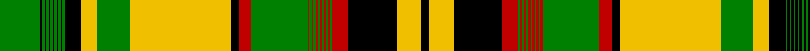

This page is one **sett** — a single exact thread-count. It belongs to the [tartan](/tartans/g20k1g1k1g1k1g1k1g1k1g1k1g1k8ly8g16ly50k4r6g28r1g1r1g1r1g1r1g1r1g1r1g1r8k24ly12k4/)
(the same proportion at any scale), whose colour order is pattern [GKGKGKGKGKGKGKYGYKRGRGRGRGRGRGRGRKYK](/stripes/gkgkgkgkgkgkgkygykrgrgrgrgrgrgrgrkyk/).

Sourced from weddslist.  It is a [36 stripe tartan](/stripes/stripes36/).

Original link http://www.weddslist.com/cgi-bin/tartans/pg.pl?source=sts

## Thread count
G/20 K1 G1 K1 G1 K1 G1 K1 G1 K1 G1 K1 G1 K8 Y8 G16 Y50 K4 R6 G28 R1 G1 R1 G1 R1 G1 R1 G1 R1 G1 R1 G1 R8 K24 Y12 K/4

## Palette

Palette: <strong>Ingles Buchan</strong> <small style="color:#888">(1 of 4 colours)</small>
<table><thead><tr><th>Colour</th><th>Threads</th><th>Shade</th><th>Base</th><th>OKLCh</th></tr></thead><tbody><tr><td>G/</td><td style="text-align:right;font-variant-numeric:tabular-nums">20</td><td><code style="background-color:#008000;">#008000</code> <small style="color:#888">#008000</small></td><td>G <code style="background-color:#006100;">#006100</code></td><td><small style="color:#888">oklch(52.0% 0.177 142.5)</small></td></tr><tr><td>K</td><td style="text-align:right;font-variant-numeric:tabular-nums">1</td><td><code style="background-color:#000000;">#000000</code> <small style="color:#888">#000000</small></td><td>K <code style="background-color:#000000;">#000000</code></td><td><small style="color:#888">oklch(0.0% 0.000 0.0)</small></td></tr><tr><td>G</td><td style="text-align:right;font-variant-numeric:tabular-nums">1</td><td><code style="background-color:#008000;">#008000</code> <small style="color:#888">#008000</small></td><td>G <code style="background-color:#006100;">#006100</code></td><td><small style="color:#888">oklch(52.0% 0.177 142.5)</small></td></tr><tr><td>K</td><td style="text-align:right;font-variant-numeric:tabular-nums">1</td><td><code style="background-color:#000000;">#000000</code> <small style="color:#888">#000000</small></td><td>K <code style="background-color:#000000;">#000000</code></td><td><small style="color:#888">oklch(0.0% 0.000 0.0)</small></td></tr><tr><td>G</td><td style="text-align:right;font-variant-numeric:tabular-nums">1</td><td><code style="background-color:#008000;">#008000</code> <small style="color:#888">#008000</small></td><td>G <code style="background-color:#006100;">#006100</code></td><td><small style="color:#888">oklch(52.0% 0.177 142.5)</small></td></tr><tr><td>K</td><td style="text-align:right;font-variant-numeric:tabular-nums">1</td><td><code style="background-color:#000000;">#000000</code> <small style="color:#888">#000000</small></td><td>K <code style="background-color:#000000;">#000000</code></td><td><small style="color:#888">oklch(0.0% 0.000 0.0)</small></td></tr><tr><td>G</td><td style="text-align:right;font-variant-numeric:tabular-nums">1</td><td><code style="background-color:#008000;">#008000</code> <small style="color:#888">#008000</small></td><td>G <code style="background-color:#006100;">#006100</code></td><td><small style="color:#888">oklch(52.0% 0.177 142.5)</small></td></tr><tr><td>K</td><td style="text-align:right;font-variant-numeric:tabular-nums">1</td><td><code style="background-color:#000000;">#000000</code> <small style="color:#888">#000000</small></td><td>K <code style="background-color:#000000;">#000000</code></td><td><small style="color:#888">oklch(0.0% 0.000 0.0)</small></td></tr><tr><td>G</td><td style="text-align:right;font-variant-numeric:tabular-nums">1</td><td><code style="background-color:#008000;">#008000</code> <small style="color:#888">#008000</small></td><td>G <code style="background-color:#006100;">#006100</code></td><td><small style="color:#888">oklch(52.0% 0.177 142.5)</small></td></tr><tr><td>K</td><td style="text-align:right;font-variant-numeric:tabular-nums">1</td><td><code style="background-color:#000000;">#000000</code> <small style="color:#888">#000000</small></td><td>K <code style="background-color:#000000;">#000000</code></td><td><small style="color:#888">oklch(0.0% 0.000 0.0)</small></td></tr><tr><td>G</td><td style="text-align:right;font-variant-numeric:tabular-nums">1</td><td><code style="background-color:#008000;">#008000</code> <small style="color:#888">#008000</small></td><td>G <code style="background-color:#006100;">#006100</code></td><td><small style="color:#888">oklch(52.0% 0.177 142.5)</small></td></tr><tr><td>K</td><td style="text-align:right;font-variant-numeric:tabular-nums">1</td><td><code style="background-color:#000000;">#000000</code> <small style="color:#888">#000000</small></td><td>K <code style="background-color:#000000;">#000000</code></td><td><small style="color:#888">oklch(0.0% 0.000 0.0)</small></td></tr><tr><td>G</td><td style="text-align:right;font-variant-numeric:tabular-nums">1</td><td><code style="background-color:#008000;">#008000</code> <small style="color:#888">#008000</small></td><td>G <code style="background-color:#006100;">#006100</code></td><td><small style="color:#888">oklch(52.0% 0.177 142.5)</small></td></tr><tr><td>K</td><td style="text-align:right;font-variant-numeric:tabular-nums">8</td><td><code style="background-color:#000000;">#000000</code> <small style="color:#888">#000000</small></td><td>K <code style="background-color:#000000;">#000000</code></td><td><small style="color:#888">oklch(0.0% 0.000 0.0)</small></td></tr><tr><td>Y</td><td style="text-align:right;font-variant-numeric:tabular-nums">8</td><td><code style="background-color:#F0C000;">#F0C000</code> <small style="color:#888">#F0C000</small></td><td>Y <code style="background-color:#F2BF00;">#F2BF00</code></td><td><small style="color:#888">oklch(82.7% 0.169 90.5)</small></td></tr><tr><td>G</td><td style="text-align:right;font-variant-numeric:tabular-nums">16</td><td><code style="background-color:#008000;">#008000</code> <small style="color:#888">#008000</small></td><td>G <code style="background-color:#006100;">#006100</code></td><td><small style="color:#888">oklch(52.0% 0.177 142.5)</small></td></tr><tr><td>Y</td><td style="text-align:right;font-variant-numeric:tabular-nums">50</td><td><code style="background-color:#F0C000;">#F0C000</code> <small style="color:#888">#F0C000</small></td><td>Y <code style="background-color:#F2BF00;">#F2BF00</code></td><td><small style="color:#888">oklch(82.7% 0.169 90.5)</small></td></tr><tr><td>K</td><td style="text-align:right;font-variant-numeric:tabular-nums">4</td><td><code style="background-color:#000000;">#000000</code> <small style="color:#888">#000000</small></td><td>K <code style="background-color:#000000;">#000000</code></td><td><small style="color:#888">oklch(0.0% 0.000 0.0)</small></td></tr><tr><td>R</td><td style="text-align:right;font-variant-numeric:tabular-nums">6</td><td><code style="background-color:#C00000;">#C00000</code> <small style="color:#888">#C00000</small></td><td>R <code style="background-color:#CC0000;">#CC0000</code></td><td><small style="color:#888">oklch(50.7% 0.208 29.2)</small></td></tr><tr><td>G</td><td style="text-align:right;font-variant-numeric:tabular-nums">28</td><td><code style="background-color:#008000;">#008000</code> <small style="color:#888">#008000</small></td><td>G <code style="background-color:#006100;">#006100</code></td><td><small style="color:#888">oklch(52.0% 0.177 142.5)</small></td></tr><tr><td>R</td><td style="text-align:right;font-variant-numeric:tabular-nums">1</td><td><code style="background-color:#C00000;">#C00000</code> <small style="color:#888">#C00000</small></td><td>R <code style="background-color:#CC0000;">#CC0000</code></td><td><small style="color:#888">oklch(50.7% 0.208 29.2)</small></td></tr><tr><td>G</td><td style="text-align:right;font-variant-numeric:tabular-nums">1</td><td><code style="background-color:#008000;">#008000</code> <small style="color:#888">#008000</small></td><td>G <code style="background-color:#006100;">#006100</code></td><td><small style="color:#888">oklch(52.0% 0.177 142.5)</small></td></tr><tr><td>R</td><td style="text-align:right;font-variant-numeric:tabular-nums">1</td><td><code style="background-color:#C00000;">#C00000</code> <small style="color:#888">#C00000</small></td><td>R <code style="background-color:#CC0000;">#CC0000</code></td><td><small style="color:#888">oklch(50.7% 0.208 29.2)</small></td></tr><tr><td>G</td><td style="text-align:right;font-variant-numeric:tabular-nums">1</td><td><code style="background-color:#008000;">#008000</code> <small style="color:#888">#008000</small></td><td>G <code style="background-color:#006100;">#006100</code></td><td><small style="color:#888">oklch(52.0% 0.177 142.5)</small></td></tr><tr><td>R</td><td style="text-align:right;font-variant-numeric:tabular-nums">1</td><td><code style="background-color:#C00000;">#C00000</code> <small style="color:#888">#C00000</small></td><td>R <code style="background-color:#CC0000;">#CC0000</code></td><td><small style="color:#888">oklch(50.7% 0.208 29.2)</small></td></tr><tr><td>G</td><td style="text-align:right;font-variant-numeric:tabular-nums">1</td><td><code style="background-color:#008000;">#008000</code> <small style="color:#888">#008000</small></td><td>G <code style="background-color:#006100;">#006100</code></td><td><small style="color:#888">oklch(52.0% 0.177 142.5)</small></td></tr><tr><td>R</td><td style="text-align:right;font-variant-numeric:tabular-nums">1</td><td><code style="background-color:#C00000;">#C00000</code> <small style="color:#888">#C00000</small></td><td>R <code style="background-color:#CC0000;">#CC0000</code></td><td><small style="color:#888">oklch(50.7% 0.208 29.2)</small></td></tr><tr><td>G</td><td style="text-align:right;font-variant-numeric:tabular-nums">1</td><td><code style="background-color:#008000;">#008000</code> <small style="color:#888">#008000</small></td><td>G <code style="background-color:#006100;">#006100</code></td><td><small style="color:#888">oklch(52.0% 0.177 142.5)</small></td></tr><tr><td>R</td><td style="text-align:right;font-variant-numeric:tabular-nums">1</td><td><code style="background-color:#C00000;">#C00000</code> <small style="color:#888">#C00000</small></td><td>R <code style="background-color:#CC0000;">#CC0000</code></td><td><small style="color:#888">oklch(50.7% 0.208 29.2)</small></td></tr><tr><td>G</td><td style="text-align:right;font-variant-numeric:tabular-nums">1</td><td><code style="background-color:#008000;">#008000</code> <small style="color:#888">#008000</small></td><td>G <code style="background-color:#006100;">#006100</code></td><td><small style="color:#888">oklch(52.0% 0.177 142.5)</small></td></tr><tr><td>R</td><td style="text-align:right;font-variant-numeric:tabular-nums">1</td><td><code style="background-color:#C00000;">#C00000</code> <small style="color:#888">#C00000</small></td><td>R <code style="background-color:#CC0000;">#CC0000</code></td><td><small style="color:#888">oklch(50.7% 0.208 29.2)</small></td></tr><tr><td>G</td><td style="text-align:right;font-variant-numeric:tabular-nums">1</td><td><code style="background-color:#008000;">#008000</code> <small style="color:#888">#008000</small></td><td>G <code style="background-color:#006100;">#006100</code></td><td><small style="color:#888">oklch(52.0% 0.177 142.5)</small></td></tr><tr><td>R</td><td style="text-align:right;font-variant-numeric:tabular-nums">8</td><td><code style="background-color:#C00000;">#C00000</code> <small style="color:#888">#C00000</small></td><td>R <code style="background-color:#CC0000;">#CC0000</code></td><td><small style="color:#888">oklch(50.7% 0.208 29.2)</small></td></tr><tr><td>K</td><td style="text-align:right;font-variant-numeric:tabular-nums">24</td><td><code style="background-color:#000000;">#000000</code> <small style="color:#888">#000000</small></td><td>K <code style="background-color:#000000;">#000000</code></td><td><small style="color:#888">oklch(0.0% 0.000 0.0)</small></td></tr><tr><td>Y</td><td style="text-align:right;font-variant-numeric:tabular-nums">12</td><td><code style="background-color:#F0C000;">#F0C000</code> <small style="color:#888">#F0C000</small></td><td>Y <code style="background-color:#F2BF00;">#F2BF00</code></td><td><small style="color:#888">oklch(82.7% 0.169 90.5)</small></td></tr><tr><td>K/</td><td style="text-align:right;font-variant-numeric:tabular-nums">4</td><td><code style="background-color:#000000;">#000000</code> <small style="color:#888">#000000</small></td><td>K <code style="background-color:#000000;">#000000</code></td><td><small style="color:#888">oklch(0.0% 0.000 0.0)</small></td></tr></tbody></table>

## Nearest tartans

The nearest existing variants by ΔTartan distance, with this tartan at the top so the swatches line up against it.

ΔTartan

Tartan

Sett

—

<a href="/ttd/edit/#slug=g20k1g1k1g1k1g1k1g1k1g1k1g1k8ly8g16ly50k4r6g28r1g1r1g1r1g1r1g1r1g1r1g1r8k24ly12k4">New Brunswick</a> <a class="nn-out" href="/setts/s36/g20k1g1k1g1k1g1k1g1k1g1k1g1k8ly8g16ly50k4r6g28r1g1r1g1r1g1r1g1r1g1r1g1r8k24ly12k4/" title="open its dictionary page">↗</a>

0.65

<a href="/ttd/edit/#slug=dg20k1dg1k1dg1k1dg1k1dg1k1dg1k1dg1k8ly8dg16ly50k4r6dg28r1dg1r1dg1r1dg1r1dg1r1dg1r1dg1r8k24ly12k4">New Brunswick (PIK Mills, Toronto)</a> <a class="nn-out" href="/setts/s36/dg20k1dg1k1dg1k1dg1k1dg1k1dg1k1dg1k8ly8dg16ly50k4r6dg28r1dg1r1dg1r1dg1r1dg1r1dg1r1dg1r8k24ly12k4/" title="open its dictionary page">↗</a>

1.35

<a href="/ttd/edit/#slug=k50g16k8w8g1w1g1w1g1w1g1w1g1w1g1w1g20w40k12w24ly8g1ly1g1ly1g1ly1g1ly1g1ly1g1ly1g28ly6w4">Saskatchewan (Commemorative)</a> <a class="nn-out" href="/setts/s36/k50g16k8w8g1w1g1w1g1w1g1w1g1w1g1w1g20w40k12w24ly8g1ly1g1ly1g1ly1g1ly1g1ly1g1ly1g28ly6w4/" title="open its dictionary page">↗</a>

1.61

<a href="/ttd/edit/#slug=ly50dg16ly8k8dg1k1dg1k1dg1k1dg1k1dg1k1dg1k1dg20k40ly12k24r8dg1r1dg1r1dg1r1dg1r1dg1r1dg1r1dg28r6k4">New Brunswick (CIDD 28101)</a> <a class="nn-out" href="/setts/s36/ly50dg16ly8k8dg1k1dg1k1dg1k1dg1k1dg1k1dg1k1dg20k40ly12k24r8dg1r1dg1r1dg1r1dg1r1dg1r1dg1r1dg28r6k4/" title="open its dictionary page">↗</a>

1.63

<a href="/ttd/edit/#slug=k50lo16k8dg8lo1dg1lo1dg1lo1dg1lo1dg1lo1dg1lo1dg1lo20dg40k12dg24g8lo1g1lo1g1lo1g1lo1g1lo1g1lo1g1lo28g6dg4">Nova Scotia (Commemorative)</a> <a class="nn-out" href="/setts/s36/k50lo16k8dg8lo1dg1lo1dg1lo1dg1lo1dg1lo1dg1lo1dg1lo20dg40k12dg24g8lo1g1lo1g1lo1g1lo1g1lo1g1lo1g1lo28g6dg4/" title="open its dictionary page">↗</a>

1.72

<a href="/ttd/edit/#slug=k50lo16k8dy8lo1dy1lo1dy1lo1dy1lo1dy1lo1dy1lo1dy1lo20dy40k12dy24dg8lo1dg1lo1dg1lo1dg1lo1dg1lo1dg1lo1dg1lo28dg6dy4">Alberta (Commemorative)</a> <a class="nn-out" href="/setts/s36/k50lo16k8dy8lo1dy1lo1dy1lo1dy1lo1dy1lo1dy1lo1dy1lo20dy40k12dy24dg8lo1dg1lo1dg1lo1dg1lo1dg1lo1dg1lo1dg1lo28dg6dy4/" title="open its dictionary page">↗</a>

1.79

<a href="/ttd/edit/#slug=db8k1db3k2db2k3db1k11ly2k4ly3k3ly4k2ly5k1ly55g4ly11g11w4g66k1g5g2g4k3g3k4g2k11ly15k2g4~x2">Unidentified</a> <a class="nn-out" href="/setts/s34/db8k1db3k2db2k3db1k11ly2k4ly3k3ly4k2ly5k1ly55g4ly11g11w4g66k1g5g2g4k3g3k4g2k11ly15k2g4~x2/" title="open its dictionary page">↗</a>

1.82

<a href="/ttd/edit/#slug=k50lo16k8dy8lo1dy1lo1dy1lo1dy1lo1dy1lo1dy1lo1dy1lo20dy40k12dy24r8lo1r1lo1r1lo1r1lo1r1lo1r1lo1r1lo28r6dy4">Ontario (CIDD 28103) (Commemorative)</a> <a class="nn-out" href="/setts/s36/k50lo16k8dy8lo1dy1lo1dy1lo1dy1lo1dy1lo1dy1lo1dy1lo20dy40k12dy24r8lo1r1lo1r1lo1r1lo1r1lo1r1lo1r1lo28r6dy4/" title="open its dictionary page">↗</a>

2.00

<a href="/ttd/edit/#slug=g14k2r2k2r2k2r2k2r2k2ly25g8r4k4ly3k1ly3k1ly4r10k2ly2~x2">New Brunswick</a> <a class="nn-out" href="/setts/s22/g14k2r2k2r2k2r2k2r2k2ly25g8r4k4ly3k1ly3k1ly4r10k2ly2~x2/" title="open its dictionary page">↗</a>

2.01

<a href="/ttd/edit/#slug=k50w16k8dg8w1dg1w1dg1w1dg1w1dg1w1dg1w1dg1w20dg40k12dg24g8w1g1w1g1w1g1w1g1w1g1w1g1w28g6dg4">British Columbia (Commemorative)</a> <a class="nn-out" href="/setts/s36/k50w16k8dg8w1dg1w1dg1w1dg1w1dg1w1dg1w1dg1w20dg40k12dg24g8w1g1w1g1w1g1w1g1w1g1w1g1w28g6dg4/" title="open its dictionary page">↗</a>

2.11

<a href="/ttd/edit/#slug=o2dg1o2dg1w1dg1w8k40o5dg40w10dg1w5k15dg1w7dg1w1dg1~x2">Shepherd, Derek (Modern)</a> <a class="nn-out" href="/setts/s19/o2dg1o2dg1w1dg1w8k40o5dg40w10dg1w5k15dg1w7dg1w1dg1~x2/" title="open its dictionary page">↗</a>

## Neighbour map

Every grey dot is one of 14359 variants placed by the first two principal components of the ΔTartan feature space (44% of its variance). Red is this tartan; blue dots are its nearest — click one to open its page.

<svg viewBox="0 0 640 380" role="img" style="max-width:100%;height:auto;border:1px solid #e0e0e0;border-radius:4px;display:block" xmlns="http://www.w3.org/2000/svg"><image href="/nn/cloud.v1.png" width="640" height="380"/><a href="/setts/s36/dg20k1dg1k1dg1k1dg1k1dg1k1dg1k1dg1k8ly8dg16ly50k4r6dg28r1dg1r1dg1r1dg1r1dg1r1dg1r1dg1r8k24ly12k4/"><circle cx="230.8" cy="14.0" r="4" fill="#3465a4"><title>New Brunswick (PIK Mills, Toronto)</title></circle></a><a href="/setts/s36/k50g16k8w8g1w1g1w1g1w1g1w1g1w1g1w1g20w40k12w24ly8g1ly1g1ly1g1ly1g1ly1g1ly1g1ly1g28ly6w4/"><circle cx="194.5" cy="14.0" r="4" fill="#3465a4"><title>Saskatchewan (Commemorative)</title></circle></a><a href="/setts/s36/ly50dg16ly8k8dg1k1dg1k1dg1k1dg1k1dg1k1dg1k1dg20k40ly12k24r8dg1r1dg1r1dg1r1dg1r1dg1r1dg1r1dg28r6k4/"><circle cx="225.6" cy="19.0" r="4" fill="#3465a4"><title>New Brunswick (CIDD 28101)</title></circle></a><a href="/setts/s36/k50lo16k8dg8lo1dg1lo1dg1lo1dg1lo1dg1lo1dg1lo1dg1lo20dg40k12dg24g8lo1g1lo1g1lo1g1lo1g1lo1g1lo1g1lo28g6dg4/"><circle cx="221.2" cy="21.7" r="4" fill="#3465a4"><title>Nova Scotia (Commemorative)</title></circle></a><a href="/setts/s36/k50lo16k8dy8lo1dy1lo1dy1lo1dy1lo1dy1lo1dy1lo1dy1lo20dy40k12dy24dg8lo1dg1lo1dg1lo1dg1lo1dg1lo1dg1lo1dg1lo28dg6dy4/"><circle cx="229.9" cy="18.7" r="4" fill="#3465a4"><title>Alberta (Commemorative)</title></circle></a><a href="/setts/s34/db8k1db3k2db2k3db1k11ly2k4ly3k3ly4k2ly5k1ly55g4ly11g11w4g66k1g5g2g4k3g3k4g2k11ly15k2g4~x2/"><circle cx="196.2" cy="14.0" r="4" fill="#3465a4"><title>Unidentified</title></circle></a><a href="/setts/s36/k50lo16k8dy8lo1dy1lo1dy1lo1dy1lo1dy1lo1dy1lo1dy1lo20dy40k12dy24r8lo1r1lo1r1lo1r1lo1r1lo1r1lo1r1lo28r6dy4/"><circle cx="230.1" cy="14.0" r="4" fill="#3465a4"><title>Ontario (CIDD 28103) (Commemorative)</title></circle></a><a href="/setts/s22/g14k2r2k2r2k2r2k2r2k2ly25g8r4k4ly3k1ly3k1ly4r10k2ly2~x2/"><circle cx="181.0" cy="66.0" r="4" fill="#3465a4"><title>New Brunswick</title></circle></a><a href="/setts/s36/k50w16k8dg8w1dg1w1dg1w1dg1w1dg1w1dg1w1dg1w20dg40k12dg24g8w1g1w1g1w1g1w1g1w1g1w1g1w28g6dg4/"><circle cx="203.6" cy="14.0" r="4" fill="#3465a4"><title>British Columbia (Commemorative)</title></circle></a><a href="/setts/s19/o2dg1o2dg1w1dg1w8k40o5dg40w10dg1w5k15dg1w7dg1w1dg1~x2/"><circle cx="236.6" cy="54.2" r="4" fill="#3465a4"><title>Shepherd, Derek (Modern)</title></circle></a><circle cx="218.2" cy="14.0" r="5" fill="#c00000"/></svg>

ID: /setts/s36/g20k1g1k1g1k1g1k1g1k1g1k1g1k8ly8g16ly50k4r6g28r1g1r1g1r1g1r1g1r1g1r1g1r8k24ly12k4/
