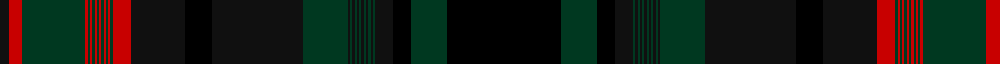

In pattern [KGKKGKGKGKGKGKGKGKKKRGRGRGRGRGRGRGRK](/patterns/kgkkgkgkgkgkgkgkgkkkrgrgrgrgrgrgrgrk/).

This was sourced from tartans-authority.  It is a [36 stripes tartan](/stripes/stripes36/).

Original link http://www.tartansauthority.com/tartan-ferret/display/7710/

## Thread count
K/8 R12 DG56 R2 DG2 R2 DG2 R2 DG2 R2 DG2 R2 DG2 R2 DG2 R16 K48 Ka24 K80 DG40 K2 DG2 K2 DG2 K2 DG2 K2 DG2 K2 DG2 K2 DG2 K16 Ka16 DG32 Ka/100

## Palette
Each colour and its ΔE from the base-6 reference it is a variant of.

| Colour | Shade | Base | ΔE (OKLab) |
|---|---|---|---|
| DG | <code style="background-color:#003820;">#003820</code> `#003820` | G <code style="background-color:#006100;">#006100</code> | 0.15 |
| K | <code style="background-color:#101010;">#101010</code> `#101010` | K <code style="background-color:#000000;">#000000</code> | 0.17 |
| Ka | <code style="background-color:#000000;">#000000</code> `#000000` | K <code style="background-color:#000000;">#000000</code> | 0.00 |
| R | <code style="background-color:#C80000;">#C80000</code> `#C80000` | R <code style="background-color:#CC0000;">#CC0000</code> | 0.01 |

## Nearest tartans

The nearest existing variants by ΔTartan distance.

1. [Quebec (Commemorative)](/setts/s36/k100b32k16ka16b2ka2b2ka2b2ka2b2ka2b2ka2b2ka2b40ka80k24ka48r16b2r2b2r2b2r2b2r2b2r2b2r2b56r12ka8-b2c2c80-k000000-ka101010-rc80000/) — ΔT 1.36
1. [Manitoba (Commemorative)](/setts/s36/k100b32k16ka16b2ka2b2ka2b2ka2b2ka2b2ka2b2ka2b40ka80k24ka48y16b2y2b2y2b2y2b2y2b2y2b2y2b56y12ka8-b2c2c80-k000000-ka101010-ybc8c00/) — ΔT 1.49
1. [Manitoba (CIDD 28104)](/setts/s36/g50b16g8k8b1k1b1k1b1k1b1k1b1k1b1k1b20k40g12k24y8b1y1b1y1b1y1b1y1b1y1b1y1b28y6k4-b2c2c80-g006818-k101010-ybc8c00/) — ΔT 1.63
1. [Alberta Trade Tartan Tartan Number: 1945. Earliest known date: pre 2003 From a Canadian pattern book. See products available Copyright © Blair Urquhart, Comrie, 2015](/setts/s36/g50k4ga6b28ga1b1ga1b1ga1b1ga1b1ga1b1ga1b1ga8k24g12k4b20k1b1k1b1k1b1k1b1k1b1k1b1k8g8b16-b2c2c80-g006818-ga604000-k101010/) — ΔT 1.63
1. [Canadian Centennial #3](/setts/s70/b32g16k16b2k2b2k2b2k2b2k2b2k2b2k2b40k8g24k48ga16b2ga2b2ga2b2ga2b2ga2b2ga2b2ga2b28ga12k8g104k8ga12b28ga2b2ga2b2ga2b2ga2b2ga2b2ga2b2ga16k48g24k8b40k2b2k2b2k2b2k2b2k2b2k2b2k16g16-b2c2c80-g006818-ga604000-h164bc8b881755e1c/) — ΔT 1.99
1. [Nova, Scotia](/setts/s36/b50g4ga6r28ga1r1ga1r1ga1r1ga1r1ga1r1ga1r1ga8g24b12g4r20g1r1g1r1g1r1g1r1g1r1g1r1g8b8r16-b304080-g003000-ga008000-r806050/) — ΔT 2.22
1. [Farquharson (Vestiarium Scoticum) or MacEwen/MacEwan](/setts/s28/k72g44k2r8k2g44k38b32k4b6k4b32k38g44k2y8k2g44k38b6k4b6k4b56k4b6k4b6-b2c4084-g005020-k101010-rdc0000-ye8c000/) — ΔT 2.27
1. [Alberta](/setts/s36/g50k4ga6b28ga1b1ga1b1ga1b1ga1b1ga1b1ga1b1ga8k24g12k4b20k1b1k1b1k1b1k1b1k1b1k1b1k8g8b16-b2c4084-g005020-ga503c14-k101010/) — ΔT 2.28
1. [Prince Edward Island (Commemorative)](/setts/s36/k100y32k16ka16y2ka2y2ka2y2ka2y2ka2y2ka2y2ka2y40ka80k24ka48g16y2g2y2g2y2g2y2g2y2g2y2g2y56g12ka8-g003820-k000000-ka101010-ybc8c00/) — ΔT 2.30
1. [Jardine Dress](/setts/s22/r26k2r6k2r6k20y2b44y2k6g64k3g64k6y2b44y2k20r6k2r6k2-b2c2c80-g005030-k101010-rc80000-yb8b8b8/) — ΔT 2.31

## Neighbour map

Every grey dot is one of 15726 variants placed by the first two principal components of the ΔTartan feature space (44% of its variance). Red is this tartan; blue dots are its nearest — click one to open its page.

<svg viewBox="0 0 640 380" role="img" style="max-width:100%;height:auto;border:1px solid #e0e0e0;border-radius:4px;display:block" xmlns="http://www.w3.org/2000/svg"><image href="/nn/cloud.v1.png" width="640" height="380"/><a href="/setts/s36/k100b32k16ka16b2ka2b2ka2b2ka2b2ka2b2ka2b2ka2b40ka80k24ka48r16b2r2b2r2b2r2b2r2b2r2b2r2b56r12ka8-b2c2c80-k000000-ka101010-rc80000/"><circle cx="265.6" cy="44.1" r="4" fill="#3465a4"><title>Quebec (Commemorative)</title></circle></a><a href="/setts/s36/k100b32k16ka16b2ka2b2ka2b2ka2b2ka2b2ka2b2ka2b40ka80k24ka48y16b2y2b2y2b2y2b2y2b2y2b2y2b56y12ka8-b2c2c80-k000000-ka101010-ybc8c00/"><circle cx="251.7" cy="39.9" r="4" fill="#3465a4"><title>Manitoba (Commemorative)</title></circle></a><a href="/setts/s36/g50b16g8k8b1k1b1k1b1k1b1k1b1k1b1k1b20k40g12k24y8b1y1b1y1b1y1b1y1b1y1b1y1b28y6k4-b2c2c80-g006818-k101010-ybc8c00/"><circle cx="255.1" cy="40.5" r="4" fill="#3465a4"><title>Manitoba (CIDD 28104)</title></circle></a><a href="/setts/s36/g50k4ga6b28ga1b1ga1b1ga1b1ga1b1ga1b1ga1b1ga8k24g12k4b20k1b1k1b1k1b1k1b1k1b1k1b1k8g8b16-b2c2c80-g006818-ga604000-k101010/"><circle cx="293.1" cy="51.7" r="4" fill="#3465a4"><title>Alberta Trade Tartan Tartan Number: 1945. Earliest known date: pre 2003 From a Canadian pattern book. See products available Copyright © Blair Urquhart, Comrie, 2015</title></circle></a><a href="/setts/s70/b32g16k16b2k2b2k2b2k2b2k2b2k2b2k2b40k8g24k48ga16b2ga2b2ga2b2ga2b2ga2b2ga2b2ga2b28ga12k8g104k8ga12b28ga2b2ga2b2ga2b2ga2b2ga2b2ga2b2ga16k48g24k8b40k2b2k2b2k2b2k2b2k2b2k2b2k16g16-b2c2c80-g006818-ga604000-h164bc8b881755e1c/"><circle cx="262.3" cy="24.0" r="4" fill="#3465a4"><title>Canadian Centennial #3</title></circle></a><a href="/setts/s36/b50g4ga6r28ga1r1ga1r1ga1r1ga1r1ga1r1ga1r1ga8g24b12g4r20g1r1g1r1g1r1g1r1g1r1g1r1g8b8r16-b304080-g003000-ga008000-r806050/"><circle cx="310.7" cy="54.0" r="4" fill="#3465a4"><title>Nova, Scotia</title></circle></a><a href="/setts/s28/k72g44k2r8k2g44k38b32k4b6k4b32k38g44k2y8k2g44k38b6k4b6k4b56k4b6k4b6-b2c4084-g005020-k101010-rdc0000-ye8c000/"><circle cx="261.3" cy="99.0" r="4" fill="#3465a4"><title>Farquharson (Vestiarium Scoticum) or MacEwen/MacEwan</title></circle></a><a href="/setts/s36/g50k4ga6b28ga1b1ga1b1ga1b1ga1b1ga1b1ga1b1ga8k24g12k4b20k1b1k1b1k1b1k1b1k1b1k1b1k8g8b16-b2c4084-g005020-ga503c14-k101010/"><circle cx="331.6" cy="70.5" r="4" fill="#3465a4"><title>Alberta</title></circle></a><a href="/setts/s36/k100y32k16ka16y2ka2y2ka2y2ka2y2ka2y2ka2y2ka2y40ka80k24ka48g16y2g2y2g2y2g2y2g2y2g2y2g2y56g12ka8-g003820-k000000-ka101010-ybc8c00/"><circle cx="221.7" cy="21.7" r="4" fill="#3465a4"><title>Prince Edward Island (Commemorative)</title></circle></a><a href="/setts/s22/r26k2r6k2r6k20y2b44y2k6g64k3g64k6y2b44y2k20r6k2r6k2-b2c2c80-g005030-k101010-rc80000-yb8b8b8/"><circle cx="237.2" cy="79.6" r="4" fill="#3465a4"><title>Jardine Dress</title></circle></a><circle cx="282.8" cy="55.2" r="5" fill="#c00000"/></svg>

ID: /setts/s36/k100g32k16ka16g2ka2g2ka2g2ka2g2ka2g2ka2g2ka2g40ka80k24ka48r16g2r2g2r2g2r2g2r2g2r2g2r2g56r12ka8-g003820-k000000-ka101010-rc80000/
