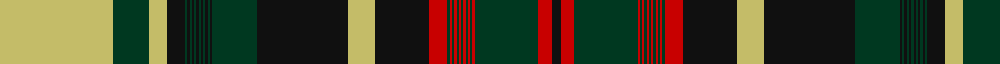

In pattern [KRGRGRGRGRGRGRGRKYKGKGKGKGKGKGKGKYGY](/stripes/krgrgrgrgrgrgrgrkykgkgkgkgkgkgkgkygy/).

This was sourced from register-of-tartans.  It is a [36 stripe tartan](/stripes/stripes36/).

Original link https://www.tartanregister.gov.uk/tartanDetails.aspx?ref=5702

## Register references

External register numbers recorded for this tartan.

- Scottish Register of Tartans: [5702](https://www.tartanregister.gov.uk/tartanDetails.aspx?ref=5702)
- Scottish Tartans Authority (ITI): 7710

## Thread count
LG/50 DG16 LG8 K8 DG1 K1 DG1 K1 DG1 K1 DG1 K1 DG1 K1 DG1 K1 DG20 K40 LG12 K24 R8 DG1 R1 DG1 R1 DG1 R1 DG1 R1 DG1 R1 DG1 R1 DG28 R6 K/4

## Palette
Each colour and the base-6 reference it is a variant of.

| Colour | Shade | Base |
|---|---|---|
| DB | <code style="background-color:#2C2C80;">#2C2C80</code> `oklch(35.0% 0.138 276.6)` <small>#2C2C80</small> | B <code style="background-color:#2A418A;">#2A418A</code> |
| DG | <code style="background-color:#003820;">#003820</code> `oklch(30.0% 0.070 158.3)` <small>#003820</small> | G <code style="background-color:#006100;">#006100</code> |
| DR | <code style="background-color:#441800;">#441800</code> `oklch(27.3% 0.076 46.3)` <small>#441800</small> | B <code style="background-color:#2A418A;">#2A418A</code> |
| DY | <code style="background-color:#BC8C00;">#BC8C00</code> `oklch(66.8% 0.137 84.1)` <small>#BC8C00</small> | Y <code style="background-color:#F2BF00;">#F2BF00</code> |
| G | <code style="background-color:#289C18;">#289C18</code> `oklch(60.6% 0.191 141.6)` <small>#289C18</small> | G <code style="background-color:#006100;">#006100</code> |
| Ga | <code style="background-color:#006818;">#006818</code> `oklch(45.0% 0.142 145.0)` <small>#006818</small> | G <code style="background-color:#006100;">#006100</code> |
| K | <code style="background-color:#101010;">#101010</code> `oklch(17.3% 0.000 89.9)` <small>#101010</small> | K <code style="background-color:#000000;">#000000</code> |
| LG | <code style="background-color:#C4BC68;">#C4BC68</code> `oklch(78.4% 0.107 103.7)` <small>#C4BC68</small> | Y <code style="background-color:#F2BF00;">#F2BF00</code> |
| LR | <code style="background-color:#E87878;">#E87878</code> `oklch(70.0% 0.139 21.2)` <small>#E87878</small> | R <code style="background-color:#CC0000;">#CC0000</code> |
| R | <code style="background-color:#C80000;">#C80000</code> `oklch(52.3% 0.215 29.2)` <small>#C80000</small> | R <code style="background-color:#CC0000;">#CC0000</code> |

## Nearest tartans

The nearest existing variants by ΔTartan distance, with this tartan at the top so the swatches line up against it.

ΔTartan

Tartan

Sett

—

<a href="/ttd/edit/#slug=ly50dg16ly8k8dg1k1dg1k1dg1k1dg1k1dg1k1dg1k1dg20k40ly12k24r8dg1r1dg1r1dg1r1dg1r1dg1r1dg1r1dg28r6k4">New Brunswick (CIDD 28101)</a> <a class="nn-out" href="/setts/s36/ly50dg16ly8k8dg1k1dg1k1dg1k1dg1k1dg1k1dg1k1dg20k40ly12k24r8dg1r1dg1r1dg1r1dg1r1dg1r1dg1r1dg28r6k4/" title="open its dictionary page">↗</a>

0.72

<a href="/ttd/edit/#slug=k50lo16k8dg8lo1dg1lo1dg1lo1dg1lo1dg1lo1dg1lo1dg1lo20dg40k12dg24g8lo1g1lo1g1lo1g1lo1g1lo1g1lo1g1lo28g6dg4">Nova Scotia (Commemorative)</a> <a class="nn-out" href="/setts/s36/k50lo16k8dg8lo1dg1lo1dg1lo1dg1lo1dg1lo1dg1lo1dg1lo20dg40k12dg24g8lo1g1lo1g1lo1g1lo1g1lo1g1lo1g1lo28g6dg4/" title="open its dictionary page">↗</a>

0.78

<a href="/ttd/edit/#slug=k50lo16k8dy8lo1dy1lo1dy1lo1dy1lo1dy1lo1dy1lo1dy1lo20dy40k12dy24dg8lo1dg1lo1dg1lo1dg1lo1dg1lo1dg1lo1dg1lo28dg6dy4">Alberta (Commemorative)</a> <a class="nn-out" href="/setts/s36/k50lo16k8dy8lo1dy1lo1dy1lo1dy1lo1dy1lo1dy1lo1dy1lo20dy40k12dy24dg8lo1dg1lo1dg1lo1dg1lo1dg1lo1dg1lo1dg1lo28dg6dy4/" title="open its dictionary page">↗</a>

0.99

<a href="/ttd/edit/#slug=k50w16k8dg8w1dg1w1dg1w1dg1w1dg1w1dg1w1dg1w20dg40k12dg24g8w1g1w1g1w1g1w1g1w1g1w1g1w28g6dg4">British Columbia (Commemorative)</a> <a class="nn-out" href="/setts/s36/k50w16k8dg8w1dg1w1dg1w1dg1w1dg1w1dg1w1dg1w20dg40k12dg24g8w1g1w1g1w1g1w1g1w1g1w1g1w28g6dg4/" title="open its dictionary page">↗</a>

1.08

<a href="/ttd/edit/#slug=db50lo16db8dg8lo1dg1lo1dg1lo1dg1lo1dg1lo1dg1lo1dg1lo20dg40db12dg24g8lo1g1lo1g1lo1g1lo1g1lo1g1lo1g1lo28g6dg4">Nova Scotia (CIDD 20899)</a> <a class="nn-out" href="/setts/s36/db50lo16db8dg8lo1dg1lo1dg1lo1dg1lo1dg1lo1dg1lo1dg1lo20dg40db12dg24g8lo1g1lo1g1lo1g1lo1g1lo1g1lo1g1lo28g6dg4/" title="open its dictionary page">↗</a>

1.09

<a href="/ttd/edit/#slug=k50lo16k8dy8lo1dy1lo1dy1lo1dy1lo1dy1lo1dy1lo1dy1lo20dy40k12dy24r8lo1r1lo1r1lo1r1lo1r1lo1r1lo1r1lo28r6dy4">Ontario (CIDD 28103) (Commemorative)</a> <a class="nn-out" href="/setts/s36/k50lo16k8dy8lo1dy1lo1dy1lo1dy1lo1dy1lo1dy1lo1dy1lo20dy40k12dy24r8lo1r1lo1r1lo1r1lo1r1lo1r1lo1r1lo28r6dy4/" title="open its dictionary page">↗</a>

1.10

<a href="/ttd/edit/#slug=k50lo16k8k8lo1k1lo1k1lo1k1lo1k1lo1k1lo1k1lo20k40k12k24dg8lo1dg1lo1dg1lo1dg1lo1dg1lo1dg1lo1dg1lo28dg6k4">Prince Edward Island (Commemorative)</a> <a class="nn-out" href="/setts/s36/k50lo16k8k8lo1k1lo1k1lo1k1lo1k1lo1k1lo1k1lo20k40k12k24dg8lo1dg1lo1dg1lo1dg1lo1dg1lo1dg1lo1dg1lo28dg6k4/" title="open its dictionary page">↗</a>

1.11

<a href="/ttd/edit/#slug=dg20k1dg1k1dg1k1dg1k1dg1k1dg1k1dg1k8ly8dg16ly50k4r6dg28r1dg1r1dg1r1dg1r1dg1r1dg1r1dg1r8k24ly12k4">New Brunswick (PIK Mills, Toronto)</a> <a class="nn-out" href="/setts/s36/dg20k1dg1k1dg1k1dg1k1dg1k1dg1k1dg1k8ly8dg16ly50k4r6dg28r1dg1r1dg1r1dg1r1dg1r1dg1r1dg1r8k24ly12k4/" title="open its dictionary page">↗</a>

1.31

<a href="/ttd/edit/#slug=g52k4o6db28o1db1o1db1o1db1o1db1o1db1o1db1o8k24g12k4db20k1db1k1db1k1db1k1db1k1db1k1db1k8g8db16~x2">13, Centennial Warp</a> <a class="nn-out" href="/setts/s36/g52k4o6db28o1db1o1db1o1db1o1db1o1db1o1db1o8k24g12k4db20k1db1k1db1k1db1k1db1k1db1k1db1k8g8db16~x2/" title="open its dictionary page">↗</a>

1.55

<a href="/ttd/edit/#slug=o2dg1o2dg1w1dg1w8k40o5dg40w10dg1w5k15dg1w7dg1w1dg1~x2">Shepherd, Derek (Modern)</a> <a class="nn-out" href="/setts/s19/o2dg1o2dg1w1dg1w8k40o5dg40w10dg1w5k15dg1w7dg1w1dg1~x2/" title="open its dictionary page">↗</a>

1.55

<a href="/ttd/edit/#slug=r50lo16r8k8lo1k1lo1k1lo1k1lo1k1lo1k1lo1k1lo20k40r12k24dg8lo1dg1lo1dg1lo1dg1lo1dg1lo1dg1lo1dg1lo28dg6k4">Prince Edward Island (CIDD 28100)</a> <a class="nn-out" href="/setts/s36/r50lo16r8k8lo1k1lo1k1lo1k1lo1k1lo1k1lo1k1lo20k40r12k24dg8lo1dg1lo1dg1lo1dg1lo1dg1lo1dg1lo1dg1lo28dg6k4/" title="open its dictionary page">↗</a>

## Neighbour map

Every grey dot is one of 14299 variants placed by the first two principal components of the ΔTartan feature space (44% of its variance). Red is this tartan; blue dots are its nearest — click one to open its page.

<svg viewBox="0 0 640 380" role="img" style="max-width:100%;height:auto;border:1px solid #e0e0e0;border-radius:4px;display:block" xmlns="http://www.w3.org/2000/svg"><image href="/nn/cloud.v1.png" width="640" height="380"/><a href="/setts/s36/k50lo16k8dg8lo1dg1lo1dg1lo1dg1lo1dg1lo1dg1lo1dg1lo20dg40k12dg24g8lo1g1lo1g1lo1g1lo1g1lo1g1lo1g1lo28g6dg4/"><circle cx="221.7" cy="21.6" r="4" fill="#3465a4"><title>Nova Scotia (Commemorative)</title></circle></a><a href="/setts/s36/k50lo16k8dy8lo1dy1lo1dy1lo1dy1lo1dy1lo1dy1lo1dy1lo20dy40k12dy24dg8lo1dg1lo1dg1lo1dg1lo1dg1lo1dg1lo1dg1lo28dg6dy4/"><circle cx="230.5" cy="18.7" r="4" fill="#3465a4"><title>Alberta (Commemorative)</title></circle></a><a href="/setts/s36/k50w16k8dg8w1dg1w1dg1w1dg1w1dg1w1dg1w1dg1w20dg40k12dg24g8w1g1w1g1w1g1w1g1w1g1w1g1w28g6dg4/"><circle cx="204.1" cy="14.0" r="4" fill="#3465a4"><title>British Columbia (Commemorative)</title></circle></a><a href="/setts/s36/db50lo16db8dg8lo1dg1lo1dg1lo1dg1lo1dg1lo1dg1lo1dg1lo20dg40db12dg24g8lo1g1lo1g1lo1g1lo1g1lo1g1lo1g1lo28g6dg4/"><circle cx="246.7" cy="31.3" r="4" fill="#3465a4"><title>Nova Scotia (CIDD 20899)</title></circle></a><a href="/setts/s36/k50lo16k8dy8lo1dy1lo1dy1lo1dy1lo1dy1lo1dy1lo1dy1lo20dy40k12dy24r8lo1r1lo1r1lo1r1lo1r1lo1r1lo1r1lo28r6dy4/"><circle cx="230.8" cy="14.0" r="4" fill="#3465a4"><title>Ontario (CIDD 28103) (Commemorative)</title></circle></a><a href="/setts/s36/k50lo16k8k8lo1k1lo1k1lo1k1lo1k1lo1k1lo1k1lo20k40k12k24dg8lo1dg1lo1dg1lo1dg1lo1dg1lo1dg1lo1dg1lo28dg6k4/"><circle cx="229.3" cy="23.9" r="4" fill="#3465a4"><title>Prince Edward Island (Commemorative)</title></circle></a><a href="/setts/s36/dg20k1dg1k1dg1k1dg1k1dg1k1dg1k1dg1k8ly8dg16ly50k4r6dg28r1dg1r1dg1r1dg1r1dg1r1dg1r1dg1r8k24ly12k4/"><circle cx="231.6" cy="14.0" r="4" fill="#3465a4"><title>New Brunswick (PIK Mills, Toronto)</title></circle></a><a href="/setts/s36/g52k4o6db28o1db1o1db1o1db1o1db1o1db1o1db1o8k24g12k4db20k1db1k1db1k1db1k1db1k1db1k1db1k8g8db16~x2/"><circle cx="246.7" cy="31.2" r="4" fill="#3465a4"><title>13, Centennial Warp</title></circle></a><a href="/setts/s19/o2dg1o2dg1w1dg1w8k40o5dg40w10dg1w5k15dg1w7dg1w1dg1~x2/"><circle cx="237.3" cy="53.9" r="4" fill="#3465a4"><title>Shepherd, Derek (Modern)</title></circle></a><a href="/setts/s36/r50lo16r8k8lo1k1lo1k1lo1k1lo1k1lo1k1lo1k1lo20k40r12k24dg8lo1dg1lo1dg1lo1dg1lo1dg1lo1dg1lo1dg1lo28dg6k4/"><circle cx="244.6" cy="14.0" r="4" fill="#3465a4"><title>Prince Edward Island (CIDD 28100)</title></circle></a><circle cx="226.2" cy="18.9" r="5" fill="#c00000"/></svg>

ID: /setts/s36/ly50dg16ly8k8dg1k1dg1k1dg1k1dg1k1dg1k1dg1k1dg20k40ly12k24r8dg1r1dg1r1dg1r1dg1r1dg1r1dg1r1dg28r6k4/
