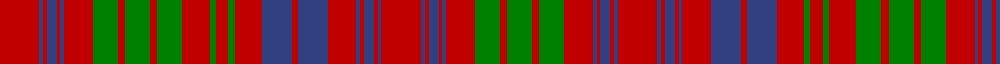

This page is one **sett** — a single exact thread-count. It belongs to the [tartan](/tartans/r32b3r3b8r3b3r23g20r6g20r6g20r22g5r10g5r22b24r5b24r23b3r3b8r3b3r32b3r3b8r3b3r23g20r6g20/)
(the same proportion at any scale), whose colour order is pattern [GRGRBRBRBRBRBRBRBRBRGRGRGRGRGRBRBRBR](/stripes/grgrbrbrbrbrbrbrbrbrgrgrgrgrgrbrbrbr/).

Sourced from weddslist.  It is a [36 stripe tartan](/stripes/stripes36/).

Original link http://www.weddslist.com/cgi-bin/tartans/pg.pl?source=sts

## Thread count
R/32 B3 R3 B8 R3 B3 R23 G20 R6 G20 R6 G20 R22 G5 R10 G5 R22 B24 R5 B24 R23 B3 R3 B8 R3 B3 R32 B3 R3 B8 R3 B3 R23 G20 R6 G/20

## Palette
Each colour and the base-6 reference it is a variant of.

| Colour | Shade | Base |
|---|---|---|
| B | <code style="background-color:#304080;">#304080</code> `oklch(39.4% 0.109 270.2)` <small>#304080</small> | B <code style="background-color:#2A418A;">#2A418A</code> |
| G | <code style="background-color:#008000;">#008000</code> `oklch(52.0% 0.177 142.5)` <small>#008000</small> | G <code style="background-color:#006100;">#006100</code> |
| R | <code style="background-color:#C00000;">#C00000</code> `oklch(50.7% 0.208 29.2)` <small>#C00000</small> | R <code style="background-color:#CC0000;">#CC0000</code> |

## Nearest tartans

The nearest existing variants by ΔTartan distance, with this tartan at the top so the swatches line up against it.

ΔTartan

Tartan

Sett

—

<a href="/ttd/edit/#slug=r32db3r3db8r3db3r23g20r6g20r6g20r22g5r10g5r22db24r5db24r23db3r3db8r3db3r32db3r3db8r3db3r23g20r6g20">Ross 1</a> <a class="nn-out" href="/setts/s36/r32db3r3db8r3db3r23g20r6g20r6g20r22g5r10g5r22db24r5db24r23db3r3db8r3db3r32db3r3db8r3db3r23g20r6g20/" title="open its dictionary page">↗</a>

0.90

<a href="/ttd/edit/#slug=r14db1r1db2r1db1r10g10r2g10r2g10r10g2r6g2r10db10r2db10r2db10r10g2r6~x2">Ross 2</a> <a class="nn-out" href="/setts/s25/r14db1r1db2r1db1r10g10r2g10r2g10r10g2r6g2r10db10r2db10r2db10r10g2r6~x2/" title="open its dictionary page">↗</a>

1.08

<a href="/ttd/edit/#slug=r14db1r1db2r1db1r10dg10r2dg10r2dg10r10dg2r6dg2r10db10r2db10r2db10r10dg2r6~x2">Ross #8</a> <a class="nn-out" href="/setts/s25/r14db1r1db2r1db1r10dg10r2dg10r2dg10r10dg2r6dg2r10db10r2db10r2db10r10dg2r6~x2/" title="open its dictionary page">↗</a>

1.09

<a href="/ttd/edit/#slug=r17g12r6db33r4g4r33g4r4g4r33g4r4db33r39g15r7db39r4g4r39g4r4g4r39g4r4db39r7g15r39db14">Na Fir Dileas (Corporate)</a> <a class="nn-out" href="/setts/s32/r17g12r6db33r4g4r33g4r4g4r33g4r4db33r39g15r7db39r4g4r39g4r4g4r39g4r4db39r7g15r39db14/" title="open its dictionary page">↗</a>

1.11

<a href="/ttd/edit/#slug=db9r2db9r9g1r1g2r1g1r9g1r1g2r1g1r9w1r4db11r2db11r4w1r9g2r4g2r9g9r2g9~x2">Lumsden, of Clova</a> <a class="nn-out" href="/setts/s31/db9r2db9r9g1r1g2r1g1r9g1r1g2r1g1r9w1r4db11r2db11r4w1r9g2r4g2r9g9r2g9~x2/" title="open its dictionary page">↗</a>

1.17

<a href="/ttd/edit/#slug=r1g17r2db2r17g2r2g2r17db2r2g17r2db17r2g2r17g2r2g2r17g2r2g17r2g17r2db2r17g2r1~x4">Robertson</a> <a class="nn-out" href="/setts/s31/r1g17r2db2r17g2r2g2r17db2r2g17r2db17r2g2r17g2r2g2r17g2r2g17r2g17r2db2r17g2r1~x4/" title="open its dictionary page">↗</a>

1.22

<a href="/ttd/edit/#slug=g3r3t9r12t1r1g1r1t1g1t6r1t1r1t1r1t1r1t6r1t1r1g1r1t1r12t9r3g3r7t3r3g1r4t3~x4">Murray of Polmaise</a> <a class="nn-out" href="/setts/s35/g3r3t9r12t1r1g1r1t1g1t6r1t1r1t1r1t1r1t6r1t1r1g1r1t1r12t9r3g3r7t3r3g1r4t3~x4/" title="open its dictionary page">↗</a>

1.23

<a href="/ttd/edit/#slug=r28g2r5g2r28g2r5g2r28db3r3g24r3db24r3db3r28g2r5g2r28db3r3g24r3db24r3db3~x2">Robertson 4</a> <a class="nn-out" href="/setts/s28/r28g2r5g2r28g2r5g2r28db3r3g24r3db24r3db3r28g2r5g2r28db3r3g24r3db24r3db3~x2/" title="open its dictionary page">↗</a>

1.32

<a href="/ttd/edit/#slug=g18r2g18r18g2r4g2r18db18r2db18r18db1r1db2r1db1r18db1r1g2r1db1r18g18r2g18~x2">Ross (Clan)</a> <a class="nn-out" href="/setts/s27/g18r2g18r18g2r4g2r18db18r2db18r18db1r1db2r1db1r18db1r1g2r1db1r18g18r2g18~x2/" title="open its dictionary page">↗</a>

1.32

<a href="/ttd/edit/#slug=g18r2g18r18g2r4g2r18db18r2db18r18db1r1db2r1db1r18db1r1db2r1db1r18g18r2g18~x2">Ross Clan Tartan Tartan Number: 864. Earliest known date: 1810-15 D.C.Stewart says, &quot;The version here given may be taken to be correct.&quot; Later versions, including Logans, are known to have omissions. The Clan Ross is descended from Fearcher MacinTagart, Earl of Ross in the 13th century. The chiefship has passed to the Rosses of Shandwick. The tartan is also worn by the MacTiers. Also worn by the Metro Toronto Police pipe band. (Strathallan 1994) See products available Copyright © Blair Urquhart, Comrie, 2015</a> <a class="nn-out" href="/setts/s27/g18r2g18r18g2r4g2r18db18r2db18r18db1r1db2r1db1r18db1r1db2r1db1r18g18r2g18~x2/" title="open its dictionary page">↗</a>

1.32

<a href="/ttd/edit/#slug=g23r6g23r26g4r9g4r26w3r8p31r6p31r8w3r26p2r2p4r2p2r26p2r2p4r2p2r26g23r6g23~x2">Ross 7</a> <a class="nn-out" href="/setts/s31/g23r6g23r26g4r9g4r26w3r8p31r6p31r8w3r26p2r2p4r2p2r26p2r2p4r2p2r26g23r6g23~x2/" title="open its dictionary page">↗</a>

## Neighbour map

Every grey dot is one of 14299 variants placed by the first two principal components of the ΔTartan feature space (44% of its variance). Red is this tartan; blue dots are its nearest — click one to open its page.

<svg viewBox="0 0 640 380" role="img" style="max-width:100%;height:auto;border:1px solid #e0e0e0;border-radius:4px;display:block" xmlns="http://www.w3.org/2000/svg"><image href="/nn/cloud.v1.png" width="640" height="380"/><a href="/setts/s25/r14db1r1db2r1db1r10g10r2g10r2g10r10g2r6g2r10db10r2db10r2db10r10g2r6~x2/"><circle cx="294.2" cy="162.7" r="4" fill="#3465a4"><title>Ross 2</title></circle></a><a href="/setts/s25/r14db1r1db2r1db1r10dg10r2dg10r2dg10r10dg2r6dg2r10db10r2db10r2db10r10dg2r6~x2/"><circle cx="289.7" cy="157.1" r="4" fill="#3465a4"><title>Ross #8</title></circle></a><a href="/setts/s32/r17g12r6db33r4g4r33g4r4g4r33g4r4db33r39g15r7db39r4g4r39g4r4g4r39g4r4db39r7g15r39db14/"><circle cx="310.3" cy="147.7" r="4" fill="#3465a4"><title>Na Fir Dileas (Corporate)</title></circle></a><a href="/setts/s31/db9r2db9r9g1r1g2r1g1r9g1r1g2r1g1r9w1r4db11r2db11r4w1r9g2r4g2r9g9r2g9~x2/"><circle cx="246.5" cy="135.1" r="4" fill="#3465a4"><title>Lumsden, of Clova</title></circle></a><a href="/setts/s31/r1g17r2db2r17g2r2g2r17db2r2g17r2db17r2g2r17g2r2g2r17g2r2g17r2g17r2db2r17g2r1~x4/"><circle cx="325.2" cy="123.9" r="4" fill="#3465a4"><title>Robertson</title></circle></a><a href="/setts/s35/g3r3t9r12t1r1g1r1t1g1t6r1t1r1t1r1t1r1t6r1t1r1g1r1t1r12t9r3g3r7t3r3g1r4t3~x4/"><circle cx="324.8" cy="132.3" r="4" fill="#3465a4"><title>Murray of Polmaise</title></circle></a><a href="/setts/s28/r28g2r5g2r28g2r5g2r28db3r3g24r3db24r3db3r28g2r5g2r28db3r3g24r3db24r3db3~x2/"><circle cx="362.8" cy="133.3" r="4" fill="#3465a4"><title>Robertson 4</title></circle></a><a href="/setts/s27/g18r2g18r18g2r4g2r18db18r2db18r18db1r1db2r1db1r18db1r1g2r1db1r18g18r2g18~x2/"><circle cx="294.0" cy="130.7" r="4" fill="#3465a4"><title>Ross (Clan)</title></circle></a><a href="/setts/s27/g18r2g18r18g2r4g2r18db18r2db18r18db1r1db2r1db1r18db1r1db2r1db1r18g18r2g18~x2/"><circle cx="292.8" cy="130.4" r="4" fill="#3465a4"><title>Ross Clan Tartan Tartan Number: 864. Earliest known date: 1810-15 D.C.Stewart says, &quot;The version here given may be taken to be correct.&quot; Later versions, including Logans, are known to have omissions. The Clan Ross is descended from Fearcher MacinTagart, Earl of Ross in the 13th century. The chiefship has passed to the Rosses of Shandwick. The tartan is also worn by the MacTiers. Also worn by the Metro Toronto Police pipe band. (Strathallan 1994) See products available Copyright © Blair Urquhart, Comrie, 2015</title></circle></a><a href="/setts/s31/g23r6g23r26g4r9g4r26w3r8p31r6p31r8w3r26p2r2p4r2p2r26p2r2p4r2p2r26g23r6g23~x2/"><circle cx="276.2" cy="112.9" r="4" fill="#3465a4"><title>Ross 7</title></circle></a><circle cx="290.5" cy="150.5" r="5" fill="#c00000"/></svg>

ID: /setts/s36/r32db3r3db8r3db3r23g20r6g20r6g20r22g5r10g5r22db24r5db24r23db3r3db8r3db3r32db3r3db8r3db3r23g20r6g20/
