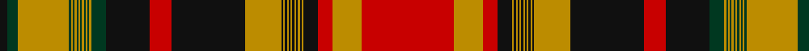

**Bands:** [KGYGYGYGYGYGYGYGKRKYKYKYKYKYKYKYKRYR](/stripes/kgygygygygygygygkrkykykykykykykykryr/) · **Stripes:** [K DG LO DG LO DG LO DG LO DG LO DG LO DG LO DG K R K LO K LO K LO K LO K LO K LO K LO K R LO R](/stripes/stripes36/) K DG LO DG LO DG LO DG LO DG LO DG LO DG LO DG K R K LO K LO K LO K LO K LO K LO K LO K R LO R

This was sourced from register-of-tartans.  It is a [36 band tartan](/bands/bands36/).

Original link https://www.tartanregister.gov.uk/tartanDetails.aspx?ref=5701

## Register references

External register numbers recorded for this tartan.

- Scottish Register of Tartans: [5701](https://www.tartanregister.gov.uk/tartanDetails.aspx?ref=5701)
- Scottish Tartans Authority (ITI): 7709

## Thread count
K/8 DG12 DY56 DG2 DY2 DG2 DY2 DG2 DY2 DG2 DY2 DG2 DY2 DG2 DY2 DG16 K48 R24 K80 DY40 K2 DY2 K2 DY2 K2 DY2 K2 DY2 K2 DY2 K2 DY2 K16 R16 DY32 R/100

## Palette
Each colour and its ΔE from the base-6 reference it is a variant of.

| Colour | Shade | Base | ΔE (OKLab) |
|---|---|---|---|
| DG | <code style="background-color:#003820;">#003820</code> `#003820` | G <code style="background-color:#006100;">#006100</code> | 0.15 |
| DY | <code style="background-color:#BC8C00;">#BC8C00</code> `#BC8C00` | Y <code style="background-color:#F2BF00;">#F2BF00</code> | 0.16 |
| K | <code style="background-color:#101010;">#101010</code> `#101010` | K <code style="background-color:#000000;">#000000</code> | 0.17 |
| R | <code style="background-color:#C80000;">#C80000</code> `#C80000` | R <code style="background-color:#CC0000;">#CC0000</code> | 0.01 |

## Nearest tartans

The nearest existing variants by ΔTartan distance.

1. [Ontario (CIDD 28103) (Commemorative)](/setts/s36/k50lo16k8dy8lo1dy1lo1dy1lo1dy1lo1dy1lo1dy1lo1dy1lo20dy40k12dy24r8lo1r1lo1r1lo1r1lo1r1lo1r1lo1r1lo28r6dy4/) — ΔT 0.86
1. [Alberta (Commemorative)](/setts/s36/k50lo16k8dy8lo1dy1lo1dy1lo1dy1lo1dy1lo1dy1lo1dy1lo20dy40k12dy24dg8lo1dg1lo1dg1lo1dg1lo1dg1lo1dg1lo1dg1lo28dg6dy4/) — ΔT 1.24
1. [Newfoundland (Commemorative)](/setts/s36/k50r16k8do8r1do1r1do1r1do1r1do1r1do1r1do1r20do40k12do24lo8r1lo1r1lo1r1lo1r1lo1r1lo1r1lo1r28lo6do4~x2/) — ΔT 1.24
1. [Newfoundland (CIDD 28098)](/setts/s36/g50r16g8do8r1do1r1do1r1do1r1do1r1do1r1do1r20do40g12do24lo8r1lo1r1lo1r1lo1r1lo1r1lo1r1lo1r28lo6do4~x2/) — ΔT 1.28
1. [MacIntosh, Moy Hall Plaid](/setts/s43/k72r4db4r4db4r72g90r2k2r24db2r2db2r4db2r2db2r24k2r2g30r26db23r26g7r2k2r2k2r24k2r2k2r2g7r24db24r26g25r2k2r26db30/) — ΔT 1.37
1. [Stuart/Stewart of Ardshiel](/setts/s34/t4k2r2r12dg66r4k2t2r6k34r6t2k2r65k3r2r6dg14r6r2k3r65k2t2r6k34r6t2k2r4dg66r12r2k2/) — ΔT 1.53
1. [New Brunswick (CIDD 28101)](/setts/s36/ly50dg16ly8k8dg1k1dg1k1dg1k1dg1k1dg1k1dg1k1dg20k40ly12k24r8dg1r1dg1r1dg1r1dg1r1dg1r1dg1r1dg28r6k4~x2/) — ΔT 1.55
1. [MacIntosh (Moy Hall Plaid)](/setts/s43/k72r4db4r4db4r72dg90r2k2r24db2r2db2r4db2r2db2r24k2r2dg30r26db23r26dg7r2k2r2k2r24k2r2k2r2dg7r24db24r26dg25r2k2r26db30/) — ΔT 1.58
1. [New Brunswick (PIK Mills, Toronto)](/setts/s36/dg20k1dg1k1dg1k1dg1k1dg1k1dg1k1dg1k8ly8dg16ly50k4r6dg28r1dg1r1dg1r1dg1r1dg1r1dg1r1dg1r8k24ly12k4/) — ΔT 1.68
1. [Ontario Centennial](/setts/s36/dg50lo16dg8dy8lo1dy1lo1dy1lo1dy1lo1dy1lo1dy1lo1dy1lo20dy40dg12dy24r8lo1r1lo1r1lo1r1lo1r1lo1r1lo1r1lo28r6dy4/) — ΔT 1.83

## Neighbour map

Every grey dot is one of 14313 variants placed by the first two principal components of the ΔTartan feature space (44% of its variance). Red is this tartan; blue dots are its nearest — click one to open its page.

<svg viewBox="0 0 640 380" role="img" style="max-width:100%;height:auto;border:1px solid #e0e0e0;border-radius:4px;display:block" xmlns="http://www.w3.org/2000/svg"><image href="/nn/cloud.v1.png" width="640" height="380"/><a href="/setts/s36/k50lo16k8dy8lo1dy1lo1dy1lo1dy1lo1dy1lo1dy1lo1dy1lo20dy40k12dy24r8lo1r1lo1r1lo1r1lo1r1lo1r1lo1r1lo28r6dy4/"><circle cx="231.2" cy="14.0" r="4" fill="#3465a4"><title>Ontario (CIDD 28103) (Commemorative)</title></circle></a><a href="/setts/s36/k50lo16k8dy8lo1dy1lo1dy1lo1dy1lo1dy1lo1dy1lo1dy1lo20dy40k12dy24dg8lo1dg1lo1dg1lo1dg1lo1dg1lo1dg1lo1dg1lo28dg6dy4/"><circle cx="230.8" cy="18.6" r="4" fill="#3465a4"><title>Alberta (Commemorative)</title></circle></a><a href="/setts/s36/k50r16k8do8r1do1r1do1r1do1r1do1r1do1r1do1r20do40k12do24lo8r1lo1r1lo1r1lo1r1lo1r1lo1r1lo1r28lo6do4~x2/"><circle cx="248.9" cy="17.0" r="4" fill="#3465a4"><title>Newfoundland (Commemorative)</title></circle></a><a href="/setts/s36/g50r16g8do8r1do1r1do1r1do1r1do1r1do1r1do1r20do40g12do24lo8r1lo1r1lo1r1lo1r1lo1r1lo1r1lo1r28lo6do4~x2/"><circle cx="279.9" cy="32.7" r="4" fill="#3465a4"><title>Newfoundland (CIDD 28098)</title></circle></a><a href="/setts/s43/k72r4db4r4db4r72g90r2k2r24db2r2db2r4db2r2db2r24k2r2g30r26db23r26g7r2k2r2k2r24k2r2k2r2g7r24db24r26g25r2k2r26db30/"><circle cx="280.6" cy="25.5" r="4" fill="#3465a4"><title>MacIntosh, Moy Hall Plaid</title></circle></a><a href="/setts/s34/t4k2r2r12dg66r4k2t2r6k34r6t2k2r65k3r2r6dg14r6r2k3r65k2t2r6k34r6t2k2r4dg66r12r2k2/"><circle cx="271.0" cy="28.0" r="4" fill="#3465a4"><title>Stuart/Stewart of Ardshiel</title></circle></a><a href="/setts/s36/ly50dg16ly8k8dg1k1dg1k1dg1k1dg1k1dg1k1dg1k1dg20k40ly12k24r8dg1r1dg1r1dg1r1dg1r1dg1r1dg1r1dg28r6k4~x2/"><circle cx="226.5" cy="18.8" r="4" fill="#3465a4"><title>New Brunswick (CIDD 28101)</title></circle></a><a href="/setts/s43/k72r4db4r4db4r72dg90r2k2r24db2r2db2r4db2r2db2r24k2r2dg30r26db23r26dg7r2k2r2k2r24k2r2k2r2dg7r24db24r26dg25r2k2r26db30/"><circle cx="298.6" cy="30.5" r="4" fill="#3465a4"><title>MacIntosh (Moy Hall Plaid)</title></circle></a><a href="/setts/s36/dg20k1dg1k1dg1k1dg1k1dg1k1dg1k1dg1k8ly8dg16ly50k4r6dg28r1dg1r1dg1r1dg1r1dg1r1dg1r1dg1r8k24ly12k4/"><circle cx="232.0" cy="14.0" r="4" fill="#3465a4"><title>New Brunswick (PIK Mills, Toronto)</title></circle></a><a href="/setts/s36/dg50lo16dg8dy8lo1dy1lo1dy1lo1dy1lo1dy1lo1dy1lo1dy1lo20dy40dg12dy24r8lo1r1lo1r1lo1r1lo1r1lo1r1lo1r1lo28r6dy4/"><circle cx="280.4" cy="39.2" r="4" fill="#3465a4"><title>Ontario Centennial</title></circle></a><circle cx="245.0" cy="14.0" r="5" fill="#c00000"/></svg>

ID: /setts/s36/r50lo16r8k8lo1k1lo1k1lo1k1lo1k1lo1k1lo1k1lo20k40r12k24dg8lo1dg1lo1dg1lo1dg1lo1dg1lo1dg1lo1dg1lo28dg6k4~x2/
