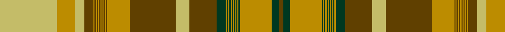

In pattern [GGYGYGYGYGYGYGYGGYGYGYGYGYGYGYGYGYYY](/patterns/ggygygygygygygyggygygygygygygygygyyy/).

This was sourced from register-of-tartans.  It is a [36 stripes tartan](/stripes/stripes36/).

Original link https://www.tartanregister.gov.uk/tartanDetails.aspx?ref=5704

## Thread count
LG/50 DY16 LG8 T8 DY1 T1 DY1 T1 DY1 T1 DY1 T1 DY1 T1 DY1 T1 DY20 T40 LG12 T24 DG8 DY1 DG1 DY1 DG1 DY1 DG1 DY1 DG1 DY1 DG1 DY1 DG1 DY28 DG6 T/4

## Palette
Each colour and its ΔE from the base-6 reference it is a variant of.

| Colour | Shade | Base | ΔE (OKLab) |
|---|---|---|---|
| B | <code style="background-color:#009894;">#009894</code> `#009894` | G <code style="background-color:#006100;">#006100</code> | 0.22 |
| DB | <code style="background-color:#2C2C80;">#2C2C80</code> `#2C2C80` | B <code style="background-color:#2A418A;">#2A418A</code> | 0.06 |
| DG | <code style="background-color:#003820;">#003820</code> `#003820` | G <code style="background-color:#006100;">#006100</code> | 0.15 |
| DR | <code style="background-color:#441800;">#441800</code> `#441800` | B <code style="background-color:#2A418A;">#2A418A</code> | 0.23 |
| DY | <code style="background-color:#BC8C00;">#BC8C00</code> `#BC8C00` | Y <code style="background-color:#F2BF00;">#F2BF00</code> | 0.16 |
| G | <code style="background-color:#289C18;">#289C18</code> `#289C18` | G <code style="background-color:#006100;">#006100</code> | 0.19 |
| Ga | <code style="background-color:#006818;">#006818</code> `#006818` | G <code style="background-color:#006100;">#006100</code> | 0.02 |
| K | <code style="background-color:#101010;">#101010</code> `#101010` | K <code style="background-color:#000000;">#000000</code> | 0.17 |
| LG | <code style="background-color:#C4BC68;">#C4BC68</code> `#C4BC68` | Y <code style="background-color:#F2BF00;">#F2BF00</code> | 0.08 |
| LN | <code style="background-color:#E0E0E0;">#E0E0E0</code> `#E0E0E0` | W <code style="background-color:#F7F7F7;">#F7F7F7</code> | 0.07 |
| R | <code style="background-color:#C80000;">#C80000</code> `#C80000` | R <code style="background-color:#CC0000;">#CC0000</code> | 0.01 |
| T | <code style="background-color:#604000;">#604000</code> `#604000` | G <code style="background-color:#006100;">#006100</code> | 0.14 |

## Nearest tartans

The nearest existing variants by ΔTartan distance.

1. [Ontario Centennial](/setts/s36/g50y16g8ga8y1ga1y1ga1y1ga1y1ga1y1ga1y1ga1y20ga40g12ga24r8y1r1y1r1y1r1y1r1y1r1y1r1y28r6ga4-g003820-ga604000-rc80000-ybc8c00/) — ΔT 1.13
1. [Newfoundland (CIDD 28098)](/setts/s36/g100r32g16b16r2b2r2b2r2b2r2b2r2b2r2b2r40b80g24b48y16r2y2r2y2r2y2r2y2r2y2r2y2r56y12b8-b441800-g006818-rc80000-ybc8c00/) — ΔT 1.64
1. [Ontario](/setts/s22/y28r4ra4r4ra4r4ra4r4ra4r4g50y16ra8r8g6r2g6r2g8ra20r4g4-g008000-r806050-rac00000-yf0c000/) — ΔT 1.76
1. [New Brunswick (PIK Mills, Toronto)](/setts/s36/g20k1g1k1g1k1g1k1g1k1g1k1g1k8y8g16y50k4r6g28r1g1r1g1r1g1r1g1r1g1r1g1r8k24y12k4-g005020-k101010-rdc0000-ye8c000/) — ΔT 1.79
1. [Not Specified](/setts/s26/b6r6g100r6g2r6b6r6b90r6b6r100b6r6b6r100b6r6b90r6b6r6g2r6g100r6-b5c8ca8-g006818-rc80000/) — ΔT 1.89
1. [Prince Edward Island (CIDD 28100)](/setts/s36/r100y32r16k16y2k2y2k2y2k2y2k2y2k2y2k2y40k80r24k48g16y2g2y2g2y2g2y2g2y2g2y2g2y56g12k8-g003820-k101010-rc80000-ybc8c00/) — ΔT 2.10
1. [Nova Scotia (CIDD 20899)](/setts/s36/b50y16b8g8y1g1y1g1y1g1y1g1y1g1y1g1y20g40b12g24ga8y1ga1y1ga1y1ga1y1ga1y1ga1y1ga1y28ga6g4-b2c2c80-g003820-ga289c18-ybc8c00/) — ΔT 2.11
1. [New Brunswick](/setts/s36/g20k1g1k1g1k1g1k1g1k1g1k1g1k8y8g16y50k4r6g28r1g1r1g1r1g1r1g1r1g1r1g1r8k24y12k4-g008000-k000000-rc00000-yf0c000/) — ΔT 2.12
1. [MacDougal 2](/setts/s20/b2r24ra8g144ra16g8ra16ba36r24ra8r24g36ra36g36ra16ba8ra144r12ra8b2-b5480b0-ba304080-g008000-r900030-rac00000/) — ΔT 2.26
1. [New Brunswick (CIDD 28101)](/setts/s36/y100g32y16k16g2k2g2k2g2k2g2k2g2k2g2k2g40k80y24k48r16g2r2g2r2g2r2g2r2g2r2g2r2g56r12k8-g003820-k101010-rc80000-yc4bc68/) — ΔT 2.32

## Neighbour map

Every grey dot is one of 15726 variants placed by the first two principal components of the ΔTartan feature space (44% of its variance). Red is this tartan; blue dots are its nearest — click one to open its page.

<svg viewBox="0 0 640 380" role="img" style="max-width:100%;height:auto;border:1px solid #e0e0e0;border-radius:4px;display:block" xmlns="http://www.w3.org/2000/svg"><image href="/nn/cloud.v1.png" width="640" height="380"/><a href="/setts/s36/g50y16g8ga8y1ga1y1ga1y1ga1y1ga1y1ga1y1ga1y20ga40g12ga24r8y1r1y1r1y1r1y1r1y1r1y1r1y28r6ga4-g003820-ga604000-rc80000-ybc8c00/"><circle cx="273.5" cy="34.5" r="4" fill="#3465a4"><title>Ontario Centennial</title></circle></a><a href="/setts/s36/g100r32g16b16r2b2r2b2r2b2r2b2r2b2r2b2r40b80g24b48y16r2y2r2y2r2y2r2y2r2y2r2y2r56y12b8-b441800-g006818-rc80000-ybc8c00/"><circle cx="273.6" cy="29.0" r="4" fill="#3465a4"><title>Newfoundland (CIDD 28098)</title></circle></a><a href="/setts/s22/y28r4ra4r4ra4r4ra4r4ra4r4g50y16ra8r8g6r2g6r2g8ra20r4g4-g008000-r806050-rac00000-yf0c000/"><circle cx="225.0" cy="88.8" r="4" fill="#3465a4"><title>Ontario</title></circle></a><a href="/setts/s36/g20k1g1k1g1k1g1k1g1k1g1k1g1k8y8g16y50k4r6g28r1g1r1g1r1g1r1g1r1g1r1g1r8k24y12k4-g005020-k101010-rdc0000-ye8c000/"><circle cx="225.1" cy="14.0" r="4" fill="#3465a4"><title>New Brunswick (PIK Mills, Toronto)</title></circle></a><a href="/setts/s26/b6r6g100r6g2r6b6r6b90r6b6r100b6r6b6r100b6r6b90r6b6r6g2r6g100r6-b5c8ca8-g006818-rc80000/"><circle cx="322.4" cy="69.9" r="4" fill="#3465a4"><title>Not Specified</title></circle></a><a href="/setts/s36/r100y32r16k16y2k2y2k2y2k2y2k2y2k2y2k2y40k80r24k48g16y2g2y2g2y2g2y2g2y2g2y2g2y56g12k8-g003820-k101010-rc80000-ybc8c00/"><circle cx="238.8" cy="14.0" r="4" fill="#3465a4"><title>Prince Edward Island (CIDD 28100)</title></circle></a><a href="/setts/s36/b50y16b8g8y1g1y1g1y1g1y1g1y1g1y1g1y20g40b12g24ga8y1ga1y1ga1y1ga1y1ga1y1ga1y1ga1y28ga6g4-b2c2c80-g003820-ga289c18-ybc8c00/"><circle cx="239.0" cy="27.4" r="4" fill="#3465a4"><title>Nova Scotia (CIDD 20899)</title></circle></a><a href="/setts/s36/g20k1g1k1g1k1g1k1g1k1g1k1g1k8y8g16y50k4r6g28r1g1r1g1r1g1r1g1r1g1r1g1r8k24y12k4-g008000-k000000-rc00000-yf0c000/"><circle cx="212.6" cy="14.0" r="4" fill="#3465a4"><title>New Brunswick</title></circle></a><a href="/setts/s20/b2r24ra8g144ra16g8ra16ba36r24ra8r24g36ra36g36ra16ba8ra144r12ra8b2-b5480b0-ba304080-g008000-r900030-rac00000/"><circle cx="297.9" cy="56.3" r="4" fill="#3465a4"><title>MacDougal 2</title></circle></a><a href="/setts/s36/y100g32y16k16g2k2g2k2g2k2g2k2g2k2g2k2g40k80y24k48r16g2r2g2r2g2r2g2r2g2r2g2r2g56r12k8-g003820-k101010-rc80000-yc4bc68/"><circle cx="218.9" cy="17.1" r="4" fill="#3465a4"><title>New Brunswick (CIDD 28101)</title></circle></a><circle cx="257.0" cy="23.3" r="5" fill="#c00000"/></svg>

ID: /setts/s36/y50ya16y8g8ya1g1ya1g1ya1g1ya1g1ya1g1ya1g1ya20g40y12g24ga8ya1ga1ya1ga1ya1ga1ya1ga1ya1ga1ya1ga1ya28ga6g4-g604000-ga003820-yc4bc68-yabc8c00/
