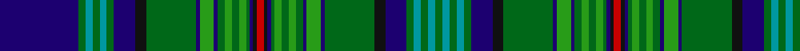

In pattern [BGGGGGBKGBGBGGGGGBKRKBGGGGGBGBGKBGGGGG](/stripes/bgggggbkgbgbgggggbkrkbgggggbgbgkbggggg/).

This was sourced from house-of-tartan.  It is a [38 stripe tartan](/stripes/stripes38/).

Original link http://www.house-of-tartan.scotland.net/house/TartanViewjs.asp?colr=Def&tnam=5505

## Thread count
DB/44 G4 B4 G4 B4 G4 DB12 K6 G28 DB2 Ga8 DB2 G4 Ga4 G4 Ga4 G2 DB2 K2 R4 K2 DB2 G2 Ga4 G4 Ga4 G4 DB2 Ga8 DB2 G28 K6 DB12 G4 B4 G4 B4 G/4

## Palette
Each colour and its ΔE from the base-6 reference it is a variant of.

| Colour | Shade | Base | ΔE (OKLab) |
|---|---|---|---|
| B | <code style="background-color:#0098A0;">#0098A0</code> `#0098A0` | G <code style="background-color:#006100;">#006100</code> | 0.23 |
| DB | <code style="background-color:#1C0070;">#1C0070</code> `#1C0070` | B <code style="background-color:#2A418A;">#2A418A</code> | 0.14 |
| G | <code style="background-color:#006818;">#006818</code> `#006818` | G <code style="background-color:#006100;">#006100</code> | 0.02 |
| Ga | <code style="background-color:#289C18;">#289C18</code> `#289C18` | G <code style="background-color:#006100;">#006100</code> | 0.19 |
| K | <code style="background-color:#101010;">#101010</code> `#101010` | K <code style="background-color:#000000;">#000000</code> | 0.17 |
| R | <code style="background-color:#C80000;">#C80000</code> `#C80000` | R <code style="background-color:#CC0000;">#CC0000</code> | 0.01 |

## Nearest tartans

The nearest existing variants by ΔTartan distance.

1. [Cockburn #2](/setts/s27/r3k2dg9db12w3db12dg2k2dg2k2dg36k2dg2k2dg2db12w3db12k3ly3k2dg12k2r3k2dg6w3~x2/) — ΔT 1.12
1. [Unidentified (R.J.Forsyth)](/setts/s35/r2k6g2k2g14k1ly1r1k1r1k3b9k1ly2k1g11k1b2k1g11k1w2k1b9k1r1k1r1ly1k1g14k2g2k6r2~x2/) — ΔT 1.21
1. [Strathclyde, University of](/setts/s26/db7k1r3k1db24k1w3k3y3k3y3g19k2w4~x2/) — ΔT 1.33
1. [Wood (Clan)](/setts/s23/k3lr2k6g3k3g21db18r1db2r1db2r3db2r1db2r1db18g21k3g3k6ly2k3~x2/) — ΔT 1.36
1. [Ayre Personal Tartan Tartan Number: 6305. Earliest known date: 1819 This is Wilsons No. 038 (1819) and has been adopted by David Ayre of Kilmarnock as a private family tartan. See #805. See products available Copyright © Blair Urquhart, Comrie, 2015](/setts/s38/g82k2g2k2g2k8db28k2w6k2db28k2ly6k2g32k2r5k2g15w6/) — ΔT 1.39
1. [Duncan of Sketraw Clan Tartan Tartan Number: 6497. Earliest known date: 2005 January A modified version of an unidentified tartan No. 331 from the 1930s. This new version is for John Duncan of Sketraw, and is approved by the Clan Duncan Society See products available Copyright © Blair Urquhart, Comrie, 2015](/setts/s32/k6g2k2g14k1ly2k1b5r1b5k1w2k1g14k1b2k1g14k1w2k1b5r1b5k1ly2k1g14k2g2k6r2~x2/) — ΔT 1.44
1. [Cockburn](/setts/s27/r3k2g9db12w3db12g2k2g2k2g36k2g2k2g2db12w3db12k3ly3k2g12k2r3k2g6w3~x2/) — ΔT 1.44
1. [Peter Pan](/setts/s20/db22g2g2g2g2g2db6k3g14db1g4db1g2g2g2g2g1db1k1r2~x2/) — ΔT 1.46
1. [Unidentified Lindley #7](/setts/s62/b3w1b1w1g22w1b1w1b3k11g22r1g1r2g1r1g22k11b16w1b4w1b16w1b4w1b16k11g22r1g1r2~x2/) — ΔT 1.51
1. [Hawick](/setts/s33/k2lo2k3w2k2g16r2g24r2g16k2w2k3lo2k4db4k4lo2k3w2k2db12r2db12g12r2g12k2w2k3lo2k4db2~x2/) — ΔT 1.52

## Neighbour map

Every grey dot is one of 14299 variants placed by the first two principal components of the ΔTartan feature space (44% of its variance). Red is this tartan; blue dots are its nearest — click one to open its page.

<svg viewBox="0 0 640 380" role="img" style="max-width:100%;height:auto;border:1px solid #e0e0e0;border-radius:4px;display:block" xmlns="http://www.w3.org/2000/svg"><image href="/nn/cloud.v1.png" width="640" height="380"/><a href="/setts/s27/r3k2dg9db12w3db12dg2k2dg2k2dg36k2dg2k2dg2db12w3db12k3ly3k2dg12k2r3k2dg6w3~x2/"><circle cx="221.8" cy="82.4" r="4" fill="#3465a4"><title>Cockburn #2</title></circle></a><a href="/setts/s35/r2k6g2k2g14k1ly1r1k1r1k3b9k1ly2k1g11k1b2k1g11k1w2k1b9k1r1k1r1ly1k1g14k2g2k6r2~x2/"><circle cx="187.1" cy="77.0" r="4" fill="#3465a4"><title>Unidentified (R.J.Forsyth)</title></circle></a><a href="/setts/s26/db7k1r3k1db24k1w3k3y3k3y3g19k2w4~x2/"><circle cx="179.7" cy="61.7" r="4" fill="#3465a4"><title>Strathclyde, University of</title></circle></a><a href="/setts/s23/k3lr2k6g3k3g21db18r1db2r1db2r3db2r1db2r1db18g21k3g3k6ly2k3~x2/"><circle cx="202.2" cy="87.0" r="4" fill="#3465a4"><title>Wood (Clan)</title></circle></a><a href="/setts/s38/g82k2g2k2g2k8db28k2w6k2db28k2ly6k2g32k2r5k2g15w6/"><circle cx="254.6" cy="16.2" r="4" fill="#3465a4"><title>Ayre Personal Tartan Tartan Number: 6305. Earliest known date: 1819 This is Wilsons No. 038 (1819) and has been adopted by David Ayre of Kilmarnock as a private family tartan. See #805. See products available Copyright © Blair Urquhart, Comrie, 2015</title></circle></a><a href="/setts/s32/k6g2k2g14k1ly2k1b5r1b5k1w2k1g14k1b2k1g14k1w2k1b5r1b5k1ly2k1g14k2g2k6r2~x2/"><circle cx="207.6" cy="85.2" r="4" fill="#3465a4"><title>Duncan of Sketraw Clan Tartan Tartan Number: 6497. Earliest known date: 2005 January A modified version of an unidentified tartan No. 331 from the 1930s. This new version is for John Duncan of Sketraw, and is approved by the Clan Duncan Society See products available Copyright © Blair Urquhart, Comrie, 2015</title></circle></a><a href="/setts/s27/r3k2g9db12w3db12g2k2g2k2g36k2g2k2g2db12w3db12k3ly3k2g12k2r3k2g6w3~x2/"><circle cx="188.2" cy="65.5" r="4" fill="#3465a4"><title>Cockburn</title></circle></a><a href="/setts/s20/db22g2g2g2g2g2db6k3g14db1g4db1g2g2g2g2g1db1k1r2~x2/"><circle cx="216.9" cy="78.4" r="4" fill="#3465a4"><title>Peter Pan</title></circle></a><a href="/setts/s62/b3w1b1w1g22w1b1w1b3k11g22r1g1r2g1r1g22k11b16w1b4w1b16w1b4w1b16k11g22r1g1r2~x2/"><circle cx="219.2" cy="54.4" r="4" fill="#3465a4"><title>Unidentified Lindley #7</title></circle></a><a href="/setts/s33/k2lo2k3w2k2g16r2g24r2g16k2w2k3lo2k4db4k4lo2k3w2k2db12r2db12g12r2g12k2w2k3lo2k4db2~x2/"><circle cx="174.0" cy="86.4" r="4" fill="#3465a4"><title>Hawick</title></circle></a><circle cx="190.1" cy="56.6" r="5" fill="#c00000"/></svg>

ID: /setts/s38/db22g2g2g2g2g2db6k3g14db1g4db1g2g2g2g2g1db1k1r2~x2/
