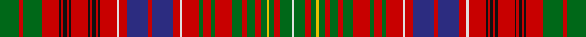

In pattern [GRGRKRKRKRKRKRKRWRBRBRWRGRGRGRGRGYGRGW](/stripes/grgrkrkrkrkrkrkrwrbrbrwrgrgrgrgrgygrgw/).

This was sourced from register-of-tartans.  It is a [38 stripe tartan](/stripes/stripes38/).

Original link https://www.tartanregister.gov.uk/tartanDetails.aspx?ref=2752

## Also known as

This cloth is also recorded under:

- MacRae Prince's Own

## Attestations

This cloth appears in 2 source records; the oldest owns this page.

- 01/01/1745 — MacRae Prince's Own (register-of-tartans, [record](https://www.tartanregister.gov.uk/tartanDetails.aspx?ref=2752))
- 1810 — MacRae - 1810 (Prince's Own) (tartans-authority, [record](http://www.tartansauthority.com/tartan-ferret/display/981/))

## Register references

External register numbers recorded for this tartan.

- Scottish Register of Tartans: [2752](https://www.tartanregister.gov.uk/tartanDetails.aspx?ref=2752)
- Scottish Tartans Authority (ITI): 981
- Scottish Tartans World Register: 981

## Thread count
G/20 R4 G20 R18 K2 R2 K4 R2 K2 R18 K2 R2 K4 R2 K2 R18 LN2 R8 DB22 R4 DB22 R8 LN2 R18 G4 R8 G4 R18 G10 R6 G8 R6 G6 Y2 G6 R6 G12 LN/2

## Palette
Each colour and the base-6 reference it is a variant of.

| Colour | Shade | Base |
|---|---|---|
| DB | <code style="background-color:#2C2C80;">#2C2C80</code> `oklch(35.0% 0.138 276.6)` <small>#2C2C80</small> | B <code style="background-color:#2A418A;">#2A418A</code> |
| G | <code style="background-color:#006818;">#006818</code> `oklch(45.0% 0.142 145.0)` <small>#006818</small> | G <code style="background-color:#006100;">#006100</code> |
| K | <code style="background-color:#101010;">#101010</code> `oklch(17.3% 0.000 89.9)` <small>#101010</small> | K <code style="background-color:#000000;">#000000</code> |
| LN | <code style="background-color:#E0E0E0;">#E0E0E0</code> `oklch(90.7% 0.000 89.9)` <small>#E0E0E0</small> | W <code style="background-color:#F7F7F7;">#F7F7F7</code> |
| R | <code style="background-color:#C80000;">#C80000</code> `oklch(52.3% 0.215 29.2)` <small>#C80000</small> | R <code style="background-color:#CC0000;">#CC0000</code> |
| Y | <code style="background-color:#E8C000;">#E8C000</code> `oklch(81.9% 0.168 93.7)` <small>#E8C000</small> | Y <code style="background-color:#F2BF00;">#F2BF00</code> |

## Nearest tartans

The nearest existing variants by ΔTartan distance, with this tartan at the top so the swatches line up against it.

ΔTartan

Tartan

Sett

—

<a href="/ttd/edit/#slug=g10r2g10r9k1r1k2r1k1r9k1r1k2r1k1r9w1r4db11r2db11r4w1r9g2r4g2r9g5r3g4r3g3ly1g3r3g6w1~x2">MacRae Prince's Own</a> <a class="nn-out" href="/setts/s38/g10r2g10r9k1r1k2r1k1r9k1r1k2r1k1r9w1r4db11r2db11r4w1r9g2r4g2r9g5r3g4r3g3ly1g3r3g6w1~x2/" title="open its dictionary page">↗</a>

0.57

<a href="/ttd/edit/#slug=g29r5g28r22k2r2k4r2k2r22k2r2k4r2k2r20w2r9db26r5db28r9w2r22g3r8g3r22g8r6g8r6g5ly3g5r7g12w2~x2">MacRae The Princes Own Clan Tartan Tartan Number: 982. Earliest known date: c.1815 Two MacRae setts, of which this is one, are contained in the Highland Society collection and presumably sealed by the Chief around 1815. Unless he recognised both, perhaps one is the clan and the other the Chief's own See products available Copyright © Blair Urquhart, Comrie, 2015</a> <a class="nn-out" href="/setts/s38/g29r5g28r22k2r2k4r2k2r22k2r2k4r2k2r20w2r9db26r5db28r9w2r22g3r8g3r22g8r6g8r6g5ly3g5r7g12w2~x2/" title="open its dictionary page">↗</a>

0.64

<a href="/ttd/edit/#slug=dg29r5dg28r22k2r2k4r2k2r22k2r2k4r2k2r20w2r9db26r5db28r9w2r22dg3r8dg3r22dg8r6dg8r6dg5ly3dg5r7dg12w2~x2">MacRae The Princes Own</a> <a class="nn-out" href="/setts/s38/dg29r5dg28r22k2r2k4r2k2r22k2r2k4r2k2r20w2r9db26r5db28r9w2r22dg3r8dg3r22dg8r6dg8r6dg5ly3dg5r7dg12w2~x2/" title="open its dictionary page">↗</a>

0.71

<a href="/ttd/edit/#slug=dg24r7dg24r26k2r2k5r2k2r26k2r2k5r2k2r26w3r12db33r7db33r12w3r26dg4r12dg4r26dg12r8dg12r12dg8g7dg8r12dg9w3dg16w2~x2">Kinnoull (MacRae)</a> <a class="nn-out" href="/setts/s40/dg24r7dg24r26k2r2k5r2k2r26k2r2k5r2k2r26w3r12db33r7db33r12w3r26dg4r12dg4r26dg12r8dg12r12dg8g7dg8r12dg9w3dg16w2~x2/" title="open its dictionary page">↗</a>

0.77

<a href="/ttd/edit/#slug=g24r7r26k2r2k5r2k2r26k2r2k5r2k2r26w3r12db33r7db33r12w3r26g4r12g4r26g12r8g12r12g8g7g8r12g9w3g16w2~x2">Kinnoull (MacRae) Family Tartan Tartan Number: 983. Earliest known date: 1819 Check thread count against Sindex. See products available Copyright © Blair Urquhart, Comrie, 2015</a> <a class="nn-out" href="/setts/s39/g24r7r26k2r2k5r2k2r26k2r2k5r2k2r26w3r12db33r7db33r12w3r26g4r12g4r26g12r8g12r12g8g7g8r12g9w3g16w2~x2/" title="open its dictionary page">↗</a>

0.85

<a href="/ttd/edit/#slug=g24r7g24r26k2r2k5r2k2r24k2r2k5r2k2r26w3r12db33r12w3r26g4r12g4r26g12r8g12r12g8y7g8r12g9w3g16w2">Kinnoull (MacRae) - Error?</a> <a class="nn-out" href="/setts/s38/g24r7g24r26k2r2k5r2k2r24k2r2k5r2k2r26w3r12db33r12w3r26g4r12g4r26g12r8g12r12g8y7g8r12g9w3g16w2/" title="open its dictionary page">↗</a>

0.99

<a href="/ttd/edit/#slug=g21w2g20r8g6ly3g6r8g10r9g11r22g3r9g3r21w2r10db26r6db26r10w2r19g2r2g3r2g2r20g2r2g3r2g2r19g20r6g20">Lumsden (Waistcoat)</a> <a class="nn-out" href="/setts/s39/g21w2g20r8g6ly3g6r8g10r9g11r22g3r9g3r21w2r10db26r6db26r10w2r19g2r2g3r2g2r20g2r2g3r2g2r19g20r6g20/" title="open its dictionary page">↗</a>

1.04

<a href="/ttd/edit/#slug=dg23r6dg23r25k2r2k5r2k2r26k2r2k5r2k2r26w3r12lb33r7lb33r12w3r26dg8r12dg4r26dg12r8dg12r12dg8y7dg8r12dg9w3dg16w2">Kinnoull (Clan)</a> <a class="nn-out" href="/setts/s40/dg23r6dg23r25k2r2k5r2k2r26k2r2k5r2k2r26w3r12lb33r7lb33r12w3r26dg8r12dg4r26dg12r8dg12r12dg8y7dg8r12dg9w3dg16w2/" title="open its dictionary page">↗</a>

1.06

<a href="/ttd/edit/#slug=r9db1r1db2r1db1r9w1r4db11r2db11r4w1r9g2r4g2r9g5r3g4r3g3ly1g3r3g6w1g6~x2">Lumsden (Short)</a> <a class="nn-out" href="/setts/s30/r9db1r1db2r1db1r9w1r4db11r2db11r4w1r9g2r4g2r9g5r3g4r3g3ly1g3r3g6w1g6~x2/" title="open its dictionary page">↗</a>

1.14

<a href="/ttd/edit/#slug=g8r2g8r12g2r3g2r12w1r3ly1db12r3db12ly1r3w1r12db1r1db2r1db1r12db1r1db2r1db1r12g8r2g8~x2">Huntly</a> <a class="nn-out" href="/setts/s33/g8r2g8r12g2r3g2r12w1r3ly1db12r3db12ly1r3w1r12db1r1db2r1db1r12db1r1db2r1db1r12g8r2g8~x2/" title="open its dictionary page">↗</a>

1.16

<a href="/ttd/edit/#slug=g12r12g2r2g2r2g6ly2r1ly2g6r2g2r2g2r12db8g8k2r4k2r4k2g8db8r12g12t2~x2">MacMaster (New) Family Tartan Tartan Number: 3218. Earliest known date: 2001 Asymetrical design follows Canadian tradition. Elements of the MacInnes and the Nova Scotia tartans were included in line with Dave McMaster's family history. See products available Copyright © Blair Urquhart, Comrie, 2015</a> <a class="nn-out" href="/setts/s28/g12r12g2r2g2r2g6ly2r1ly2g6r2g2r2g2r12db8g8k2r4k2r4k2g8db8r12g12t2~x2/" title="open its dictionary page">↗</a>

## Neighbour map

Every grey dot is one of 14299 variants placed by the first two principal components of the ΔTartan feature space (44% of its variance). Red is this tartan; blue dots are its nearest — click one to open its page.

<svg viewBox="0 0 640 380" role="img" style="max-width:100%;height:auto;border:1px solid #e0e0e0;border-radius:4px;display:block" xmlns="http://www.w3.org/2000/svg"><image href="/nn/cloud.v1.png" width="640" height="380"/><a href="/setts/s38/g29r5g28r22k2r2k4r2k2r22k2r2k4r2k2r20w2r9db26r5db28r9w2r22g3r8g3r22g8r6g8r6g5ly3g5r7g12w2~x2/"><circle cx="216.3" cy="71.5" r="4" fill="#3465a4"><title>MacRae The Princes Own Clan Tartan Tartan Number: 982. Earliest known date: c.1815 Two MacRae setts, of which this is one, are contained in the Highland Society collection and presumably sealed by the Chief around 1815. Unless he recognised both, perhaps one is the clan and the other the Chief's own See products available Copyright © Blair Urquhart, Comrie, 2015</title></circle></a><a href="/setts/s38/dg29r5dg28r22k2r2k4r2k2r22k2r2k4r2k2r20w2r9db26r5db28r9w2r22dg3r8dg3r22dg8r6dg8r6dg5ly3dg5r7dg12w2~x2/"><circle cx="214.0" cy="68.1" r="4" fill="#3465a4"><title>MacRae The Princes Own</title></circle></a><a href="/setts/s40/dg24r7dg24r26k2r2k5r2k2r26k2r2k5r2k2r26w3r12db33r7db33r12w3r26dg4r12dg4r26dg12r8dg12r12dg8g7dg8r12dg9w3dg16w2~x2/"><circle cx="212.1" cy="68.3" r="4" fill="#3465a4"><title>Kinnoull (MacRae)</title></circle></a><a href="/setts/s39/g24r7r26k2r2k5r2k2r26k2r2k5r2k2r26w3r12db33r7db33r12w3r26g4r12g4r26g12r8g12r12g8g7g8r12g9w3g16w2~x2/"><circle cx="230.4" cy="70.4" r="4" fill="#3465a4"><title>Kinnoull (MacRae) Family Tartan Tartan Number: 983. Earliest known date: 1819 Check thread count against Sindex. See products available Copyright © Blair Urquhart, Comrie, 2015</title></circle></a><a href="/setts/s38/g24r7g24r26k2r2k5r2k2r24k2r2k5r2k2r26w3r12db33r12w3r26g4r12g4r26g12r8g12r12g8y7g8r12g9w3g16w2/"><circle cx="235.7" cy="74.0" r="4" fill="#3465a4"><title>Kinnoull (MacRae) - Error?</title></circle></a><a href="/setts/s39/g21w2g20r8g6ly3g6r8g10r9g11r22g3r9g3r21w2r10db26r6db26r10w2r19g2r2g3r2g2r20g2r2g3r2g2r19g20r6g20/"><circle cx="229.3" cy="103.1" r="4" fill="#3465a4"><title>Lumsden (Waistcoat)</title></circle></a><a href="/setts/s40/dg23r6dg23r25k2r2k5r2k2r26k2r2k5r2k2r26w3r12lb33r7lb33r12w3r26dg8r12dg4r26dg12r8dg12r12dg8y7dg8r12dg9w3dg16w2/"><circle cx="197.0" cy="61.0" r="4" fill="#3465a4"><title>Kinnoull (Clan)</title></circle></a><a href="/setts/s30/r9db1r1db2r1db1r9w1r4db11r2db11r4w1r9g2r4g2r9g5r3g4r3g3ly1g3r3g6w1g6~x2/"><circle cx="224.0" cy="120.7" r="4" fill="#3465a4"><title>Lumsden (Short)</title></circle></a><a href="/setts/s33/g8r2g8r12g2r3g2r12w1r3ly1db12r3db12ly1r3w1r12db1r1db2r1db1r12db1r1db2r1db1r12g8r2g8~x2/"><circle cx="260.2" cy="102.8" r="4" fill="#3465a4"><title>Huntly</title></circle></a><a href="/setts/s28/g12r12g2r2g2r2g6ly2r1ly2g6r2g2r2g2r12db8g8k2r4k2r4k2g8db8r12g12t2~x2/"><circle cx="176.9" cy="112.1" r="4" fill="#3465a4"><title>MacMaster (New) Family Tartan Tartan Number: 3218. Earliest known date: 2001 Asymetrical design follows Canadian tradition. Elements of the MacInnes and the Nova Scotia tartans were included in line with Dave McMaster's family history. See products available Copyright © Blair Urquhart, Comrie, 2015</title></circle></a><circle cx="194.3" cy="90.3" r="5" fill="#c00000"/></svg>

ID: /setts/s38/g10r2g10r9k1r1k2r1k1r9k1r1k2r1k1r9w1r4db11r2db11r4w1r9g2r4g2r9g5r3g4r3g3ly1g3r3g6w1~x2/
