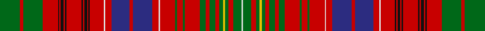

In pattern [GRGRKRKRKRKRKRKRWRBRBRWRGRGRGRGRGYGRGW](/stripes/grgrkrkrkrkrkrkrwrbrbrwrgrgrgrgrgygrgw/).

This was sourced from house-of-tartan.  It is a [38 stripe tartan](/stripes/stripes38/).

Original link http://www.house-of-tartan.scotland.net/house/TartanViewjs.asp?colr=Def&tnam=982

## Thread count
G/58 R10 G56 R44 K4 R4 K8 R4 K4 R44 K4 R4 K8 R4 K4 R40 LN4 R18 DB52 R10 DB56 R18 LN4 R44 G6 R16 G6 R44 G16 R12 G16 R12 G10 Y6 G10 R14 G24 LN/4

## Palette
Each colour and its ΔE from the base-6 reference it is a variant of.

| Colour | Shade | Base | ΔE (OKLab) |
|---|---|---|---|
| DB | <code style="background-color:#2C2C80;">#2C2C80</code> `#2C2C80` | B <code style="background-color:#2A418A;">#2A418A</code> | 0.06 |
| G | <code style="background-color:#006818;">#006818</code> `#006818` | G <code style="background-color:#006100;">#006100</code> | 0.02 |
| K | <code style="background-color:#101010;">#101010</code> `#101010` | K <code style="background-color:#000000;">#000000</code> | 0.17 |
| LN | <code style="background-color:#E0E0E0;">#E0E0E0</code> `#E0E0E0` | W <code style="background-color:#F7F7F7;">#F7F7F7</code> | 0.07 |
| R | <code style="background-color:#C80000;">#C80000</code> `#C80000` | R <code style="background-color:#CC0000;">#CC0000</code> | 0.01 |
| Y | <code style="background-color:#E8C000;">#E8C000</code> `#E8C000` | Y <code style="background-color:#F2BF00;">#F2BF00</code> | 0.02 |

## Nearest tartans

The nearest existing variants by ΔTartan distance.

1. [MacRae The Princes Own](/setts/s38/dg29r5dg28r22k2r2k4r2k2r22k2r2k4r2k2r20w2r9db26r5db28r9w2r22dg3r8dg3r22dg8r6dg8r6dg5ly3dg5r7dg12w2~x2/) — ΔT 0.28
1. [Kinnoull (MacRae)](/setts/s40/dg24r7dg24r26k2r2k5r2k2r26k2r2k5r2k2r26w3r12db33r7db33r12w3r26dg4r12dg4r26dg12r8dg12r12dg8g7dg8r12dg9w3dg16w2~x2/) — ΔT 0.51
1. [Kinnoull (MacRae) Family Tartan Tartan Number: 983. Earliest known date: 1819 Check thread count against Sindex. See products available Copyright © Blair Urquhart, Comrie, 2015](/setts/s39/g24r7r26k2r2k5r2k2r26k2r2k5r2k2r26w3r12db33r7db33r12w3r26g4r12g4r26g12r8g12r12g8g7g8r12g9w3g16w2~x2/) — ΔT 0.52
1. [MacRae Prince's Own](/setts/s38/g10r2g10r9k1r1k2r1k1r9k1r1k2r1k1r9w1r4db11r2db11r4w1r9g2r4g2r9g5r3g4r3g3ly1g3r3g6w1~x2/) — ΔT 0.57
1. [Kinnoull (MacRae) - Error?](/setts/s38/g24r7g24r26k2r2k5r2k2r24k2r2k5r2k2r26w3r12db33r12w3r26g4r12g4r26g12r8g12r12g8y7g8r12g9w3g16w2/) — ΔT 0.70
1. [MacPherson](/setts/s29/r2k2w2r22t8k2t2k2t8k12ly2g16r22t4r22t4r22g16ly2k12t8k2t2k2t8r22w1k1r1~x2/) — ΔT 0.94
1. [Kinnoull (Clan)](/setts/s40/dg23r6dg23r25k2r2k5r2k2r26k2r2k5r2k2r26w3r12lb33r7lb33r12w3r26dg8r12dg4r26dg12r8dg12r12dg8y7dg8r12dg9w3dg16w2/) — ΔT 0.94
1. [MacAlister Clan Tartan Tartan Number: 1465. Earliest known date: 1850 This plate is taken from the manuscript of William and Andrew Smith's 'Authenticated Tartans of the Clans and Families of Scotland'. The Smith's sources included the findings of George Hunter, an Army clothier, who toured the Highlands in search of old tartans prior to 1822. MacAlisters are descendants of Donald of Islay, Lord of the Isles. Contemporary accounts of Flora MacDonald (1746) suggest that MacAlisters wore the MacDonald tartan at that time. The MacAlister tartan certified by the chief in 1816 shows the MacDonald connection in its design. The present day Chief MacAlister of Loup was granted by Lord Lyon in 1991. See products available Copyright © Blair Urquhart, Comrie, 2015](/setts/s44/r8g1dg2r2t1r1w1r1t1r2dg3r1w1r6t1r1dg12r1t1r16t1r1dg12r1t1r6w1r1db4r1w1r2dg3g1r2g1dg3r3w1r1db2r1w1r8~x2/) — ΔT 1.04
1. [Lumsden (Waistcoat)](/setts/s39/g21w2g20r8g6ly3g6r8g10r9g11r22g3r9g3r21w2r10db26r6db26r10w2r19g2r2g3r2g2r20g2r2g3r2g2r19g20r6g20/) — ΔT 1.05
1. [Huntly](/setts/s33/g8r2g8r12g2r3g2r12w1r3ly1db12r3db12ly1r3w1r12db1r1db2r1db1r12db1r1db2r1db1r12g8r2g8~x2/) — ΔT 1.09

## Neighbour map

Every grey dot is one of 14299 variants placed by the first two principal components of the ΔTartan feature space (44% of its variance). Red is this tartan; blue dots are its nearest — click one to open its page.

<svg viewBox="0 0 640 380" role="img" style="max-width:100%;height:auto;border:1px solid #e0e0e0;border-radius:4px;display:block" xmlns="http://www.w3.org/2000/svg"><image href="/nn/cloud.v1.png" width="640" height="380"/><a href="/setts/s38/dg29r5dg28r22k2r2k4r2k2r22k2r2k4r2k2r20w2r9db26r5db28r9w2r22dg3r8dg3r22dg8r6dg8r6dg5ly3dg5r7dg12w2~x2/"><circle cx="214.0" cy="68.1" r="4" fill="#3465a4"><title>MacRae The Princes Own</title></circle></a><a href="/setts/s40/dg24r7dg24r26k2r2k5r2k2r26k2r2k5r2k2r26w3r12db33r7db33r12w3r26dg4r12dg4r26dg12r8dg12r12dg8g7dg8r12dg9w3dg16w2~x2/"><circle cx="212.1" cy="68.3" r="4" fill="#3465a4"><title>Kinnoull (MacRae)</title></circle></a><a href="/setts/s39/g24r7r26k2r2k5r2k2r26k2r2k5r2k2r26w3r12db33r7db33r12w3r26g4r12g4r26g12r8g12r12g8g7g8r12g9w3g16w2~x2/"><circle cx="230.4" cy="70.4" r="4" fill="#3465a4"><title>Kinnoull (MacRae) Family Tartan Tartan Number: 983. Earliest known date: 1819 Check thread count against Sindex. See products available Copyright © Blair Urquhart, Comrie, 2015</title></circle></a><a href="/setts/s38/g10r2g10r9k1r1k2r1k1r9k1r1k2r1k1r9w1r4db11r2db11r4w1r9g2r4g2r9g5r3g4r3g3ly1g3r3g6w1~x2/"><circle cx="194.3" cy="90.3" r="4" fill="#3465a4"><title>MacRae Prince's Own</title></circle></a><a href="/setts/s38/g24r7g24r26k2r2k5r2k2r24k2r2k5r2k2r26w3r12db33r12w3r26g4r12g4r26g12r8g12r12g8y7g8r12g9w3g16w2/"><circle cx="235.7" cy="74.0" r="4" fill="#3465a4"><title>Kinnoull (MacRae) - Error?</title></circle></a><a href="/setts/s29/r2k2w2r22t8k2t2k2t8k12ly2g16r22t4r22t4r22g16ly2k12t8k2t2k2t8r22w1k1r1~x2/"><circle cx="220.2" cy="61.0" r="4" fill="#3465a4"><title>MacPherson</title></circle></a><a href="/setts/s40/dg23r6dg23r25k2r2k5r2k2r26k2r2k5r2k2r26w3r12lb33r7lb33r12w3r26dg8r12dg4r26dg12r8dg12r12dg8y7dg8r12dg9w3dg16w2/"><circle cx="197.0" cy="61.0" r="4" fill="#3465a4"><title>Kinnoull (Clan)</title></circle></a><a href="/setts/s44/r8g1dg2r2t1r1w1r1t1r2dg3r1w1r6t1r1dg12r1t1r16t1r1dg12r1t1r6w1r1db4r1w1r2dg3g1r2g1dg3r3w1r1db2r1w1r8~x2/"><circle cx="260.3" cy="40.2" r="4" fill="#3465a4"><title>MacAlister Clan Tartan Tartan Number: 1465. Earliest known date: 1850 This plate is taken from the manuscript of William and Andrew Smith's 'Authenticated Tartans of the Clans and Families of Scotland'. The Smith's sources included the findings of George Hunter, an Army clothier, who toured the Highlands in search of old tartans prior to 1822. MacAlisters are descendants of Donald of Islay, Lord of the Isles. Contemporary accounts of Flora MacDonald (1746) suggest that MacAlisters wore the MacDonald tartan at that time. The MacAlister tartan certified by the chief in 1816 shows the MacDonald connection in its design. The present day Chief MacAlister of Loup was granted by Lord Lyon in 1991. See products available Copyright © Blair Urquhart, Comrie, 2015</title></circle></a><a href="/setts/s39/g21w2g20r8g6ly3g6r8g10r9g11r22g3r9g3r21w2r10db26r6db26r10w2r19g2r2g3r2g2r20g2r2g3r2g2r19g20r6g20/"><circle cx="229.3" cy="103.1" r="4" fill="#3465a4"><title>Lumsden (Waistcoat)</title></circle></a><a href="/setts/s33/g8r2g8r12g2r3g2r12w1r3ly1db12r3db12ly1r3w1r12db1r1db2r1db1r12db1r1db2r1db1r12g8r2g8~x2/"><circle cx="260.2" cy="102.8" r="4" fill="#3465a4"><title>Huntly</title></circle></a><circle cx="216.3" cy="71.5" r="5" fill="#c00000"/></svg>

ID: /setts/s38/g29r5g28r22k2r2k4r2k2r22k2r2k4r2k2r20w2r9db26r5db28r9w2r22g3r8g3r22g8r6g8r6g5ly3g5r7g12w2~x2/
