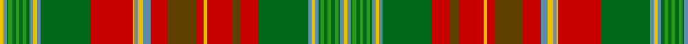

This page is one **sett** — a single exact thread-count. It belongs to the [tartan](/tartans/y2b2g1ga2g2ga2g2ga2g2b2y2b2g28r24y1n2y3b4r10t16r4y2r14t5r10g28b2y2b2g1ga2g2ga2g2ga2g1b2y2/)
(the same proportion at any scale), whose colour order is pattern [YBGGGGGGGBYBGRGRYRGRBYRYRGBYBGGGGGGGBY](/stripes/ybgggggggbybgrgryrgrbyryrgbybgggggggby/).

Sourced from house-of-tartan.  It is a [38 stripe tartan](/stripes/stripes38/).

Original link http://www.house-of-tartan.scotland.net/house/TartanViewjs.asp?colr=Def&tnam=1880

## Thread count
Y/2 B2 G1 Ga2 G2 Ga2 G2 Ga2 G2 B2 Y2 B2 G28 R24 Y1 N2 Y3 B4 R10 T16 R4 Y2 R14 T5 R10 G28 B2 Y2 B2 G1 Ga2 G2 Ga2 G2 Ga2 G1 B2 Y/2

## Palette
Each colour and the base-6 reference it is a variant of.

| Colour | Shade | Base |
|---|---|---|
| B | <code style="background-color:#5C8CA8;">#5C8CA8</code> `oklch(61.7% 0.067 235.0)` <small>#5C8CA8</small> | B <code style="background-color:#2A418A;">#2A418A</code> |
| G | <code style="background-color:#006818;">#006818</code> `oklch(45.0% 0.142 145.0)` <small>#006818</small> | G <code style="background-color:#006100;">#006100</code> |
| Ga | <code style="background-color:#289C18;">#289C18</code> `oklch(60.6% 0.191 141.6)` <small>#289C18</small> | G <code style="background-color:#006100;">#006100</code> |
| N | <code style="background-color:#888888;">#888888</code> `oklch(62.7% 0.000 89.9)` <small>#888888</small> | R <code style="background-color:#CC0000;">#CC0000</code> |
| R | <code style="background-color:#C80000;">#C80000</code> `oklch(52.3% 0.215 29.2)` <small>#C80000</small> | R <code style="background-color:#CC0000;">#CC0000</code> |
| T | <code style="background-color:#604000;">#604000</code> `oklch(39.8% 0.083 76.8)` <small>#604000</small> | G <code style="background-color:#006100;">#006100</code> |
| Y | <code style="background-color:#E8C000;">#E8C000</code> `oklch(81.9% 0.168 93.7)` <small>#E8C000</small> | Y <code style="background-color:#F2BF00;">#F2BF00</code> |

## Nearest tartans

The nearest existing variants by ΔTartan distance, with this tartan at the top so the swatches line up against it.

ΔTartan

Tartan

Sett

—

<a href="/ttd/edit/#slug=ly2t2g1g2g2g2g2g2g2t2ly2t2g28r24ly1o2ly3t4r10dy16r4ly2r14dy5r10g28t2ly2t2g1g2g2g2g2g2g1t2ly2">New Brunswick variation Canadian Tartan Tartan Number: 1880. Earliest known date: pre 2003 Sent in by Tweedmill for information. See products available Copyright © Blair Urquhart, Comrie, 2015</a> <a class="nn-out" href="/setts/s38/ly2t2g1g2g2g2g2g2g2t2ly2t2g28r24ly1o2ly3t4r10dy16r4ly2r14dy5r10g28t2ly2t2g1g2g2g2g2g2g1t2ly2/" title="open its dictionary page">↗</a>

0.34

<a href="/ttd/edit/#slug=ly2t2g1g2g2g2g2g2g2t2ly2t2g28r24ly1y2ly3t4r10o16r4ly2r14o5r10g28t2ly2t2g1g2g2g2g2g2g1t2ly2">New Brunswick, variation</a> <a class="nn-out" href="/setts/s38/ly2t2g1g2g2g2g2g2g2t2ly2t2g28r24ly1y2ly3t4r10o16r4ly2r14o5r10g28t2ly2t2g1g2g2g2g2g2g1t2ly2/" title="open its dictionary page">↗</a>

0.50

<a href="/ttd/edit/#slug=t1ly1t1g1g2g2g2g2g2g1t1ly1t1ly1t1g28r24ly1o2ly3t4r10dy16r4ly2r15dy5r9g28t1ly1t1ly1t1g1g2g2g2g2g2g1t1ly1t1~x2">New Brunswick</a> <a class="nn-out" href="/setts/s44/t1ly1t1g1g2g2g2g2g2g1t1ly1t1ly1t1g28r24ly1o2ly3t4r10dy16r4ly2r15dy5r9g28t1ly1t1ly1t1g1g2g2g2g2g2g1t1ly1t1~x2/" title="open its dictionary page">↗</a>

1.28

<a href="/ttd/edit/#slug=t1ly1t1dg1g2dg2g2dg2g2dg1t1ly1t1ly1t1dg28r24ly1o2ly3t4r10o16r4ly2r15o5r9dg28t1ly1t1ly1t1dg1g2dg2g2dg2g2dg1t1ly1t1~x2">New Brunswick (Lyon Court Books)</a> <a class="nn-out" href="/setts/s44/t1ly1t1dg1g2dg2g2dg2g2dg1t1ly1t1ly1t1dg28r24ly1o2ly3t4r10o16r4ly2r15o5r9dg28t1ly1t1ly1t1dg1g2dg2g2dg2g2dg1t1ly1t1~x2/" title="open its dictionary page">↗</a>

1.35

<a href="/ttd/edit/#slug=t1ly1t1dg1g2dg2g2dg2g2dg1t1ly1t1ly1t1dg18r16ly1y2ly3t4r8o9r3ly2r9o5r6dg18t1ly1t1ly1t1dg1g2dg2g2dg2g2dg1t1ly1t1~x2">New Brunswick, or Beaverbrook</a> <a class="nn-out" href="/setts/s44/t1ly1t1dg1g2dg2g2dg2g2dg1t1ly1t1ly1t1dg18r16ly1y2ly3t4r8o9r3ly2r9o5r6dg18t1ly1t1ly1t1dg1g2dg2g2dg2g2dg1t1ly1t1~x2/" title="open its dictionary page">↗</a>

1.42

<a href="/ttd/edit/#slug=t1ly1t1dg1g2dg2g2dg2g2dg1t1ly1t1ly1t1dg18r16ly1o2ly3t4r8dr9r3ly2r9dr5r6dg18t1ly1t1ly1t1dg1g2dg2g2dg2g2dg1t1ly1t1~x2">New Brunswick or Beaverbrook District Tartan Tartan Number: 663. Earliest known date: 1959 The entry in the Lyon Court Books reads, &quot;This tartan is assymetrical. The sett reading along the warp from the left may be divided into four equal sections of 190 threads. The first is symetrical, The second is assymetrical, The third is the same as the first, The fourth is the same as the second but in reverse&quot; In reality the pattern is symetrical and has 380 threads in half sett as careful reading of Lord Lyons description reveals. The design was commissioned by Lord Beaverbrook and adopted by the Province. See products available Copyright © Blair Urquhart, Comrie, 2015</a> <a class="nn-out" href="/setts/s44/t1ly1t1dg1g2dg2g2dg2g2dg1t1ly1t1ly1t1dg18r16ly1o2ly3t4r8dr9r3ly2r9dr5r6dg18t1ly1t1ly1t1dg1g2dg2g2dg2g2dg1t1ly1t1~x2/" title="open its dictionary page">↗</a>

1.69

<a href="/setts/s32/r50w2db7lo2g33g12db7lo3w2lo3db7g12g33lo2db7w2r17~x2/">Spens Fragment</a>

1.73

<a href="/ttd/edit/#slug=t2p10r3r4g72r7g4r10db24p6r5r4r5p7g24r24g24r3db3r74p7r5r6t2~x2">MacDougall, of MacDougall</a> <a class="nn-out" href="/setts/s24/t2p10r3r4g72r7g4r10db24p6r5r4r5p7g24r24g24r3db3r74p7r5r6t2~x2/" title="open its dictionary page">↗</a>

1.74

<a href="/ttd/edit/#slug=k4w2k2w1t6r6g6w1g27w1db4t4dy3w1dy3t4db4w1r36db3t2w1t2db3~x2">Ross Wedding Dress</a> <a class="nn-out" href="/setts/s24/k4w2k2w1t6r6g6w1g27w1db4t4dy3w1dy3t4db4w1r36db3t2w1t2db3~x2/" title="open its dictionary page">↗</a>

1.76

<a href="/ttd/edit/#slug=k4w2k2w1t6r6g6w1g27w1db4t4o3w1o3t4db4w1r36db3t2w1t2db3~x2">Ross, Wedding dress</a> <a class="nn-out" href="/setts/s24/k4w2k2w1t6r6g6w1g27w1db4t4o3w1o3t4db4w1r36db3t2w1t2db3~x2/" title="open its dictionary page">↗</a>

1.82

<a href="/ttd/edit/#slug=g16k1b2k1lo4k1lo4k1b2k1r16w2r16k1b2k1lo4k1lo4k1b2k1g16b2~x4">Baxter Clan/Family Tartan Tartan Number: 3664. Earliest known date: 1856 This Baxter tartan is recorded by Logan (c.1832) as &quot;Buchanan&quot;. Logans complied his tartan list from the limited information available at the time. It appears in a description as Baxter in D. Macgregor Peter's Baronage of Angus &amp; Mearns, 1856. The principal branch of the clan is the Baxters of Earlshall who live at Leuchars in north Fife. See products available Copyright © Blair Urquhart, Comrie, 2015</a> <a class="nn-out" href="/setts/s24/g16k1b2k1lo4k1lo4k1b2k1r16w2r16k1b2k1lo4k1lo4k1b2k1g16b2~x4/" title="open its dictionary page">↗</a>

## Neighbour map

Every grey dot is one of 14299 variants placed by the first two principal components of the ΔTartan feature space (44% of its variance). Red is this tartan; blue dots are its nearest — click one to open its page.

<svg viewBox="0 0 640 380" role="img" style="max-width:100%;height:auto;border:1px solid #e0e0e0;border-radius:4px;display:block" xmlns="http://www.w3.org/2000/svg"><image href="/nn/cloud.v1.png" width="640" height="380"/><a href="/setts/s38/ly2t2g1g2g2g2g2g2g2t2ly2t2g28r24ly1y2ly3t4r10o16r4ly2r14o5r10g28t2ly2t2g1g2g2g2g2g2g1t2ly2/"><circle cx="178.7" cy="16.8" r="4" fill="#3465a4"><title>New Brunswick, variation</title></circle></a><a href="/setts/s44/t1ly1t1g1g2g2g2g2g2g1t1ly1t1ly1t1g28r24ly1o2ly3t4r10dy16r4ly2r15dy5r9g28t1ly1t1ly1t1g1g2g2g2g2g2g1t1ly1t1~x2/"><circle cx="189.2" cy="14.0" r="4" fill="#3465a4"><title>New Brunswick</title></circle></a><a href="/setts/s44/t1ly1t1dg1g2dg2g2dg2g2dg1t1ly1t1ly1t1dg28r24ly1o2ly3t4r10o16r4ly2r15o5r9dg28t1ly1t1ly1t1dg1g2dg2g2dg2g2dg1t1ly1t1~x2/"><circle cx="173.7" cy="14.0" r="4" fill="#3465a4"><title>New Brunswick (Lyon Court Books)</title></circle></a><a href="/setts/s44/t1ly1t1dg1g2dg2g2dg2g2dg1t1ly1t1ly1t1dg18r16ly1y2ly3t4r8o9r3ly2r9o5r6dg18t1ly1t1ly1t1dg1g2dg2g2dg2g2dg1t1ly1t1~x2/"><circle cx="118.6" cy="16.6" r="4" fill="#3465a4"><title>New Brunswick, or Beaverbrook</title></circle></a><a href="/setts/s44/t1ly1t1dg1g2dg2g2dg2g2dg1t1ly1t1ly1t1dg18r16ly1o2ly3t4r8dr9r3ly2r9dr5r6dg18t1ly1t1ly1t1dg1g2dg2g2dg2g2dg1t1ly1t1~x2/"><circle cx="118.1" cy="16.0" r="4" fill="#3465a4"><title>New Brunswick or Beaverbrook District Tartan Tartan Number: 663. Earliest known date: 1959 The entry in the Lyon Court Books reads, &quot;This tartan is assymetrical. The sett reading along the warp from the left may be divided into four equal sections of 190 threads. The first is symetrical, The second is assymetrical, The third is the same as the first, The fourth is the same as the second but in reverse&quot; In reality the pattern is symetrical and has 380 threads in half sett as careful reading of Lord Lyons description reveals. The design was commissioned by Lord Beaverbrook and adopted by the Province. See products available Copyright © Blair Urquhart, Comrie, 2015</title></circle></a><a href="/setts/s32/r50w2db7lo2g33g12db7lo3w2lo3db7g12g33lo2db7w2r17~x2/"><circle cx="175.4" cy="54.0" r="4" fill="#3465a4"><title>Spens Fragment</title></circle></a><a href="/setts/s24/t2p10r3r4g72r7g4r10db24p6r5r4r5p7g24r24g24r3db3r74p7r5r6t2~x2/"><circle cx="251.7" cy="38.9" r="4" fill="#3465a4"><title>MacDougall, of MacDougall</title></circle></a><a href="/setts/s24/k4w2k2w1t6r6g6w1g27w1db4t4dy3w1dy3t4db4w1r36db3t2w1t2db3~x2/"><circle cx="164.6" cy="14.0" r="4" fill="#3465a4"><title>Ross Wedding Dress</title></circle></a><a href="/setts/s24/k4w2k2w1t6r6g6w1g27w1db4t4o3w1o3t4db4w1r36db3t2w1t2db3~x2/"><circle cx="157.2" cy="14.0" r="4" fill="#3465a4"><title>Ross, Wedding dress</title></circle></a><a href="/setts/s24/g16k1b2k1lo4k1lo4k1b2k1r16w2r16k1b2k1lo4k1lo4k1b2k1g16b2~x4/"><circle cx="144.1" cy="70.2" r="4" fill="#3465a4"><title>Baxter Clan/Family Tartan Tartan Number: 3664. Earliest known date: 1856 This Baxter tartan is recorded by Logan (c.1832) as &quot;Buchanan&quot;. Logans complied his tartan list from the limited information available at the time. It appears in a description as Baxter in D. Macgregor Peter's Baronage of Angus &amp; Mearns, 1856. The principal branch of the clan is the Baxters of Earlshall who live at Leuchars in north Fife. See products available Copyright © Blair Urquhart, Comrie, 2015</title></circle></a><circle cx="177.3" cy="15.9" r="5" fill="#c00000"/></svg>

ID: /setts/s38/ly2t2g1g2g2g2g2g2g2t2ly2t2g28r24ly1o2ly3t4r10dy16r4ly2r14dy5r10g28t2ly2t2g1g2g2g2g2g2g1t2ly2/
