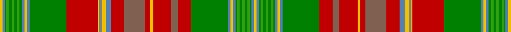

In pattern [YBGGGGGGGBYBGRRRYRRRBYGYRGBYBGGGGGGGBY](/stripes/ybgggggggbybgrrryrrrbygyrgbybgggggggby/).

This was sourced from weddslist.  It is a [38 stripe tartan](/stripes/stripes38/).

Original link http://www.weddslist.com/cgi-bin/tartans/pg.pl?source=sts

## Thread count
Y/2 B2 Ga1 G2 Ga2 G2 Ga2 G2 Ga2 B2 Y2 B2 Ga28 R24 Y1 N2 Y3 B4 R10 LT16 R4 Y2 R14 LT5 R10 Ga28 B2 Y2 B2 Ga1 G2 Ga2 G2 Ga2 G2 Ga1 B2 Y/2

## Palette
Each colour and the base-6 reference it is a variant of.

| Colour | Shade | Base |
|---|---|---|
| B | <code style="background-color:#5480B0;">#5480B0</code> `oklch(58.8% 0.089 251.5)` <small>#5480B0</small> | B <code style="background-color:#2A418A;">#2A418A</code> |
| G | <code style="background-color:#30A010;">#30A010</code> `oklch(61.9% 0.195 140.5)` <small>#30A010</small> | G <code style="background-color:#006100;">#006100</code> |
| Ga | <code style="background-color:#008000;">#008000</code> `oklch(52.0% 0.177 142.5)` <small>#008000</small> | G <code style="background-color:#006100;">#006100</code> |
| LT | <code style="background-color:#806050;">#806050</code> `oklch(51.7% 0.049 47.8)` <small>#806050</small> | R <code style="background-color:#CC0000;">#CC0000</code> |
| N | <code style="background-color:#808080;">#808080</code> `oklch(60.0% 0.000 89.9)` <small>#808080</small> | G <code style="background-color:#006100;">#006100</code> |
| R | <code style="background-color:#C00000;">#C00000</code> `oklch(50.7% 0.208 29.2)` <small>#C00000</small> | R <code style="background-color:#CC0000;">#CC0000</code> |
| Y | <code style="background-color:#F0C000;">#F0C000</code> `oklch(82.7% 0.169 90.5)` <small>#F0C000</small> | Y <code style="background-color:#F2BF00;">#F2BF00</code> |

## Nearest tartans

The nearest existing variants by ΔTartan distance.

1. [New Brunswick variation Canadian Tartan Tartan Number: 1880. Earliest known date: pre 2003 Sent in by Tweedmill for information. See products available Copyright © Blair Urquhart, Comrie, 2015](/setts/s38/ly2t2g1g2g2g2g2g2g2t2ly2t2g28r24ly1o2ly3t4r10dy16r4ly2r14dy5r10g28t2ly2t2g1g2g2g2g2g2g1t2ly2/) — ΔT 0.34
1. [New Brunswick](/setts/s44/t1ly1t1g1g2g2g2g2g2g1t1ly1t1ly1t1g28r24ly1o2ly3t4r10dy16r4ly2r15dy5r9g28t1ly1t1ly1t1g1g2g2g2g2g2g1t1ly1t1~x2/) — ΔT 0.61
1. [New Brunswick (Lyon Court Books)](/setts/s44/t1ly1t1dg1g2dg2g2dg2g2dg1t1ly1t1ly1t1dg28r24ly1o2ly3t4r10o16r4ly2r15o5r9dg28t1ly1t1ly1t1dg1g2dg2g2dg2g2dg1t1ly1t1~x2/) — ΔT 1.58
1. [New Brunswick, or Beaverbrook](/setts/s44/t1ly1t1dg1g2dg2g2dg2g2dg1t1ly1t1ly1t1dg18r16ly1y2ly3t4r8o9r3ly2r9o5r6dg18t1ly1t1ly1t1dg1g2dg2g2dg2g2dg1t1ly1t1~x2/) — ΔT 1.60
1. [New Brunswick or Beaverbrook District Tartan Tartan Number: 663. Earliest known date: 1959 The entry in the Lyon Court Books reads, "This tartan is assymetrical. The sett reading along the warp from the left may be divided into four equal sections of 190 threads. The first is symetrical, The second is assymetrical, The third is the same as the first, The fourth is the same as the second but in reverse" In reality the pattern is symetrical and has 380 threads in half sett as careful reading of Lord Lyons description reveals. The design was commissioned by Lord Beaverbrook and adopted by the Province. See products available Copyright © Blair Urquhart, Comrie, 2015](/setts/s44/t1ly1t1dg1g2dg2g2dg2g2dg1t1ly1t1ly1t1dg18r16ly1o2ly3t4r8dr9r3ly2r9dr5r6dg18t1ly1t1ly1t1dg1g2dg2g2dg2g2dg1t1ly1t1~x2/) — ΔT 1.67
1. [Spens Fragment](/setts/s32/r50w2db7lo2g33g12db7lo3w2lo3db7g12g33lo2db7w2r17~x2/) — ΔT 1.75
1. [Stewart (Silk Fragment)](/setts/s24/db4w2db2w1t5lo5g5w1g20w1db4t4dy3w1dy3t4db4w1lo30db2t2w1t2db2~x2/) — ΔT 1.85
1. [Stewart, Silk](/setts/s24/db4w2db2w1t5lo5g5w1g20w1db4t4o3w1o3t4db4w1lo30db2t2w1t2db2~x2/) — ΔT 1.86
1. [MacDougall, of MacDougall](/setts/s24/t2p10r3r4g72r7g4r10db24p6r5r4r5p7g24r24g24r3db3r74p7r5r6t2~x2/) — ΔT 1.88
1. [Ross Wedding Dress](/setts/s24/k4w2k2w1t6r6g6w1g27w1db4t4dy3w1dy3t4db4w1r36db3t2w1t2db3~x2/) — ΔT 1.91

## Neighbour map

Every grey dot is one of 14299 variants placed by the first two principal components of the ΔTartan feature space (44% of its variance). Red is this tartan; blue dots are its nearest — click one to open its page.

<svg viewBox="0 0 640 380" role="img" style="max-width:100%;height:auto;border:1px solid #e0e0e0;border-radius:4px;display:block" xmlns="http://www.w3.org/2000/svg"><image href="/nn/cloud.v1.png" width="640" height="380"/><a href="/setts/s38/ly2t2g1g2g2g2g2g2g2t2ly2t2g28r24ly1o2ly3t4r10dy16r4ly2r14dy5r10g28t2ly2t2g1g2g2g2g2g2g1t2ly2/"><circle cx="177.3" cy="15.9" r="4" fill="#3465a4"><title>New Brunswick variation Canadian Tartan Tartan Number: 1880. Earliest known date: pre 2003 Sent in by Tweedmill for information. See products available Copyright © Blair Urquhart, Comrie, 2015</title></circle></a><a href="/setts/s44/t1ly1t1g1g2g2g2g2g2g1t1ly1t1ly1t1g28r24ly1o2ly3t4r10dy16r4ly2r15dy5r9g28t1ly1t1ly1t1g1g2g2g2g2g2g1t1ly1t1~x2/"><circle cx="189.2" cy="14.0" r="4" fill="#3465a4"><title>New Brunswick</title></circle></a><a href="/setts/s44/t1ly1t1dg1g2dg2g2dg2g2dg1t1ly1t1ly1t1dg28r24ly1o2ly3t4r10o16r4ly2r15o5r9dg28t1ly1t1ly1t1dg1g2dg2g2dg2g2dg1t1ly1t1~x2/"><circle cx="173.7" cy="14.0" r="4" fill="#3465a4"><title>New Brunswick (Lyon Court Books)</title></circle></a><a href="/setts/s44/t1ly1t1dg1g2dg2g2dg2g2dg1t1ly1t1ly1t1dg18r16ly1y2ly3t4r8o9r3ly2r9o5r6dg18t1ly1t1ly1t1dg1g2dg2g2dg2g2dg1t1ly1t1~x2/"><circle cx="118.6" cy="16.6" r="4" fill="#3465a4"><title>New Brunswick, or Beaverbrook</title></circle></a><a href="/setts/s44/t1ly1t1dg1g2dg2g2dg2g2dg1t1ly1t1ly1t1dg18r16ly1o2ly3t4r8dr9r3ly2r9dr5r6dg18t1ly1t1ly1t1dg1g2dg2g2dg2g2dg1t1ly1t1~x2/"><circle cx="118.1" cy="16.0" r="4" fill="#3465a4"><title>New Brunswick or Beaverbrook District Tartan Tartan Number: 663. Earliest known date: 1959 The entry in the Lyon Court Books reads, &quot;This tartan is assymetrical. The sett reading along the warp from the left may be divided into four equal sections of 190 threads. The first is symetrical, The second is assymetrical, The third is the same as the first, The fourth is the same as the second but in reverse&quot; In reality the pattern is symetrical and has 380 threads in half sett as careful reading of Lord Lyons description reveals. The design was commissioned by Lord Beaverbrook and adopted by the Province. See products available Copyright © Blair Urquhart, Comrie, 2015</title></circle></a><a href="/setts/s32/r50w2db7lo2g33g12db7lo3w2lo3db7g12g33lo2db7w2r17~x2/"><circle cx="175.4" cy="54.0" r="4" fill="#3465a4"><title>Spens Fragment</title></circle></a><a href="/setts/s24/db4w2db2w1t5lo5g5w1g20w1db4t4dy3w1dy3t4db4w1lo30db2t2w1t2db2~x2/"><circle cx="162.4" cy="35.9" r="4" fill="#3465a4"><title>Stewart (Silk Fragment)</title></circle></a><a href="/setts/s24/db4w2db2w1t5lo5g5w1g20w1db4t4o3w1o3t4db4w1lo30db2t2w1t2db2~x2/"><circle cx="159.1" cy="30.9" r="4" fill="#3465a4"><title>Stewart, Silk</title></circle></a><a href="/setts/s24/t2p10r3r4g72r7g4r10db24p6r5r4r5p7g24r24g24r3db3r74p7r5r6t2~x2/"><circle cx="251.7" cy="38.9" r="4" fill="#3465a4"><title>MacDougall, of MacDougall</title></circle></a><a href="/setts/s24/k4w2k2w1t6r6g6w1g27w1db4t4dy3w1dy3t4db4w1r36db3t2w1t2db3~x2/"><circle cx="164.6" cy="14.0" r="4" fill="#3465a4"><title>Ross Wedding Dress</title></circle></a><circle cx="178.7" cy="16.8" r="5" fill="#c00000"/></svg>

ID: /setts/s38/ly2t2g1g2g2g2g2g2g2t2ly2t2g28r24ly1y2ly3t4r10o16r4ly2r14o5r10g28t2ly2t2g1g2g2g2g2g2g1t2ly2/
