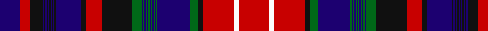

In pattern [BRKBKBKBKBKBKBKBKRKGBGBGBGBGBGBGBGKRWR](/patterns/brkbkbkbkbkbkbkbkrkgbgbgbgbgbgbgbgkrwr/).

This was sourced from tartans-authority.  It is a [38 stripes tartan](/stripes/stripes38/).

Original link http://www.tartansauthority.com/tartan-ferret/display/1964/

## Attestations

This cloth appears in 2 source records; the oldest owns this page.

- 1965 — Canadian Confederation (Commemorat) (tartans-authority, [record](http://www.tartansauthority.com/tartan-ferret/display/1964/))
- 01/01/1967 — Canadian Confederation (register-of-tartans, [record](https://www.tartanregister.gov.uk/tartanDetails.aspx?ref=545))

## Thread count
DB/16 R8 K8 DB1 K1 DB1 K1 DB1 K1 DB1 K1 DB1 K1 DB1 K1 DB20 K4 R12 K24 G8 DB1 G1 DB1 G1 DB1 G1 DB1 G1 DB1 G1 DB1 G1 DB26 G6 K4 R24 W4 R/24

## Palette
Each colour and its ΔE from the base-6 reference it is a variant of.

| Colour | Shade | Base | ΔE (OKLab) |
|---|---|---|---|
| DB | <code style="background-color:#1C0070;">#1C0070</code> `#1C0070` | B <code style="background-color:#2A418A;">#2A418A</code> | 0.14 |
| G | <code style="background-color:#006818;">#006818</code> `#006818` | G <code style="background-color:#006100;">#006100</code> | 0.02 |
| K | <code style="background-color:#101010;">#101010</code> `#101010` | K <code style="background-color:#000000;">#000000</code> | 0.17 |
| R | <code style="background-color:#C80000;">#C80000</code> `#C80000` | R <code style="background-color:#CC0000;">#CC0000</code> | 0.01 |
| W | <code style="background-color:#FCFCFC;">#FCFCFC</code> `#FCFCFC` | W <code style="background-color:#F7F7F7;">#F7F7F7</code> | 0.01 |

## Nearest tartans

The nearest existing variants by ΔTartan distance.

1. [Canadian Confederation Canadian Tartan Tartan Number: 1964. Earliest known date: pre 2003 Re-do this sett to make 12 single thread strips where 8 exist here. See products available Copyright © Blair Urquhart, Comrie, 2015](/setts/s30/k8r8b16r24w4r24k4g6b26g1b1g1b1g1b1g1b1g8k24r12k4b20k1b1k1b1k1b1k1b1~b2c2c80-g006818-k101010-rc80000-we0e0e0/) — ΔT 0.75
1. [13, Confederation](/setts/s30/k8r8b16r24w4r24k4g6b26g1b1g1b1g1b1g1b1g8k24r12k4b20k1b1k1b1k1b1k1b1~b304080-g008000-k000000-rc00000-we0e0e0/) — ΔT 0.86
1. [Harris (1997) (Personal)](/setts/s26/r4k1w4k1r18k3r4k3r4k10b30k6b4w6b4k6b30k10r4k3r4k3r18k1w4k1~b2c2c80-k101010-rc80000-wfcfcfc~x2/) — ΔT 1.46
1. [Arran, Isle of (Lochcarron)](/setts/s48/k7r1k2r2k2r2k1r3w2r3k1r2k2r2k2r1k7b10k2b4k2b10k7r1k2r2k2r2k1r3w2r3k1r2k2r2k2r1k7ba2g2ba2g2ba40g2ba2g2ba2~b5c5c5c-ba440044-g006818-k101010-rc8002c-wf8f8f8~x2/) — ΔT 1.54
1. [Unidentified #52](/setts/s48/b18k6b36k34r1k6r4k4r6k2r7w3r7k2r6k4r4k6r1k34ba10g8ba8g10ba96g10ba8g8ba10k34r1k6r4k4r6k2r7w3r7k2r6k4r4k6r1k34b36k6~b788ccc-ba8c008c-g48783c-k000000-rc80000-wfcfcfc~x2/) — ΔT 1.66
1. [Arran District Tartan Tartan Number: 381. Earliest known date: 1982 The Arran District tartan is a modern sett introduced by MacNaughtons of Pitlochry in 1982. It has recently been produced with a colour modification by Lochcarron Mills in Galashiels. The unusual ever decreasing stripe effect is taken from a pattern book of old plaids found on the Isle of Arran. See products available Copyright © Blair Urquhart, Comrie, 2015](/setts/s24/b90r5b5r5b5k16ra3k5ra4k4ra5k3ra6w4ra6k3ra5k4ra4k5ra3k16r22k5~b780078-k101010-r888888-rac80000-we0e0e0/) — ΔT 1.71
1. [New Hampshire District Tartan Tartan Number: 1102. Earliest known date: 1994 New Hampshire State Representative Steven Avery, arranged for Governor Stephen Merrill to proclaim the Tartan as the State Tartan of New Hampshire in June 1994. In January 1995, Avery introduced the bill to the NH Legislature for permanent recognition, which was passed in May, 1995. The purple represents the finch and the lilac, green the forests, black the granite mountains, white for the snow, and red for the States heroes. New Hampshire Revised Statutes Annotated (RSA) 3:21. See products available Copyright © Blair Urquhart, Comrie, 2015](/setts/s21/g20k1g1k6w1k6b1k1b4r3b14r3b4k1b1k6w1k6g1k1g8~b780078-g006818-k101010-rc80000-we0e0e0~x2/) — ΔT 1.78
1. [Holyrood (Chair)](/setts/s24/r34w1b10g10w1y1g2ba2w1b2ba10r6w1r6ba10b2w1ba2g2y1w1g10b10w1~b202060-ba2888c4-g003820-rc80000-wfcfcfc-yd8b000~x2/) — ΔT 1.78
1. [Kormylo (Personal)](/setts/s22/r9b3g12r2b40r2g20b2r18b2w2b2r18b2g20r2b40r2g12b3r9y2~b202060-g003820-rc80000-wfcfcfc-ye8c000~x2/) — ΔT 1.79
1. [Unnamed C18th - Hynde Cotton Plaid](/setts/s45/w2b1r3ra7g7r2b1r2g7r41b40w2r4ra4r1ra1r1ra4r4g15r4ra4r1ra1r1ra4r4w2k40r3g36r5ra5r1ra5r5b38r40g16w2r8ra8r3ra2r1~b202060-g285800-k101010-rc80000-raa00048-wfcfcfc~x2/) — ΔT 1.79

## Neighbour map

Every grey dot is one of 15726 variants placed by the first two principal components of the ΔTartan feature space (44% of its variance). Red is this tartan; blue dots are its nearest — click one to open its page.

<svg viewBox="0 0 640 380" role="img" style="max-width:100%;height:auto;border:1px solid #e0e0e0;border-radius:4px;display:block" xmlns="http://www.w3.org/2000/svg"><image href="/nn/cloud.v1.png" width="640" height="380"/><a href="/setts/s30/k8r8b16r24w4r24k4g6b26g1b1g1b1g1b1g1b1g8k24r12k4b20k1b1k1b1k1b1k1b1~b2c2c80-g006818-k101010-rc80000-we0e0e0/"><circle cx="199.5" cy="57.8" r="4" fill="#3465a4"><title>Canadian Confederation Canadian Tartan Tartan Number: 1964. Earliest known date: pre 2003 Re-do this sett to make 12 single thread strips where 8 exist here. See products available Copyright © Blair Urquhart, Comrie, 2015</title></circle></a><a href="/setts/s30/k8r8b16r24w4r24k4g6b26g1b1g1b1g1b1g1b1g8k24r12k4b20k1b1k1b1k1b1k1b1~b304080-g008000-k000000-rc00000-we0e0e0/"><circle cx="179.3" cy="51.8" r="4" fill="#3465a4"><title>13, Confederation</title></circle></a><a href="/setts/s26/r4k1w4k1r18k3r4k3r4k10b30k6b4w6b4k6b30k10r4k3r4k3r18k1w4k1~b2c2c80-k101010-rc80000-wfcfcfc~x2/"><circle cx="209.8" cy="75.2" r="4" fill="#3465a4"><title>Harris (1997) (Personal)</title></circle></a><a href="/setts/s48/k7r1k2r2k2r2k1r3w2r3k1r2k2r2k2r1k7b10k2b4k2b10k7r1k2r2k2r2k1r3w2r3k1r2k2r2k2r1k7ba2g2ba2g2ba40g2ba2g2ba2~b5c5c5c-ba440044-g006818-k101010-rc8002c-wf8f8f8~x2/"><circle cx="190.2" cy="14.0" r="4" fill="#3465a4"><title>Arran, Isle of (Lochcarron)</title></circle></a><a href="/setts/s48/b18k6b36k34r1k6r4k4r6k2r7w3r7k2r6k4r4k6r1k34ba10g8ba8g10ba96g10ba8g8ba10k34r1k6r4k4r6k2r7w3r7k2r6k4r4k6r1k34b36k6~b788ccc-ba8c008c-g48783c-k000000-rc80000-wfcfcfc~x2/"><circle cx="172.4" cy="14.0" r="4" fill="#3465a4"><title>Unidentified #52</title></circle></a><a href="/setts/s24/b90r5b5r5b5k16ra3k5ra4k4ra5k3ra6w4ra6k3ra5k4ra4k5ra3k16r22k5~b780078-k101010-r888888-rac80000-we0e0e0/"><circle cx="275.6" cy="36.2" r="4" fill="#3465a4"><title>Arran District Tartan Tartan Number: 381. Earliest known date: 1982 The Arran District tartan is a modern sett introduced by MacNaughtons of Pitlochry in 1982. It has recently been produced with a colour modification by Lochcarron Mills in Galashiels. The unusual ever decreasing stripe effect is taken from a pattern book of old plaids found on the Isle of Arran. See products available Copyright © Blair Urquhart, Comrie, 2015</title></circle></a><a href="/setts/s21/g20k1g1k6w1k6b1k1b4r3b14r3b4k1b1k6w1k6g1k1g8~b780078-g006818-k101010-rc80000-we0e0e0~x2/"><circle cx="184.3" cy="95.4" r="4" fill="#3465a4"><title>New Hampshire District Tartan Tartan Number: 1102. Earliest known date: 1994 New Hampshire State Representative Steven Avery, arranged for Governor Stephen Merrill to proclaim the Tartan as the State Tartan of New Hampshire in June 1994. In January 1995, Avery introduced the bill to the NH Legislature for permanent recognition, which was passed in May, 1995. The purple represents the finch and the lilac, green the forests, black the granite mountains, white for the snow, and red for the States heroes. New Hampshire Revised Statutes Annotated (RSA) 3:21. See products available Copyright © Blair Urquhart, Comrie, 2015</title></circle></a><a href="/setts/s24/r34w1b10g10w1y1g2ba2w1b2ba10r6w1r6ba10b2w1ba2g2y1w1g10b10w1~b202060-ba2888c4-g003820-rc80000-wfcfcfc-yd8b000~x2/"><circle cx="175.6" cy="25.9" r="4" fill="#3465a4"><title>Holyrood (Chair)</title></circle></a><a href="/setts/s22/r9b3g12r2b40r2g20b2r18b2w2b2r18b2g20r2b40r2g12b3r9y2~b202060-g003820-rc80000-wfcfcfc-ye8c000~x2/"><circle cx="246.8" cy="99.2" r="4" fill="#3465a4"><title>Kormylo (Personal)</title></circle></a><a href="/setts/s45/w2b1r3ra7g7r2b1r2g7r41b40w2r4ra4r1ra1r1ra4r4g15r4ra4r1ra1r1ra4r4w2k40r3g36r5ra5r1ra5r5b38r40g16w2r8ra8r3ra2r1~b202060-g285800-k101010-rc80000-raa00048-wfcfcfc~x2/"><circle cx="190.8" cy="14.0" r="4" fill="#3465a4"><title>Unnamed C18th - Hynde Cotton Plaid</title></circle></a><circle cx="196.1" cy="37.5" r="5" fill="#c00000"/></svg>

ID: /setts/s38/r24w4r24k4g6b26g1b1g1b1g1b1g1b1g1b1g1b1g8k24r12k4b20k1b1k1b1k1b1k1b1k1b1k1b1k8r8b16~b1c0070-g006818-k101010-rc80000-wfcfcfc/
