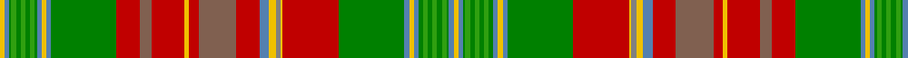

In pattern [YBGGGGGGGBYBGRRRYRRRBYGYRGBYBGGGGGGGBY](/patterns/ybgggggggbybgrrryrrrbygyrgbybgggggggby/).

This was sourced from weddslist.  It is a [38 stripes tartan](/stripes/stripes38/).

Original link http://www.weddslist.com/cgi-bin/tartans/pg.pl?source=sts

## Thread count
Y/4 B4 Ga2 G4 Ga4 G4 Ga4 G4 Ga2 B4 Y4 B4 Ga56 R20 LT10 R28 Y4 R8 LT32 R20 B8 Y6 N4 Y2 R48 Ga56 B4 Y4 B4 Ga4 G4 Ga4 G4 Ga4 G4 Ga2 B4 Y/4

## Palette
Each colour and its ΔE from the base-6 reference it is a variant of.

| Colour | Shade | Base | ΔE (OKLab) |
|---|---|---|---|
| B | <code style="background-color:#5480B0;">#5480B0</code> `#5480B0` | B <code style="background-color:#2A418A;">#2A418A</code> | 0.19 |
| G | <code style="background-color:#30A010;">#30A010</code> `#30A010` | G <code style="background-color:#006100;">#006100</code> | 0.20 |
| Ga | <code style="background-color:#008000;">#008000</code> `#008000` | G <code style="background-color:#006100;">#006100</code> | 0.10 |
| LT | <code style="background-color:#806050;">#806050</code> `#806050` | R <code style="background-color:#CC0000;">#CC0000</code> | 0.17 |
| N | <code style="background-color:#808080;">#808080</code> `#808080` | G <code style="background-color:#006100;">#006100</code> | 0.23 |
| R | <code style="background-color:#C00000;">#C00000</code> `#C00000` | R <code style="background-color:#CC0000;">#CC0000</code> | 0.03 |
| Y | <code style="background-color:#F0C000;">#F0C000</code> `#F0C000` | Y <code style="background-color:#F2BF00;">#F2BF00</code> | 0.00 |

## Nearest tartans

The nearest existing variants by ΔTartan distance.

1. [New Brunswick variation Canadian Tartan Tartan Number: 1880. Earliest known date: pre 2003 Sent in by Tweedmill for information. See products available Copyright © Blair Urquhart, Comrie, 2015](/setts/s38/y2b2g1ga2g2ga2g2ga2g2b2y2b2g28r24y1ra2y3b4r10gb16r4y2r14gb5r10g28b2y2b2g1ga2g2ga2g2ga2g1b2y2~b5c8ca8-g006818-ga289c18-gb604000-rc80000-ra888888-ye8c000~x2/) — ΔT 0.34
1. [New Brunswick](/setts/s44/b1y1b1g1ga2g2ga2g2ga2g1b1y1b1y1b1g28r24y1ra2y3b4r10gb16r4y2r15gb5r9g28b1y1b1y1b1g1ga2g2ga2g2ga2g1b1y1b1~b5c8ca8-g006818-ga289c18-gb604000-rc80000-ra888888-ye8c000~x2/) — ΔT 0.61
1. [New Brunswick (Lyon Court Books)](/setts/s44/b1y1b1g1ga2g2ga2g2ga2g1b1y1b1y1b1g28r24y1ra2y3b4r10rb16r4y2r15rb5r9g28b1y1b1y1b1g1ga2g2ga2g2ga2g1b1y1b1~b5c8ca8-g003820-ga289c18-rc80000-ra888888-rb6c0800-ye8c000~x2/) — ΔT 1.58
1. [New Brunswick, or Beaverbrook](/setts/s44/b1y1b1g1ga2g2ga2g2ga2g1b1y1b1y1b1g18r16y1gb2y3b4r8ra9r3y2r9ra5r6g18b1y1b1y1b1g1ga2g2ga2g2ga2g1b1y1b1~b5480b0-g003000-ga30a010-gb808080-rc00000-ra703000-yf0c000~x2/) — ΔT 1.60
1. [New Brunswick or Beaverbrook District Tartan Tartan Number: 663. Earliest known date: 1959 The entry in the Lyon Court Books reads, "This tartan is assymetrical. The sett reading along the warp from the left may be divided into four equal sections of 190 threads. The first is symetrical, The second is assymetrical, The third is the same as the first, The fourth is the same as the second but in reverse" In reality the pattern is symetrical and has 380 threads in half sett as careful reading of Lord Lyons description reveals. The design was commissioned by Lord Beaverbrook and adopted by the Province. See products available Copyright © Blair Urquhart, Comrie, 2015](/setts/s44/b1y1b1g1ga2g2ga2g2ga2g1b1y1b1y1b1g18r16y1ra2y3b4r8ba9r3y2r9ba5r6g18b1y1b1y1b1g1ga2g2ga2g2ga2g1b1y1b1~b5c8ca8-ba480800-g003820-ga289c18-rc80000-ra888888-ye8c000~x2/) — ΔT 1.67
1. [Spens Fragment](/setts/s32/r17w2b7y2g33ga12b7y3w2y3b7ga12g33y2b7w2r50w2b7y2g33ga12b7y3w2y3b7ga12g33y2b7w2~b2c2c80-g006818-ga289c18-rc80050-we0e0e0-ya08858~x2/) — ΔT 1.75
1. [Stewart (Silk Fragment)](/setts/s24/b4w2b2w1ba5y5g5w1g20w1b4ba4ga3w1ga3ba4b4w1y30b2ba2w1ba2b2~b2c2c80-ba5c8ca8-g006818-ga604000-we0e0e0-yd87c00~x2/) — ΔT 1.86
1. [Stewart, Silk](/setts/s24/b4w2b2w1ba5y5g5w1g20w1b4ba4r3w1r3ba4b4w1y30b2ba2w1ba2b2~b304080-ba5480b0-g008000-r806050-we0e0e0-yff8500~x2/) — ΔT 1.86
1. [MacDougall, of MacDougall](/setts/s24/b2ba10r3ra4g72ra7g4ra10bb24ba6r5ra4r5ba7g24ra24g24ra3bb3ra74ba7r5ra6b2~b5480b0-ba800080-bb304080-g008000-rd03030-rac00000~x2/) — ΔT 1.87
1. [Ross Wedding Dress](/setts/s24/k4w2k2w1b6r6g6w1g27w1ba4b4ga3w1ga3b4ba4w1r36ba3b2w1b2ba3~b5c8ca8-ba2c2c80-g006818-ga604000-k101010-rc80000-we0e0e0~x2/) — ΔT 1.91

## Neighbour map

Every grey dot is one of 15726 variants placed by the first two principal components of the ΔTartan feature space (44% of its variance). Red is this tartan; blue dots are its nearest — click one to open its page.

<svg viewBox="0 0 640 380" role="img" style="max-width:100%;height:auto;border:1px solid #e0e0e0;border-radius:4px;display:block" xmlns="http://www.w3.org/2000/svg"><image href="/nn/cloud.v1.png" width="640" height="380"/><a href="/setts/s38/y2b2g1ga2g2ga2g2ga2g2b2y2b2g28r24y1ra2y3b4r10gb16r4y2r14gb5r10g28b2y2b2g1ga2g2ga2g2ga2g1b2y2~b5c8ca8-g006818-ga289c18-gb604000-rc80000-ra888888-ye8c000~x2/"><circle cx="175.6" cy="14.0" r="4" fill="#3465a4"><title>New Brunswick variation Canadian Tartan Tartan Number: 1880. Earliest known date: pre 2003 Sent in by Tweedmill for information. See products available Copyright © Blair Urquhart, Comrie, 2015</title></circle></a><a href="/setts/s44/b1y1b1g1ga2g2ga2g2ga2g1b1y1b1y1b1g28r24y1ra2y3b4r10gb16r4y2r15gb5r9g28b1y1b1y1b1g1ga2g2ga2g2ga2g1b1y1b1~b5c8ca8-g006818-ga289c18-gb604000-rc80000-ra888888-ye8c000~x2/"><circle cx="187.4" cy="14.0" r="4" fill="#3465a4"><title>New Brunswick</title></circle></a><a href="/setts/s44/b1y1b1g1ga2g2ga2g2ga2g1b1y1b1y1b1g28r24y1ra2y3b4r10rb16r4y2r15rb5r9g28b1y1b1y1b1g1ga2g2ga2g2ga2g1b1y1b1~b5c8ca8-g003820-ga289c18-rc80000-ra888888-rb6c0800-ye8c000~x2/"><circle cx="171.8" cy="14.0" r="4" fill="#3465a4"><title>New Brunswick (Lyon Court Books)</title></circle></a><a href="/setts/s44/b1y1b1g1ga2g2ga2g2ga2g1b1y1b1y1b1g18r16y1gb2y3b4r8ra9r3y2r9ra5r6g18b1y1b1y1b1g1ga2g2ga2g2ga2g1b1y1b1~b5480b0-g003000-ga30a010-gb808080-rc00000-ra703000-yf0c000~x2/"><circle cx="116.3" cy="14.0" r="4" fill="#3465a4"><title>New Brunswick, or Beaverbrook</title></circle></a><a href="/setts/s44/b1y1b1g1ga2g2ga2g2ga2g1b1y1b1y1b1g18r16y1ra2y3b4r8ba9r3y2r9ba5r6g18b1y1b1y1b1g1ga2g2ga2g2ga2g1b1y1b1~b5c8ca8-ba480800-g003820-ga289c18-rc80000-ra888888-ye8c000~x2/"><circle cx="115.8" cy="14.0" r="4" fill="#3465a4"><title>New Brunswick or Beaverbrook District Tartan Tartan Number: 663. Earliest known date: 1959 The entry in the Lyon Court Books reads, &quot;This tartan is assymetrical. The sett reading along the warp from the left may be divided into four equal sections of 190 threads. The first is symetrical, The second is assymetrical, The third is the same as the first, The fourth is the same as the second but in reverse&quot; In reality the pattern is symetrical and has 380 threads in half sett as careful reading of Lord Lyons description reveals. The design was commissioned by Lord Beaverbrook and adopted by the Province. See products available Copyright © Blair Urquhart, Comrie, 2015</title></circle></a><a href="/setts/s32/r17w2b7y2g33ga12b7y3w2y3b7ga12g33y2b7w2r50w2b7y2g33ga12b7y3w2y3b7ga12g33y2b7w2~b2c2c80-g006818-ga289c18-rc80050-we0e0e0-ya08858~x2/"><circle cx="172.7" cy="48.0" r="4" fill="#3465a4"><title>Spens Fragment</title></circle></a><a href="/setts/s24/b4w2b2w1ba5y5g5w1g20w1b4ba4ga3w1ga3ba4b4w1y30b2ba2w1ba2b2~b2c2c80-ba5c8ca8-g006818-ga604000-we0e0e0-yd87c00~x2/"><circle cx="159.8" cy="30.7" r="4" fill="#3465a4"><title>Stewart (Silk Fragment)</title></circle></a><a href="/setts/s24/b4w2b2w1ba5y5g5w1g20w1b4ba4r3w1r3ba4b4w1y30b2ba2w1ba2b2~b304080-ba5480b0-g008000-r806050-we0e0e0-yff8500~x2/"><circle cx="156.8" cy="26.3" r="4" fill="#3465a4"><title>Stewart, Silk</title></circle></a><a href="/setts/s24/b2ba10r3ra4g72ra7g4ra10bb24ba6r5ra4r5ba7g24ra24g24ra3bb3ra74ba7r5ra6b2~b5480b0-ba800080-bb304080-g008000-rd03030-rac00000~x2/"><circle cx="250.5" cy="34.5" r="4" fill="#3465a4"><title>MacDougall, of MacDougall</title></circle></a><a href="/setts/s24/k4w2k2w1b6r6g6w1g27w1ba4b4ga3w1ga3b4ba4w1r36ba3b2w1b2ba3~b5c8ca8-ba2c2c80-g006818-ga604000-k101010-rc80000-we0e0e0~x2/"><circle cx="162.4" cy="14.0" r="4" fill="#3465a4"><title>Ross Wedding Dress</title></circle></a><circle cx="177.0" cy="14.0" r="5" fill="#c00000"/></svg>

ID: /setts/s38/y2b2g1ga2g2ga2g2ga2g2b2y2b2g28r24y1gb2y3b4r10ra16r4y2r14ra5r10g28b2y2b2g1ga2g2ga2g2ga2g1b2y2~b5480b0-g008000-ga30a010-gb808080-rc00000-ra806050-yf0c000~x2/
