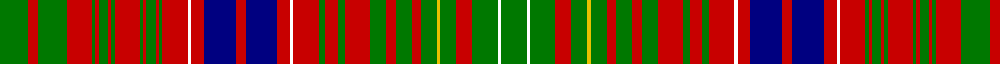

In pattern [GRGRGRGRGRGRGRGRWRBRBRWRGRGRGRGRGYGRGWG](/patterns/grgrgrgrgrgrgrgrwrbrbrwrgrgrgrgrgygrgwg/).

This was sourced from register-of-tartans.  It is a [39 stripes tartan](/stripes/stripes39/).

Original link https://www.tartanregister.gov.uk/tartanDetails.aspx?ref=6023

## Thread count
G/18 R6 G18 R16 G2 R2 G6 R2 G2 R16 G2 R2 G6 R2 G2 R16 W2 R8 DB20 R6 DB20 R8 W2 R16 G4 R8 G4 R16 G10 R6 G10 R6 G10 Y2 G10 R10 G16 W2 G/16

## Palette
Each colour and its ΔE from the base-6 reference it is a variant of.

| Colour | Shade | Base | ΔE (OKLab) |
|---|---|---|---|
| DB | <code style="background-color:#000080;">#000080</code> `#000080` | B <code style="background-color:#2C4084;">#2C4084</code> | 0.14 |
| G | <code style="background-color:#007800;">#007800</code> `#007800` | G <code style="background-color:#006400;">#006400</code> | 0.06 |
| R | <code style="background-color:#C80000;">#C80000</code> `#C80000` | R <code style="background-color:#C80000;">#C80000</code> | 0.00 |
| W | <code style="background-color:#FFFFFF;">#FFFFFF</code> `#FFFFFF` | W <code style="background-color:#F4F4F0;">#F4F4F0</code> | 0.03 |
| Y | <code style="background-color:#E8C000;">#E8C000</code> `#E8C000` | Y <code style="background-color:#E8C000;">#E8C000</code> | 0.00 |

## Nearest tartans

The nearest existing variants by ΔTartan distance.

1. [Lumsden Waistcoat](/setts/s39/g42w4g40r16g12y6g12r16g20r18g22r44g6r18g6r42w4r20b52r12b52r20w4r38g4r4g6r4g4r40g4r4g6r4g4r38g40r12g40-b304080-g008000-rc00000-we0e0e0-yf0c000/) — ΔT 0.91
1. [Lumsden (Waistcoat)](/setts/s39/g21w2g20r8g6y3g6r8g10r9g11r22g3r9g3r21w2r10b26r6b26r10w2r19g2r2g3r2g2r20g2r2g3r2g2r19g20r6g20-b2c2c80-g006818-rc80000-we0e0e0-ye8c000/) — ΔT 0.99
1. [Lumsden Short Version](/setts/s30/r18b2r2b4r2b2r18w2r8b22r4b22r8w2r18g4r8g4r18g10r6g8r6g6y2g6r6g12w2g12-b304080-g008000-rc00000-we0e0e0-yf0c000/) — ΔT 1.16
1. [MacMaster (New) Family Tartan Tartan Number: 3218. Earliest known date: 2001 Asymetrical design follows Canadian tradition. Elements of the MacInnes and the Nova Scotia tartans were included in line with Dave McMaster's family history. See products available Copyright © Blair Urquhart, Comrie, 2015](/setts/s28/g24r24g4r4g4r4g12y4r2y4g12r4g4r4g4r24b16g16k4r8k4r8k4g16b16r24g24ba4-b2c2c80-ba5c8ca8-g006818-k101010-rc80000-ye8c000/) — ΔT 1.32
1. [Kinnoull](/setts/s31/g46r12g46r50g8r20g8r50w6r20b62r12b62r20w6r50k4r4k8r4k4r50k4r4k8r4k4r50g46r12g46-b8080d0-g008000-k000000-rc00000-we0e0e0/) — ΔT 1.33
1. [Lumsden (Short)](/setts/s30/r18b2r2b4r2b2r18w2r8b22r4b22r8w2r18g4r8g4r18g10r6g8r6g6y2g6r6g12w2g12-b2c2c80-g006818-rc80000-we0e0e0-ye8c000/) — ΔT 1.33
1. [MacRae - 1810 (Prince's Own)](/setts/s38/g20r4g20r18k2r2k4r2k2r18k2r2k4r2k2r18w2r8b22r4b22r8w2r18g4r8g4r18g10r6g8r6g6y2g6r6g12w2-b1c1c50-g006818-k101010-rc80000-we0e0e0-ye8c000/) — ΔT 1.35
1. [MacRae Prince's Own](/setts/s38/g20r4g20r18k2r2k4r2k2r18k2r2k4r2k2r18w2r8b22r4b22r8w2r18g4r8g4r18g10r6g8r6g6y2g6r6g12w2-b2c2c80-g006818-k101010-rc80000-we0e0e0-ye8c000/) — ΔT 1.37
1. [MacRae of Inverinate](/setts/s40/r46g4r6g4r6g4r10y10r10g4r6g4r6g4r46g46r10g30r10g46r46g4r6g4r6g4r10w10r10g4r6g4r6g4r46b30r10b30r10b30-b304080-g008000-rc00000-we0e0e0-yf0c000/) — ΔT 1.49
1. [Wilson (Janet)](/setts/s42/b45w4b6g6b6g6b6g37r6g6r6g6r6g6r6g39r27g6b6r12w4r30w4r12b6g6r27g39r6g6r6g6r6g6r6g37b6g6b6g6b6w4-b2c2c80-g006818-rc80000-wfcfcfc/) — ΔT 1.50

## Neighbour map

Every grey dot is one of 15726 variants placed by the first two principal components of the ΔTartan feature space (44% of its variance). Red is this tartan; blue dots are its nearest — click one to open its page.

<svg viewBox="0 0 640 380" role="img" style="max-width:100%;height:auto;border:1px solid #e0e0e0;border-radius:4px;display:block" xmlns="http://www.w3.org/2000/svg"><image href="/nn/cloud.v1.png" width="640" height="380"/><a href="/setts/s39/g42w4g40r16g12y6g12r16g20r18g22r44g6r18g6r42w4r20b52r12b52r20w4r38g4r4g6r4g4r40g4r4g6r4g4r38g40r12g40-b304080-g008000-rc00000-we0e0e0-yf0c000/"><circle cx="225.2" cy="101.9" r="4" fill="#3465a4"><title>Lumsden Waistcoat</title></circle></a><a href="/setts/s39/g21w2g20r8g6y3g6r8g10r9g11r22g3r9g3r21w2r10b26r6b26r10w2r19g2r2g3r2g2r20g2r2g3r2g2r19g20r6g20-b2c2c80-g006818-rc80000-we0e0e0-ye8c000/"><circle cx="226.2" cy="101.6" r="4" fill="#3465a4"><title>Lumsden (Waistcoat)</title></circle></a><a href="/setts/s30/r18b2r2b4r2b2r18w2r8b22r4b22r8w2r18g4r8g4r18g10r6g8r6g6y2g6r6g12w2g12-b304080-g008000-rc00000-we0e0e0-yf0c000/"><circle cx="223.6" cy="121.6" r="4" fill="#3465a4"><title>Lumsden Short Version</title></circle></a><a href="/setts/s28/g24r24g4r4g4r4g12y4r2y4g12r4g4r4g4r24b16g16k4r8k4r8k4g16b16r24g24ba4-b2c2c80-ba5c8ca8-g006818-k101010-rc80000-ye8c000/"><circle cx="173.0" cy="110.0" r="4" fill="#3465a4"><title>MacMaster (New) Family Tartan Tartan Number: 3218. Earliest known date: 2001 Asymetrical design follows Canadian tradition. Elements of the MacInnes and the Nova Scotia tartans were included in line with Dave McMaster's family history. See products available Copyright © Blair Urquhart, Comrie, 2015</title></circle></a><a href="/setts/s31/g46r12g46r50g8r20g8r50w6r20b62r12b62r20w6r50k4r4k8r4k4r50k4r4k8r4k4r50g46r12g46-b8080d0-g008000-k000000-rc00000-we0e0e0/"><circle cx="225.9" cy="91.6" r="4" fill="#3465a4"><title>Kinnoull</title></circle></a><a href="/setts/s30/r18b2r2b4r2b2r18w2r8b22r4b22r8w2r18g4r8g4r18g10r6g8r6g6y2g6r6g12w2g12-b2c2c80-g006818-rc80000-we0e0e0-ye8c000/"><circle cx="221.6" cy="119.9" r="4" fill="#3465a4"><title>Lumsden (Short)</title></circle></a><a href="/setts/s38/g20r4g20r18k2r2k4r2k2r18k2r2k4r2k2r18w2r8b22r4b22r8w2r18g4r8g4r18g10r6g8r6g6y2g6r6g12w2-b1c1c50-g006818-k101010-rc80000-we0e0e0-ye8c000/"><circle cx="188.9" cy="88.5" r="4" fill="#3465a4"><title>MacRae - 1810 (Prince's Own)</title></circle></a><a href="/setts/s38/g20r4g20r18k2r2k4r2k2r18k2r2k4r2k2r18w2r8b22r4b22r8w2r18g4r8g4r18g10r6g8r6g6y2g6r6g12w2-b2c2c80-g006818-k101010-rc80000-we0e0e0-ye8c000/"><circle cx="190.9" cy="89.0" r="4" fill="#3465a4"><title>MacRae Prince's Own</title></circle></a><a href="/setts/s40/r46g4r6g4r6g4r10y10r10g4r6g4r6g4r46g46r10g30r10g46r46g4r6g4r6g4r10w10r10g4r6g4r6g4r46b30r10b30r10b30-b304080-g008000-rc00000-we0e0e0-yf0c000/"><circle cx="256.4" cy="89.9" r="4" fill="#3465a4"><title>MacRae of Inverinate</title></circle></a><a href="/setts/s42/b45w4b6g6b6g6b6g37r6g6r6g6r6g6r6g39r27g6b6r12w4r30w4r12b6g6r27g39r6g6r6g6r6g6r6g37b6g6b6g6b6w4-b2c2c80-g006818-rc80000-wfcfcfc/"><circle cx="220.8" cy="106.6" r="4" fill="#3465a4"><title>Wilson (Janet)</title></circle></a><circle cx="179.4" cy="116.9" r="5" fill="#c00000"/></svg>

ID: /setts/s39/g18r6g18r16g2r2g6r2g2r16g2r2g6r2g2r16w2r8b20r6b20r8w2r16g4r8g4r16g10r6g10r6g10y2g10r10g16w2g16-b000080-g007800-rc80000-wffffff-ye8c000/
