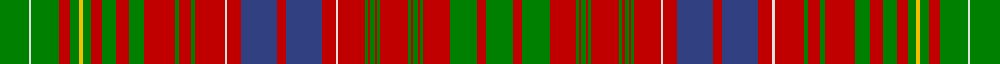

In pattern [GRGRGRGRGRGRGRGRWRBRBRWRGRGRGRGRGYGRGWG](/stripes/grgrgrgrgrgrgrgrwrbrbrwrgrgrgrgrgygrgwg/).

This was sourced from weddslist.  It is a [39 stripe tartan](/stripes/stripes39/).

Original link http://www.weddslist.com/cgi-bin/tartans/pg.pl?source=sts

## Thread count
G/42 LN4 G40 R16 G12 Y6 G12 R16 G20 R18 G22 R44 G6 R18 G6 R42 LN4 R20 B52 R12 B52 R20 LN4 R38 G4 R4 G6 R4 G4 R40 G4 R4 G6 R4 G4 R38 G40 R12 G/40

## Palette
Each colour and the base-6 reference it is a variant of.

| Colour | Shade | Base |
|---|---|---|
| B | <code style="background-color:#304080;">#304080</code> `oklch(39.4% 0.109 270.2)` <small>#304080</small> | B <code style="background-color:#2A418A;">#2A418A</code> |
| G | <code style="background-color:#008000;">#008000</code> `oklch(52.0% 0.177 142.5)` <small>#008000</small> | G <code style="background-color:#006100;">#006100</code> |
| LN | <code style="background-color:#E0E0E0;">#E0E0E0</code> `oklch(90.7% 0.000 89.9)` <small>#E0E0E0</small> | W <code style="background-color:#F7F7F7;">#F7F7F7</code> |
| R | <code style="background-color:#C00000;">#C00000</code> `oklch(50.7% 0.208 29.2)` <small>#C00000</small> | R <code style="background-color:#CC0000;">#CC0000</code> |
| Y | <code style="background-color:#F0C000;">#F0C000</code> `oklch(82.7% 0.169 90.5)` <small>#F0C000</small> | Y <code style="background-color:#F2BF00;">#F2BF00</code> |

## Nearest tartans

The nearest existing variants by ΔTartan distance.

1. [Lumsden (Waistcoat)](/setts/s39/g21w2g20r8g6ly3g6r8g10r9g11r22g3r9g3r21w2r10db26r6db26r10w2r19g2r2g3r2g2r20g2r2g3r2g2r19g20r6g20/) — ΔT 0.44
1. [MacRae of Inverinate](/setts/s40/r23g2r3g2r3g2r5ly5r5g2r3g2r3g2r23g23r5g15r5g23r23g2r3g2r3g2r5w5r5g2r3g2r3g2r23db15r5db15r5db15~x2/) — ΔT 0.84
1. [Lumsden](/setts/s39/g9r3g9r8g1r1g3r1g1r8g1r1g3r1g1r8w1r4db10r3db10r4w1r8g2r4g2r8g5r3g5r3g5ly1g5r5g8w1g8~x2/) — ΔT 0.92
1. [Huntly](/setts/s33/g8r2g8r12g2r3g2r12w1r3ly1db12r3db12ly1r3w1r12db1r1db2r1db1r12db1r1db2r1db1r12g8r2g8~x2/) — ΔT 0.94
1. [Kinnoull](/setts/s31/g23r6g23r25g4r10g4r25w3r10b31r6b31r10w3r25k2r2k4r2k2r25k2r2k4r2k2r25g23r6g23~x2/) — ΔT 0.97
1. [Lumsden (Short)](/setts/s30/r9db1r1db2r1db1r9w1r4db11r2db11r4w1r9g2r4g2r9g5r3g4r3g3ly1g3r3g6w1g6~x2/) — ΔT 1.17
1. [MacRae Prince's Own](/setts/s38/g10r2g10r9k1r1k2r1k1r9k1r1k2r1k1r9w1r4db11r2db11r4w1r9g2r4g2r9g5r3g4r3g3ly1g3r3g6w1~x2/) — ΔT 1.19
1. [Kinnoull (MacRae) - Error?](/setts/s38/g24r7g24r26k2r2k5r2k2r24k2r2k5r2k2r26w3r12db33r12w3r26g4r12g4r26g12r8g12r12g8y7g8r12g9w3g16w2/) — ΔT 1.25
1. [MacRae The Princes Own Clan Tartan Tartan Number: 982. Earliest known date: c.1815 Two MacRae setts, of which this is one, are contained in the Highland Society collection and presumably sealed by the Chief around 1815. Unless he recognised both, perhaps one is the clan and the other the Chief's own See products available Copyright © Blair Urquhart, Comrie, 2015](/setts/s38/g29r5g28r22k2r2k4r2k2r22k2r2k4r2k2r20w2r9db26r5db28r9w2r22g3r8g3r22g8r6g8r6g5ly3g5r7g12w2~x2/) — ΔT 1.25
1. [Lumsden, of Clova](/setts/s31/db9r2db9r9g1r1g2r1g1r9g1r1g2r1g1r9w1r4db11r2db11r4w1r9g2r4g2r9g9r2g9~x2/) — ΔT 1.31

## Neighbour map

Every grey dot is one of 14299 variants placed by the first two principal components of the ΔTartan feature space (44% of its variance). Red is this tartan; blue dots are its nearest — click one to open its page.

<svg viewBox="0 0 640 380" role="img" style="max-width:100%;height:auto;border:1px solid #e0e0e0;border-radius:4px;display:block" xmlns="http://www.w3.org/2000/svg"><image href="/nn/cloud.v1.png" width="640" height="380"/><a href="/setts/s39/g21w2g20r8g6ly3g6r8g10r9g11r22g3r9g3r21w2r10db26r6db26r10w2r19g2r2g3r2g2r20g2r2g3r2g2r19g20r6g20/"><circle cx="229.3" cy="103.1" r="4" fill="#3465a4"><title>Lumsden (Waistcoat)</title></circle></a><a href="/setts/s40/r23g2r3g2r3g2r5ly5r5g2r3g2r3g2r23g23r5g15r5g23r23g2r3g2r3g2r5w5r5g2r3g2r3g2r23db15r5db15r5db15~x2/"><circle cx="259.2" cy="91.1" r="4" fill="#3465a4"><title>MacRae of Inverinate</title></circle></a><a href="/setts/s39/g9r3g9r8g1r1g3r1g1r8g1r1g3r1g1r8w1r4db10r3db10r4w1r8g2r4g2r8g5r3g5r3g5ly1g5r5g8w1g8~x2/"><circle cx="182.4" cy="117.4" r="4" fill="#3465a4"><title>Lumsden</title></circle></a><a href="/setts/s33/g8r2g8r12g2r3g2r12w1r3ly1db12r3db12ly1r3w1r12db1r1db2r1db1r12db1r1db2r1db1r12g8r2g8~x2/"><circle cx="260.2" cy="102.8" r="4" fill="#3465a4"><title>Huntly</title></circle></a><a href="/setts/s31/g23r6g23r25g4r10g4r25w3r10b31r6b31r10w3r25k2r2k4r2k2r25k2r2k4r2k2r25g23r6g23~x2/"><circle cx="228.7" cy="91.8" r="4" fill="#3465a4"><title>Kinnoull</title></circle></a><a href="/setts/s30/r9db1r1db2r1db1r9w1r4db11r2db11r4w1r9g2r4g2r9g5r3g4r3g3ly1g3r3g6w1g6~x2/"><circle cx="224.0" cy="120.7" r="4" fill="#3465a4"><title>Lumsden (Short)</title></circle></a><a href="/setts/s38/g10r2g10r9k1r1k2r1k1r9k1r1k2r1k1r9w1r4db11r2db11r4w1r9g2r4g2r9g5r3g4r3g3ly1g3r3g6w1~x2/"><circle cx="194.3" cy="90.3" r="4" fill="#3465a4"><title>MacRae Prince's Own</title></circle></a><a href="/setts/s38/g24r7g24r26k2r2k5r2k2r24k2r2k5r2k2r26w3r12db33r12w3r26g4r12g4r26g12r8g12r12g8y7g8r12g9w3g16w2/"><circle cx="235.7" cy="74.0" r="4" fill="#3465a4"><title>Kinnoull (MacRae) - Error?</title></circle></a><a href="/setts/s38/g29r5g28r22k2r2k4r2k2r22k2r2k4r2k2r20w2r9db26r5db28r9w2r22g3r8g3r22g8r6g8r6g5ly3g5r7g12w2~x2/"><circle cx="216.3" cy="71.5" r="4" fill="#3465a4"><title>MacRae The Princes Own Clan Tartan Tartan Number: 982. Earliest known date: c.1815 Two MacRae setts, of which this is one, are contained in the Highland Society collection and presumably sealed by the Chief around 1815. Unless he recognised both, perhaps one is the clan and the other the Chief's own See products available Copyright © Blair Urquhart, Comrie, 2015</title></circle></a><a href="/setts/s31/db9r2db9r9g1r1g2r1g1r9g1r1g2r1g1r9w1r4db11r2db11r4w1r9g2r4g2r9g9r2g9~x2/"><circle cx="246.5" cy="135.1" r="4" fill="#3465a4"><title>Lumsden, of Clova</title></circle></a><circle cx="228.4" cy="103.6" r="5" fill="#c00000"/></svg>

ID: /setts/s39/g21w2g20r8g6ly3g6r8g10r9g11r22g3r9g3r21w2r10db26r6db26r10w2r19g2r2g3r2g2r20g2r2g3r2g2r19g20r6g20~x2/
