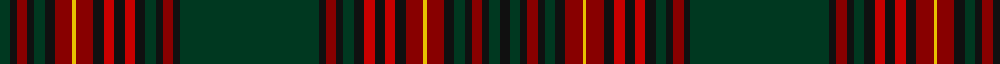

In pattern [GKRKGKRYRKRKRKGKRKGGKRKGKRKRKRYRKGKRKGK](/patterns/gkrkgkryrkrkrkgkrkggkrkgkrkrkryrkgkrkgk/).

This was sourced from house-of-tartan.  It is a [39 stripes tartan](/stripes/stripes39/).

Original link http://www.house-of-tartan.scotland.net/house/TartanViewjs.asp?colr=Def&tnam=6460

## Thread count
DG/6 K4 DR6 K4 DG6 K6 DR10 Y2 DR10 K6 R6 K6 R6 K6 DG6 K4 DR6 K4 DG40 DG40 K4 DR6 K4 DG6 K6 R6 K6 R6 K6 DR10 Y2 DR10 K6 DG6 K4 DR6 K4 DG6 K/6

## Palette
Each colour and its ΔE from the base-6 reference it is a variant of.

| Colour | Shade | Base | ΔE (OKLab) |
|---|---|---|---|
| DG | <code style="background-color:#003820;">#003820</code> `#003820` | G <code style="background-color:#006100;">#006100</code> | 0.15 |
| DR | <code style="background-color:#880000;">#880000</code> `#880000` | R <code style="background-color:#CC0000;">#CC0000</code> | 0.15 |
| K | <code style="background-color:#101010;">#101010</code> `#101010` | K <code style="background-color:#000000;">#000000</code> | 0.17 |
| R | <code style="background-color:#C80000;">#C80000</code> `#C80000` | R <code style="background-color:#CC0000;">#CC0000</code> | 0.01 |
| Y | <code style="background-color:#E8C000;">#E8C000</code> `#E8C000` | Y <code style="background-color:#F2BF00;">#F2BF00</code> | 0.02 |

## Nearest tartans

The nearest existing variants by ΔTartan distance.

1. [Unidentified Cant #06](/setts/s42/r16b3r16k3g32r16k3r16g32k3r18ba3r3b3r3ba3r18k34r3ba34r16k3r16ba34r3k34r18ba3r3b3r3ba3r18k3g32r16k3r16g32k3r16b3-b2888c4-ba2c2c80-g285800-k101010-r880000/) — ΔT 1.22
1. [Gordon #4](/setts/s32/b30k6b6k6b6k30g30r2g2r8g2r2g30k30b30k6b8k6b30k30g30y2g2y8g2y2g30k30b6k6b6k6-b2c4084-g005020-k101010-rdc0000-ye8c000/) — ΔT 1.62
1. [Broun Hunting (Personal?)](/setts/s29/b64k12b12k12b12k64g60k4ba12k4g60k64b60k12b12k12b60k64g60k4y12k4g60k64b12k12b12k12b12-b14283c-ba5c8ca8-g006818-k101010-yb8b8b8/) — ΔT 1.68
1. [Lumsden Green Clan Tartan Tartan Number: 2366. Earliest known date: 1997 Designed by Peter MacDonald at the request of David Lumsden of Cushnie to provide a hunting tartan for the clan. Can be worn by all in the Lumsden clan ( House of Lumsden). Medium green used here to show graphic instead of required dark green. See products available Copyright © Blair Urquhart, Comrie, 2015](/setts/s32/k66b4g4b4g4b4k66r6b68r4b68r6g68b4k4b4g68b4k4b4g68r6b68r4b68r6k66b4g4b4g4b4-b202060-g285800-k101010-rc80000/) — ΔT 1.74
1. [Campbell of Argyll](/setts/s28/k32g16k2y4k2g16k16b16k2b2k2b16k16g16k2w4k2g16k16b2k2b2k2b16k2b2k2b2-b2c4084-g005020-k101010-we0e0e0-ye8c000/) — ΔT 1.77
1. [Cairns of Finavon](/setts/s28/b32g6b6g6b6g32b6g6b6g6b32r30b2y6b2r30b32g30b6g6b6g30b32r30ba2r6ba2r30-b202060-ba1474b4-g006818-r980044-ye8c000/) — ΔT 1.78
1. [Cairns of Finavon (Name)](/setts/s28/g32b6g6b6g6b32r30b2y6b2r30b32g30b6g6b6g30b32r30ba2r6ba2r30b32g6b6g6b6-b202060-ba1474b4-g006818-r980044-ye8c000/) — ΔT 1.78
1. [Farquharson (Vestiarium Scoticum) or MacEwen/MacEwan](/setts/s28/k72g44k2r8k2g44k38b32k4b6k4b32k38g44k2y8k2g44k38b6k4b6k4b56k4b6k4b6-b2c4084-g005020-k101010-rdc0000-ye8c000/) — ΔT 1.83
1. [MacMaster (Name 2001)](/setts/s28/r24g24w4g24r24g4r4g4r4g12y4r2y4g12r4g4r4g4r24b16g16k4r8k4r8k4g16b16-b1c0070-g285800-k101010-r880000-wa8ace8-yd09800/) — ΔT 1.86
1. [Sempill Clan/Family Tartan Tartan Number: 2420. Earliest known date: 1996 The historic connection between the Forbes and the Sempills is the reason for the similarity of the tartans. Sir Thomas Innes of Learney GCVO Lord Lyon 1945 - 1969 suggested that red should be use in the tartan because that colour was in the Sempill chevron. The white in the Forbes was adjusted to light blue as a late change and a further difference. See products available Copyright © Blair Urquhart, Comrie, 2015](/setts/s30/b6k6b38k30r4g38k2ba6k2g38k30b6k6b6k6b44k6b6k6b6k30g38k2ba6k2g38r4k30b38k6-b2c2c80-ba5c8ca8-g006818-k101010-rc80000/) — ΔT 1.86

## Neighbour map

Every grey dot is one of 15726 variants placed by the first two principal components of the ΔTartan feature space (44% of its variance). Red is this tartan; blue dots are its nearest — click one to open its page.

<svg viewBox="0 0 640 380" role="img" style="max-width:100%;height:auto;border:1px solid #e0e0e0;border-radius:4px;display:block" xmlns="http://www.w3.org/2000/svg"><image href="/nn/cloud.v1.png" width="640" height="380"/><a href="/setts/s42/r16b3r16k3g32r16k3r16g32k3r18ba3r3b3r3ba3r18k34r3ba34r16k3r16ba34r3k34r18ba3r3b3r3ba3r18k3g32r16k3r16g32k3r16b3-b2888c4-ba2c2c80-g285800-k101010-r880000/"><circle cx="208.6" cy="118.5" r="4" fill="#3465a4"><title>Unidentified Cant #06</title></circle></a><a href="/setts/s32/b30k6b6k6b6k30g30r2g2r8g2r2g30k30b30k6b8k6b30k30g30y2g2y8g2y2g30k30b6k6b6k6-b2c4084-g005020-k101010-rdc0000-ye8c000/"><circle cx="188.0" cy="124.5" r="4" fill="#3465a4"><title>Gordon #4</title></circle></a><a href="/setts/s29/b64k12b12k12b12k64g60k4ba12k4g60k64b60k12b12k12b60k64g60k4y12k4g60k64b12k12b12k12b12-b14283c-ba5c8ca8-g006818-k101010-yb8b8b8/"><circle cx="226.7" cy="144.0" r="4" fill="#3465a4"><title>Broun Hunting (Personal?)</title></circle></a><a href="/setts/s32/k66b4g4b4g4b4k66r6b68r4b68r6g68b4k4b4g68b4k4b4g68r6b68r4b68r6k66b4g4b4g4b4-b202060-g285800-k101010-rc80000/"><circle cx="273.9" cy="125.1" r="4" fill="#3465a4"><title>Lumsden Green Clan Tartan Tartan Number: 2366. Earliest known date: 1997 Designed by Peter MacDonald at the request of David Lumsden of Cushnie to provide a hunting tartan for the clan. Can be worn by all in the Lumsden clan ( House of Lumsden). Medium green used here to show graphic instead of required dark green. See products available Copyright © Blair Urquhart, Comrie, 2015</title></circle></a><a href="/setts/s28/k32g16k2y4k2g16k16b16k2b2k2b16k16g16k2w4k2g16k16b2k2b2k2b16k2b2k2b2-b2c4084-g005020-k101010-we0e0e0-ye8c000/"><circle cx="231.3" cy="124.7" r="4" fill="#3465a4"><title>Campbell of Argyll</title></circle></a><a href="/setts/s28/b32g6b6g6b6g32b6g6b6g6b32r30b2y6b2r30b32g30b6g6b6g30b32r30ba2r6ba2r30-b202060-ba1474b4-g006818-r980044-ye8c000/"><circle cx="206.8" cy="123.1" r="4" fill="#3465a4"><title>Cairns of Finavon</title></circle></a><a href="/setts/s28/g32b6g6b6g6b32r30b2y6b2r30b32g30b6g6b6g30b32r30ba2r6ba2r30b32g6b6g6b6-b202060-ba1474b4-g006818-r980044-ye8c000/"><circle cx="206.8" cy="123.1" r="4" fill="#3465a4"><title>Cairns of Finavon (Name)</title></circle></a><a href="/setts/s28/k72g44k2r8k2g44k38b32k4b6k4b32k38g44k2y8k2g44k38b6k4b6k4b56k4b6k4b6-b2c4084-g005020-k101010-rdc0000-ye8c000/"><circle cx="261.3" cy="99.0" r="4" fill="#3465a4"><title>Farquharson (Vestiarium Scoticum) or MacEwen/MacEwan</title></circle></a><a href="/setts/s28/r24g24w4g24r24g4r4g4r4g12y4r2y4g12r4g4r4g4r24b16g16k4r8k4r8k4g16b16-b1c0070-g285800-k101010-r880000-wa8ace8-yd09800/"><circle cx="196.9" cy="125.1" r="4" fill="#3465a4"><title>MacMaster (Name 2001)</title></circle></a><a href="/setts/s30/b6k6b38k30r4g38k2ba6k2g38k30b6k6b6k6b44k6b6k6b6k30g38k2ba6k2g38r4k30b38k6-b2c2c80-ba5c8ca8-g006818-k101010-rc80000/"><circle cx="195.6" cy="110.6" r="4" fill="#3465a4"><title>Sempill Clan/Family Tartan Tartan Number: 2420. Earliest known date: 1996 The historic connection between the Forbes and the Sempills is the reason for the similarity of the tartans. Sir Thomas Innes of Learney GCVO Lord Lyon 1945 - 1969 suggested that red should be use in the tartan because that colour was in the Sempill chevron. The white in the Forbes was adjusted to light blue as a late change and a further difference. See products available Copyright © Blair Urquhart, Comrie, 2015</title></circle></a><circle cx="231.9" cy="97.6" r="5" fill="#c00000"/></svg>

ID: /setts/s39/g6k4r6k4g6k6r10y2r10k6ra6k6ra6k6g6k4r6k4g40g40k4r6k4g6k6ra6k6ra6k6r10y2r10k6g6k4r6k4g6k6-g003820-k101010-r880000-rac80000-ye8c000/
