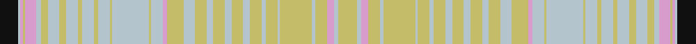

In pattern [KWWYWWYWYWYWYWYYWYWWYYWYWYWYWYWYWYWYWWY](/stripes/kwwywwywywywywyywywwyywywywywywywywywwy/).

This was sourced from register-of-tartans.  It is a [39 stripe tartan](/stripes/stripes39/).

Original link https://www.tartanregister.gov.uk/tartanDetails.aspx?ref=4864

## Register references

External register numbers recorded for this tartan.

- Scottish Register of Tartans: [4864](https://www.tartanregister.gov.uk/tartanDetails.aspx?ref=4864)
- Scottish Tartans Authority (ITI): 3200

## Thread count
K/32 N4 LP4 LG4 LP20 N8 LG12 N20 LG12 N20 LG8 N20 LG8 N20 LG2 LG2 N64 LG4 N20 LP8 LG20 LG8 N20 LG20 N12 LG20 N12 LG20 N12 LG20 N8 LG20 N4 LG56 N6 LG20 LP12 N8 LG/32

## Palette
Each colour and the base-6 reference it is a variant of.

| Colour | Shade | Base |
|---|---|---|
| B | <code style="background-color:#1870A4;">#1870A4</code> `oklch(52.2% 0.113 241.2)` <small>#1870A4</small> | B <code style="background-color:#2A418A;">#2A418A</code> |
| DY | <code style="background-color:#BC8C00;">#BC8C00</code> `oklch(66.8% 0.137 84.1)` <small>#BC8C00</small> | Y <code style="background-color:#F2BF00;">#F2BF00</code> |
| K | <code style="background-color:#101010;">#101010</code> `oklch(17.3% 0.000 89.9)` <small>#101010</small> | K <code style="background-color:#000000;">#000000</code> |
| LG | <code style="background-color:#C4BC68;">#C4BC68</code> `oklch(78.4% 0.107 103.7)` <small>#C4BC68</small> | Y <code style="background-color:#F2BF00;">#F2BF00</code> |
| LP | <code style="background-color:#D89CCC;">#D89CCC</code> `oklch(76.5% 0.095 333.7)` <small>#D89CCC</small> | W <code style="background-color:#F7F7F7;">#F7F7F7</code> |
| N | <code style="background-color:#B4C4CC;">#B4C4CC</code> `oklch(81.1% 0.021 229.1)` <small>#B4C4CC</small> | W <code style="background-color:#F7F7F7;">#F7F7F7</code> |
| P | <code style="background-color:#6C0070;">#6C0070</code> `oklch(37.6% 0.174 326.5)` <small>#6C0070</small> | B <code style="background-color:#2A418A;">#2A418A</code> |

## Nearest tartans

The nearest existing variants by ΔTartan distance.

1. [Shapiro (Personal)](/setts/s39/lb16lb4k6lb10lb3lb28lb2lb10lb4lb10lb6lb10lb6lb10lb6lb10lb10lb4lb10k4lb10lb2lb32lb1lb1lb10lb4lb10lb4lb10lb6lb10lb6lb4k10lb2k2lb2lp16~x2/) — ΔT 2.35
1. [Beaufort (Name)](/setts/s19/o3w1o2w2w21w3lg2o8w2o2w2o2w8lg2w2lg2w2lg8w3~x2/) — ΔT 2.48
1. [Isle of Skye (Dalgety)](/setts/s28/lo7lb7dy3lb29lo20dy6g1lb8g1dy4lb3dy8lb6g1dy8g1lb6dy8lb3dy4g1lb8g1dy6lo20lb29dy3lb7~x2/) — ΔT 2.53
1. [elCorte](/setts/s20/w6lt5lg4lt5lo2r5lg2r14lg10lo30lt1lg2r4lg2r1lo30r10lt14lg2lt5~x2/) — ΔT 2.60
1. [Nike Golf Light](/setts/s17/r5w20lr1w2lr1w2lr2w2lr5o2lr2o2lr2o3lr2o10w3~x2/) — ΔT 2.61
1. [Delta Dental Association (Corporate)](/setts/s13/g4o1lo29o6w13o13w6o13w13o6lo29o1t4~x2/) — ΔT 2.67
1. [Miyuki #3](/setts/s18/n12lb14r3o6lb10n28lb10o6r3lb8o10lb8r3o6lb40n6lb6n6/) — ΔT 2.68
1. [Miyuki, House Check Grey, 1003A](/setts/s18/n12lb14r3y6lb10n28lb10y6r3lb8y10lb8r3y6lb40n6lb6n6/) — ΔT 2.96
1. [O'Monaghan (Personal)](/setts/s18/y25w2t4lo7t4w2lo25w2t4lo7~x2/) — ΔT 3.00
1. [Satisfashion Argyll](/setts/s18/do5lo1y27lo9r6do5lo1lo23do3lo5~x2/) — ΔT 3.06

## Neighbour map

Every grey dot is one of 14299 variants placed by the first two principal components of the ΔTartan feature space (44% of its variance). Red is this tartan; blue dots are its nearest — click one to open its page.

<svg viewBox="0 0 640 380" role="img" style="max-width:100%;height:auto;border:1px solid #e0e0e0;border-radius:4px;display:block" xmlns="http://www.w3.org/2000/svg"><image href="/nn/cloud.v1.png" width="640" height="380"/><a href="/setts/s39/lb16lb4k6lb10lb3lb28lb2lb10lb4lb10lb6lb10lb6lb10lb6lb10lb10lb4lb10k4lb10lb2lb32lb1lb1lb10lb4lb10lb4lb10lb6lb10lb6lb4k10lb2k2lb2lp16~x2/"><circle cx="320.9" cy="126.8" r="4" fill="#3465a4"><title>Shapiro (Personal)</title></circle></a><a href="/setts/s19/o3w1o2w2w21w3lg2o8w2o2w2o2w8lg2w2lg2w2lg8w3~x2/"><circle cx="232.9" cy="116.2" r="4" fill="#3465a4"><title>Beaufort (Name)</title></circle></a><a href="/setts/s28/lo7lb7dy3lb29lo20dy6g1lb8g1dy4lb3dy8lb6g1dy8g1lb6dy8lb3dy4g1lb8g1dy6lo20lb29dy3lb7~x2/"><circle cx="282.5" cy="78.3" r="4" fill="#3465a4"><title>Isle of Skye (Dalgety)</title></circle></a><a href="/setts/s20/w6lt5lg4lt5lo2r5lg2r14lg10lo30lt1lg2r4lg2r1lo30r10lt14lg2lt5~x2/"><circle cx="287.6" cy="107.0" r="4" fill="#3465a4"><title>elCorte</title></circle></a><a href="/setts/s17/r5w20lr1w2lr1w2lr2w2lr5o2lr2o2lr2o3lr2o10w3~x2/"><circle cx="276.9" cy="113.0" r="4" fill="#3465a4"><title>Nike Golf Light</title></circle></a><a href="/setts/s13/g4o1lo29o6w13o13w6o13w13o6lo29o1t4~x2/"><circle cx="252.3" cy="128.2" r="4" fill="#3465a4"><title>Delta Dental Association (Corporate)</title></circle></a><a href="/setts/s18/n12lb14r3o6lb10n28lb10o6r3lb8o10lb8r3o6lb40n6lb6n6/"><circle cx="290.9" cy="154.1" r="4" fill="#3465a4"><title>Miyuki #3</title></circle></a><a href="/setts/s18/n12lb14r3y6lb10n28lb10y6r3lb8y10lb8r3y6lb40n6lb6n6/"><circle cx="275.3" cy="146.5" r="4" fill="#3465a4"><title>Miyuki, House Check Grey, 1003A</title></circle></a><a href="/setts/s18/y25w2t4lo7t4w2lo25w2t4lo7~x2/"><circle cx="214.5" cy="134.0" r="4" fill="#3465a4"><title>O'Monaghan (Personal)</title></circle></a><a href="/setts/s18/do5lo1y27lo9r6do5lo1lo23do3lo5~x2/"><circle cx="296.6" cy="126.1" r="4" fill="#3465a4"><title>Satisfashion Argyll</title></circle></a><circle cx="302.2" cy="107.6" r="5" fill="#c00000"/></svg>

ID: /setts/s39/k16lb2lp2ly2lp10lb4ly6lb10ly6lb10ly4lb10ly4lb10ly1ly1lb32ly2lb10lp4ly10ly4lb10ly10lb6ly10lb6ly10lb6ly10lb4ly10lb2ly28lb3ly10lp6lb4ly16~x2/
