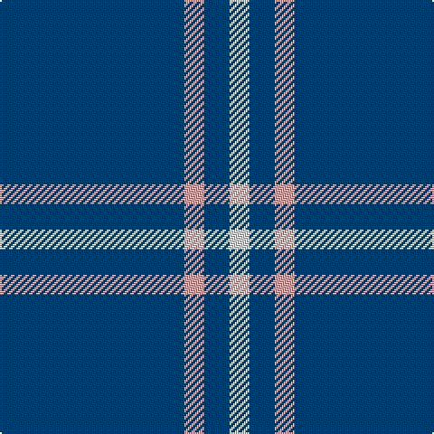

In pattern [BYBW](/patterns/bybw/).

This was sourced from tartans-authority.  It is a [4 stripes tartan](/stripes/stripes4/).

Original link http://www.tartansauthority.com/tartan-ferret/display/8161/

## Thread count
DB/102 LR11 DB14 LN/11

## Palette
Each colour and its ΔE from the base-6 reference it is a variant of.

| Colour | Shade | Base | ΔE (OKLab) |
|---|---|---|---|
| DB | <code style="background-color:#003C64;">#003C64</code> `#003C64` | B <code style="background-color:#2C4084;">#2C4084</code> | 0.07 |
| LN | <code style="background-color:#E0E0E0;">#E0E0E0</code> `#E0E0E0` | W <code style="background-color:#F4F4F0;">#F4F4F0</code> | 0.06 |
| LR | <code style="background-color:#ECA4A4;">#ECA4A4</code> `#ECA4A4` | Y <code style="background-color:#E8C000;">#E8C000</code> | 0.17 |

# Sample pattern

## Nearest tartans

The nearest existing variants by ΔTartan distance.

1. [MacLaine of Lochbuie](/setts/s4/b64r6b8y6-b2c4084-rdc0000-ye8c000/) — ΔT 1.20
1. [MacLaine of Lochbuie](/setts/s4/b64r6b8y6-b304080-rc00000-yf0c000/) — ΔT 1.31
1. [Coinean Dubh](/setts/s4/b100k24b42w10-b003c64-k101010-wffffff/) — ΔT 1.45
1. [Gem](/setts/s4/b140r11b14y11-b202060-rc80000-ye8c000/) — ΔT 1.61
1. [Poulain League (Corporate)](/setts/s3/y12b76k6-b2888c4-k101010-ye8c000/) — ΔT 1.94
1. [Brooks Brothers Tattersall Blue](/setts/s5/r4b36y8b36y4-b202060-r880000-ya08858/) — ΔT 1.97
1. [Scottish Qualifications Auth. (Corp)](/setts/s7/b72y10b16w6b16w20b6-b202060-wc0c0c0-yd87c00/) — ΔT 2.03
1. [Laidlaw's Highland Drovers](/setts/s6/b70k20b8w4b6r4-b1474b4-k101010-rc80000-wf8f8f8/) — ΔT 2.18
1. [McCallie](/setts/s4/r8k24b132w8-b2c2c80-k101010-rc80000-wfcfcfc/) — ΔT 2.20
1. [Dollar, Academy](/setts/s6/b18k18b18k18b84w10-b304080-k000000-we0e0e0/) — ΔT 2.20

## Neighbour map

Every grey dot is one of 15726 variants placed by the first two principal components of the ΔTartan feature space (44% of its variance). Red is this tartan; blue dots are its nearest — click one to open its page.

<svg viewBox="0 0 640 380" role="img" style="max-width:100%;height:auto;border:1px solid #e0e0e0;border-radius:4px;display:block" xmlns="http://www.w3.org/2000/svg"><image href="/nn/cloud.v1.png" width="640" height="380"/><a href="/setts/s4/b64r6b8y6-b2c4084-rdc0000-ye8c000/"><circle cx="591.5" cy="238.1" r="4" fill="#3465a4"><title>MacLaine of Lochbuie</title></circle></a><a href="/setts/s4/b64r6b8y6-b304080-rc00000-yf0c000/"><circle cx="596.8" cy="239.8" r="4" fill="#3465a4"><title>MacLaine of Lochbuie</title></circle></a><a href="/setts/s4/b100k24b42w10-b003c64-k101010-wffffff/"><circle cx="508.8" cy="274.2" r="4" fill="#3465a4"><title>Coinean Dubh</title></circle></a><a href="/setts/s4/b140r11b14y11-b202060-rc80000-ye8c000/"><circle cx="616.6" cy="229.8" r="4" fill="#3465a4"><title>Gem</title></circle></a><a href="/setts/s3/y12b76k6-b2888c4-k101010-ye8c000/"><circle cx="530.3" cy="247.3" r="4" fill="#3465a4"><title>Poulain League (Corporate)</title></circle></a><a href="/setts/s5/r4b36y8b36y4-b202060-r880000-ya08858/"><circle cx="544.6" cy="266.1" r="4" fill="#3465a4"><title>Brooks Brothers Tattersall Blue</title></circle></a><a href="/setts/s7/b72y10b16w6b16w20b6-b202060-wc0c0c0-yd87c00/"><circle cx="453.4" cy="201.9" r="4" fill="#3465a4"><title>Scottish Qualifications Auth. (Corp)</title></circle></a><a href="/setts/s6/b70k20b8w4b6r4-b1474b4-k101010-rc80000-wf8f8f8/"><circle cx="470.2" cy="173.1" r="4" fill="#3465a4"><title>Laidlaw's Highland Drovers</title></circle></a><a href="/setts/s4/r8k24b132w8-b2c2c80-k101010-rc80000-wfcfcfc/"><circle cx="506.2" cy="202.3" r="4" fill="#3465a4"><title>McCallie</title></circle></a><a href="/setts/s6/b18k18b18k18b84w10-b304080-k000000-we0e0e0/"><circle cx="415.6" cy="234.0" r="4" fill="#3465a4"><title>Dollar, Academy</title></circle></a><circle cx="541.0" cy="240.1" r="5" fill="#c00000"/></svg>

ID: /setts/s4/b102y11b14w11-b003c64-we0e0e0-yeca4a4/
