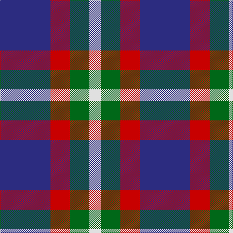

In pattern [BRGW](/patterns/brgw/).

This was sourced from tartans-authority.  It is a [4 stripes tartan](/stripes/stripes4/).

Original link http://www.tartansauthority.com/tartan-ferret/display/7809/

## Attestations

This cloth appears in 2 source records; the oldest owns this page.

- 2008 — International Highland Games Fed. (tartans-authority, [record](http://www.tartansauthority.com/tartan-ferret/display/7809/))
- undated — International Highland Games Fed. (register-of-tartans, [record](https://www.tartanregister.gov.uk/tartanDetails.aspx?ref=5768))

## Thread count
DB/104 R40 G40 LN/24

## Palette
Each colour and its ΔE from the base-6 reference it is a variant of.

| Colour | Shade | Base | ΔE (OKLab) |
|---|---|---|---|
| DB | <code style="background-color:#2C2C80;">#2C2C80</code> `#2C2C80` | B <code style="background-color:#2C4084;">#2C4084</code> | 0.05 |
| G | <code style="background-color:#006818;">#006818</code> `#006818` | G <code style="background-color:#006400;">#006400</code> | 0.02 |
| LN | <code style="background-color:#E0E0E0;">#E0E0E0</code> `#E0E0E0` | W <code style="background-color:#F4F4F0;">#F4F4F0</code> | 0.06 |
| R | <code style="background-color:#C80000;">#C80000</code> `#C80000` | R <code style="background-color:#C80000;">#C80000</code> | 0.00 |

# Sample pattern

ID: /setts/s4/b104r40g40w24-b2c2c80-g006818-rc80000-we0e0e0/
