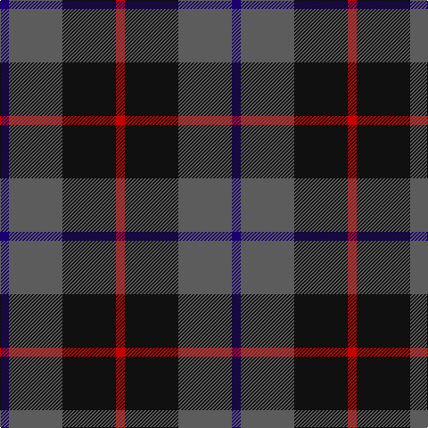

In pattern [BBKR](/patterns/bbkr/).

This was sourced from tartans-authority.  It is a [4 stripes tartan](/stripes/stripes4/).

Original link http://www.tartansauthority.com/tartan-ferret/display/10244/

## Thread count
DB/10 N60 K60 R/10

## Palette
Each colour and its ΔE from the base-6 reference it is a variant of.

| Colour | Shade | Base | ΔE (OKLab) |
|---|---|---|---|
| DB | <code style="background-color:#1C0070;">#1C0070</code> `#1C0070` | B <code style="background-color:#2C4084;">#2C4084</code> | 0.14 |
| K | <code style="background-color:#101010;">#101010</code> `#101010` | K <code style="background-color:#000000;">#000000</code> | 0.17 |
| N | <code style="background-color:#5C5C5C;">#5C5C5C</code> `#5C5C5C` | B <code style="background-color:#2C4084;">#2C4084</code> | 0.14 |
| R | <code style="background-color:#C80000;">#C80000</code> `#C80000` | R <code style="background-color:#C80000;">#C80000</code> | 0.00 |

# Sample pattern

## Nearest tartans

The nearest existing variants by ΔTartan distance.

1. [Nairn](/setts/s5/r8k64g16b32r8-b2c2c80-g006818-k101010-rc80000/) — ΔT 1.06
1. [Nairn Family Tartan Tartan Number: 1331. Earliest known date: c.1930 The exact date of this design is uncertain. We know that it appeared around 1930 in the collection of Messrs. Anderson of Edinburgh. (Later Kinloch Anderson). A note on the weavers scale in the STS collection states '..worn by the Spencer-Nairn family. (done)'. The design is similar to the Hunting Brodie sett without the yellow. Nairns were first recorded in Fife and later in Moray. There is also a family called Nairne of Dunsinnan in Perthshire of MacBeth fame. See products available Copyright © Blair Urquhart, Comrie, 2015](/setts/s5/r4k32g8b16r4-b2c2c80-g006818-k101010-rc80000/) — ΔT 1.06
1. [MacArthur of Milton (Clan)](/setts/s6/g28b4g4k16ba16k4-b28287c-ba700070-g006c3c-k101010/) — ΔT 1.17
1. [MacNab WI2](/setts/s4/g15r3b11w2-b5a3094-g004c00-rc80000-wd0d0d0/) — ΔT 1.19
1. [MacNab](/setts/s4/g30r6b22ba4-b141e46-ba3c82af-g005020-rdc0000/) — ΔT 1.20
1. [MacArthur of Milton Hunting Clan Tartan Tartan Number: 700. Earliest known date: 1823 This is the older of the two MacArthur setts, which links the clan with the Campbells. See products available Copyright © Blair Urquhart, Comrie, 2015](/setts/s6/g28b4g4k16ba18k4-b2c2c80-ba780078-g006818-k101010/) — ΔT 1.21
1. [Wilson's No.062](/setts/s4/g26r4b26r4-b202060-g006818-rc80000/) — ΔT 1.24
1. [Britannia](/setts/s5/k28r8k50b60w8-b202060-k101010-rc80000-we0e0e0/) — ΔT 1.32
1. [Gallamore](/setts/s6/k6b28r4k28g28k6-b2c2c80-g006818-k101010-rc80000/) — ΔT 1.32
1. [Murray (Variation) Clan Tartan Tartan Number: 271. Earliest known date: 1810-15 A simplified version of the Murray of Atholl. The Cockburn collection housed in the Mitchell Library in Glasgow, is one of the earliest references for clan tartans. James Logan, in his book, The Scottish Gael (1831), wrote concerning the Black Watch, that "...a red stripe is often introduced", and this by Lord Murray who commanded the regiment. See products available Copyright © Blair Urquhart, Comrie, 2015](/setts/s6/b4k4b24k16g22r4-b2c2c80-g006818-k101010-rc80000/) — ΔT 1.39

## Neighbour map

Every grey dot is one of 15726 variants placed by the first two principal components of the ΔTartan feature space (44% of its variance). Red is this tartan; blue dots are its nearest — click one to open its page.

<svg viewBox="0 0 640 380" role="img" style="max-width:100%;height:auto;border:1px solid #e0e0e0;border-radius:4px;display:block" xmlns="http://www.w3.org/2000/svg"><image href="/nn/cloud.v1.png" width="640" height="380"/><a href="/setts/s5/r8k64g16b32r8-b2c2c80-g006818-k101010-rc80000/"><circle cx="272.1" cy="240.6" r="4" fill="#3465a4"><title>Nairn</title></circle></a><a href="/setts/s5/r4k32g8b16r4-b2c2c80-g006818-k101010-rc80000/"><circle cx="272.1" cy="240.6" r="4" fill="#3465a4"><title>Nairn Family Tartan Tartan Number: 1331. Earliest known date: c.1930 The exact date of this design is uncertain. We know that it appeared around 1930 in the collection of Messrs. Anderson of Edinburgh. (Later Kinloch Anderson). A note on the weavers scale in the STS collection states '..worn by the Spencer-Nairn family. (done)'. The design is similar to the Hunting Brodie sett without the yellow. Nairns were first recorded in Fife and later in Moray. There is also a family called Nairne of Dunsinnan in Perthshire of MacBeth fame. See products available Copyright © Blair Urquhart, Comrie, 2015</title></circle></a><a href="/setts/s6/g28b4g4k16ba16k4-b28287c-ba700070-g006c3c-k101010/"><circle cx="230.6" cy="244.8" r="4" fill="#3465a4"><title>MacArthur of Milton (Clan)</title></circle></a><a href="/setts/s4/g15r3b11w2-b5a3094-g004c00-rc80000-wd0d0d0/"><circle cx="252.1" cy="253.2" r="4" fill="#3465a4"><title>MacNab WI2</title></circle></a><a href="/setts/s4/g30r6b22ba4-b141e46-ba3c82af-g005020-rdc0000/"><circle cx="280.8" cy="273.1" r="4" fill="#3465a4"><title>MacNab</title></circle></a><a href="/setts/s6/g28b4g4k16ba18k4-b2c2c80-ba780078-g006818-k101010/"><circle cx="218.8" cy="242.0" r="4" fill="#3465a4"><title>MacArthur of Milton Hunting Clan Tartan Tartan Number: 700. Earliest known date: 1823 This is the older of the two MacArthur setts, which links the clan with the Campbells. See products available Copyright © Blair Urquhart, Comrie, 2015</title></circle></a><a href="/setts/s4/g26r4b26r4-b202060-g006818-rc80000/"><circle cx="271.8" cy="281.5" r="4" fill="#3465a4"><title>Wilson's No.062</title></circle></a><a href="/setts/s5/k28r8k50b60w8-b202060-k101010-rc80000-we0e0e0/"><circle cx="283.6" cy="259.1" r="4" fill="#3465a4"><title>Britannia</title></circle></a><a href="/setts/s6/k6b28r4k28g28k6-b2c2c80-g006818-k101010-rc80000/"><circle cx="211.1" cy="256.0" r="4" fill="#3465a4"><title>Gallamore</title></circle></a><a href="/setts/s6/b4k4b24k16g22r4-b2c2c80-g006818-k101010-rc80000/"><circle cx="194.7" cy="257.1" r="4" fill="#3465a4"><title>Murray (Variation) Clan Tartan Tartan Number: 271. Earliest known date: 1810-15 A simplified version of the Murray of Atholl. The Cockburn collection housed in the Mitchell Library in Glasgow, is one of the earliest references for clan tartans. James Logan, in his book, The Scottish Gael (1831), wrote concerning the Black Watch, that &quot;...a red stripe is often introduced&quot;, and this by Lord Murray who commanded the regiment. See products available Copyright © Blair Urquhart, Comrie, 2015</title></circle></a><circle cx="252.3" cy="271.5" r="5" fill="#c00000"/></svg>

ID: /setts/s4/b10ba60k60r10-b1c0070-ba5c5c5c-k101010-rc80000/
