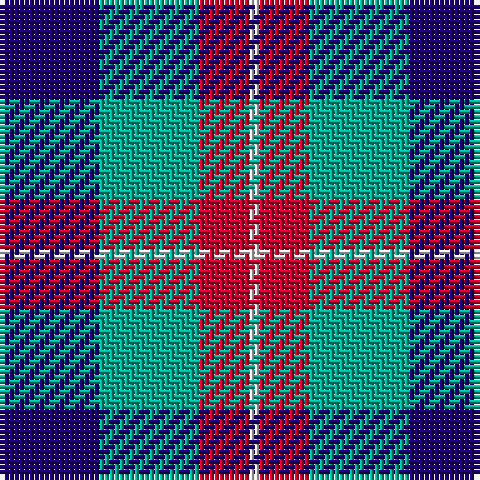

In pattern [BGRW](/patterns/bgrw/).

This was sourced from house-of-tartan.  It is a [4 stripes tartan](/stripes/stripes4/).

Original link http://www.house-of-tartan.scotland.net/house/TartanViewjs.asp?colr=Def&tnam=6862

## Thread count
DB/20 B20 R10 LN/2

## Palette
Each colour and its ΔE from the base-6 reference it is a variant of.

| Colour | Shade | Base | ΔE (OKLab) |
|---|---|---|---|
| B | <code style="background-color:#00AC94;">#00AC94</code> `#00AC94` | G <code style="background-color:#006100;">#006100</code> | 0.25 |
| DB | <code style="background-color:#1C0070;">#1C0070</code> `#1C0070` | B <code style="background-color:#2A418A;">#2A418A</code> | 0.14 |
| LN | <code style="background-color:#E0E0E0;">#E0E0E0</code> `#E0E0E0` | W <code style="background-color:#F7F7F7;">#F7F7F7</code> | 0.07 |
| R | <code style="background-color:#C80030;">#C80030</code> `#C80030` | R <code style="background-color:#CC0000;">#CC0000</code> | 0.03 |

# Sample pattern

## Nearest tartans

The nearest existing variants by ΔTartan distance.

1. [Thorntons Law (Corporate)](/setts/s4/b10g10r5w1~b1c0070-g0098a0-rc80000-wf8f8f8~x2/) — ΔT 0.34
1. [Tilburg (District)](/setts/s5/b9y9b9ba23r3~b1c1c50-ba1c6894-rc80000-yc8c44c~x2/) — ΔT 1.01
1. [Lands of Liberty (Fashion)](/setts/s5/r15w10b48ba32r6~b202060-ba2888c4-rc80000-wfcfcfc~x2/) — ΔT 1.08
1. [Edinburgh Tattoo 50th (Commemorative](/setts/s5/k1b8r6g8k1~b000090-g008854-k000000-rc80000~x4/) — ΔT 1.19
1. [Battle of Prestonpans (1745) Heritage Trust, The](/setts/s5/b9r12g9b5w2~b0000cd-g008b00-re3170d-wffffff~x4/) — ΔT 1.20
1. [Oban Grey District Tartan Tartan Number: 1237. Earliest known date: pre 2003 Not an official district but a name chosen by the weavers. See products available Copyright © Blair Urquhart, Comrie, 2015](/setts/s5/k4w3k4r9ra1~k101010-r888888-rac80000-we0e0e0~x4/) — ΔT 1.27
1. [Oban Grey](/setts/s5/k4w3k4g9r1~g808080-k101010-rdc0000-we0e0e0~x4/) — ΔT 1.28
1. [Lands of Liberty](/setts/s5/r10w5b30ba20r3~b2c4084-ba0596fa-rc80000-wffffff~x4/) — ΔT 1.38
1. [Pitt (Name)](/setts/s6/b23ba18w5ba2r14ba18~b1474b4-ba003c64-rc80000-wfcfcfc~x2/) — ΔT 1.43
1. [Raven (Fashion)](/setts/s4/k19b18w9r3~b1c0070-k101010-rc80000-we0e0e0~x4/) — ΔT 1.44

## Neighbour map

Every grey dot is one of 15726 variants placed by the first two principal components of the ΔTartan feature space (44% of its variance). Red is this tartan; blue dots are its nearest — click one to open its page.

<svg viewBox="0 0 640 380" role="img" style="max-width:100%;height:auto;border:1px solid #e0e0e0;border-radius:4px;display:block" xmlns="http://www.w3.org/2000/svg"><image href="/nn/cloud.v1.png" width="640" height="380"/><a href="/setts/s4/b10g10r5w1~b1c0070-g0098a0-rc80000-wf8f8f8~x2/"><circle cx="175.2" cy="243.2" r="4" fill="#3465a4"><title>Thorntons Law (Corporate)</title></circle></a><a href="/setts/s5/b9y9b9ba23r3~b1c1c50-ba1c6894-rc80000-yc8c44c~x2/"><circle cx="191.6" cy="245.3" r="4" fill="#3465a4"><title>Tilburg (District)</title></circle></a><a href="/setts/s5/r15w10b48ba32r6~b202060-ba2888c4-rc80000-wfcfcfc~x2/"><circle cx="183.3" cy="224.9" r="4" fill="#3465a4"><title>Lands of Liberty (Fashion)</title></circle></a><a href="/setts/s5/k1b8r6g8k1~b000090-g008854-k000000-rc80000~x4/"><circle cx="139.2" cy="233.1" r="4" fill="#3465a4"><title>Edinburgh Tattoo 50th (Commemorative</title></circle></a><a href="/setts/s5/b9r12g9b5w2~b0000cd-g008b00-re3170d-wffffff~x4/"><circle cx="118.0" cy="254.8" r="4" fill="#3465a4"><title>Battle of Prestonpans (1745) Heritage Trust, The</title></circle></a><a href="/setts/s5/k4w3k4r9ra1~k101010-r888888-rac80000-we0e0e0~x4/"><circle cx="183.3" cy="226.2" r="4" fill="#3465a4"><title>Oban Grey District Tartan Tartan Number: 1237. Earliest known date: pre 2003 Not an official district but a name chosen by the weavers. See products available Copyright © Blair Urquhart, Comrie, 2015</title></circle></a><a href="/setts/s5/k4w3k4g9r1~g808080-k101010-rdc0000-we0e0e0~x4/"><circle cx="185.1" cy="227.2" r="4" fill="#3465a4"><title>Oban Grey</title></circle></a><a href="/setts/s5/r10w5b30ba20r3~b2c4084-ba0596fa-rc80000-wffffff~x4/"><circle cx="207.8" cy="216.5" r="4" fill="#3465a4"><title>Lands of Liberty</title></circle></a><a href="/setts/s6/b23ba18w5ba2r14ba18~b1474b4-ba003c64-rc80000-wfcfcfc~x2/"><circle cx="221.1" cy="233.0" r="4" fill="#3465a4"><title>Pitt (Name)</title></circle></a><a href="/setts/s4/k19b18w9r3~b1c0070-k101010-rc80000-we0e0e0~x4/"><circle cx="142.8" cy="263.7" r="4" fill="#3465a4"><title>Raven (Fashion)</title></circle></a><circle cx="169.3" cy="240.9" r="5" fill="#c00000"/></svg>

ID: /setts/s4/b10g10r5w1~b1c0070-g00ac94-rc80030-we0e0e0~x2/
