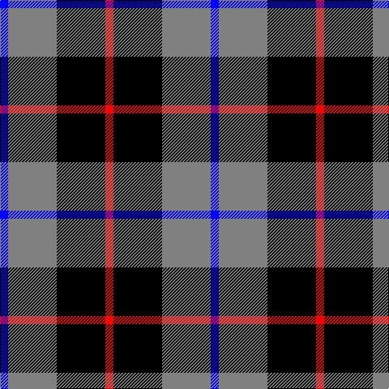

In pattern [BGKR](/patterns/bgkr/).

This was sourced from register-of-tartans.  It is a [4 stripes tartan](/stripes/stripes4/).

Original link https://www.tartanregister.gov.uk/tartanDetails.aspx?ref=10244

## Thread count
B/10 N60 K60 R/10

## Palette
Each colour and its ΔE from the base-6 reference it is a variant of.

| Colour | Shade | Base | ΔE (OKLab) |
|---|---|---|---|
| B | <code style="background-color:#0000FF;">#0000FF</code> `#0000FF` | B <code style="background-color:#2C4084;">#2C4084</code> | 0.21 |
| K | <code style="background-color:#000000;">#000000</code> `#000000` | K <code style="background-color:#000000;">#000000</code> | 0.00 |
| N | <code style="background-color:#808080;">#808080</code> `#808080` | G <code style="background-color:#006400;">#006400</code> | 0.22 |
| R | <code style="background-color:#FF0000;">#FF0000</code> `#FF0000` | R <code style="background-color:#C80000;">#C80000</code> | 0.11 |

# Sample pattern

ID: /setts/s4/b10g60k60r10-b0000ff-g808080-k000000-rff0000/
