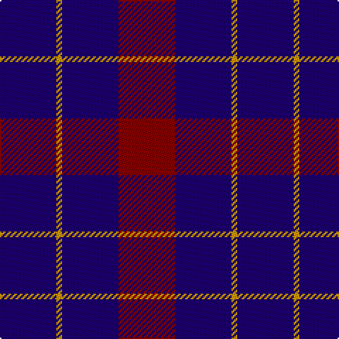

In pattern [BYBR](/patterns/bybr/).

This was sourced from register-of-tartans.  It is a [4 stripes tartan](/stripes/stripes4/).

Original link https://www.tartanregister.gov.uk/tartanDetails.aspx?ref=3025

## Thread count
DB/40 DY4 DB40 DR/40

## Palette
Each colour and its ΔE from the base-6 reference it is a variant of.

| Colour | Shade | Base | ΔE (OKLab) |
|---|---|---|---|
| DB | <code style="background-color:#1C0070;">#1C0070</code> `#1C0070` | B <code style="background-color:#2A418A;">#2A418A</code> | 0.14 |
| DR | <code style="background-color:#880000;">#880000</code> `#880000` | R <code style="background-color:#CC0000;">#CC0000</code> | 0.15 |
| DY | <code style="background-color:#D09800;">#D09800</code> `#D09800` | Y <code style="background-color:#F2BF00;">#F2BF00</code> | 0.12 |
| LN | <code style="background-color:#E0E0E0;">#E0E0E0</code> `#E0E0E0` | W <code style="background-color:#F7F7F7;">#F7F7F7</code> | 0.07 |

# Sample pattern

## Nearest tartans

The nearest existing variants by ΔTartan distance.

1. [Highland Spirit (Fashion)](/setts/s5/b15k5b15k21w2x2~b780078-k000c3c-we0e0e0/) — ΔT 1.43
1. [Masai Shuka 22 (Artefact)](/setts/s4/b20w1r12b12x4~b2c2c80-rc80000-we0e0e0/) — ΔT 1.59
1. [Davidson of Tulloch Clan Tartan Tartan Number: 1360. Earliest known date: 1984 The Davidsons or Clan Dhai maintained a constant battle for precedence within Clan Chattan. The Davidsons of Tulloch in Ross-shire are one of the main branches of the Davidson family. See products available Copyright © Blair Urquhart, Comrie, 2015](/setts/s5/r6b35k36b36w6~b2c2c80-k101010-rc80000-we0e0e0/) — ΔT 1.82
1. [Highland Spirit](/setts/s8/k21b15k5b15k5b15k21w2x2~b780078-k000c3c-we0e0e0/) — ΔT 1.83
1. [Scottish Nuclear](/setts/s6/b9k4w1k4b9r1x4~b2c2c80-k101010-rc80000-wc0c0c0/) — ΔT 1.84
1. [Bank of Scotland Corporate Tartan Tartan Number: 2462. Earliest known date: 1994 Commemorating the founding of the bank in 1695 See products available Copyright © Blair Urquhart, Comrie, 2015](/setts/s5/w4b30k23b24y4x2~b202060-k101010-we0e0e0-ye8c000/) — ΔT 1.87
1. [Moorlands (Corporate)](/setts/s5/b27k10b27k35y6~b780078-k101010-ye8c000/) — ΔT 1.89
1. [Baru](/setts/s5/b23g8b23g35w5x2~b780078-g003820-we0e0e0/) — ΔT 1.94
1. [Robbins](/setts/s6/b1r3b1r3b6g1x8~b1c0070-g006818-r880000/) — ΔT 1.94
1. [Hamilton](/setts/s5/b6r1b6r9y1x2~b000052-raa0000-yaaaaaa/) — ΔT 2.03

## Neighbour map

Every grey dot is one of 15726 variants placed by the first two principal components of the ΔTartan feature space (44% of its variance). Red is this tartan; blue dots are its nearest — click one to open its page.

<svg viewBox="0 0 640 380" role="img" style="max-width:100%;height:auto;border:1px solid #e0e0e0;border-radius:4px;display:block" xmlns="http://www.w3.org/2000/svg"><image href="/nn/cloud.v1.png" width="640" height="380"/><a href="/setts/s5/b15k5b15k21w2x2~b780078-k000c3c-we0e0e0/"><circle cx="334.9" cy="268.0" r="4" fill="#3465a4"><title>Highland Spirit (Fashion)</title></circle></a><a href="/setts/s4/b20w1r12b12x4~b2c2c80-rc80000-we0e0e0/"><circle cx="459.5" cy="256.2" r="4" fill="#3465a4"><title>Masai Shuka 22 (Artefact)</title></circle></a><a href="/setts/s5/r6b35k36b36w6~b2c2c80-k101010-rc80000-we0e0e0/"><circle cx="303.2" cy="273.9" r="4" fill="#3465a4"><title>Davidson of Tulloch Clan Tartan Tartan Number: 1360. Earliest known date: 1984 The Davidsons or Clan Dhai maintained a constant battle for precedence within Clan Chattan. The Davidsons of Tulloch in Ross-shire are one of the main branches of the Davidson family. See products available Copyright © Blair Urquhart, Comrie, 2015</title></circle></a><a href="/setts/s8/k21b15k5b15k5b15k21w2x2~b780078-k000c3c-we0e0e0/"><circle cx="337.7" cy="260.1" r="4" fill="#3465a4"><title>Highland Spirit</title></circle></a><a href="/setts/s6/b9k4w1k4b9r1x4~b2c2c80-k101010-rc80000-wc0c0c0/"><circle cx="380.1" cy="254.8" r="4" fill="#3465a4"><title>Scottish Nuclear</title></circle></a><a href="/setts/s5/w4b30k23b24y4x2~b202060-k101010-we0e0e0-ye8c000/"><circle cx="330.4" cy="264.2" r="4" fill="#3465a4"><title>Bank of Scotland Corporate Tartan Tartan Number: 2462. Earliest known date: 1994 Commemorating the founding of the bank in 1695 See products available Copyright © Blair Urquhart, Comrie, 2015</title></circle></a><a href="/setts/s5/b27k10b27k35y6~b780078-k101010-ye8c000/"><circle cx="284.8" cy="289.1" r="4" fill="#3465a4"><title>Moorlands (Corporate)</title></circle></a><a href="/setts/s5/b23g8b23g35w5x2~b780078-g003820-we0e0e0/"><circle cx="291.5" cy="279.2" r="4" fill="#3465a4"><title>Baru</title></circle></a><a href="/setts/s6/b1r3b1r3b6g1x8~b1c0070-g006818-r880000/"><circle cx="330.7" cy="272.2" r="4" fill="#3465a4"><title>Robbins</title></circle></a><a href="/setts/s5/b6r1b6r9y1x2~b000052-raa0000-yaaaaaa/"><circle cx="311.4" cy="254.0" r="4" fill="#3465a4"><title>Hamilton</title></circle></a><circle cx="392.1" cy="298.3" r="5" fill="#c00000"/></svg>

ID: /setts/s4/b10y1b10r10x4~b1c0070-r880000-yd09800/
