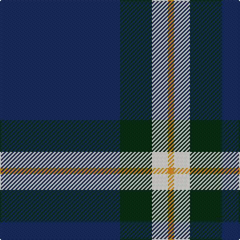

In pattern [BGWY](/patterns/bgwy/).

This was sourced from register-of-tartans.  It is a [4 stripes tartan](/stripes/stripes4/).

Original link https://www.tartanregister.gov.uk/tartanDetails.aspx?ref=10496

## Thread count
DB/120 DG32 W16 O/6

## Palette
Each colour and its ΔE from the base-6 reference it is a variant of.

| Colour | Shade | Base | ΔE (OKLab) |
|---|---|---|---|
| DB | <code style="background-color:#172D60;">#172D60</code> `#172D60` | B <code style="background-color:#2A418A;">#2A418A</code> | 0.09 |
| DG | <code style="background-color:#052F14;">#052F14</code> `#052F14` | G <code style="background-color:#006100;">#006100</code> | 0.18 |
| O | <code style="background-color:#EF8F06;">#EF8F06</code> `#EF8F06` | Y <code style="background-color:#F2BF00;">#F2BF00</code> | 0.12 |
| W | <code style="background-color:#F7F1E8;">#F7F1E8</code> `#F7F1E8` | W <code style="background-color:#F7F7F7;">#F7F7F7</code> | 0.02 |

# Sample pattern

## Nearest tartans

The nearest existing variants by ΔTartan distance.

1. [Hsu (Personal)](/setts/s4/b120g32w16y6-b2c2c80-g006818-wfcfcfc-ye8c000/) — ΔT 0.77
1. [C-Tec N.I. Ltd](/setts/s4/k124b30w12y8-b000080-k1c1714-wf8f8f8-yfccc00/) — ΔT 1.22
1. [Cleland](/setts/s5/k4b72g24w6r4-b304080-g008000-k000000-rc00000-we0e0e0/) — ΔT 1.34
1. [Special Air Service](/setts/s5/b52ba12g2r2w4-b141e46-ba5c8ca8-g005020-r660000-wf8f4d0/) — ΔT 1.36
1. [McNiff, Kevin (Personal)](/setts/s4/g40r14b80w4-b1c0070-g006818-ra00000-wfcfcfc/) — ΔT 1.36
1. [Micron](/setts/s6/k60b80y6b10w4b12-b1474b4-k101010-wfcfcfc-ye8c000/) — ΔT 1.38
1. [Scottish Nuclear](/setts/s4/r8b64k30w4-b304080-k000000-rc00000-we0e0e0/) — ΔT 1.41
1. [Jon's Theme](/setts/s6/k2y4k6b24k36w2-b555b7c-k010542-wffffff-y9e8f00/) — ΔT 1.42
1. [Thunderlord (Celtic Group, USA)](/setts/s4/b124w22k8ba34-b3f4441-ba50818e-k120a01-wf7f1e8/) — ΔT 1.48
1. [McKerrell of Hillhouse](/setts/s4/w8b56ba98y6-b2888c4-ba202060-we0e0e0-ye8c000/) — ΔT 1.53

## Neighbour map

Every grey dot is one of 15726 variants placed by the first two principal components of the ΔTartan feature space (44% of its variance). Red is this tartan; blue dots are its nearest — click one to open its page.

<svg viewBox="0 0 640 380" role="img" style="max-width:100%;height:auto;border:1px solid #e0e0e0;border-radius:4px;display:block" xmlns="http://www.w3.org/2000/svg"><image href="/nn/cloud.v1.png" width="640" height="380"/><a href="/setts/s4/b120g32w16y6-b2c2c80-g006818-wfcfcfc-ye8c000/"><circle cx="409.3" cy="189.4" r="4" fill="#3465a4"><title>Hsu (Personal)</title></circle></a><a href="/setts/s4/k124b30w12y8-b000080-k1c1714-wf8f8f8-yfccc00/"><circle cx="423.4" cy="199.4" r="4" fill="#3465a4"><title>C-Tec N.I. Ltd</title></circle></a><a href="/setts/s5/k4b72g24w6r4-b304080-g008000-k000000-rc00000-we0e0e0/"><circle cx="384.9" cy="166.3" r="4" fill="#3465a4"><title>Cleland</title></circle></a><a href="/setts/s5/b52ba12g2r2w4-b141e46-ba5c8ca8-g005020-r660000-wf8f4d0/"><circle cx="450.6" cy="147.1" r="4" fill="#3465a4"><title>Special Air Service</title></circle></a><a href="/setts/s4/g40r14b80w4-b1c0070-g006818-ra00000-wfcfcfc/"><circle cx="343.7" cy="209.4" r="4" fill="#3465a4"><title>McNiff, Kevin (Personal)</title></circle></a><a href="/setts/s6/k60b80y6b10w4b12-b1474b4-k101010-wfcfcfc-ye8c000/"><circle cx="352.2" cy="173.5" r="4" fill="#3465a4"><title>Micron</title></circle></a><a href="/setts/s4/r8b64k30w4-b304080-k000000-rc00000-we0e0e0/"><circle cx="344.4" cy="208.1" r="4" fill="#3465a4"><title>Scottish Nuclear</title></circle></a><a href="/setts/s6/k2y4k6b24k36w2-b555b7c-k010542-wffffff-y9e8f00/"><circle cx="363.0" cy="184.0" r="4" fill="#3465a4"><title>Jon's Theme</title></circle></a><a href="/setts/s4/b124w22k8ba34-b3f4441-ba50818e-k120a01-wf7f1e8/"><circle cx="387.1" cy="204.9" r="4" fill="#3465a4"><title>Thunderlord (Celtic Group, USA)</title></circle></a><a href="/setts/s4/w8b56ba98y6-b2888c4-ba202060-we0e0e0-ye8c000/"><circle cx="343.4" cy="209.0" r="4" fill="#3465a4"><title>McKerrell of Hillhouse</title></circle></a><circle cx="419.6" cy="196.9" r="5" fill="#c00000"/></svg>

ID: /setts/s4/b120g32w16y6-b172d60-g052f14-wf7f1e8-yef8f06/
