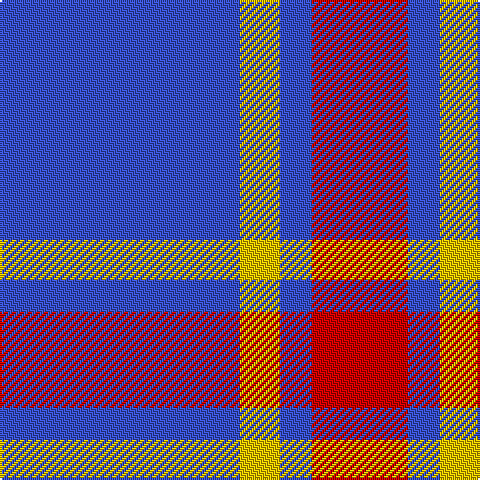

In pattern [BYBR](/patterns/bybr/).

This was sourced from tartans-authority.  It is a [4 stripes tartan](/stripes/stripes4/).

Original link http://www.tartansauthority.com/tartan-ferret/display/6385/

## Thread count
B/120 Y20 B16 R/48

## Palette
Each colour and its ΔE from the base-6 reference it is a variant of.

| Colour | Shade | Base | ΔE (OKLab) |
|---|---|---|---|
| B | <code style="background-color:#3850C8;">#3850C8</code> `#3850C8` | B <code style="background-color:#2C4084;">#2C4084</code> | 0.12 |
| R | <code style="background-color:#C80000;">#C80000</code> `#C80000` | R <code style="background-color:#C80000;">#C80000</code> | 0.00 |
| Y | <code style="background-color:#E8C000;">#E8C000</code> `#E8C000` | Y <code style="background-color:#E8C000;">#E8C000</code> | 0.00 |

# Sample pattern

ID: /setts/s4/b120y20b16r48-b3850c8-rc80000-ye8c000/
