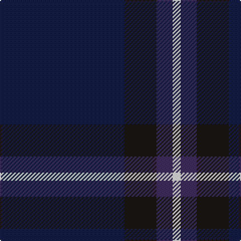

In pattern [BKBW](/patterns/bkbw/).

This was sourced from register-of-tartans.  It is a [4 stripes tartan](/stripes/stripes4/).

Original link https://www.tartanregister.gov.uk/tartanDetails.aspx?ref=11485

## Thread count
DB/124 K32 DBa16 W/8

## Palette
Each colour and its ΔE from the base-6 reference it is a variant of.

| Colour | Shade | Base | ΔE (OKLab) |
|---|---|---|---|
| DB | <code style="background-color:#141E46;">#141E46</code> `#141E46` | B <code style="background-color:#2C4084;">#2C4084</code> | 0.15 |
| DBa | <code style="background-color:#3D2E60;">#3D2E60</code> `#3D2E60` | B <code style="background-color:#2C4084;">#2C4084</code> | 0.08 |
| K | <code style="background-color:#1C1714;">#1C1714</code> `#1C1714` | K <code style="background-color:#000000;">#000000</code> | 0.21 |
| W | <code style="background-color:#F8F8F8;">#F8F8F8</code> `#F8F8F8` | W <code style="background-color:#F4F4F0;">#F4F4F0</code> | 0.01 |

# Sample pattern

## Nearest tartans

The nearest existing variants by ΔTartan distance.

1. [Open Championship, The](/setts/s5/g4b8ba20b44y4-b141e46-ba2c4084-g005020-ye8c000/) — ΔT 1.15
1. [Open Championship (2000)](/setts/s5/g8b16ba40b80y8-b202060-ba2c2c80-g285800-ye8c000/) — ΔT 1.48
1. [Edinburgh Crystal](/setts/s5/b120w8k24ba12r12-b14283c-ba2c2c80-k101010-rc80000-wc0c0c0/) — ΔT 1.50
1. [Meaux (Personal)](/setts/s4/b124r48y10g6-b003c64-g003820-r880000-ybc8c00/) — ΔT 1.66
1. [Edinburgh Crystal (Corporate)](/setts/s5/b120w8k24ba12r12-b14283c-ba2c2c80-k101010-rc80000-we0e0e0/) — ΔT 1.68
1. [Burnetts & Struth](/setts/s5/b136ba14b32k32y8-b14283c-ba5c8ca8-k101010-ya08858/) — ΔT 1.76
1. [Sligo, County](/setts/s6/b100ba8b24ba46y8ba8-b303070-ba441800-yd8b000/) — ΔT 1.78
1. [Doyle Blue](/setts/s4/k160b60ba18r6-b6c0070-ba2c2c80-k101010-rc8002c/) — ΔT 1.83
1. [Barrance, Paul and Kelly (Personal)](/setts/s7/b6ba84k4g34ba18b6w4-b64008c-ba14283c-g005448-k101010-wffffff/) — ΔT 1.83
1. [Oxford University (Corporate)](/setts/s4/b18g32ba118y8-b2c2c80-ba1c0070-g006818-yc4bc68/) — ΔT 1.88

## Neighbour map

Every grey dot is one of 15726 variants placed by the first two principal components of the ΔTartan feature space (44% of its variance). Red is this tartan; blue dots are its nearest — click one to open its page.

<svg viewBox="0 0 640 380" role="img" style="max-width:100%;height:auto;border:1px solid #e0e0e0;border-radius:4px;display:block" xmlns="http://www.w3.org/2000/svg"><image href="/nn/cloud.v1.png" width="640" height="380"/><a href="/setts/s5/g4b8ba20b44y4-b141e46-ba2c4084-g005020-ye8c000/"><circle cx="421.9" cy="242.3" r="4" fill="#3465a4"><title>Open Championship, The</title></circle></a><a href="/setts/s5/g8b16ba40b80y8-b202060-ba2c2c80-g285800-ye8c000/"><circle cx="419.8" cy="256.7" r="4" fill="#3465a4"><title>Open Championship (2000)</title></circle></a><a href="/setts/s5/b120w8k24ba12r12-b14283c-ba2c2c80-k101010-rc80000-wc0c0c0/"><circle cx="441.2" cy="194.5" r="4" fill="#3465a4"><title>Edinburgh Crystal</title></circle></a><a href="/setts/s4/b124r48y10g6-b003c64-g003820-r880000-ybc8c00/"><circle cx="470.0" cy="220.5" r="4" fill="#3465a4"><title>Meaux (Personal)</title></circle></a><a href="/setts/s5/b120w8k24ba12r12-b14283c-ba2c2c80-k101010-rc80000-we0e0e0/"><circle cx="427.2" cy="188.2" r="4" fill="#3465a4"><title>Edinburgh Crystal (Corporate)</title></circle></a><a href="/setts/s5/b136ba14b32k32y8-b14283c-ba5c8ca8-k101010-ya08858/"><circle cx="549.4" cy="236.5" r="4" fill="#3465a4"><title>Burnetts &amp; Struth</title></circle></a><a href="/setts/s6/b100ba8b24ba46y8ba8-b303070-ba441800-yd8b000/"><circle cx="470.8" cy="241.3" r="4" fill="#3465a4"><title>Sligo, County</title></circle></a><a href="/setts/s4/k160b60ba18r6-b6c0070-ba2c2c80-k101010-rc8002c/"><circle cx="483.9" cy="216.7" r="4" fill="#3465a4"><title>Doyle Blue</title></circle></a><a href="/setts/s7/b6ba84k4g34ba18b6w4-b64008c-ba14283c-g005448-k101010-wffffff/"><circle cx="446.5" cy="177.8" r="4" fill="#3465a4"><title>Barrance, Paul and Kelly (Personal)</title></circle></a><a href="/setts/s4/b18g32ba118y8-b2c2c80-ba1c0070-g006818-yc4bc68/"><circle cx="420.2" cy="225.9" r="4" fill="#3465a4"><title>Oxford University (Corporate)</title></circle></a><circle cx="471.4" cy="238.3" r="5" fill="#c00000"/></svg>

ID: /setts/s4/b124k32ba16w8-b141e46-ba3d2e60-k1c1714-wf8f8f8/
