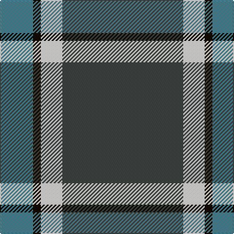

In pattern [BKWB](/patterns/bkwb/).

This was sourced from register-of-tartans.  It is a [4 stripes tartan](/stripes/stripes4/).

Original link https://www.tartanregister.gov.uk/tartanDetails.aspx?ref=10473

## Thread count
B/34 K8 W22 N/124

## Palette
Each colour and its ΔE from the base-6 reference it is a variant of.

| Colour | Shade | Base | ΔE (OKLab) |
|---|---|---|---|
| B | <code style="background-color:#50818E;">#50818E</code> `#50818E` | B <code style="background-color:#2A418A;">#2A418A</code> | 0.20 |
| K | <code style="background-color:#120A01;">#120A01</code> `#120A01` | K <code style="background-color:#000000;">#000000</code> | 0.15 |
| N | <code style="background-color:#3F4441;">#3F4441</code> `#3F4441` | B <code style="background-color:#2A418A;">#2A418A</code> | 0.13 |
| W | <code style="background-color:#F7F1E8;">#F7F1E8</code> `#F7F1E8` | W <code style="background-color:#F7F7F7;">#F7F7F7</code> | 0.02 |

# Sample pattern

## Nearest tartans

The nearest existing variants by ΔTartan distance.

1. [Thunderlord (Corporate)](/setts/s4/b124w22k8y34-b5c5c5c-k101010-we0e0e0-y48a4c0/) — ΔT 0.93
1. [Wilson's No.189](/setts/s4/b8g20r2w2-b440044-g006818-rc80000-wfcfcfc/) — ΔT 1.29
1. [Wilson's No.205](/setts/s4/w2b8g20wa2-b280034-g044028-w00fcfc-wafcfcfc/) — ΔT 1.32
1. [Wilson's, No 189](/setts/s4/b8g20w2r2-b800080-g008000-rc00000-we0e0e0/) — ΔT 1.42
1. [Sligo](/setts/s6/b100ba8b24ba46y8ba8-b5480b0-ba401000-yf0c000/) — ΔT 1.47
1. [MaleHsuHK (Hong Kong) (Personal)](/setts/s4/b120g32w16y6-b172d60-g052f14-wf7f1e8-yef8f06/) — ΔT 1.48
1. [Perkins 2015](/setts/s7/k6b20y10b58k20r12k4-b5c8ca8-k101010-rc80000-ye8c000/) — ΔT 1.48
1. [Wilson's No.192](/setts/s4/b8g20r2y2-b440044-g006818-rc80000-ye8c000/) — ΔT 1.48
1. [Perry, Alex (Personal)](/setts/s4/k124b48y10w16-b5c5c5c-k101010-wfcfcfc-ybc8c00/) — ΔT 1.50
1. [Cleland](/setts/s5/k4b72g24w6r4-b304080-g008000-k000000-rc00000-we0e0e0/) — ΔT 1.51

## Neighbour map

Every grey dot is one of 15726 variants placed by the first two principal components of the ΔTartan feature space (44% of its variance). Red is this tartan; blue dots are its nearest — click one to open its page.

<svg viewBox="0 0 640 380" role="img" style="max-width:100%;height:auto;border:1px solid #e0e0e0;border-radius:4px;display:block" xmlns="http://www.w3.org/2000/svg"><image href="/nn/cloud.v1.png" width="640" height="380"/><a href="/setts/s4/b124w22k8y34-b5c5c5c-k101010-we0e0e0-y48a4c0/"><circle cx="403.0" cy="209.0" r="4" fill="#3465a4"><title>Thunderlord (Corporate)</title></circle></a><a href="/setts/s4/b8g20r2w2-b440044-g006818-rc80000-wfcfcfc/"><circle cx="342.5" cy="223.3" r="4" fill="#3465a4"><title>Wilson's No.189</title></circle></a><a href="/setts/s4/w2b8g20wa2-b280034-g044028-w00fcfc-wafcfcfc/"><circle cx="333.1" cy="224.4" r="4" fill="#3465a4"><title>Wilson's No.205</title></circle></a><a href="/setts/s4/b8g20w2r2-b800080-g008000-rc00000-we0e0e0/"><circle cx="342.9" cy="220.0" r="4" fill="#3465a4"><title>Wilson's, No 189</title></circle></a><a href="/setts/s6/b100ba8b24ba46y8ba8-b5480b0-ba401000-yf0c000/"><circle cx="399.5" cy="206.1" r="4" fill="#3465a4"><title>Sligo</title></circle></a><a href="/setts/s4/b120g32w16y6-b172d60-g052f14-wf7f1e8-yef8f06/"><circle cx="419.6" cy="196.9" r="4" fill="#3465a4"><title>MaleHsuHK (Hong Kong) (Personal)</title></circle></a><a href="/setts/s7/k6b20y10b58k20r12k4-b5c8ca8-k101010-rc80000-ye8c000/"><circle cx="315.5" cy="176.1" r="4" fill="#3465a4"><title>Perkins 2015</title></circle></a><a href="/setts/s4/b8g20r2y2-b440044-g006818-rc80000-ye8c000/"><circle cx="356.7" cy="229.4" r="4" fill="#3465a4"><title>Wilson's No.192</title></circle></a><a href="/setts/s4/k124b48y10w16-b5c5c5c-k101010-wfcfcfc-ybc8c00/"><circle cx="341.6" cy="212.4" r="4" fill="#3465a4"><title>Perry, Alex (Personal)</title></circle></a><a href="/setts/s5/k4b72g24w6r4-b304080-g008000-k000000-rc00000-we0e0e0/"><circle cx="384.9" cy="166.3" r="4" fill="#3465a4"><title>Cleland</title></circle></a><circle cx="387.1" cy="204.9" r="5" fill="#c00000"/></svg>

ID: /setts/s4/b124w22k8ba34-b3f4441-ba50818e-k120a01-wf7f1e8/
