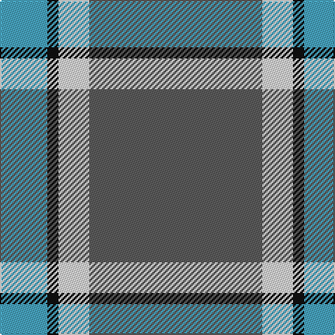

In pattern [BWKY](/patterns/bwky/).

This was sourced from tartans-authority.  It is a [4 stripes tartan](/stripes/stripes4/).

Original link http://www.tartansauthority.com/tartan-ferret/display/10473/

## Thread count
B/34 K8 LN22 N/124

## Palette
Each colour and its ΔE from the base-6 reference it is a variant of.

| Colour | Shade | Base | ΔE (OKLab) |
|---|---|---|---|
| B | <code style="background-color:#48A4C0;">#48A4C0</code> `#48A4C0` | Y <code style="background-color:#E8C000;">#E8C000</code> | 0.28 |
| K | <code style="background-color:#101010;">#101010</code> `#101010` | K <code style="background-color:#000000;">#000000</code> | 0.17 |
| LN | <code style="background-color:#E0E0E0;">#E0E0E0</code> `#E0E0E0` | W <code style="background-color:#F4F4F0;">#F4F4F0</code> | 0.06 |
| N | <code style="background-color:#5C5C5C;">#5C5C5C</code> `#5C5C5C` | B <code style="background-color:#2C4084;">#2C4084</code> | 0.14 |

# Sample pattern

ID: /setts/s4/b124w22k8y34-b5c5c5c-k101010-we0e0e0-y48a4c0/
