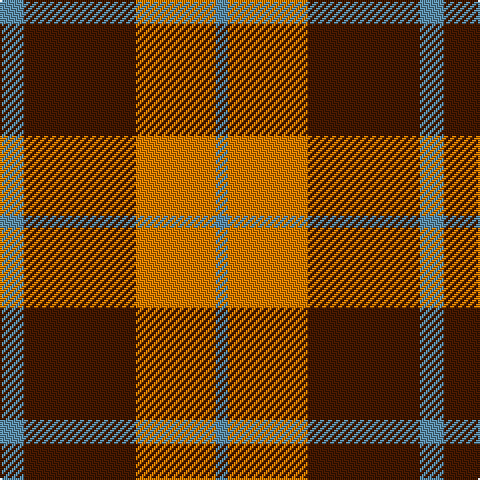

In pattern [BBYB](/patterns/bbyb/).

This was sourced from register-of-tartans.  It is a [4 stripes tartan](/stripes/stripes4/).

Original link https://www.tartanregister.gov.uk/tartanDetails.aspx?ref=3394

## Thread count
B/12 DR56 O40 B/6

## Palette
Each colour and its ΔE from the base-6 reference it is a variant of.

| Colour | Shade | Base | ΔE (OKLab) |
|---|---|---|---|
| B | <code style="background-color:#5C8CA8;">#5C8CA8</code> `#5C8CA8` | B <code style="background-color:#2C4084;">#2C4084</code> | 0.23 |
| DR | <code style="background-color:#441800;">#441800</code> `#441800` | B <code style="background-color:#2C4084;">#2C4084</code> | 0.22 |
| O | <code style="background-color:#D87C00;">#D87C00</code> `#D87C00` | Y <code style="background-color:#E8C000;">#E8C000</code> | 0.17 |

# Sample pattern

ID: /setts/s4/b12ba56y40b6-b5c8ca8-ba441800-yd87c00/
