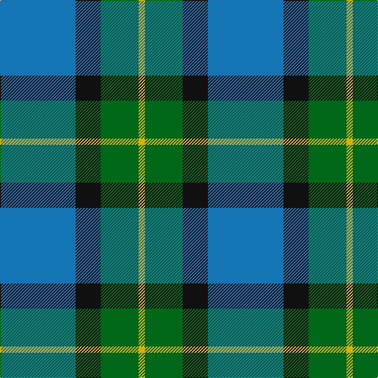

**Bands:** [YGKB](/stripes/ygkb/) · **Stripes:** [LY G K B](/stripes/stripes4/) LY G K B

This was sourced from tartans-authority.  It is a [4 band tartan](/bands/bands4/).

Original link http://www.tartansauthority.com/tartan-ferret/display/339/

## Thread count
B/96 K32 G48 Y/8

## Palette
Each colour and its ΔE from the base-6 reference it is a variant of.

| Colour | Shade | Base | ΔE (OKLab) |
|---|---|---|---|
| B | <code style="background-color:#1474B4;">#1474B4</code> `#1474B4` | B <code style="background-color:#2A418A;">#2A418A</code> | 0.15 |
| G | <code style="background-color:#006818;">#006818</code> `#006818` | G <code style="background-color:#006100;">#006100</code> | 0.02 |
| K | <code style="background-color:#101010;">#101010</code> `#101010` | K <code style="background-color:#000000;">#000000</code> | 0.17 |
| Y | <code style="background-color:#D8B000;">#D8B000</code> `#D8B000` | Y <code style="background-color:#F2BF00;">#F2BF00</code> | 0.06 |

# Sample pattern

## Nearest tartans

The nearest existing variants by ΔTartan distance.

1. [Rothesay & Caithness Fencibles (Mil)](/setts/s5/b32k10g15k2ly4~x2/) — ΔT 0.93
1. [U.S. Border Patrol (Corporate)](/setts/s5/g40k15b10k10ly3~x2/) — ΔT 1.19
1. [Bethlehem, City of](/setts/s5/dg3r1dg9o10db3~x4/) — ΔT 1.27
1. [Wallace Blue (Fashion)](/setts/s5/t2db29t12g29w2~x2/) — ΔT 1.32
1. [Sterling (Name)](/setts/s5/g11lo10dt11b33w3~x2/) — ΔT 1.38
1. [Trafalgar (Fashion)](/setts/s6/g3db1g8db7k3ly1~x2/) — ΔT 1.40
1. [Flower of Scotland](/setts/s6/r3b25k16b3g25b3~x2/) — ΔT 1.43
1. [All as One (Corporate)](/setts/s5/k11t38r11g11k5~x2/) — ΔT 1.43
1. [Skibo](/setts/s5/r2g23db11db22r2~x2/) — ΔT 1.44
1. [Heritage Tartan, The](/setts/s6/db8r4db24g35lb4g8/) — ΔT 1.44

## Neighbour map

Every grey dot is one of 14299 variants placed by the first two principal components of the ΔTartan feature space (44% of its variance). Red is this tartan; blue dots are its nearest — click one to open its page.

<svg viewBox="0 0 640 380" role="img" style="max-width:100%;height:auto;border:1px solid #e0e0e0;border-radius:4px;display:block" xmlns="http://www.w3.org/2000/svg"><image href="/nn/cloud.v1.png" width="640" height="380"/><a href="/setts/s5/b32k10g15k2ly4~x2/"><circle cx="277.0" cy="208.5" r="4" fill="#3465a4"><title>Rothesay &amp; Caithness Fencibles (Mil)</title></circle></a><a href="/setts/s5/g40k15b10k10ly3~x2/"><circle cx="280.0" cy="216.3" r="4" fill="#3465a4"><title>U.S. Border Patrol (Corporate)</title></circle></a><a href="/setts/s5/dg3r1dg9o10db3~x4/"><circle cx="256.4" cy="242.7" r="4" fill="#3465a4"><title>Bethlehem, City of</title></circle></a><a href="/setts/s5/t2db29t12g29w2~x2/"><circle cx="249.0" cy="223.1" r="4" fill="#3465a4"><title>Wallace Blue (Fashion)</title></circle></a><a href="/setts/s5/g11lo10dt11b33w3~x2/"><circle cx="229.0" cy="218.8" r="4" fill="#3465a4"><title>Sterling (Name)</title></circle></a><a href="/setts/s6/g3db1g8db7k3ly1~x2/"><circle cx="248.8" cy="247.4" r="4" fill="#3465a4"><title>Trafalgar (Fashion)</title></circle></a><a href="/setts/s6/r3b25k16b3g25b3~x2/"><circle cx="210.4" cy="230.2" r="4" fill="#3465a4"><title>Flower of Scotland</title></circle></a><a href="/setts/s5/k11t38r11g11k5~x2/"><circle cx="228.6" cy="231.3" r="4" fill="#3465a4"><title>All as One (Corporate)</title></circle></a><a href="/setts/s5/r2g23db11db22r2~x2/"><circle cx="216.4" cy="231.8" r="4" fill="#3465a4"><title>Skibo</title></circle></a><a href="/setts/s6/db8r4db24g35lb4g8/"><circle cx="284.9" cy="228.3" r="4" fill="#3465a4"><title>Heritage Tartan, The</title></circle></a><circle cx="278.3" cy="247.8" r="5" fill="#c00000"/></svg>

ID: /setts/s4/b12k4g6ly1~x8/
